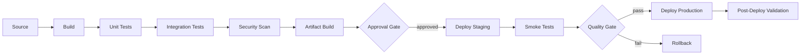

# História: CI/CD Patterns Knowledge Pack

**ID:** story-0013-0002
**Chave Jira:** SCRUM-5
**Status:** Pendente

## 1. Dependências

| Blocked By | Blocks |
| :--- | :--- |
| -- | story-0013-0004, story-0013-0005 |

## 2. Regras Transversais Aplicáveis

| ID | Título |
| :--- | :--- |
| RULE-001 | Template Consistency |
| RULE-003 | Pebble Template Variables |
| RULE-007 | Knowledge Pack Structure |
| RULE-010 | Backward Compatibility |

## 3. Descrição

Como **DevOps engineer**, eu quero um knowledge pack abrangente de CI/CD patterns, para que a IA tenha contexto completo sobre pipelines de integracao continua e entrega continua ao gerar configuracoes e dar recomendacoes.

### Contexto

O ia-dev-env atualmente gera um `ci.yml` basico para GitHub Actions e possui knowledge packs de infrastructure (Docker, K8s), mas nao tem um knowledge pack dedicado a CI/CD patterns. Isso significa que quando a IA precisa recomendar configuracoes de pipeline, gerar workflows ou ajudar com troubleshooting de CI, ela nao tem acesso a patterns especificos como matrix builds, caching strategies, artifact management, environment promotion ou approval gates.

### 3.1 Estrutura do Knowledge Pack

- Path: `skills-templates/ci-cd-patterns/SKILL.md`
- Frontmatter: `user-invocable: false` (knowledge pack interno)
- Referenciado por: `devops-engineer` agent, `x-ci-cd-generate` skill

### 3.2 Conteudo Principal

**Pipeline Stages:**
- Build stage (compilation, dependency resolution, artifact creation)
- Test stage (unit, integration, e2e -- parallelization strategies)
- Security stage (SAST, dependency scan, container scan, secrets detection)
- Artifact stage (versioning, registry push, signing)
- Deploy stage (environment promotion, rollback, canary/blue-green)
- Post-deploy stage (smoke tests, synthetic monitoring, rollback triggers)

**Pipeline Patterns per Language:**
- Java (Maven/Gradle): cache strategies, multi-module builds, JaCoCo integration
- Python (pip/poetry): virtualenv caching, tox integration
- Go: module cache, cross-compilation matrix
- Rust: cargo cache, incremental compilation
- TypeScript (npm/pnpm): node_modules cache, workspace builds
- Kotlin: Gradle build cache, KSP annotation processing
- C# (.NET): NuGet cache, multi-target framework builds

**Cross-Cutting Patterns:**
- Matrix builds (language version x OS x configuration)
- Caching strategies (dependency cache, build cache, test result cache)
- Artifact management (versioned artifacts, retention policies)
- Environment promotion (dev -> staging -> production)
- Approval gates (manual approval, automated quality gates)
- Parallel execution (job concurrency, resource optimization)
- Secrets management (environment secrets, OIDC, vault integration)
- Reusable workflows / composite actions
- Monorepo strategies (affected-only builds, path-based triggers)

### 3.3 Referencias

- `references/github-actions-patterns.md` -- GitHub Actions specific patterns
- `references/pipeline-security.md` -- Pipeline security hardening (SLSA, provenance)
- `references/caching-strategies.md` -- Language-specific caching matrices

## 3.5 Entrega de Valor

- **Valor Principal:** IA tem conhecimento completo de CI/CD para gerar pipelines e troubleshoot builds
- **Metrica de Sucesso:** Knowledge pack gerado em `.claude/skills/ci-cd-patterns/` com >= 3 reference files
- **Impacto no Negocio:** Reducao do tempo de setup de CI/CD em novos projetos

## 4. Definições de Qualidade Locais

### DoR Local

- [ ] Pipelines CI existentes do projeto revisados (`.github/workflows/ci.yml`)
- [ ] Knowledge packs existentes revisados para manter consistencia de formato
- [ ] Patterns de CI/CD por linguagem pesquisados
- [ ] `SkillsAssembler` compreendido para saber como KPs sao copiados

### DoD Local

- [ ] `SKILL.md` criado com todas as secoes de pipeline patterns
- [ ] `references/github-actions-patterns.md` criado
- [ ] `references/pipeline-security.md` criado
- [ ] `references/caching-strategies.md` criado
- [ ] Frontmatter YAML valido com `user-invocable: false`
- [ ] Template usa variaveis Pebble corretas para secoes language-specific
- [ ] Integration test: KP e gerado pelo pipeline para todos os perfis

### Global DoD

- **Cobertura:** >= 95% Line, >= 90% Branch
- **Regressao:** Golden file tests passando
- **TDD Compliance:** Test-first pattern
- **Multi-Target:** Claude (.claude/skills/) + GitHub (.github/skills/)

## 5. Contratos de Dados

**SKILL.md Frontmatter:**

| Campo | Formato | Obrigatorio | Valor |
| :--- | :--- | :--- | :--- |
| `name` | String | M | "ci-cd-patterns" |
| `description` | String | M | "CI/CD pipeline patterns..." |
| `user-invocable` | Boolean | M | false |

**Template Variables Used:**

| Variavel | Tipo | Condicional | Descrição |
| :--- | :--- | :--- | :--- |
| `{{LANGUAGE}}` | String | N | Linguagem do projeto |
| `{{FRAMEWORK}}` | String | N | Framework do projeto |
| `{{BUILD_TOOL}}` | String | N | Ferramenta de build (maven, gradle, npm, etc.) |
| `{{CONTAINER}}` | String | S | Container runtime (docker, none) |
| `{{NATIVE_BUILD}}` | Boolean | S | Se native image esta habilitado |

## 6. Diagramas

### 6.1 Pipeline CI/CD Generico



## 7. Critérios de Aceite (Gherkin)

```gherkin
Cenario: KP gerado com secao vazia quando linguagem nao reconhecida
  DADO que o config YAML define language.name="unknown"
  QUANDO o pipeline gera o knowledge pack
  ENTAO o SKILL.md contem secao "Pipeline Patterns" com conteudo generico
  E nao contem secoes language-specific

Cenario: KP gerado com patterns Java/Maven
  DADO que o config YAML define language.name="java" e build_tool="maven"
  QUANDO o pipeline gera o knowledge pack
  ENTAO o SKILL.md contem secao "Java/Maven Pipeline Patterns"
  E contem referencia a cache de `.m2/repository`
  E contem referencia a JaCoCo coverage

Cenario: KP gerado com patterns TypeScript/npm
  DADO que o config YAML define language.name="typescript" e build_tool="npm"
  QUANDO o pipeline gera o knowledge pack
  ENTAO o SKILL.md contem secao "TypeScript/npm Pipeline Patterns"
  E contem referencia a cache de `node_modules`

Cenario: KP inclui secao de container quando Docker habilitado
  DADO que o config YAML define infrastructure.container="docker"
  QUANDO o pipeline gera o knowledge pack
  ENTAO o SKILL.md contem secao "Container Build & Push"
  E contem referencia a multi-stage build

Cenario: Reference files sao gerados junto com SKILL.md
  DADO que o pipeline e executado para qualquer perfil
  QUANDO o ci-cd-patterns KP e gerado
  ENTAO existem 3 reference files em `.claude/skills/ci-cd-patterns/references/`

Cenario: KP gerado para ambos targets Claude e GitHub
  DADO que o pipeline e executado para perfil java-spring
  QUANDO o ci-cd-patterns KP e gerado
  ENTAO o SKILL.md existe em `.claude/skills/ci-cd-patterns/`
  E o SKILL.md existe em `.github/skills/ci-cd-patterns/`
```

### 7.1 Scenario Ordering (TPP)

> TPP: degenerate (linguagem desconhecida) -> unconditional (Java) -> condicional (TypeScript) -> condicional (Docker) -> boundary (reference files) -> multi-target.

### 7.2 Mandatory Scenario Categories

- [x] Degenerate cases (linguagem desconhecida)
- [x] Happy path (Java/Maven patterns)
- [x] Error paths (N/A - KP sempre gerado)
- [x] Boundary values (reference files, multi-target)

## 8. Sub-tarefas

- [ ] [Test] Unit test: SKILL.md gerado com frontmatter valido
- [ ] [Dev] Criar `skills-templates/ci-cd-patterns/SKILL.md` com secoes base
- [ ] [Test] Unit test: secoes language-specific renderizadas corretamente
- [ ] [Dev] Adicionar blocos condicionais Pebble para cada linguagem
- [ ] [Dev] Criar `references/github-actions-patterns.md`
- [ ] [Dev] Criar `references/pipeline-security.md`
- [ ] [Dev] Criar `references/caching-strategies.md`
- [ ] [Test] Integration test: KP gerado para perfis java-spring e typescript-nestjs
- [ ] [Test] Atualizar golden file manifests
- [ ] [Doc] Registrar KP na tabela de knowledge packs do CLAUDE.md
