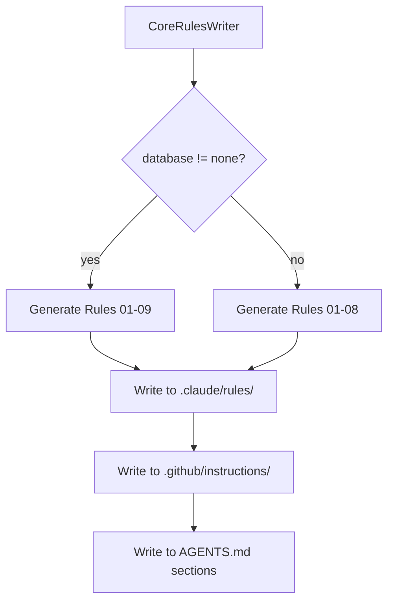

# História: Novas Rules de Projeto (07-Operations, 08-Release, 09-Data)

**ID:** story-0013-0003
**Chave Jira:** SCRUM-6
**Status:** Pendente

## 1. Dependências

| Blocked By | Blocks |
| :--- | :--- |
| -- | story-0013-0026 |

## 2. Regras Transversais Aplicáveis

| ID | Título |
| :--- | :--- |
| RULE-001 | Template Consistency |
| RULE-003 | Pebble Template Variables |
| RULE-010 | Backward Compatibility |

## 3. Descrição

Como **tech lead**, eu quero 3 novas rules de projeto (Operations Baseline, Release Process, Data Management) carregadas automaticamente em toda conversa, para que a IA siga padroes de operacoes, release e dados sem precisar consultar knowledge packs.

### Contexto

Atualmente existem 6 rules (01-project-identity, 02-domain, 03-coding-standards, 04-architecture-summary, 05-quality-gates, 06-security-baseline). Estas rules cobrem identidade, domain, codigo, arquitetura, qualidade e seguranca -- mas falta cobertura para operacoes (health checks, graceful shutdown, logging), release (versionamento, changelog, processo) e dados (migrations, backup, governance).

Rules sao carregadas automaticamente em TODA conversa (system prompt), enquanto knowledge packs sao lazy-loaded sob demanda. Estas 3 novas rules garantem que requisitos minimos de operacoes, release e dados sejam sempre considerados.

### 3.1 Rule 07 -- Operations Baseline

- Arquivo: `core-rules/07-operations-baseline.md`
- Conteudo: Requisitos minimos de operacao (NON-NEGOTIABLE)
  - Health checks (liveness, readiness, startup) obrigatorios para todo servico
  - Graceful shutdown com timeout configuravel
  - Structured logging em JSON com campos obrigatorios (timestamp, level, trace_id, span_id)
  - Correlation ID propagation em toda cadeia de chamadas
  - Configuration externalization (12-Factor App)
  - Referencia: `skills/sre-practices/SKILL.md` para detalhes

### 3.2 Rule 08 -- Release Process

- Arquivo: `core-rules/08-release-process.md`
- Conteudo: Processo de release (NON-NEGOTIABLE)
  - Semantic Versioning (MAJOR.MINOR.PATCH)
  - Conventional Commits obrigatorio
  - CHANGELOG.md atualizado a cada release
  - Release checklist verificada antes de tag
  - Rollback plan documentado
  - Referencia: `skills/release-management/SKILL.md` para detalhes

### 3.3 Rule 09 -- Data Management

- Arquivo: `core-rules/09-data-management.md`
- Conteudo: Gestao de dados (CONDITIONAL - quando database != none)
  - Database migrations forward-only em producao
  - Expand/contract pattern para alteracoes breaking
  - Backup verification regular
  - Data retention policy definida
  - Sensitive data classification obrigatoria
  - Referencia: `skills/data-management/SKILL.md` para detalhes

## 3.5 Entrega de Valor

- **Valor Principal:** Regras de operacoes, release e dados sempre presentes no contexto da IA
- **Metrica de Sucesso:** 3 novos arquivos de rules gerados para todos os perfis
- **Impacto no Negocio:** IA considera requisitos operacionais, de release e dados em TODA interacao

## 4. Definições de Qualidade Locais

### DoR Local

- [ ] Rules existentes (01-06) revisadas para manter consistencia de formato
- [ ] `CoreRulesWriter` assembler compreendido
- [ ] Variaveis Pebble disponiveis para condicionais identificadas

### DoD Local

- [ ] `07-operations-baseline.md` template criado em `core-rules/`
- [ ] `08-release-process.md` template criado em `core-rules/`
- [ ] `09-data-management.md` template criado em `core-rules/` (condicional)
- [ ] Rule 09 usa bloco condicional Pebble: gerada apenas quando `database != none`
- [ ] Unit tests para `CoreRulesWriter` cobrindo as 3 novas rules
- [ ] Integration test: pipeline gera 9 rules para perfil com database, 8 para perfil sem
- [ ] Golden file manifests atualizados

### Global DoD

- **Cobertura:** >= 95% Line, >= 90% Branch
- **Regressao:** Golden file tests passando
- **TDD Compliance:** Test-first pattern
- **Multi-Target:** Claude (.claude/rules/) + GitHub (.github/instructions/) + Codex (AGENTS.md sections)

## 5. Contratos de Dados

**Rule Template Structure:**

| Seção | Obrigatoria | Descrição |
| :--- | :--- | :--- |
| Header (`# Rule NN`) | M | Titulo da rule com numero |
| Quick Reference table | M | Tabela resumo dos requisitos |
| Hard Limits section | M | Limites nao negociaveis |
| Forbidden section | M | Praticas proibidas |
| Reference link | M | Link para knowledge pack detalhado |

**Conditional Variables:**

| Variavel | Tipo | Usada em | Condicao |
| :--- | :--- | :--- | :--- |
| `{{DATABASE_TYPE}}` | String | Rule 09 | `data.database.type != "none"` |
| `{{MIGRATION_TOOL}}` | String | Rule 09 | `data.database.migration != "none"` |
| `{{OBSERVABILITY_ENABLED}}` | Boolean | Rule 07 | `observability != null` |

## 6. Diagramas

### 6.1 Fluxo de Geracao Condicional



## 7. Critérios de Aceite (Gherkin)

```gherkin
Cenario: Pipeline gera 9 rules quando database esta configurado
  DADO que o config YAML define data.database.type="postgresql"
  QUANDO o CoreRulesWriter executa
  ENTAO existem 9 arquivos em `.claude/rules/`
  E o arquivo `09-data-management.md` existe
  E contem referencia a "postgresql"

Cenario: Pipeline gera 8 rules quando database e none
  DADO que o config YAML define data.database.type="none"
  QUANDO o CoreRulesWriter executa
  ENTAO existem 8 arquivos em `.claude/rules/`
  E o arquivo `09-data-management.md` NAO existe

Cenario: Rule 07 contem requisitos de health check
  DADO que o pipeline e executado para qualquer perfil
  QUANDO a rule 07 e gerada
  ENTAO o arquivo contem secao "Health Checks"
  E contem "liveness", "readiness" e "startup"

Cenario: Rule 08 contem requisitos de Semantic Versioning
  DADO que o pipeline e executado para qualquer perfil
  QUANDO a rule 08 e gerada
  ENTAO o arquivo contem "Semantic Versioning"
  E contem "Conventional Commits"
  E contem "CHANGELOG"

Cenario: Rules geradas para todos os 3 targets
  DADO que o pipeline e executado para perfil java-quarkus
  QUANDO as rules sao geradas
  ENTAO rules existem em `.claude/rules/`
  E rules existem em `.github/instructions/`
  E rules existem como secoes no `.codex/AGENTS.md`
```

### 7.2 Mandatory Scenario Categories

- [x] Degenerate cases (database=none, rule 09 nao gerada)
- [x] Happy path (database configurado, 9 rules)
- [x] Error paths (N/A - rules sempre geradas)
- [x] Boundary values (multi-target output)

## 8. Sub-tarefas

- [ ] [Test] Unit test: CoreRulesWriter gera rule 07 com secoes obrigatorias
- [ ] [Dev] Criar template `07-operations-baseline.md` em core-rules/
- [ ] [Test] Unit test: CoreRulesWriter gera rule 08 com SemVer
- [ ] [Dev] Criar template `08-release-process.md` em core-rules/
- [ ] [Test] Unit test: CoreRulesWriter gera rule 09 condicionalmente
- [ ] [Dev] Criar template `09-data-management.md` com condicional Pebble
- [ ] [Dev] Atualizar `CoreRulesWriter` para incluir novas rules
- [ ] [Test] Integration test: 9 rules para perfil com DB, 8 sem DB
- [ ] [Test] Atualizar golden file manifests
- [ ] [Doc] Atualizar tabela de rules no CLAUDE.md (6 -> 9)
