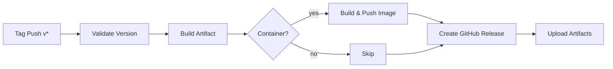

# Historia: CD Workflow Templates (release, deploy, rollback)

**ID:** story-0013-0004
**Chave Jira:** --
**Status:** Pendente

## 1. Dependencias

| Blocked By | Blocks |
| :--- | :--- |
| story-0013-0002 | story-0013-0005 |

## 2. Regras Transversais Aplicaveis

| ID | Titulo |
| :--- | :--- |
| RULE-001 | Template Consistency |
| RULE-002 | Assembler Integration |
| RULE-003 | Pebble Template Variables |
| RULE-004 | Conditional Generation |
| RULE-006 | Multi-Target Output |

## 3. Descricao

Como **DevOps engineer**, eu quero que o pipeline gere workflow templates de CD (release, deploy-staging, deploy-production, rollback) no diretorio `.github/workflows/`, para que projetos gerados tenham automacao de entrega continua pronta para uso.

### Contexto

Atualmente o ia-dev-env gera apenas um `ci.yml` (build, test, coverage, security scan). Nao existem workflows para release (tag + changelog + artifact), deploy (staging e production), ou rollback. Isso significa que toda automacao de CD deve ser criada manualmente, quebrando a proposta de "repositorio production-ready desde o dia 1".

### 3.1 Release Workflow

- Arquivo: `.github/workflows/release.yml`
- Trigger: Push de tag `v*` ou manual (workflow_dispatch)
- Steps: Version validation, changelog generation, artifact build, container image build/push (condicional), GitHub Release creation
- Variaveis Pebble: `{{LANGUAGE}}`, `{{BUILD_TOOL}}`, `{{CONTAINER}}`, `{{NATIVE_BUILD}}`

### 3.2 Deploy Staging Workflow

- Arquivo: `.github/workflows/deploy-staging.yml`
- Trigger: Push para branch `main` (apos merge) ou manual
- Steps: Build, test, deploy to staging environment, smoke tests
- Condicional: gerado apenas quando `infrastructure.container != "none"`

### 3.3 Deploy Production Workflow

- Arquivo: `.github/workflows/deploy-production.yml`
- Trigger: Manual (workflow_dispatch) com input de version
- Steps: Version validation, approval gate, deploy to production, smoke tests, rollback trigger on failure
- Condicional: gerado apenas quando `infrastructure.container != "none"`

### 3.4 Rollback Workflow

- Arquivo: `.github/workflows/rollback.yml`
- Trigger: Manual com inputs (version, environment)
- Steps: Version validation, deploy previous version, health check verification

### 3.5 Assembler

- Criar ou estender `CiWorkflowAssembler` para gerar workflows adicionais
- Workflows de deploy sao CONDICIONAIS (apenas quando container/orchestrator configurado)
- Release workflow e INCONDICIONAL (sempre gerado)

## 3.5 Entrega de Valor

- **Valor Principal:** Workflows de CD prontos para uso em repositorios gerados
- **Metrica de Sucesso:** 1-4 workflow files gerados dependendo da configuracao
- **Impacto no Negocio:** Automacao de release e deploy disponivel sem esforco manual

## 4. Definicoes de Qualidade Locais

### DoR Local

- [ ] `CiWorkflowAssembler` existente revisado
- [ ] GitHub Actions workflow syntax compreendida
- [ ] Variaveis Pebble por linguagem mapeadas
- [ ] CI/CD Patterns KP (story-0013-0002) concluido

### DoD Local

- [ ] Template Pebble `release.yml.peb` criado
- [ ] Template Pebble `deploy-staging.yml.peb` criado (condicional)
- [ ] Template Pebble `deploy-production.yml.peb` criado (condicional)
- [ ] Template Pebble `rollback.yml.peb` criado (condicional)
- [ ] `CiWorkflowAssembler` estendido para gerar novos workflows
- [ ] Unit tests para cada workflow por linguagem (Java, TypeScript, Go)
- [ ] Integration test: pipeline gera 4 workflows para perfil com container, 1 para perfil sem

### Global DoD

- **Cobertura:** >= 95% Line, >= 90% Branch
- **Regressao:** Golden file tests passando
- **TDD Compliance:** Test-first pattern

## 5. Contratos de Dados

**Workflow Variables:**

| Variavel | Tipo | Workflow | Descricao |
| :--- | :--- | :--- | :--- |
| `{{LANGUAGE}}` | String | Todos | Determina build commands |
| `{{BUILD_TOOL}}` | String | Todos | maven, gradle, npm, cargo, etc. |
| `{{CONTAINER}}` | String | Deploy, Rollback | docker ou none |
| `{{NATIVE_BUILD}}` | Boolean | Release | GraalVM native image |
| `{{PROJECT_NAME}}` | String | Todos | Nome do container image |
| `{{JAVA_VERSION}}` | String | Release (Java) | JDK version para setup-java |

## 6. Diagramas

### 6.1 Release Pipeline



## 7. Criterios de Aceite (Gherkin)

```gherkin
Cenario: Release workflow gerado para perfil sem container
  DADO que o config YAML define infrastructure.container="none"
  QUANDO o CiWorkflowAssembler executa
  ENTAO o arquivo ".github/workflows/release.yml" existe
  E NAO contem step "Build & Push Docker Image"

Cenario: Release workflow gerado com build steps de Java/Maven
  DADO que o config YAML define language="java" e build_tool="maven"
  QUANDO o release workflow e gerado
  ENTAO contem step "mvn package" ou "mvn verify"
  E contem "setup-java" com versao correta

Cenario: Deploy workflows gerados quando container configurado
  DADO que o config YAML define infrastructure.container="docker"
  QUANDO o CiWorkflowAssembler executa
  ENTAO os arquivos deploy-staging.yml e deploy-production.yml existem
  E deploy-production.yml contem "workflow_dispatch" trigger
  E deploy-production.yml contem input "version"

Cenario: Deploy workflows NAO gerados quando sem container
  DADO que o config YAML define infrastructure.container="none"
  QUANDO o CiWorkflowAssembler executa
  ENTAO o arquivo deploy-staging.yml NAO existe
  E o arquivo deploy-production.yml NAO existe

Cenario: Rollback workflow com inputs obrigatorios
  DADO que o config YAML define infrastructure.container="docker"
  QUANDO o rollback workflow e gerado
  ENTAO contem input "version" obrigatorio
  E contem input "environment" com choices ["staging", "production"]

Cenario: Todos os workflows gerados para perfil java-spring completo
  DADO que o perfil java-spring com Docker esta configurado
  QUANDO o pipeline completo executa
  ENTAO existem 5 workflow files: ci.yml, release.yml, deploy-staging.yml, deploy-production.yml, rollback.yml
```

### 7.2 Mandatory Scenario Categories

- [x] Degenerate cases (perfil sem container)
- [x] Happy path (Java/Maven release)
- [x] Error paths (deploy nao gerado sem container)
- [x] Boundary values (perfil completo com 5 workflows)

## 8. Sub-tarefas

- [ ] [Test] Unit test: release.yml gerado para perfil sem container (sem Docker step)
- [ ] [Dev] Criar template `release.yml.peb` com blocos condicionais por linguagem
- [ ] [Test] Unit test: deploy-staging.yml gerado condicionalmente
- [ ] [Dev] Criar template `deploy-staging.yml.peb`
- [ ] [Test] Unit test: deploy-production.yml com approval gate
- [ ] [Dev] Criar template `deploy-production.yml.peb`
- [ ] [Dev] Criar template `rollback.yml.peb`
- [ ] [Dev] Estender `CiWorkflowAssembler` com logica condicional
- [ ] [Test] Integration test: 5 workflows para java-spring, 2 para python-click-cli
- [ ] [Test] Atualizar golden file manifests
