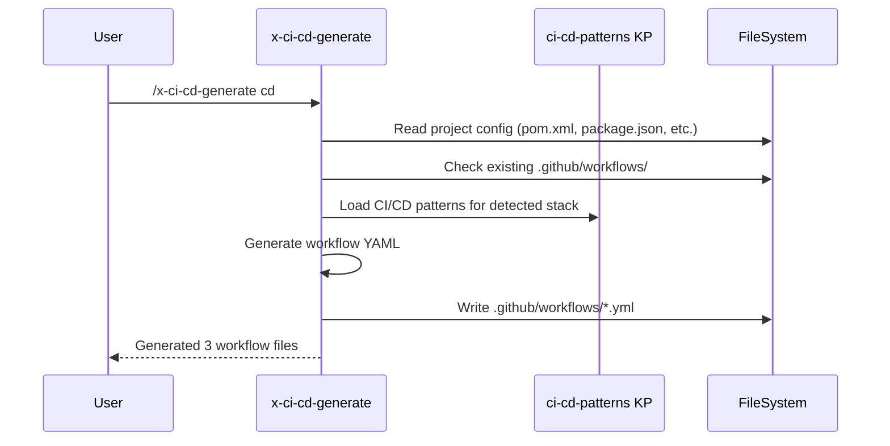

# História: Skill x-ci-cd-generate

**ID:** story-0013-0005
**Chave Jira:** SCRUM-8
**Status:** Pendente

## 1. Dependências

| Blocked By | Blocks |
| :--- | :--- |
| story-0013-0002, story-0013-0004 | story-0013-0026 |

## 2. Regras Transversais Aplicáveis

| ID | Título |
| :--- | :--- |
| RULE-001 | Template Consistency |
| RULE-008 | Skill Invocability |

## 3. Descrição

Como **DevOps engineer**, eu quero uma skill `/x-ci-cd-generate` que gere ou atualize pipelines CI/CD customizados interativamente, para que eu possa criar configuracoes de pipeline adaptadas ao stack tecnologico do projeto sem escrever YAML manualmente.

### Contexto

Os CD workflow templates (story-0013-0004) geram configuracoes default durante o pipeline de geracao. Porem, em projetos existentes ou cenarios avancados (monorepo, multi-service, custom environments), e necessario regenerar ou customizar pipelines. Esta skill permite gerar pipelines interativamente, lendo o stack do projeto e oferecendo opcoes de customizacao.

### 3.1 Workflow da Skill

1. **Detect Stack**: Le configuracao do projeto (pom.xml, package.json, go.mod, Cargo.toml, etc.) para identificar linguagem, build tool e dependencias
2. **Analyze Existing**: Verifica workflows existentes em `.github/workflows/` para nao duplicar
3. **Generate/Update**: Gera novos workflows ou propoe atualizacoes para existentes
4. **Validate**: Executa `actionlint` (se disponivel) para validar YAML gerado

### 3.2 Capabilities

- Gerar CI pipeline (build + test + security scan)
- Gerar CD pipeline (release + deploy + rollback)
- Gerar pipeline de dependency audit (scheduled)
- Gerar pipeline de security scan (scheduled)
- Atualizar pipeline existente (add/remove steps)
- Suportar monorepo (path-based triggers)

### 3.3 Frontmatter

```yaml
name: x-ci-cd-generate
description: "Generate or update CI/CD pipelines based on project stack"
user-invocable: true
argument-hint: "[ci|cd|release|security|all] [--monorepo] [--force]"
allowed-tools: [Read, Write, Edit, Glob, Grep, Bash, Agent]
```

## 3.5 Entrega de Valor

- **Valor Principal:** Geracao interativa de pipelines CI/CD customizados
- **Metrica de Sucesso:** Skill disponivel via `/x-ci-cd-generate` com 6 capabilities
- **Impacto no Negocio:** Automacao de pipeline disponivel on-demand em qualquer momento do ciclo

## 4. Definições de Qualidade Locais

### DoR Local

- [ ] CI/CD KP (story-0013-0002) concluido
- [ ] CD Workflow Templates (story-0013-0004) concluidos
- [ ] Skills existentes de geracao revisados (x-git-push como referencia)
- [ ] `actionlint` tool pesquisada

### DoD Local

- [ ] `skills-templates/x-ci-cd-generate/SKILL.md` criado com workflow completo
- [ ] Frontmatter YAML valido com allowed-tools corretos
- [ ] Secoes: Description, Stack Detection, Workflow, Generated Files, Integration Notes
- [ ] Referencia ao ci-cd-patterns KP no corpo do skill
- [ ] Integration test: skill template gerado para perfis Java e TypeScript

### Global DoD

- **Cobertura:** >= 95% Line, >= 90% Branch
- **Regressao:** Golden file tests passando
- **TDD Compliance:** Test-first pattern
- **Multi-Target:** Claude + GitHub

## 5. Contratos de Dados

**Skill Arguments:**

| Argumento | Tipo | Default | Descrição |
| :--- | :--- | :--- | :--- |
| `type` | Enum | "all" | ci, cd, release, security, all |
| `--monorepo` | Flag | false | Ativa triggers path-based |
| `--force` | Flag | false | Sobrescreve workflows existentes |

## 6. Diagramas

### 6.1 Workflow da Skill



## 7. Critérios de Aceite (Gherkin)

```gherkin
Cenario: Skill gera pipeline CI para projeto Java/Maven
  DADO que o projeto tem pom.xml na raiz
  QUANDO /x-ci-cd-generate ci e executado
  ENTAO o arquivo ".github/workflows/ci.yml" e gerado
  E contem steps para Maven build e test

Cenario: Skill gera pipelines CD para projeto com Dockerfile
  DADO que o projeto tem Dockerfile e pom.xml
  QUANDO /x-ci-cd-generate cd e executado
  ENTAO os arquivos deploy-staging.yml, deploy-production.yml e rollback.yml sao gerados

Cenario: Skill nao sobrescreve workflow existente sem --force
  DADO que ".github/workflows/ci.yml" ja existe
  QUANDO /x-ci-cd-generate ci e executado sem --force
  ENTAO o skill reporta "ci.yml already exists, use --force to overwrite"
  E o arquivo existente nao e modificado

Cenario: Skill gera com monorepo triggers
  DADO que --monorepo flag esta ativa
  QUANDO /x-ci-cd-generate all e executado
  ENTAO os workflows contem "paths:" triggers
  E os paths sao derivados da estrutura do projeto

Cenario: Skill valida YAML com actionlint quando disponivel
  DADO que actionlint esta instalado
  QUANDO /x-ci-cd-generate gera um workflow
  ENTAO actionlint e executado no arquivo gerado
  E erros de validacao sao reportados
```

### 7.2 Mandatory Scenario Categories

- [x] Degenerate cases (N/A)
- [x] Happy path (gera CI para Java)
- [x] Error paths (nao sobrescreve sem --force)
- [x] Boundary values (monorepo triggers, actionlint validation)

## 8. Sub-tarefas

- [ ] [Dev] Criar `skills-templates/x-ci-cd-generate/SKILL.md` com frontmatter
- [ ] [Dev] Implementar secao Stack Detection no SKILL.md
- [ ] [Dev] Implementar secao Workflow com 6 capabilities
- [ ] [Dev] Implementar secao Integration Notes com referencia ao KP
- [ ] [Test] Unit test: skill template gerado com frontmatter valido
- [ ] [Test] Integration test: skill gerado para perfis Java e TypeScript
- [ ] [Test] Atualizar golden file manifests
- [ ] [Doc] Registrar skill na tabela de skills do CLAUDE.md
