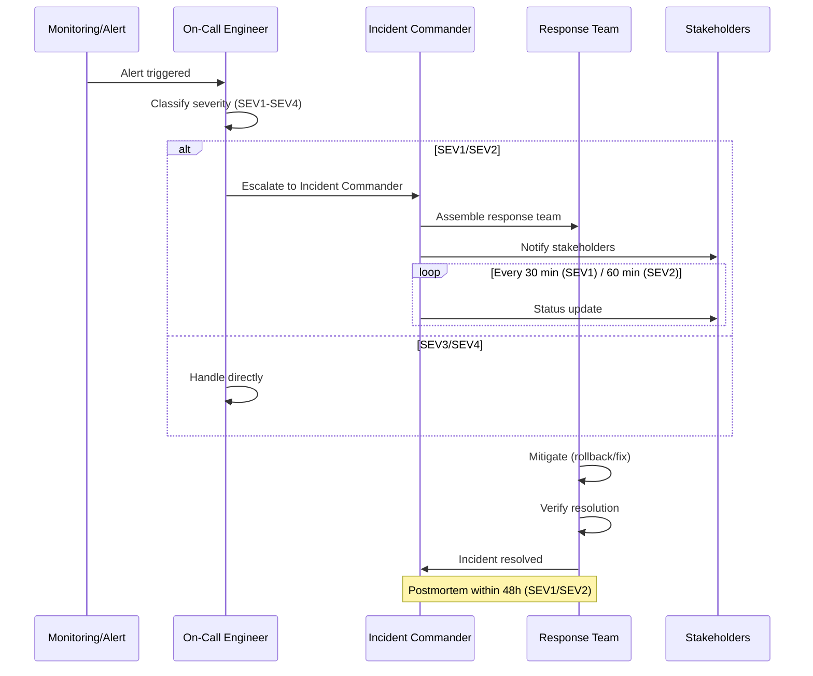
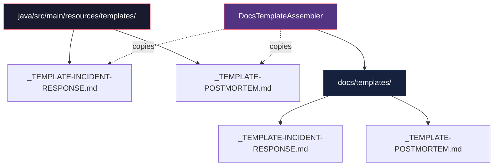

# História: Templates de Incident Response e Postmortem

**ID:** story-0013-0006

## 1. Dependências

| Blocked By | Blocks |
| :--- | :--- |
| — | story-0013-0007, story-0013-0010 |

## 2. Regras Transversais Aplicáveis

| ID | Título |
| :--- | :--- |
| RULE-001 | Template Consistency |
| RULE-002 | Assembler Integration |
| RULE-005 | Golden File Compatibility |

## 3. Descrição

Como **SRE Engineer**, eu quero templates padronizados de Incident Response e Postmortem
gerados automaticamente pelo `ia-dev-env`, garantindo que todos os projetos tenham um
processo formal de gestao de incidentes desde a inicializacao.

Atualmente, o unico template operacional existente e o `_TEMPLATE-DEPLOY-RUNBOOK.md`. Nao
ha nenhum artefato para gestao de incidentes, o que forca equipes a improvisar durante
situacoes criticas de producao. Esta story cria dois novos templates em
`java/src/main/resources/templates/`:

- `_TEMPLATE-INCIDENT-RESPONSE.md` — guia estruturado para resposta a incidentes
- `_TEMPLATE-POSTMORTEM.md` — template para analise pos-incidente

Ambos os templates sao **INCONDICIONAIS** (sempre gerados para qualquer perfil), pois
gestao de incidentes e uma pratica universal independente de stack tecnologica.

### 3.1 Template de Incident Response

- **Severity Classification (SEV1-SEV4):** Criterios objetivos para classificacao de severidade baseados em impacto ao usuario, perda financeira e abrangencia do problema
- **Detection & Triage:** Passos para identificacao rapida do problema, verificacao de alertas, e avaliacao inicial de impacto
- **Communication Plan:** Templates de comunicacao para stakeholders internos, status page, e clientes, com frequencia definida por severidade
- **Mitigation Steps:** Checklist generico de acoes de mitigacao (rollback, feature flags, scaling, traffic diversion)
- **Escalation Matrix:** Tabela de escalacao por severidade com roles, tempos maximos de resposta e canais de comunicacao
- **Resolution Verification:** Passos para confirmar que o incidente foi resolvido (metricas voltaram ao normal, alertas fechados, usuarios impactados notificados)
- **Timeline Template:** Estrutura para registro cronologico de acoes durante o incidente

### 3.2 Template de Postmortem

- **Incident Summary:** Resumo executivo com severidade, duracao, impacto e status de resolucao
- **Timeline (with timestamps):** Cronologia detalhada do incidente com horarios precisos (detectado, triaged, mitigated, resolved)
- **Root Cause Analysis (5 Whys):** Estrutura para analise de causa raiz utilizando a tecnica dos 5 Porques
- **Impact Assessment:** Quantificacao do impacto (usuarios afetados, revenue perdida, SLO burn, duracao do downtime)
- **Contributing Factors:** Fatores que contribuiram para o incidente ou para sua extensao (debt tecnico, lacunas de monitoramento, etc.)
- **Action Items (with owners and deadlines):** Tabela de acoes corretivas com responsavel, prazo e prioridade
- **Lessons Learned:** Reflexoes sobre o que funcionou bem e o que precisa melhorar no processo
- **Prevention Measures:** Medidas concretas para prevenir recorrencia (automacao, alertas, testes, runbooks)

### 3.3 Assembler

O `DocsTemplateAssembler` existente deve ser estendido para copiar ambos os templates
para `docs/templates/` no output gerado. A geracao e incondicional — nao depende de
nenhuma configuracao especifica do perfil.

## 4. Definições de Qualidade Locais

### DoR Local (Definition of Ready)

- [ ] Template `_TEMPLATE-DEPLOY-RUNBOOK.md` existente analisado como referencia de estrutura
- [ ] Estrutura de `resources/templates/` identificada
- [ ] `DocsTemplateAssembler` existente compreendido
- [ ] Best practices de incident response e postmortem pesquisadas (PagerDuty, Google SRE Book)

### DoD Local (Definition of Done)

- [ ] Template `_TEMPLATE-INCIDENT-RESPONSE.md` criado em `java/src/main/resources/templates/`
- [ ] Template `_TEMPLATE-POSTMORTEM.md` criado em `java/src/main/resources/templates/`
- [ ] `DocsTemplateAssembler` estendido para copiar ambos para `docs/templates/`
- [ ] Geracao incondicional (todos os perfis geram os templates)
- [ ] Golden file tests validando output para todos os perfis

### Global Definition of Done (DoD)

- **Cobertura:** >= 95% Line, >= 90% Branch
- **Testes Automatizados:** Golden file tests validando geracao dos templates para todos os perfis
- **TDD Compliance:** Commits test-first, refactoring explicito
- **Documentacao:** README.md e CLAUDE.md atualizados com novos artefatos
- **Backward Compatibility:** Todos os golden file tests existentes continuam passando

## 5. Contratos de Dados (Data Contract)

**_TEMPLATE-INCIDENT-RESPONSE.md (estrutura):**

| Campo | Formato | Request | Response | Origem / Regra |
| :--- | :--- | :--- | :--- | :--- |
| `# Incident Response Guide` | Markdown H1 | — | M | Titulo fixo |
| `## Severity Classification` | Markdown H2 section | — | M | Tabela SEV1-SEV4 com criterios |
| `## Detection & Triage` | Markdown H2 section | — | M | Checklist de deteccao |
| `## Communication Plan` | Markdown H2 section | — | M | Templates por severidade |
| `## Mitigation Steps` | Markdown H2 section | — | M | Checklist de mitigacao |
| `## Escalation Matrix` | Markdown H2 section | — | M | Tabela: Severity, Role, Response Time |
| `## Resolution Verification` | Markdown H2 section | — | M | Checklist de verificacao |
| `## Timeline Template` | Markdown H2 section | — | M | Tabela cronologica (Time, Action, Owner) |

**_TEMPLATE-POSTMORTEM.md (estrutura):**

| Campo | Formato | Request | Response | Origem / Regra |
| :--- | :--- | :--- | :--- | :--- |
| `# Postmortem Report` | Markdown H1 | — | M | Titulo fixo |
| `## Incident Summary` | Markdown H2 section | — | M | Resumo executivo |
| `## Timeline` | Markdown H2 section | — | M | Tabela com timestamps |
| `## Root Cause Analysis` | Markdown H2 section | — | M | 5 Whys structure |
| `## Impact Assessment` | Markdown H2 section | — | M | Quantificacao de impacto |
| `## Contributing Factors` | Markdown H2 section | — | M | Lista de fatores |
| `## Action Items` | Markdown H2 section | — | M | Tabela: Action, Owner, Deadline, Priority |
| `## Lessons Learned` | Markdown H2 section | — | M | Reflexoes |
| `## Prevention Measures` | Markdown H2 section | — | M | Medidas preventivas |

## 6. Diagramas

### 6.1 Fluxo de Incident Response



### 6.2 Estrutura de Arquivos Gerada



## 7. Critérios de Aceite (Gherkin)

```gherkin
Cenario: Template de incident response vazio gerado com todas as secoes
  DADO que o ia-dev-env e executado para um novo projeto
  QUANDO a geracao de templates e concluida
  ENTAO o arquivo resources/templates/_TEMPLATE-INCIDENT-RESPONSE.md deve existir
  E deve conter as secoes Severity Classification, Detection & Triage, Communication Plan
  E deve conter as secoes Mitigation Steps, Escalation Matrix, Resolution Verification, Timeline Template

Cenario: Classificacao de severidade SEV1 com criterios de impacto critico
  DADO que o template _TEMPLATE-INCIDENT-RESPONSE.md foi gerado
  QUANDO a secao Severity Classification e inspecionada
  ENTAO deve conter 4 niveis de severidade (SEV1, SEV2, SEV3, SEV4)
  E SEV1 deve indicar impacto critico com perda total de servico ou perda financeira significativa
  E cada nivel deve definir criterios objetivos de classificacao

Cenario: Fluxo de incidente SEV1 com escalacao e comunicacao
  DADO que o template _TEMPLATE-INCIDENT-RESPONSE.md foi gerado
  QUANDO as secoes Escalation Matrix e Communication Plan sao inspecionadas
  ENTAO a Escalation Matrix deve definir Incident Commander para SEV1
  E a Communication Plan deve definir frequencia de atualizacao de 30 minutos para SEV1
  E o tempo maximo de resposta para SEV1 deve ser <= 15 minutos

Cenario: Postmortem template com action items estruturados
  DADO que o template _TEMPLATE-POSTMORTEM.md foi gerado
  QUANDO a secao Action Items e inspecionada
  ENTAO deve conter uma tabela com colunas Action, Owner, Deadline, Priority
  E deve conter instrucoes para definir prioridade (P0-P3)
  E a secao Root Cause Analysis deve conter estrutura de 5 Whys

Cenario: Ambos os templates gerados para todos os perfis
  DADO que o ia-dev-env e executado para o perfil "<perfil>"
  QUANDO a geracao de templates e concluida
  ENTAO docs/templates/_TEMPLATE-INCIDENT-RESPONSE.md deve existir no output
  E docs/templates/_TEMPLATE-POSTMORTEM.md deve existir no output

  Exemplos:
    | perfil             |
    | java-spring        |
    | java-quarkus       |
    | go-gin             |
    | python-fastapi     |
    | typescript-nestjs  |
    | rust-axum          |
    | kotlin-ktor        |
    | python-click-cli   |

Cenario: Golden file tests existentes nao quebram com novos templates
  DADO que os golden file tests existentes estao passando
  QUANDO os templates de incident response e postmortem sao adicionados ao pipeline
  ENTAO todos os golden file tests existentes devem continuar passando
  E os novos templates devem aparecer nos manifestos de artefatos esperados
```

### 7.1 Scenario Ordering (TPP)

> TPP: degenerate (template vazio com secoes) -> constant (classificacao de severidade) ->
> conditions (fluxo SEV1 com escalacao) -> composite (postmortem com action items) ->
> iterations (todos os perfis) -> edge cases (backward compatibility golden files).

### 7.2 Mandatory Scenario Categories

- [x] Degenerate cases (template vazio gerado com secoes)
- [x] Happy path (fluxo SEV1, postmortem com action items)
- [x] Error paths (golden files nao quebram)
- [x] Boundary values (todos os perfis geram ambos os templates)

## 8. Sub-tarefas

- [ ] [Test] Unitario: validar estrutura do template _TEMPLATE-INCIDENT-RESPONSE.md (7 secoes obrigatorias)
- [ ] [Test] Unitario: validar estrutura do template _TEMPLATE-POSTMORTEM.md (8 secoes obrigatorias)
- [ ] [Dev] Criar template `java/src/main/resources/templates/_TEMPLATE-INCIDENT-RESPONSE.md`
- [ ] [Dev] Criar template `java/src/main/resources/templates/_TEMPLATE-POSTMORTEM.md`
- [ ] [Test] Integracao: validar que DocsTemplateAssembler copia ambos os templates
- [ ] [Dev] Estender `DocsTemplateAssembler` para copiar incident response e postmortem templates
- [ ] [Test] Integracao: golden file test para output de docs/templates/ com ambos os templates
- [ ] [Test] Integracao: validar geracao incondicional para todos os perfis (8 perfis)
- [ ] [Test] Regressao: confirmar que golden file tests existentes continuam passando
- [ ] [Doc] Atualizar CHANGELOG e manifestos de artefatos esperados
