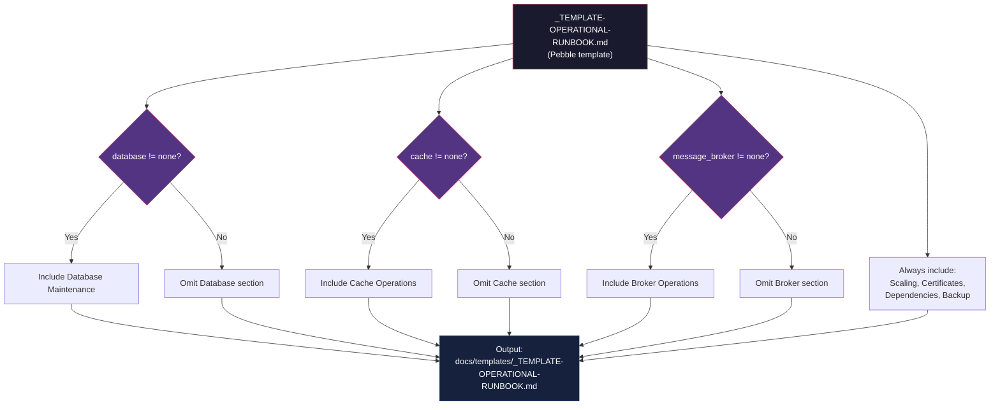

# Historia: Template de Operational Runbook

**ID:** story-0013-0007

## 1. Dependencias

| Blocked By | Blocks |
| :--- | :--- |
| story-0013-0006 | story-0013-0010 |

## 2. Regras Transversais Aplicaveis

| ID | Titulo |
| :--- | :--- |
| RULE-001 | Template Consistency |
| RULE-002 | Assembler Integration |
| RULE-003 | Pebble Template Variables |
| RULE-004 | Conditional Generation |

## 3. Descricao

Como **SRE Engineer**, eu quero um template de Operational Runbook generico que cubra
procedimentos operacionais alem do deploy, garantindo que equipes tenham guias
padronizados para operacoes de rotina e emergencia.

O template `_TEMPLATE-DEPLOY-RUNBOOK.md` existente cobre apenas o ciclo de deploy.
Operacoes como scaling, manutencao de banco de dados, gestao de cache, rotacao de
certificados e procedimentos de backup nao possuem documentacao padronizada. Esta story
cria `_TEMPLATE-OPERATIONAL-RUNBOOK.md` em `java/src/main/resources/templates/` com
secoes condicionais que variam de acordo com a stack configurada no perfil.

### 3.1 Secoes do Template

- **Scaling Procedures:** Horizontal scaling (replicas), vertical scaling (resources), auto-scaling configuration, scaling validation checklist
- **Database Maintenance:** Vacuum/analyze (PostgreSQL), reindex operations, failover procedures, connection pool tuning, slow query investigation
- **Cache Operations:** Cache flush (full e parcial), cache warmup procedures, TTL adjustment, hit rate monitoring, eviction policy tuning
- **Certificate Rotation:** TLS certificate renewal, mutual TLS rotation, secrets rotation schedule, validation steps
- **Dependency Failure Handling:** External API failure procedures, circuit breaker manual override, fallback activation, degraded mode operations
- **Backup & Restore Procedures:** Backup verification, restore testing schedule, point-in-time recovery, disaster recovery activation

### 3.2 Secoes Condicionais (Pebble)

O template utiliza variaveis Pebble para incluir ou omitir secoes com base na
configuracao do projeto:

- `` — Secao Database Maintenance incluida apenas se ha database configurado
- `` — Secao Cache Operations incluida apenas se ha cache configurado
- `` — Secao adicional Message Broker Operations (queue management, dead letter processing, consumer lag monitoring)
- Secoes Scaling, Certificate Rotation, Dependency Failure e Backup & Restore sao **incondicionais**

### 3.3 Assembler

O `DocsTemplateAssembler` (ja estendido em story-0013-0006) deve processar o template
Pebble e gerar o output condicional em `docs/templates/`. O assembler deve resolver as
variaveis Pebble com base na configuracao do perfil antes de escrever o output.

## 4. Definicoes de Qualidade Locais

### DoR Local (Definition of Ready)

- [ ] Template `_TEMPLATE-DEPLOY-RUNBOOK.md` existente analisado como referencia
- [ ] Templates de incident response e postmortem (story-0013-0006) implementados
- [ ] Variaveis Pebble existentes (`database`, `cache`, `message_broker`) identificadas no `TemplateVariable` enum
- [ ] Operacoes de manutencao por tecnologia pesquisadas (PostgreSQL vacuum, Redis flush, Kafka consumer groups)

### DoD Local (Definition of Done)

- [ ] Template `_TEMPLATE-OPERATIONAL-RUNBOOK.md` criado em `java/src/main/resources/templates/`
- [ ] Secoes condicionais implementadas com variaveis Pebble
- [ ] `DocsTemplateAssembler` estendido para processar template condicional
- [ ] Golden file tests validando output para perfis com e sem database/cache/broker
- [ ] Secoes incondicionais presentes em todos os perfis

### Global Definition of Done (DoD)

- **Cobertura:** >= 95% Line, >= 90% Branch
- **Testes Automatizados:** Golden file tests validando geracao condicional para multiplos perfis
- **TDD Compliance:** Commits test-first, refactoring explicito
- **Documentacao:** README.md e CLAUDE.md atualizados com novos artefatos
- **Backward Compatibility:** Todos os golden file tests existentes continuam passando

## 5. Contratos de Dados (Data Contract)

**_TEMPLATE-OPERATIONAL-RUNBOOK.md (estrutura):**

| Campo | Formato | Request | Response | Origem / Regra |
| :--- | :--- | :--- | :--- | :--- |
| `# Operational Runbook — {{PROJECT_NAME}}` | Markdown H1 | — | M | Titulo com nome do projeto |
| `## Scaling Procedures` | Markdown H2 section | — | M | Incondicional |
| `## Database Maintenance` | Markdown H2 section | — | C | Condicional: `database != "none"` |
| `## Cache Operations` | Markdown H2 section | — | C | Condicional: `cache != "none"` |
| `## Message Broker Operations` | Markdown H2 section | — | C | Condicional: `message_broker != "none"` |
| `## Certificate Rotation` | Markdown H2 section | — | M | Incondicional |
| `## Dependency Failure Handling` | Markdown H2 section | — | M | Incondicional |
| `## Backup & Restore Procedures` | Markdown H2 section | — | M | Incondicional |

**Pebble variables utilizadas:**

| Variavel | Tipo | Origem | Descricao |
| :--- | :--- | :--- | :--- |
| `PROJECT_NAME` | String | Project identity | Nome do projeto |
| `database` | String | Stack config `data.database.type` | Tipo de database (none, postgresql, mysql, mongodb) |
| `cache` | String | Stack config `data.cache.type` | Tipo de cache (none, redis, memcached) |
| `message_broker` | String | Stack config `messaging.broker.type` | Tipo de broker (none, kafka, rabbitmq) |

## 6. Diagramas

### 6.1 Resolucao Condicional do Template



## 7. Criterios de Aceite (Gherkin)

```gherkin
Cenario: Runbook sem database nem cache nem broker contem apenas secoes incondicionais
  DADO que o perfil configura database como "none", cache como "none" e message_broker como "none"
  QUANDO o ia-dev-env gera o operational runbook
  ENTAO o arquivo docs/templates/_TEMPLATE-OPERATIONAL-RUNBOOK.md deve existir
  E deve conter as secoes Scaling Procedures, Certificate Rotation, Dependency Failure Handling, Backup & Restore
  E NAO deve conter a secao Database Maintenance
  E NAO deve conter a secao Cache Operations
  E NAO deve conter a secao Message Broker Operations

Cenario: Runbook com PostgreSQL inclui secao Database Maintenance
  DADO que o perfil configura database como "postgresql"
  QUANDO o ia-dev-env gera o operational runbook
  ENTAO o arquivo deve conter a secao Database Maintenance
  E a secao deve incluir procedimentos de vacuum, reindex e failover
  E as secoes incondicionais devem estar presentes

Cenario: Runbook com Redis cache inclui secao Cache Operations
  DADO que o perfil configura cache como "redis"
  QUANDO o ia-dev-env gera o operational runbook
  ENTAO o arquivo deve conter a secao Cache Operations
  E a secao deve incluir procedimentos de flush, warmup e TTL adjustment
  E a secao deve incluir monitoramento de hit rate

Cenario: Runbook com Kafka broker inclui secao Message Broker Operations
  DADO que o perfil configura message_broker como "kafka"
  QUANDO o ia-dev-env gera o operational runbook
  ENTAO o arquivo deve conter a secao Message Broker Operations
  E a secao deve incluir queue management e dead letter processing
  E a secao deve incluir monitoramento de consumer lag

Cenario: Runbook com stack completa inclui todas as secoes
  DADO que o perfil configura database como "postgresql", cache como "redis" e message_broker como "kafka"
  QUANDO o ia-dev-env gera o operational runbook
  ENTAO o arquivo deve conter TODAS as 7 secoes
  E as secoes condicionais Database Maintenance, Cache Operations e Message Broker Operations devem estar presentes
  E as secoes incondicionais Scaling, Certificate Rotation, Dependency Failure, Backup & Restore devem estar presentes

Cenario: Placeholder PROJECT_NAME resolvido no titulo do runbook
  DADO que o project identity define nome como "payment-service"
  QUANDO o ia-dev-env gera o operational runbook
  ENTAO o titulo do documento deve ser "# Operational Runbook — payment-service"
```

### 7.1 Scenario Ordering (TPP)

> TPP: degenerate (runbook sem nenhuma dependencia — apenas secoes incondicionais) ->
> constant (com PostgreSQL) -> constant+ (com Redis cache) -> scalar (com Kafka broker) ->
> composite (stack completa, todas as secoes) -> conditions (placeholder resolution).

### 7.2 Mandatory Scenario Categories

- [x] Degenerate cases (runbook sem database/cache/broker)
- [x] Happy path (com PostgreSQL, com Redis, com Kafka, stack completa)
- [x] Error paths (secoes condicionais omitidas corretamente)
- [x] Boundary values (placeholder resolution)

## 8. Sub-tarefas

- [ ] [Test] Unitario: validar estrutura do template com secoes incondicionais (4 secoes sempre presentes)
- [ ] [Test] Unitario: validar resolucao condicional Pebble para database, cache e message_broker
- [ ] [Dev] Criar template `java/src/main/resources/templates/_TEMPLATE-OPERATIONAL-RUNBOOK.md` com Pebble conditionals
- [ ] [Dev] Estender `DocsTemplateAssembler` para processar template condicional com variaveis Pebble
- [ ] [Test] Integracao: golden file test para perfil sem database/cache/broker (apenas secoes incondicionais)
- [ ] [Test] Integracao: golden file test para perfil com PostgreSQL (secao Database Maintenance presente)
- [ ] [Test] Integracao: golden file test para perfil com Redis (secao Cache Operations presente)
- [ ] [Test] Integracao: golden file test para perfil com Kafka (secao Message Broker Operations presente)
- [ ] [Test] Integracao: golden file test para perfil com stack completa (todas as secoes)
- [ ] [Test] Regressao: confirmar que golden file tests existentes continuam passando
- [ ] [Doc] Atualizar CHANGELOG e manifestos de artefatos esperados
