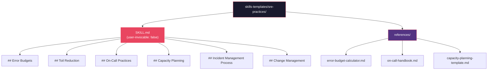
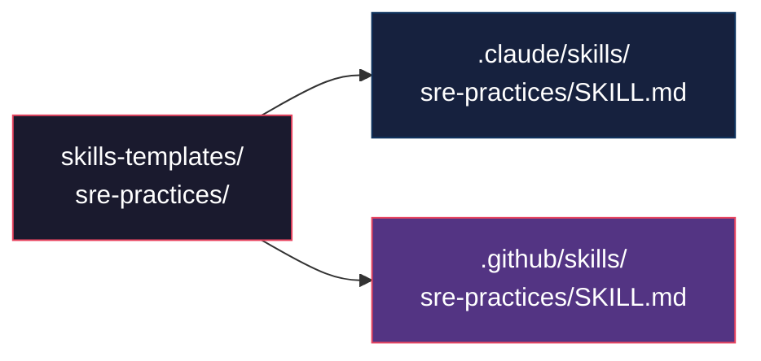

# Historia: SRE Practices Knowledge Pack

**ID:** story-0013-0008

## 1. Dependencias

| Blocked By | Blocks |
| :--- | :--- |
| — | story-0013-0009, story-0013-0011, story-0013-0023 |

## 2. Regras Transversais Aplicaveis

| ID | Titulo |
| :--- | :--- |
| RULE-001 | Template Consistency |
| RULE-007 | Knowledge Pack Structure |
| RULE-003 | Pebble Template Variables |

## 3. Descricao

Como **SRE Engineer**, eu quero um Knowledge Pack dedicado a praticas SRE que a IA possa
referenciar ao guiar decisoes operacionais, garantindo que recomendacoes de confiabilidade,
capacidade e gestao de incidentes sigam best practices da industria.

O Knowledge Pack de Observability existente cobre tracing, metricas, logging e health
checks, mas nao aborda praticas SRE como error budgets, toil reduction, on-call, capacity
planning e incident management process. Estas sao areas fundamentais para a operacao de
servicos em producao e representam uma lacuna significativa na capacidade da IA de guiar
equipes em temas operacionais.

O KP sera criado em `skills-templates/sre-practices/SKILL.md` com frontmatter
`user-invocable: false`, seguindo a estrutura padrao de Knowledge Packs (RULE-007).

### 3.1 Content Sections

- **Error Budgets:** SLO-based release gates (deploy freeze quando budget esgotado), burn rate calculation (fast/slow burn alerts), budget exhaustion policy (actions at 50%, 75%, 100% consumption), error budget allocation por time period
- **Toil Reduction:** Toil identification criteria (manual, repetitive, automatable, tactical, no enduring value), automation prioritization matrix (frequency x time x risk), toil budget (max 50% of team time), elimination strategies
- **On-Call Practices:** Rotation patterns (follow-the-sun, weekly, hybrid), escalation policies (response time by severity), handoff procedures (shift log, context transfer), fatigue management (max pages/shift, compensation, post-incident rest)
- **Capacity Planning:** Load testing methodology (baseline, stress, soak), growth modeling (linear, exponential, seasonal), headroom targets (minimum 30% above peak), resource right-sizing (CPU, memory, storage projections)
- **Incident Management Process:** Detection (alerting, user reports, synthetic monitoring), response (severity classification, commander assignment), mitigation (rollback, feature flags, traffic management), resolution (root cause fix, verification), postmortem (blameless culture, timeline, action items)
- **Change Management:** Change freeze policies (holiday, major events), rollback criteria (error rate thresholds, latency degradation), canary analysis (traffic percentage, evaluation window, success criteria), deployment velocity metrics

### 3.2 Reference Files

O Knowledge Pack inclui arquivos de referencia em `references/` subdirectory:

- `references/error-budget-calculator.md` — Formulas e exemplos para calculo de error budget, burn rate e remaining budget. Inclui tabela de SLO targets e seus error budgets correspondentes (99.9% = 43.8min/month)
- `references/on-call-handbook.md` — Guia completo para engenheiros de plantao: tools, escalation procedures, page response workflow, post-incident actions, self-care
- `references/capacity-planning-template.md` — Template para documentacao de capacity planning: current load, growth projections, resource requirements, scaling triggers, cost estimates

### 3.3 Multi-Target Generation

O KP gera artefatos para Claude Code (`.claude/skills/sre-practices/`) e GitHub Copilot
(`.github/skills/sre-practices/`). Knowledge Packs nao geram para Codex target.

## 4. Definicoes de Qualidade Locais

### DoR Local (Definition of Ready)

- [ ] Knowledge Pack de Observability existente analisado (para evitar sobreposicao)
- [ ] Google SRE Book e PagerDuty incident response documentation pesquisados
- [ ] Estrutura de `skills-templates/` existente compreendida
- [ ] Frontmatter conventions para KPs identificadas

### DoD Local (Definition of Done)

- [ ] `skills-templates/sre-practices/SKILL.md` criado com frontmatter `user-invocable: false`
- [ ] 6 secoes de conteudo implementadas (Error Budgets, Toil, On-Call, Capacity, Incidents, Change)
- [ ] 3 reference files criados no subdirectory `references/`
- [ ] KP gerado para ambos os targets (Claude Code e GitHub Copilot)
- [ ] Golden file tests validando output

### Global Definition of Done (DoD)

- **Cobertura:** >= 95% Line, >= 90% Branch
- **Testes Automatizados:** Golden file tests validando geracao do KP para multi-target
- **TDD Compliance:** Commits test-first, refactoring explicito
- **Documentacao:** README.md e CLAUDE.md atualizados com novo KP
- **Backward Compatibility:** Todos os golden file tests existentes continuam passando

## 5. Contratos de Dados (Data Contract)

**skills-templates/sre-practices/SKILL.md (estrutura):**

| Campo | Formato | Request | Response | Origem / Regra |
| :--- | :--- | :--- | :--- | :--- |
| Frontmatter `name` | YAML string | — | M | "sre-practices" |
| Frontmatter `description` | YAML string | — | M | Descricao do KP |
| Frontmatter `user-invocable` | YAML boolean | — | M | `false` (RULE-007) |
| `## Error Budgets` | Markdown H2 section | — | M | SLO gates, burn rate, exhaustion policy |
| `## Toil Reduction` | Markdown H2 section | — | M | Identification, prioritization, budget |
| `## On-Call Practices` | Markdown H2 section | — | M | Rotation, escalation, fatigue |
| `## Capacity Planning` | Markdown H2 section | — | M | Load testing, growth, headroom |
| `## Incident Management Process` | Markdown H2 section | — | M | Detection to postmortem |
| `## Change Management` | Markdown H2 section | — | M | Freeze, rollback, canary |

**Reference files:**

| Arquivo | Formato | Response | Descricao |
| :--- | :--- | :--- | :--- |
| `references/error-budget-calculator.md` | Markdown | M | Formulas e tabelas de error budget |
| `references/on-call-handbook.md` | Markdown | M | Guia de plantao |
| `references/capacity-planning-template.md` | Markdown | M | Template de capacity planning |

## 6. Diagramas

### 6.1 Estrutura do Knowledge Pack



### 6.2 Multi-Target Output



## 7. Criterios de Aceite (Gherkin)

```gherkin
Cenario: Knowledge Pack gerado com todas as 6 secoes de conteudo
  DADO que o ia-dev-env e executado para um novo projeto
  QUANDO a geracao de skills e concluida
  ENTAO o arquivo .claude/skills/sre-practices/SKILL.md deve existir
  E deve conter frontmatter com user-invocable: false
  E deve conter as secoes Error Budgets, Toil Reduction, On-Call Practices
  E deve conter as secoes Capacity Planning, Incident Management Process, Change Management

Cenario: Secao Error Budgets contem formulas de burn rate e exhaustion policy
  DADO que o KP sre-practices foi gerado
  QUANDO a secao Error Budgets e inspecionada
  ENTAO deve conter descricao de SLO-based release gates
  E deve conter formulas de burn rate calculation
  E deve conter politica de acoes em 50%, 75% e 100% de consumo do budget

Cenario: Reference files gerados no subdirectory references
  DADO que o ia-dev-env e executado para um novo projeto
  QUANDO a geracao de skills e concluida
  ENTAO o arquivo references/error-budget-calculator.md deve existir dentro do skill directory
  E o arquivo references/on-call-handbook.md deve existir dentro do skill directory
  E o arquivo references/capacity-planning-template.md deve existir dentro do skill directory

Cenario: KP gerado para ambos os targets Claude e GitHub
  DADO que o ia-dev-env e executado para um novo projeto
  QUANDO a geracao multi-target e concluida
  ENTAO o arquivo .claude/skills/sre-practices/SKILL.md deve existir
  E o arquivo .github/skills/sre-practices/SKILL.md deve existir
  E ambos os arquivos devem ter conteudo identico

Cenario: KP nao sobrepoem conteudo do Observability KP existente
  DADO que o KP sre-practices e o KP observability foram gerados
  QUANDO seus conteudos sao comparados
  ENTAO sre-practices NAO deve conter secoes sobre tracing, metrics ou logging
  E observability NAO deve conter secoes sobre error budgets, toil ou on-call
  E os KPs devem ser complementares sem duplicacao

Cenario: Golden file tests existentes nao quebram com novo KP
  DADO que os golden file tests existentes estao passando
  QUANDO o KP sre-practices e adicionado ao pipeline
  ENTAO todos os golden file tests existentes devem continuar passando
  E o novo KP deve aparecer nos manifestos de artefatos esperados
```

### 7.1 Scenario Ordering (TPP)

> TPP: degenerate (KP gerado com todas as secoes) -> constant (secao Error Budgets detalhada) ->
> collection (reference files no subdirectory) -> composite (multi-target output) ->
> edge cases (nao sobrepoe observability, backward compatibility).

### 7.2 Mandatory Scenario Categories

- [x] Degenerate cases (KP gerado com estrutura completa)
- [x] Happy path (secoes com conteudo, reference files, multi-target)
- [x] Error paths (nao sobrepoe observability)
- [x] Boundary values (golden file compatibility)

## 8. Sub-tarefas

- [ ] [Test] Unitario: validar frontmatter do KP (user-invocable: false, name, description)
- [ ] [Test] Unitario: validar presenca das 6 secoes de conteudo
- [ ] [Dev] Criar `skills-templates/sre-practices/SKILL.md` com frontmatter e 6 secoes
- [ ] [Dev] Criar `skills-templates/sre-practices/references/error-budget-calculator.md`
- [ ] [Dev] Criar `skills-templates/sre-practices/references/on-call-handbook.md`
- [ ] [Dev] Criar `skills-templates/sre-practices/references/capacity-planning-template.md`
- [ ] [Test] Integracao: golden file test para output do KP em .claude/skills/
- [ ] [Test] Integracao: golden file test para output do KP em .github/skills/
- [ ] [Test] Integracao: validar que reference files sao copiados para ambos os targets
- [ ] [Test] Regressao: confirmar que golden file tests existentes continuam passando
- [ ] [Doc] Atualizar CHANGELOG, README.md e CLAUDE.md com novo KP
