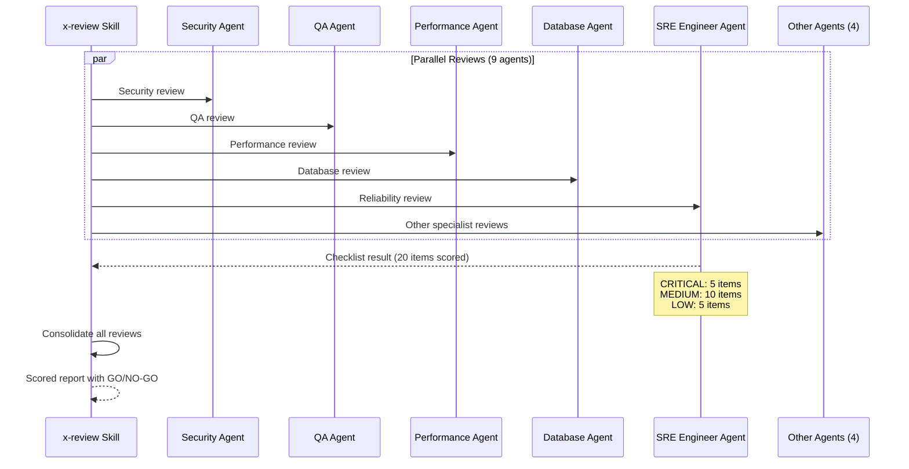
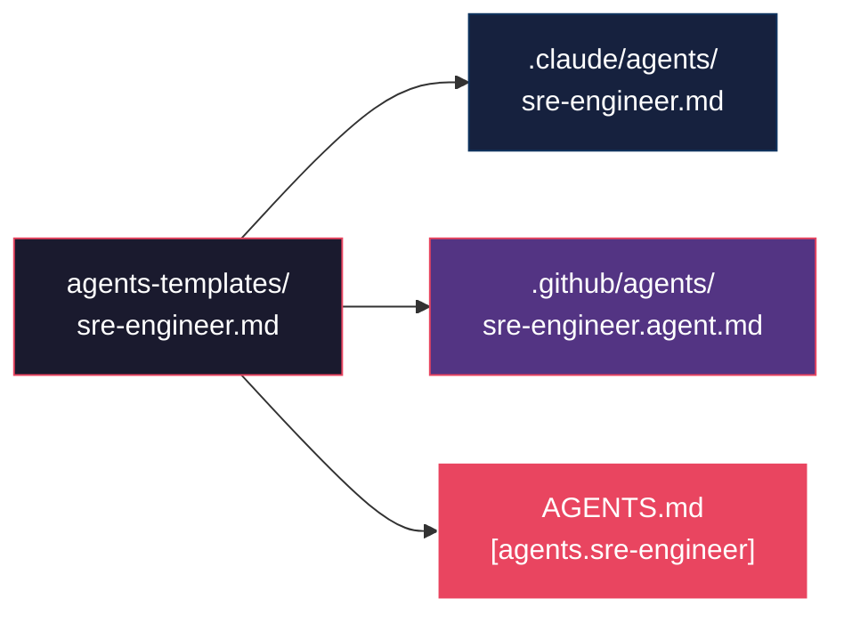

# Historia: SRE Engineer Agent

**ID:** story-0013-0009

## 1. Dependencias

| Blocked By | Blocks |
| :--- | :--- |
| story-0013-0008 | story-0013-0010 |

## 2. Regras Transversais Aplicaveis

| ID | Titulo |
| :--- | :--- |
| RULE-001 | Template Consistency |
| RULE-009 | Agent Persona Contract |
| RULE-006 | Multi-Target Output |

## 3. Descricao

Como **Tech Lead**, eu quero um agent SRE Engineer que participe dos reviews paralelos do
`x-review`, garantindo que aspectos de confiabilidade, operabilidade e production-readiness
sejam avaliados por uma persona especializada.

Atualmente existem 8 agents (architect, devops-engineer, performance-engineer, product-owner,
qa-engineer, security-engineer, tech-lead, typescript-developer) mas nenhum e focado em
reliability engineering. Quando o `x-review` executa reviews paralelos com 8 subagents,
nenhum avalia SLOs, health checks, graceful shutdown, error budgets ou on-call readiness.
O resultado e que aspectos criticos de operabilidade sao ignorados no processo de review.

O agent sera criado em `agents-templates/sre-engineer.md` e deve atender ao contrato de
persona definido em RULE-009: role, expertise areas, numbered checklist (minimo 15 pontos,
este agent tera 20), severity classification e integration notes.

### 3.1 Agent Contract (RULE-009)

- **Role:** Site Reliability Engineer specialist
- **Expertise:** reliability, operability, incident response, SLOs/SLIs, capacity planning, chaos engineering, graceful degradation, observability

### 3.2 Checklist (20 points)

| # | Item | Severity |
| :--- | :--- | :--- |
| 1 | Health checks (liveness, readiness, startup) implemented | CRITICAL |
| 2 | Graceful shutdown with configurable timeout | CRITICAL |
| 3 | Structured logging with correlation IDs | CRITICAL |
| 4 | SLO/SLI definitions documented | CRITICAL |
| 5 | Error budget tracking configured | CRITICAL |
| 6 | Alerting thresholds defined and documented | MEDIUM |
| 7 | On-call runbooks exist for critical paths | MEDIUM |
| 8 | Rollback procedure documented and tested | MEDIUM |
| 9 | Capacity headroom >= 30% above peak load | MEDIUM |
| 10 | Circuit breaker configured for external dependencies | MEDIUM |
| 11 | Retry with exponential backoff for transient failures | MEDIUM |
| 12 | Timeout budgets defined for all external calls | MEDIUM |
| 13 | Rate limiting on ingress endpoints | MEDIUM |
| 14 | Database connection pool sizing documented | MEDIUM |
| 15 | Cache TTL and eviction policies defined | MEDIUM |
| 16 | Backup verification schedule established | LOW |
| 17 | Disaster recovery plan tested (at least annually) | LOW |
| 18 | Configuration externalized (no hardcoded values) | LOW |
| 19 | Secrets rotation schedule defined | LOW |
| 20 | Change management process followed | LOW |

### 3.3 Severity Classification

- **CRITICAL (items 1-5):** Production blockers. Service cannot go to production without these. Failure to comply results in review rejection.
- **MEDIUM (items 6-15):** Operational risk. Service can go to production but operational incidents are likely. Must be tracked as tech debt with timeline.
- **LOW (items 16-20):** Best practices. Recommended for mature services. Should be addressed within next 2 sprints.

### 3.4 Integration

- **x-review skill:** Used as one of the parallel reviewers (9th subagent alongside existing 8)
- **x-ops-incident skill:** Used as the primary agent for incident response guidance
- **SRE Practices KP:** Agent reads this KP (from story-0013-0008) for domain knowledge

### 3.5 Multi-Target Output (RULE-006)

O agent gera artefatos para os 3 targets:

- **Claude Code:** `.claude/agents/sre-engineer.md`
- **GitHub Copilot:** `.github/agents/sre-engineer.agent.md` (com frontmatter YAML para tools/disallowed-tools)
- **OpenAI Codex:** Secao `[agents.sre-engineer]` em `AGENTS.md`

## 4. Definicoes de Qualidade Locais

### DoR Local (Definition of Ready)

- [ ] SRE Practices Knowledge Pack (story-0013-0008) implementado
- [ ] Agents existentes analisados como referencia de estrutura (ex: devops-engineer.md, security-engineer.md)
- [ ] Contrato de persona (RULE-009) compreendido
- [ ] Integracao com x-review skill mapeada

### DoD Local (Definition of Done)

- [ ] `agents-templates/sre-engineer.md` criado com role, expertise, checklist de 20 pontos
- [ ] Severity classification (CRITICAL/MEDIUM/LOW) documentada
- [ ] Agent gerado para os 3 targets (Claude, GitHub, Codex)
- [ ] Integration notes com x-review e x-ops-incident documentadas
- [ ] Golden file tests validando output para todos os targets

### Global Definition of Done (DoD)

- **Cobertura:** >= 95% Line, >= 90% Branch
- **Testes Automatizados:** Golden file tests validando geracao do agent para 3 targets
- **TDD Compliance:** Commits test-first, refactoring explicito
- **Documentacao:** README.md e CLAUDE.md atualizados com novo agent
- **Backward Compatibility:** Todos os golden file tests existentes continuam passando

## 5. Contratos de Dados (Data Contract)

**agents-templates/sre-engineer.md (estrutura):**

| Campo | Formato | Request | Response | Origem / Regra |
| :--- | :--- | :--- | :--- | :--- |
| `# SRE Engineer` | Markdown H1 | — | M | Titulo do agent |
| `## Role` | Markdown H2 section | — | M | Descricao do papel |
| `## Expertise` | Markdown H2 section | — | M | Lista de areas de expertise |
| `## Review Checklist` | Markdown H2 section | — | M | 20 items numerados |
| `## Severity Classification` | Markdown H2 section | — | M | CRITICAL/MEDIUM/LOW com ranges |
| `## Integration Notes` | Markdown H2 section | — | M | Skills que utilizam este agent |
| `## Knowledge References` | Markdown H2 section | — | M | KPs referenciados |

**Multi-target output:**

| Target | Path | Formato |
| :--- | :--- | :--- |
| Claude Code | `.claude/agents/sre-engineer.md` | Markdown puro |
| GitHub Copilot | `.github/agents/sre-engineer.agent.md` | Markdown com frontmatter YAML |
| OpenAI Codex | `AGENTS.md` (secao) | TOML-style section |

## 6. Diagramas

### 6.1 Integracao do SRE Agent no x-review



### 6.2 Multi-Target Generation



## 7. Criterios de Aceite (Gherkin)

```gherkin
Cenario: Agent gerado com checklist completo de 20 itens
  DADO que o ia-dev-env e executado para um novo projeto
  QUANDO a geracao de agents e concluida
  ENTAO o arquivo .claude/agents/sre-engineer.md deve existir
  E deve conter uma secao Review Checklist com exatamente 20 itens numerados
  E cada item deve ter descricao e severidade atribuida

Cenario: Checklist possui classificacao de severidade CRITICAL, MEDIUM e LOW
  DADO que o agent sre-engineer foi gerado
  QUANDO a secao Severity Classification e inspecionada
  ENTAO deve definir itens 1-5 como CRITICAL
  E deve definir itens 6-15 como MEDIUM
  E deve definir itens 16-20 como LOW
  E a descricao de CRITICAL deve indicar que sao production blockers

Cenario: Agent contem integration notes com x-review e x-ops-incident
  DADO que o agent sre-engineer foi gerado
  QUANDO a secao Integration Notes e inspecionada
  ENTAO deve referenciar o skill x-review como consumidor do agent
  E deve referenciar o skill x-ops-incident como consumidor do agent
  E deve referenciar o KP sre-practices como fonte de conhecimento

Cenario: Agent gerado para os 3 targets Claude, GitHub e Codex
  DADO que o ia-dev-env e executado para um novo projeto
  QUANDO a geracao multi-target e concluida
  ENTAO o arquivo .claude/agents/sre-engineer.md deve existir
  E o arquivo .github/agents/sre-engineer.agent.md deve existir
  E o arquivo AGENTS.md deve conter uma secao [agents.sre-engineer]

Cenario: Agent GitHub possui frontmatter YAML com tools
  DADO que o agent sre-engineer foi gerado para GitHub target
  QUANDO o frontmatter de .github/agents/sre-engineer.agent.md e inspecionado
  ENTAO deve conter campo tools com lista de ferramentas permitidas
  E deve seguir o formato dos agents GitHub existentes

Cenario: Itens CRITICAL do checklist cobrem fundamentos de production-readiness
  DADO que o agent sre-engineer foi gerado
  QUANDO os 5 itens CRITICAL sao inspecionados
  ENTAO devem cobrir health checks, graceful shutdown, structured logging
  E devem cobrir SLO/SLI definitions e error budget tracking
  E cada item CRITICAL deve ter descricao acionavel

Cenario: Golden file tests existentes nao quebram com novo agent
  DADO que os golden file tests existentes estao passando
  QUANDO o agent sre-engineer e adicionado ao pipeline
  ENTAO todos os golden file tests existentes devem continuar passando
  E o novo agent deve aparecer nos manifestos de artefatos esperados
```

### 7.1 Scenario Ordering (TPP)

> TPP: degenerate (agent com checklist gerado) -> constant (severity classification) ->
> constant+ (integration notes) -> composite (multi-target 3 outputs) ->
> conditions (GitHub frontmatter, CRITICAL items detalhados) -> edge cases (backward compatibility).

### 7.2 Mandatory Scenario Categories

- [x] Degenerate cases (agent gerado com checklist)
- [x] Happy path (severity classification, integration notes, multi-target)
- [x] Error paths (backward compatibility)
- [x] Boundary values (CRITICAL items cobrem fundamentos, GitHub frontmatter)

## 8. Sub-tarefas

- [ ] [Test] Unitario: validar estrutura do agent (role, expertise, checklist de 20 itens, severity)
- [ ] [Test] Unitario: validar que checklist tem exatamente 20 itens com severity classification
- [ ] [Dev] Criar `agents-templates/sre-engineer.md` com role, expertise, checklist e integration notes
- [ ] [Dev] Implementar geracao do agent para Claude target (.claude/agents/sre-engineer.md)
- [ ] [Dev] Implementar geracao do agent para GitHub target (.github/agents/sre-engineer.agent.md)
- [ ] [Dev] Implementar geracao da secao agent no Codex target (AGENTS.md)
- [ ] [Test] Integracao: golden file test para output do agent em .claude/agents/
- [ ] [Test] Integracao: golden file test para output do agent em .github/agents/
- [ ] [Test] Integracao: golden file test para secao do agent em AGENTS.md
- [ ] [Test] Regressao: confirmar que golden file tests existentes continuam passando
- [ ] [Doc] Atualizar CHANGELOG, README.md e CLAUDE.md com novo agent
