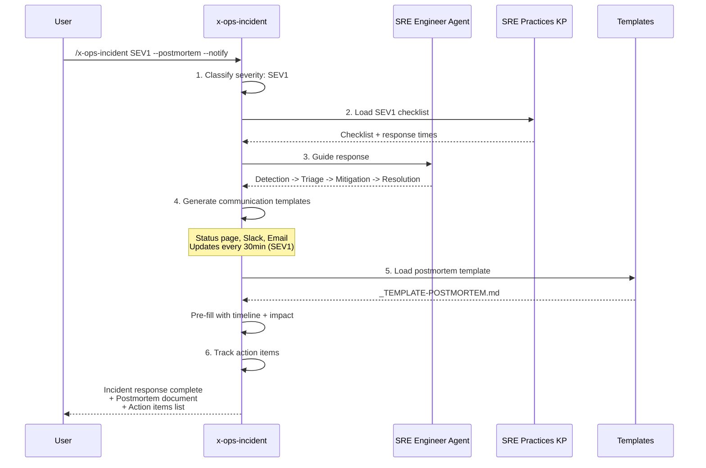
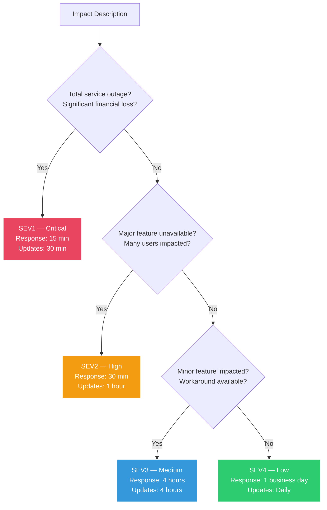

# Historia: Skill x-ops-incident

**ID:** story-0013-0010

## 1. Dependencias

| Blocked By | Blocks |
| :--- | :--- |
| story-0013-0006, story-0013-0008, story-0013-0009 | story-0013-0026 |

## 2. Regras Transversais Aplicaveis

| ID | Titulo |
| :--- | :--- |
| RULE-001 | Template Consistency |
| RULE-008 | Skill Invocability |

## 3. Descricao

Como **SRE Engineer**, eu quero um skill interativo de gestao de incidentes que guie a
equipe atraves do processo completo de resposta, garantindo que incidentes de producao
sejam tratados de forma estruturada e consistente.

O skill `x-ops-troubleshoot` existente diagnostica erros, stacktraces e falhas de build,
mas nao oferece gestao de incidentes. Quando um incidente de producao ocorre, nao existe
guia interativo que classifique severidade, orquestre a comunicacao, conduza a mitigacao
e acione postmortems. Esta lacuna forca equipes a improvisar em momentos criticos.

O skill sera criado em `skills-templates/x-ops-incident/SKILL.md` com frontmatter
`user-invocable: true` e `argument-hint` descritivo, seguindo RULE-008.

### 3.1 Frontmatter

```yaml
name: x-ops-incident
description: Guides incident response with severity-based checklists, communication templates, and postmortem triggers
user-invocable: true
argument-hint: "[severity SEV1|SEV2|SEV3|SEV4] [--postmortem] [--notify]"
```

### 3.2 Workflow

1. **Classify Severity:** Analisa descricao do impacto fornecida pelo usuario e classifica como SEV1 (critical — total service outage, significant financial loss), SEV2 (high — major feature unavailable, degraded experience for many users), SEV3 (medium — minor feature impacted, workaround available), SEV4 (low — cosmetic issue, minimal impact)
2. **Load Checklist:** Carrega checklist severity-specific do SRE Practices KP (story-0013-0008). Cada severidade tem passos e tempos de resposta diferentes.
3. **Guide Response:** Conduz o usuario atraves do fluxo Detection -> Triage -> Mitigation -> Resolution com passos contextuais baseados na severidade
4. **Generate Communication:** Gera templates de comunicacao para status page (public-facing message), Slack/Teams (internal updates), email (stakeholder notifications). Frequencia de atualizacao varia por severidade (SEV1: 30min, SEV2: 1h, SEV3: 4h, SEV4: daily)
5. **Trigger Postmortem:** Se flag `--postmortem` e fornecida ou severidade e SEV1/SEV2, gera documento de postmortem a partir do template (story-0013-0006) pre-preenchido com timeline, impacto e participantes
6. **Track Action Items:** Registra action items com owners e deadlines, gera lista formatada para acompanhamento

### 3.3 Agents e References

- **Agent utilizado:** sre-engineer (story-0013-0009) — fornece expertise em reliability e checklist de validacao
- **Knowledge Pack:** sre-practices (story-0013-0008) — fornece processos e checklists por severidade
- **Templates:** incident-response e postmortem (story-0013-0006) — templates para geracao de documentos

### 3.4 Error Handling

- Se severidade nao e fornecida: perguntar ao usuario sobre o impacto e sugerir classificacao
- Se severidade invalida: rejeitar com mensagem "Invalid severity. Use SEV1, SEV2, SEV3, or SEV4"
- Se `--postmortem` sem template disponivel: gerar postmortem inline com estrutura basica

## 4. Definicoes de Qualidade Locais

### DoR Local (Definition of Ready)

- [ ] Templates de incident response e postmortem (story-0013-0006) implementados
- [ ] SRE Practices KP (story-0013-0008) implementado
- [ ] SRE Engineer Agent (story-0013-0009) implementado
- [ ] Skill x-ops-troubleshoot existente analisado como referencia de estrutura
- [ ] Frontmatter conventions para skills invocaveis (RULE-008) compreendidas

### DoD Local (Definition of Done)

- [ ] `skills-templates/x-ops-incident/SKILL.md` criado com frontmatter user-invocable: true
- [ ] Workflow de 6 passos implementado (classify, load, guide, communicate, postmortem, track)
- [ ] Integracao com sre-engineer agent documentada
- [ ] Referencias ao SRE Practices KP e templates de incident/postmortem
- [ ] Golden file tests validando output

### Global Definition of Done (DoD)

- **Cobertura:** >= 95% Line, >= 90% Branch
- **Testes Automatizados:** Golden file tests validando geracao do skill
- **TDD Compliance:** Commits test-first, refactoring explicito
- **Documentacao:** README.md e CLAUDE.md atualizados com novo skill
- **Backward Compatibility:** Todos os golden file tests existentes continuam passando

## 5. Contratos de Dados (Data Contract)

**skills-templates/x-ops-incident/SKILL.md (estrutura):**

| Campo | Formato | Request | Response | Origem / Regra |
| :--- | :--- | :--- | :--- | :--- |
| Frontmatter `name` | YAML string | — | M | "x-ops-incident" |
| Frontmatter `description` | YAML string | — | M | Descricao do skill |
| Frontmatter `user-invocable` | YAML boolean | — | M | `true` (RULE-008) |
| Frontmatter `argument-hint` | YAML string | — | M | "[severity SEV1\|SEV2\|SEV3\|SEV4] [--postmortem] [--notify]" |
| `## Description` | Markdown H2 section | — | M | Descricao do proposito do skill |
| `## Workflow` | Markdown H2 section | — | M | 6 passos numerados |
| `## Severity Definitions` | Markdown H2 section | — | M | Tabela SEV1-SEV4 com criterios |
| `## Communication Templates` | Markdown H2 section | — | M | Templates por canal e severidade |
| `## Integration Notes` | Markdown H2 section | — | M | Agents, KPs e templates referenciados |
| `## Error Handling` | Markdown H2 section | — | M | Comportamento para inputs invalidos |

**Argument parsing:**

| Argumento | Tipo | Obrigatorio | Descricao |
| :--- | :--- | :--- | :--- |
| `severity` | Enum (SEV1-SEV4) | Opcional | Severidade do incidente. Se omitido, skill pergunta |
| `--postmortem` | Flag | Opcional | Aciona geracao de postmortem ao final |
| `--notify` | Flag | Opcional | Gera templates de comunicacao para stakeholders |

## 6. Diagramas

### 6.1 Workflow do Skill x-ops-incident



### 6.2 Classificacao de Severidade



## 7. Criterios de Aceite (Gherkin)

```gherkin
Cenario: Skill gerado com frontmatter user-invocable e argument-hint
  DADO que o ia-dev-env e executado para um novo projeto
  QUANDO a geracao de skills e concluida
  ENTAO o arquivo .claude/skills/x-ops-incident/SKILL.md deve existir
  E o frontmatter deve conter user-invocable: true
  E o frontmatter deve conter argument-hint com SEV1, SEV2, SEV3, SEV4

Cenario: Incidente SEV1 aciona fluxo completo com escalacao
  DADO que o skill x-ops-incident recebe argumento "SEV1"
  QUANDO o workflow e executado
  ENTAO deve classificar severidade como SEV1 — Critical
  E deve carregar checklist SEV1 do SRE Practices KP
  E deve guiar atraves de Detection, Triage, Mitigation, Resolution
  E deve gerar templates de comunicacao com atualizacao a cada 30 minutos
  E deve recomendar Incident Commander e response team

Cenario: Incidente SEV3 com fluxo simplificado
  DADO que o skill x-ops-incident recebe argumento "SEV3"
  QUANDO o workflow e executado
  ENTAO deve classificar severidade como SEV3 — Medium
  E deve carregar checklist SEV3 do SRE Practices KP
  E NAO deve recomendar Incident Commander (handled by on-call engineer)
  E deve gerar templates de comunicacao com atualizacao a cada 4 horas

Cenario: Flag --postmortem gera documento de postmortem
  DADO que o skill x-ops-incident recebe argumento "SEV2 --postmortem"
  QUANDO o workflow e concluido
  ENTAO deve gerar documento de postmortem a partir do template _TEMPLATE-POSTMORTEM.md
  E o postmortem deve estar pre-preenchido com timeline do incidente
  E o postmortem deve conter secao de action items com owners

Cenario: Skill valida input de severidade
  DADO que o skill x-ops-incident recebe argumento "SEV5"
  QUANDO o input e validado
  ENTAO deve rejeitar com mensagem "Invalid severity. Use SEV1, SEV2, SEV3, or SEV4"
  E NAO deve prosseguir com o workflow

Cenario: Severidade nao fornecida aciona pergunta interativa
  DADO que o skill x-ops-incident e invocado sem argumento de severidade
  QUANDO o workflow inicia
  ENTAO deve perguntar ao usuario sobre o impacto do incidente
  E deve sugerir classificacao de severidade baseada na descricao
  E deve prosseguir com o workflow apos confirmacao

Cenario: Golden file tests existentes nao quebram com novo skill
  DADO que os golden file tests existentes estao passando
  QUANDO o skill x-ops-incident e adicionado ao pipeline
  ENTAO todos os golden file tests existentes devem continuar passando
  E o novo skill deve aparecer nos manifestos de artefatos esperados
```

### 7.1 Scenario Ordering (TPP)

> TPP: degenerate (skill gerado com frontmatter) -> constant (SEV1 fluxo completo) ->
> scalar (SEV3 fluxo simplificado) -> composite (--postmortem gera documento) ->
> edge cases (severidade invalida, severidade ausente, backward compatibility).

### 7.2 Mandatory Scenario Categories

- [x] Degenerate cases (skill gerado com frontmatter correto)
- [x] Happy path (SEV1 fluxo completo, SEV3 fluxo simplificado, postmortem)
- [x] Error paths (severidade invalida rejeitada, severidade ausente interativa)
- [x] Boundary values (backward compatibility golden files)

## 8. Sub-tarefas

- [ ] [Test] Unitario: validar frontmatter do skill (user-invocable: true, argument-hint)
- [ ] [Test] Unitario: validar presenca das secoes Description, Workflow, Severity Definitions, Communication Templates, Integration Notes, Error Handling
- [ ] [Dev] Criar `skills-templates/x-ops-incident/SKILL.md` com frontmatter e workflow
- [ ] [Dev] Implementar secao Severity Definitions com tabela SEV1-SEV4
- [ ] [Dev] Implementar secao Communication Templates com templates por canal e severidade
- [ ] [Dev] Implementar secao Integration Notes com referencias a sre-engineer, sre-practices KP e templates
- [ ] [Dev] Implementar secao Error Handling com comportamento para inputs invalidos
- [ ] [Test] Integracao: golden file test para output do skill em .claude/skills/
- [ ] [Test] Integracao: golden file test para output do skill em .github/skills/
- [ ] [Test] Regressao: confirmar que golden file tests existentes continuam passando
- [ ] [Doc] Atualizar CHANGELOG, README.md e CLAUDE.md com novo skill
