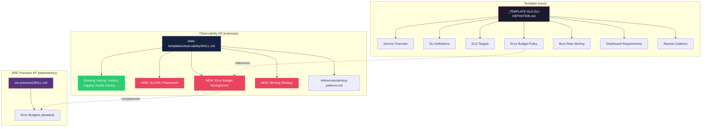
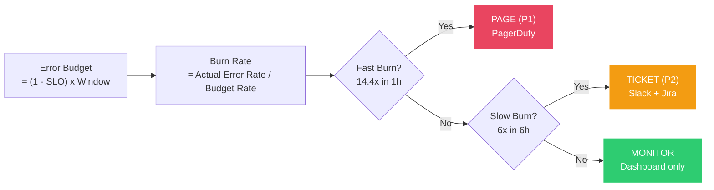

# História: SLO/SLI Template e Extensão do Observability KP

**ID:** story-0013-0011

## 1. Dependências

| Blocked By | Blocks |
| :--- | :--- |
| story-0013-0008 | story-0013-0026 |

## 2. Regras Transversais Aplicáveis

| ID | Título |
| :--- | :--- |
| RULE-001 | Template Consistency |
| RULE-002 | Assembler Integration |
| RULE-007 | Knowledge Pack Structure |
| RULE-010 | Backward Compatibility |

## 3. Descrição

Como **SRE Engineer**, eu quero um template de definicao de SLOs/SLIs e uma extensao do
Knowledge Pack de Observability com framework de SLOs e alerting strategy, garantindo que
equipes tenham guias claros para definir, medir e alertar sobre service level objectives.

O KP de Observability existente cobre tracing, metricas, logging, health checks, correlation
IDs e setup de OpenTelemetry, mas nao aborda SLOs/SLIs, error budgets ou estrategias de
alerting. O template `_TEMPLATE-PERFORMANCE-BASELINE.md` existe mas e focado em raw metrics
(latencia, throughput) e nao em service level objectives. Esta story preenche esta lacuna
com dois entregaveis complementares.

### 3.1 Entregavel 1: Template `_TEMPLATE-SLO-SLI-DEFINITION.md`

Novo template em `java/src/main/resources/templates/` com as seguintes secoes:

- **Service Overview:** Nome do servico, papel no ecossistema, stakeholders, criticidade
- **SLI Definitions:** Tabela com SLIs padrao — availability (uptime ratio), latency (p50, p95, p99), throughput (requests/sec), error rate (5xx ratio). Para cada SLI: metrica, metodo de medicao, fonte de dados
- **SLO Targets:** Tabela de targets por SLI — target numerico (ex: 99.9%), window (rolling 30d, calendar month), consequence de violacao
- **Error Budget Policy:** Politica de acao por nivel de consumo do budget — 50% consumed (review), 75% consumed (freeze non-critical deploys), 100% consumed (freeze all deploys, incident response)
- **Burn Rate Alerting Configuration:** Thresholds para fast burn (14.4x in 1h) e slow burn (6x in 6h), configuracao de alertas por canal (PagerDuty, Slack, email)
- **Dashboard Requirements:** Metricas que devem estar em dashboards de SLO (remaining budget, burn rate, SLI trend, error budget exhaustion forecast)
- **Review Cadence:** Frequencia de revisao de SLOs (monthly review, quarterly adjustment), processo de escalacao quando SLOs sao consistentemente violados

### 3.2 Entregavel 2: Extensão do Observability KP

Adicionar NOVAS secoes ao template existente `skills-templates/observability/SKILL.md`.
Em conformidade com RULE-010, a extensao APENAS adiciona conteudo — nenhuma secao existente
e modificada ou removida.

Novas secoes:

- **SLO/SLI Framework:** Tipos de SLIs (request-based, window-based), metodos de medicao (server-side, client-side, synthetic), window types (rolling, calendar), SLI specification patterns
- **Error Budget Management:** Calculo de error budget (1 - SLO target) x time window, burn rate alerts (fast burn vs slow burn), politica de exaustao (escalation ladder), budget allocation entre equipes
- **Alerting Strategy:** Alert routing por severidade (page, ticket, notification), severity mapping (P1-P4), PagerDuty/OpsGenie integration patterns, on-call rotation alerting, alert fatigue prevention (dedup, grouping, silencing)

Novo reference file:

- **`references/alerting-patterns.md`:** Patterns de alerting (symptom-based vs cause-based, golden signals alerting, multi-window multi-burn-rate alerting), anti-patterns (alert on every metric, threshold-only alerting, missing runbook links)

### 3.3 RULE-010 Compliance

A extensao do Observability KP e estritamente aditiva:
- Secoes existentes (tracing, metrics, logging, health checks, correlation IDs, OpenTelemetry) NAO sao modificadas
- Novas secoes sao adicionadas APOS as secoes existentes
- Reference files existentes NAO sao alterados
- Frontmatter existente NAO e modificado

## 4. Definições de Qualidade Locais

### DoR Local (Definition of Ready)

- [ ] SRE Practices KP (story-0013-0008) implementado
- [ ] Observability KP existente analisado em detalhe (secoes atuais mapeadas)
- [ ] Template `_TEMPLATE-PERFORMANCE-BASELINE.md` analisado (para evitar sobreposicao)
- [ ] Google SRE Book capitulos sobre SLOs e alerting pesquisados

### DoD Local (Definition of Done)

- [ ] Template `_TEMPLATE-SLO-SLI-DEFINITION.md` criado em `java/src/main/resources/templates/`
- [ ] Observability KP estendido com 3 novas secoes (SLO/SLI Framework, Error Budget, Alerting)
- [ ] Reference file `references/alerting-patterns.md` criado no KP de Observability
- [ ] Conteudo existente do Observability KP inalterado (RULE-010)
- [ ] Golden file tests validando output

### Global Definition of Done (DoD)

- **Cobertura:** >= 95% Line, >= 90% Branch
- **Testes Automatizados:** Golden file tests validando template e extensao do KP
- **TDD Compliance:** Commits test-first, refactoring explicito
- **Documentacao:** README.md e CLAUDE.md atualizados
- **Backward Compatibility:** Conteudo existente do Observability KP inalterado, golden files passando

## 5. Contratos de Dados (Data Contract)

**_TEMPLATE-SLO-SLI-DEFINITION.md (estrutura):**

| Campo | Formato | Request | Response | Origem / Regra |
| :--- | :--- | :--- | :--- | :--- |
| `# SLO/SLI Definitions — {{PROJECT_NAME}}` | Markdown H1 | — | M | Titulo com nome do projeto |
| `## Service Overview` | Markdown H2 section | — | M | Nome, papel, stakeholders |
| `## SLI Definitions` | Markdown H2 section | — | M | Tabela: SLI, Metric, Method, Source |
| `## SLO Targets` | Markdown H2 section | — | M | Tabela: SLI, Target, Window, Consequence |
| `## Error Budget Policy` | Markdown H2 section | — | M | Acoes por nivel de consumo |
| `## Burn Rate Alerting Configuration` | Markdown H2 section | — | M | Thresholds fast/slow burn |
| `## Dashboard Requirements` | Markdown H2 section | — | M | Metricas obrigatorias em dashboards |
| `## Review Cadence` | Markdown H2 section | — | M | Frequencia e processo de revisao |

**Observability KP extension (novas secoes):**

| Campo | Formato | Request | Response | Origem / Regra |
| :--- | :--- | :--- | :--- | :--- |
| `## SLO/SLI Framework` | Markdown H2 section | — | M | Tipos, metodos, windows |
| `## Error Budget Management` | Markdown H2 section | — | M | Calculo, burn rate, exaustao |
| `## Alerting Strategy` | Markdown H2 section | — | M | Routing, severity, integration |
| `references/alerting-patterns.md` | Markdown file | — | M | Patterns e anti-patterns |

## 6. Diagramas

### 6.1 Relacao entre Template e KP Extension



### 6.2 Burn Rate Alerting Model



## 7. Critérios de Aceite (Gherkin)

```gherkin
Cenario: Template SLO/SLI gerado com todas as 7 secoes
  DADO que o ia-dev-env e executado para um novo projeto
  QUANDO a geracao de templates e concluida
  ENTAO o arquivo docs/templates/_TEMPLATE-SLO-SLI-DEFINITION.md deve existir
  E deve conter as secoes Service Overview, SLI Definitions, SLO Targets
  E deve conter as secoes Error Budget Policy, Burn Rate Alerting, Dashboard Requirements, Review Cadence

Cenario: Secao SLI Definitions contem tabela com 4 SLIs padrao
  DADO que o template _TEMPLATE-SLO-SLI-DEFINITION.md foi gerado
  QUANDO a secao SLI Definitions e inspecionada
  ENTAO deve conter tabela com colunas SLI, Metric, Method, Source
  E deve incluir SLIs: availability, latency, throughput, error rate
  E cada SLI deve ter metodo de medicao e fonte de dados definidos

Cenario: Observability KP estendido com secao SLO/SLI Framework
  DADO que o ia-dev-env e executado para um novo projeto
  QUANDO o KP de Observability e gerado
  ENTAO deve conter a nova secao "## SLO/SLI Framework"
  E a secao deve cobrir tipos de SLIs (request-based, window-based)
  E a secao deve cobrir metodos de medicao e window types

Cenario: Reference file alerting-patterns.md gerado no KP de Observability
  DADO que o ia-dev-env e executado para um novo projeto
  QUANDO o KP de Observability e gerado
  ENTAO o arquivo references/alerting-patterns.md deve existir dentro do KP
  E deve conter patterns (symptom-based, golden signals, multi-window)
  E deve conter anti-patterns (alert on every metric, threshold-only)

Cenario: Conteudo existente do Observability KP inalterado
  DADO que o KP de Observability existente contem secoes de tracing, metrics, logging, health checks
  QUANDO a extensao e aplicada pelo ia-dev-env
  ENTAO todas as secoes existentes devem permanecer identicas ao conteudo original
  E as novas secoes devem ser adicionadas APOS as secoes existentes
  E nenhum reference file existente deve ser alterado

Cenario: Template e KP sao complementares sem duplicacao
  DADO que o template _TEMPLATE-SLO-SLI-DEFINITION.md e o KP de Observability foram gerados
  QUANDO seus conteudos sao comparados
  ENTAO o template deve focar em DEFINICAO de SLOs para um servico especifico
  E o KP deve focar em COMO IMPLEMENTAR SLOs (framework, patterns, tools)
  E NAO deve haver secoes duplicadas entre template e KP

Cenario: Golden file tests existentes nao quebram com extensao do KP
  DADO que os golden file tests existentes estao passando
  QUANDO o template e a extensao do KP sao adicionados ao pipeline
  ENTAO todos os golden file tests existentes devem continuar passando
  E os novos artefatos devem aparecer nos manifestos de artefatos esperados
```

### 7.1 Scenario Ordering (TPP)

> TPP: degenerate (template gerado com todas as secoes) -> constant (SLI Definitions com 4 SLIs) ->
> constant+ (KP estendido com secao SLO/SLI Framework) -> collection (reference file alerting-patterns) ->
> conditions (conteudo existente inalterado, complementaridade sem duplicacao) ->
> edge cases (backward compatibility golden files).

### 7.2 Mandatory Scenario Categories

- [x] Degenerate cases (template gerado com estrutura completa)
- [x] Happy path (SLI definitions, KP extension, reference file)
- [x] Error paths (conteudo existente inalterado — RULE-010)
- [x] Boundary values (complementaridade template/KP, backward compatibility)

## 8. Sub-tarefas

- [ ] [Test] Unitario: validar estrutura do template _TEMPLATE-SLO-SLI-DEFINITION.md (7 secoes)
- [ ] [Test] Unitario: validar que extensao do Observability KP adiciona 3 novas secoes sem modificar existentes
- [ ] [Dev] Criar template `java/src/main/resources/templates/_TEMPLATE-SLO-SLI-DEFINITION.md`
- [ ] [Dev] Estender `DocsTemplateAssembler` para copiar novo template para docs/templates/
- [ ] [Dev] Adicionar secoes SLO/SLI Framework, Error Budget Management e Alerting Strategy ao KP de Observability
- [ ] [Dev] Criar `skills-templates/observability/references/alerting-patterns.md`
- [ ] [Test] Integracao: golden file test para output do template em docs/templates/
- [ ] [Test] Integracao: golden file test para Observability KP estendido (novas secoes presentes)
- [ ] [Test] Integracao: golden file test para reference file alerting-patterns.md
- [ ] [Test] Regressao: confirmar que conteudo existente do Observability KP permanece identico
- [ ] [Test] Regressao: confirmar que golden file tests existentes continuam passando
- [ ] [Doc] Atualizar CHANGELOG, README.md e CLAUDE.md
