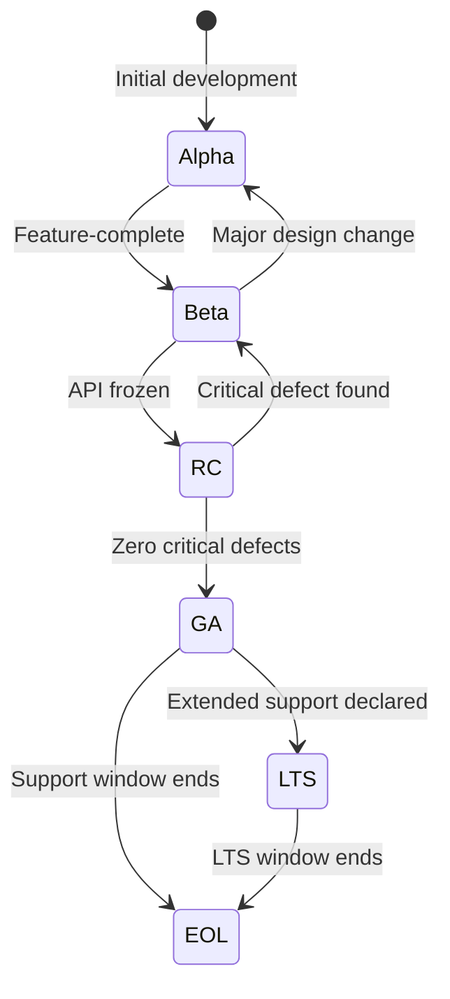
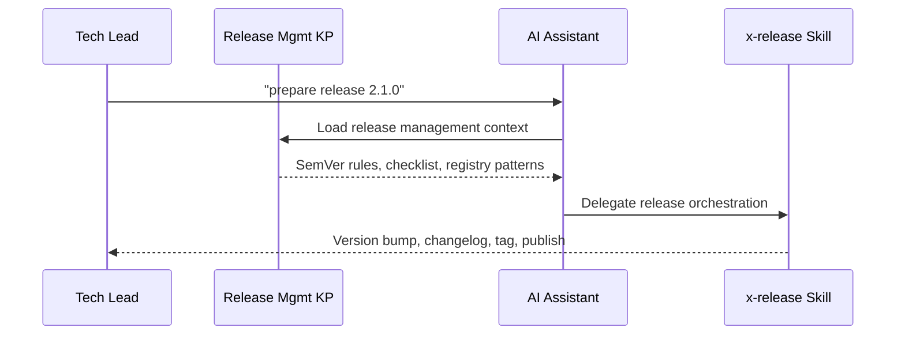

# História: Release Management Knowledge Pack

**ID:** story-0013-0012
**Chave Jira:** SCRUM-15
**Status:** Pendente

## 1. Dependências

| Blocked By | Blocks |
| :--- | :--- |
| -- | story-0013-0013, story-0013-0014 |

## 2. Regras Transversais Aplicáveis

| ID | Título |
| :--- | :--- |
| RULE-001 | Template Consistency |
| RULE-007 | Knowledge Pack Structure |
| RULE-003 | Pebble Template Variables |

## 3. Descrição

Como **tech lead**, eu quero um knowledge pack abrangente de release management, para que a IA tenha contexto completo sobre versionamento semantico, ciclo de vida de releases, estrategias de branching, publicacao de artefatos, assinatura, hotfixes e rollback ao gerar configuracoes e orientar equipes.

### Contexto

O ia-dev-env atualmente gera changelogs via `x-changelog` e forca Conventional Commits via regras existentes, mas nao possui um knowledge pack dedicado a release management. Isso significa que a IA nao tem acesso a patterns sobre ciclo de vida de versoes (alpha/beta/RC/GA/LTS), estrategias de branching para release, gestao de registros de artefatos, assinatura de releases, processos de hotfix e procedimentos de rollback. Equipes precisam desse conhecimento contextualizado para tomar decisoes consistentes sobre quando e como publicar versoes.

### 3.1 Estrutura do Knowledge Pack

- Path: `skills-templates/release-management/SKILL.md`
- Frontmatter: `user-invocable: false` (knowledge pack interno)
- Referenciado por: `tech-lead` agent, `x-release` skill, `x-changelog` skill

### 3.2 Conteudo Principal

**Semantic Versioning Deep-Dive:**
- MAJOR.MINOR.PATCH rules with concrete examples
- Pre-release identifiers (alpha, beta, rc) and precedence rules
- Build metadata (+build.123) and when to use it
- Version 0.y.z semantics (initial development phase)

**Version Lifecycle:**
- alpha: Feature-incomplete, internal testing only, no backward-compatibility guarantee
- beta: Feature-complete, external testing, API may change with notice
- RC (Release Candidate): Production-ready candidate, only critical fixes allowed
- GA (General Availability): Stable release, full support commitment
- LTS (Long-Term Support): Extended maintenance window, security patches only
- EOL (End of Life): No further updates, migration guidance provided
- Transition criteria between each phase (test coverage, defect density, stakeholder sign-off)

**Release Branching Strategies:**
- Trunk-based development: pros (simplicity, CI/CD alignment), cons (requires feature flags), team size (any)
- GitFlow: pros (parallel release tracks), cons (complexity, merge conflicts), team size (large teams)
- Release branches: pros (isolation), cons (cherry-pick overhead), team size (medium teams)
- Decision matrix by team size, release frequency, and compliance requirements

**Artifact Registry Management:**
- Maven Central / Sonatype OSSRH (Java): staging, release, snapshot repositories
- npm registry (TypeScript/JavaScript): scoped packages, access tokens, provenance
- Docker Hub / GHCR (containers): multi-arch manifests, tag conventions, retention
- crates.io (Rust): cargo publish, yanking, version requirements
- PyPI (Python): twine upload, trusted publishers, classifiers
- Publishing patterns: CI-triggered, manual gated, hybrid

**Release Signing & Attestation:**
- GPG signing: key management, signature verification, trust model
- Sigstore/cosign: keyless signing, transparency log, OIDC identity
- SLSA provenance: levels 1-4, build attestation, supply chain security
- GitHub Attestations API integration

**Hotfix Process:**
- Cherry-pick from main to release branch (when to use)
- Dedicated hotfix branch (when to use)
- Version bumping rules for hotfixes (PATCH increment only)
- Validation requirements (focused regression, affected area tests)

**Rollback Procedures:**
- Application rollback: revert deployment, prior version redeploy
- Database rollback coordination: expand/contract alignment, migration rollback scripts
- Feature flag rollback: instant disable without redeploy
- Rollback decision criteria: severity, blast radius, time to fix vs rollback

**Release Communication:**
- Release notes: audience-appropriate content, breaking changes highlight
- Migration guides: step-by-step upgrade instructions, automated migration scripts
- Deprecation notices: timeline, alternatives, removal date
- Breaking change announcements: pre-release warning period, impact assessment

### 3.3 Referencias

- `references/release-branching-guide.md` -- Decision guide for selecting branching strategy
- `references/artifact-publishing-matrix.md` -- Registry per language with publish commands
- `references/rollback-decision-tree.md` -- Flowchart for rollback vs fix-forward decision

## 3.5 Entrega de Valor

- **Valor Principal:** IA tem conhecimento completo de release management para orientar versionamento, publicacao e rollback
- **Metrica de Sucesso:** Knowledge pack gerado em `.claude/skills/release-management/` com 3 reference files
- **Impacto no Negocio:** Decisoes de release consistentes e reducao de incidentes causados por releases mal gerenciadas

## 4. Definições de Qualidade Locais

### DoR Local

- [ ] Processo de release atual do projeto compreendido
- [ ] Knowledge packs existentes revisados para manter consistencia de formato
- [ ] Registros de artefatos por linguagem pesquisados (Maven Central, npm, PyPI, crates.io, Docker Hub)
- [ ] `SkillsAssembler` compreendido para saber como KPs sao copiados
- [ ] Templates de branching strategies por tamanho de equipe pesquisados

### DoD Local

- [ ] `SKILL.md` criado com todas as 8 secoes de release management
- [ ] `references/release-branching-guide.md` criado com decision matrix
- [ ] `references/artifact-publishing-matrix.md` criado com registry por linguagem
- [ ] `references/rollback-decision-tree.md` criado com flowchart de decisao
- [ ] Frontmatter YAML valido com `user-invocable: false`
- [ ] Template usa variaveis Pebble corretas para secoes language-specific
- [ ] Integration test: KP gerado pelo pipeline para todos os perfis

### Global DoD

- **Cobertura:** >= 95% Line, >= 90% Branch
- **Regressao:** Golden file tests passando
- **TDD Compliance:** Test-first pattern
- **Multi-Target:** Claude (.claude/skills/) + GitHub (.github/skills/)

## 5. Contratos de Dados

**SKILL.md Frontmatter:**

| Campo | Formato | Obrigatorio | Valor |
| :--- | :--- | :--- | :--- |
| `name` | String | M | "release-management" |
| `description` | String | M | "Release management practices..." |
| `user-invocable` | Boolean | M | false |

**Template Variables Used:**

| Variavel | Tipo | Condicional | Descrição |
| :--- | :--- | :--- | :--- |
| `{{LANGUAGE}}` | String | N | Linguagem do projeto (para registry-specific content) |
| `{{BUILD_TOOL}}` | String | N | Ferramenta de build (maven, gradle, npm, cargo, etc.) |
| `{{CONTAINER}}` | String | S | Container runtime (docker, none) |

**Reference Files:**

| Arquivo | Formato | Conteudo |
| :--- | :--- | :--- |
| `references/release-branching-guide.md` | Markdown | Decision matrix: team size x release frequency x strategy |
| `references/artifact-publishing-matrix.md` | Markdown | Registry per language with CLI commands and CI steps |
| `references/rollback-decision-tree.md` | Markdown | Flowchart: severity x blast radius x time-to-fix -> rollback or fix-forward |

## 6. Diagramas

### 6.1 Version Lifecycle State Machine



### 6.2 Release Orchestration Flow



## 7. Critérios de Aceite (Gherkin)

```gherkin
Cenario: KP gerado com todas as secoes obrigatorias
  DADO que o pipeline e executado para qualquer perfil
  QUANDO o release-management KP e gerado
  ENTAO o SKILL.md contem secao "Semantic Versioning"
  E contem secao "Version Lifecycle"
  E contem secao "Release Branching Strategies"
  E contem secao "Artifact Registry Management"
  E contem secao "Release Signing & Attestation"
  E contem secao "Hotfix Process"
  E contem secao "Rollback Procedures"
  E contem secao "Release Communication"

Cenario: KP inclui conteudo de registry especifico para Java/Maven
  DADO que o config YAML define language.name="java" e build_tool="maven"
  QUANDO o pipeline gera o knowledge pack
  ENTAO o SKILL.md contem referencia a "Maven Central"
  E contem referencia a "Sonatype OSSRH"
  E contem referencia a "mvn deploy"

Cenario: KP inclui conteudo de registry especifico para TypeScript/npm
  DADO que o config YAML define language.name="typescript" e build_tool="npm"
  QUANDO o pipeline gera o knowledge pack
  ENTAO o SKILL.md contem referencia a "npm registry"
  E contem referencia a "npm publish"

Cenario: KP inclui secao de container registry quando Docker habilitado
  DADO que o config YAML define infrastructure.container="docker"
  QUANDO o pipeline gera o knowledge pack
  ENTAO o SKILL.md contem referencia a "Docker Hub"
  E contem referencia a "multi-arch manifests"

Cenario: Reference files gerados junto com SKILL.md
  DADO que o pipeline e executado para qualquer perfil
  QUANDO o release-management KP e gerado
  ENTAO existe arquivo `references/release-branching-guide.md`
  E existe arquivo `references/artifact-publishing-matrix.md`
  E existe arquivo `references/rollback-decision-tree.md`

Cenario: KP gerado para ambos targets Claude e GitHub
  DADO que o pipeline e executado para perfil java-spring
  QUANDO o release-management KP e gerado
  ENTAO o SKILL.md existe em `.claude/skills/release-management/`
  E o SKILL.md existe em `.github/skills/release-management/`
```

### 7.1 Scenario Ordering (TPP)

> TPP: unconditional (todas as secoes presentes) -> condicional (Java registry) -> condicional (TypeScript registry) -> condicional (Docker container) -> boundary (reference files) -> multi-target.

### 7.2 Mandatory Scenario Categories

- [x] Degenerate cases (KP com todas as secoes obrigatorias)
- [x] Happy path (Java/Maven registry content, TypeScript/npm content)
- [x] Error paths (N/A - KP sempre gerado)
- [x] Boundary values (reference files, multi-target output)

## 8. Sub-tarefas

- [ ] [Test] Unit test: SKILL.md gerado com frontmatter valido e `user-invocable: false`
- [ ] [Dev] Criar `skills-templates/release-management/SKILL.md` com secoes base (SemVer, Lifecycle, Branching)
- [ ] [Test] Unit test: secoes de registry renderizadas corretamente por linguagem
- [ ] [Dev] Adicionar blocos condicionais Pebble para registry content por linguagem
- [ ] [Dev] Adicionar secoes de Signing, Hotfix, Rollback e Communication
- [ ] [Dev] Criar `references/release-branching-guide.md` com decision matrix
- [ ] [Dev] Criar `references/artifact-publishing-matrix.md` com registry por linguagem
- [ ] [Dev] Criar `references/rollback-decision-tree.md` com flowchart de decisao
- [ ] [Test] Integration test: KP gerado para perfis java-spring e typescript-nestjs
- [ ] [Test] Integration test: reference files presentes no output
- [ ] [Test] Atualizar golden file manifests com novos arquivos
- [ ] [Doc] Registrar KP na tabela de knowledge packs do CLAUDE.md
