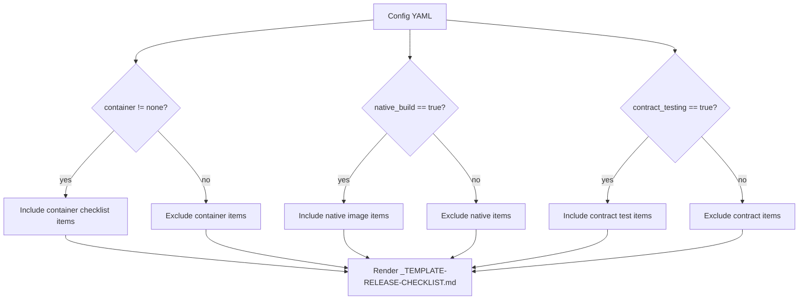
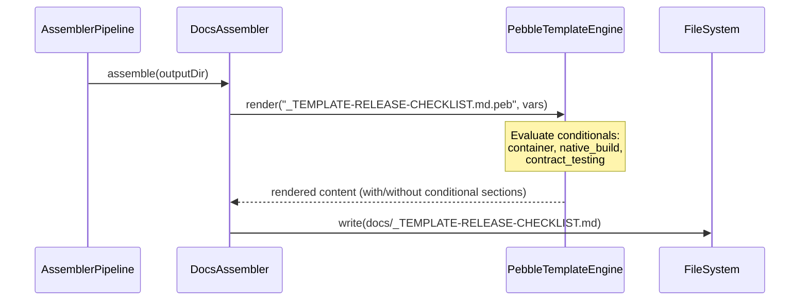

# História: Release Checklist Template

**ID:** story-0013-0013
**Chave Jira:** SCRUM-16
**Status:** Pendente

## 1. Dependências

| Blocked By | Blocks |
| :--- | :--- |
| story-0013-0012 | story-0013-0014 |

## 2. Regras Transversais Aplicáveis

| ID | Título |
| :--- | :--- |
| RULE-001 | Template Consistency |
| RULE-002 | Assembler Integration |
| RULE-003 | Pebble Template Variables |
| RULE-004 | Conditional Generation |

## 3. Descrição

Como **tech lead**, eu quero um template de checklist de release padronizado gerado para cada projeto, para que equipes tenham um gate formal de pre-release cobrindo validacao, versionamento, build de artefatos, quality gates e publicacao.

### Contexto

O ia-dev-env gera um `_TEMPLATE-DEPLOY-RUNBOOK.md` que cobre deployment operacional, mas release e um processo mais amplo: validacao de versao, changelog, build de artefatos, assinatura, publicacao em registry e comunicacao. Atualmente nao existe um checklist formal de release, o que leva equipes a esquecerem etapas criticas (ex: validar que security scan esta limpo antes de publicar, ou que container image foi tagueada corretamente). Este template fornece um checklist padronizado que pode ser usado como gate de pre-release, com secoes condicionais baseadas na stack do projeto.

### 3.1 Template Path

- Path: `templates/_TEMPLATE-RELEASE-CHECKLIST.md`
- Template Pebble: `_TEMPLATE-RELEASE-CHECKLIST.md.peb`
- Gerado pelo assembler existente de templates de documentacao (ou novo `ReleaseChecklistAssembler`)

### 3.2 Pebble Variables

| Variavel | Tipo | Origem |
| :--- | :--- | :--- |
| `{{PROJECT_NAME}}` | String | Config YAML `project.name` |
| `{{LANGUAGE}}` | String | Config YAML `language.name` |
| `{{BUILD_TOOL}}` | String | Config YAML `build.tool` |
| `{{CONTAINER}}` | String | Config YAML `infrastructure.container` |

### 3.3 Secoes do Template

**Pre-Release Validation:**
- [ ] All unit tests passing
- [ ] All integration tests passing
- [ ] Coverage meets threshold (>= {{COVERAGE_LINE}}% line, >= {{COVERAGE_BRANCH}}% branch)
- [ ] No open blocker/critical issues
- [ ] Security scan clean (SAST, dependency audit)
- [ ] Dependency audit clean (no known critical CVEs)

**Version & Changelog:**
- [ ] Version number validated per Semantic Versioning
- [ ] Version bumped in project files ({{BUILD_TOOL}} config)
- [ ] CHANGELOG.md updated with all changes since last release
- [ ] Release notes drafted for stakeholders
- [ ] Breaking changes documented with migration guide

**Artifact Build:**
- [ ] Application artifact built successfully ({{BUILD_TOOL}})
- [ ] Artifact size within expected range
- [ ] [CONDITIONAL: container] Container image built and tagged with version
- [ ] [CONDITIONAL: container] Container image tagged with `latest`
- [ ] [CONDITIONAL: native_build] Native image built and smoke-tested

**Quality Gate:**
- [ ] Smoke tests pass against built artifact
- [ ] Performance baseline met (no regression > 10%)
- [ ] [CONDITIONAL: contract_testing] Contract tests pass
- [ ] API compatibility verified (no unintended breaking changes)

**Publish:**
- [ ] Artifact published to registry
- [ ] [CONDITIONAL: container] Container image pushed to registry
- [ ] GitHub Release created with release notes
- [ ] Git tag created (v{version})
- [ ] Release signed (GPG or Sigstore)

**Post-Release:**
- [ ] Monitoring dashboards reviewed (error rate, latency)
- [ ] Rollback plan verified and documented
- [ ] Release communication sent (team, stakeholders)
- [ ] Documentation updated (API docs, user guides)
- [ ] Next version placeholder added to CHANGELOG.md

### 3.4 Conditional Sections

| Seção | Condicao | Renderizado quando |
| :--- | :--- | :--- |
| Container items | `infrastructure.container != "none"` | Docker, Podman, etc. |
| Native image items | `native_build == true` | GraalVM native image habilitado |
| Contract test items | `testing.contract_testing == true` | Contract testing habilitado |

## 3.5 Entrega de Valor

- **Valor Principal:** Gate formal de release com checklist padronizado e adaptado a stack do projeto
- **Metrica de Sucesso:** Template gerado com secoes condicionais corretas para todos os perfis
- **Impacto no Negocio:** Reducao de releases incompletas ou com etapas esquecidas

## 4. Definições de Qualidade Locais

### DoR Local

- [ ] Release management KP (story-0013-0012) concluido
- [ ] Templates de documentacao existentes revisados (`_TEMPLATE-*.md`)
- [ ] Secoes condicionais do `_TEMPLATE-DEPLOY-RUNBOOK.md` compreendidas como referencia
- [ ] Variaveis Pebble disponiveis em `TemplateVariable` identificadas

### DoD Local

- [ ] Template Pebble `_TEMPLATE-RELEASE-CHECKLIST.md.peb` criado em resources
- [ ] Template renderiza corretamente para projeto CLI (sem container, sem contract tests)
- [ ] Template renderiza corretamente para microservico (com container, com contract tests)
- [ ] Secoes condicionais renderizadas apenas quando configuracao correspondente esta ativa
- [ ] Assembler registrado no pipeline (ou integrado ao assembler de docs existente)
- [ ] Unit tests para todas as combinacoes condicionais
- [ ] Golden file manifests atualizados

### Global DoD

- **Cobertura:** >= 95% Line, >= 90% Branch
- **Regressao:** Golden file tests passando
- **TDD Compliance:** Test-first, refactoring explicito
- **Multi-Target:** Template gerado no output directory do projeto

## 5. Contratos de Dados

**Template Input (Config YAML):**

| Campo | Tipo | Default | Impacto no Template |
| :--- | :--- | :--- | :--- |
| `project.name` | String | N/A | Header do checklist |
| `language.name` | String | N/A | Build commands language-specific |
| `build.tool` | String | N/A | Artifact build step |
| `infrastructure.container` | String | "none" | Secoes de container (inclui/exclui) |
| `native_build` | Boolean | false | Secao de native image (inclui/exclui) |
| `testing.contract_testing` | Boolean | false | Secao de contract tests (inclui/exclui) |
| `testing.coverage.line` | Integer | 95 | Threshold de cobertura |
| `testing.coverage.branch` | Integer | 90 | Threshold de cobertura |

**Template Output:**

| Perfil | Secoes Container | Secoes Native | Secoes Contract |
| :--- | :--- | :--- | :--- |
| python-click-cli | Excluidas | Excluidas | Excluidas |
| java-spring | Incluidas | Excluidas | Incluidas |
| java-quarkus | Incluidas | Incluidas | Incluidas |
| typescript-nestjs | Incluidas | Excluidas | Excluidas |
| go-gin | Incluidas | Excluidas | Excluidas |
| rust-axum | Incluidas | Excluidas | Excluidas |

## 6. Diagramas

### 6.1 Conditional Rendering Flow



### 6.2 Template Generation Pipeline



## 7. Critérios de Aceite (Gherkin)

```gherkin
Cenario: Template minimo gerado para projeto CLI sem container
  DADO que o config YAML define infrastructure.container="none"
  E native_build=false
  E testing.contract_testing=false
  QUANDO o pipeline gera o release checklist template
  ENTAO o arquivo "_TEMPLATE-RELEASE-CHECKLIST.md" existe
  E contem secao "Pre-Release Validation"
  E contem secao "Version & Changelog"
  E contem secao "Artifact Build"
  E NAO contem "Container image built"
  E NAO contem "Native image built"
  E NAO contem "Contract tests pass"

Cenario: Template completo gerado para microservico com container
  DADO que o config YAML define infrastructure.container="docker"
  E native_build=false
  E testing.contract_testing=true
  QUANDO o pipeline gera o release checklist template
  ENTAO o arquivo "_TEMPLATE-RELEASE-CHECKLIST.md" existe
  E contem "Container image built and tagged with version"
  E contem "Container image pushed to registry"
  E contem "Contract tests pass"

Cenario: Template inclui secao de native image quando habilitado
  DADO que o config YAML define native_build=true
  QUANDO o pipeline gera o release checklist template
  ENTAO o arquivo contem "Native image built and smoke-tested"

Cenario: Template usa variaveis Pebble corretas
  DADO que o config YAML define project.name="my-service" e build_tool="maven"
  QUANDO o pipeline gera o release checklist template
  ENTAO o arquivo contem "my-service" no header
  E contem referencia a "maven" nas secoes de build

Cenario: Template gerado para todos os perfis com DB e container
  DADO que cada um dos perfis com container e processado
  QUANDO o pipeline completo e executado
  ENTAO o release checklist inclui secoes de container para cada perfil com container
  E nenhum erro e lancado

Cenario: Secoes condicionais renderizadas corretamente
  DADO que dois perfis sao processados: python-click-cli e java-spring
  QUANDO ambos release checklists sao comparados
  ENTAO python-click-cli NAO contem secoes de container
  E java-spring contem secoes de container e contract tests
```

### 7.1 Scenario Ordering (TPP)

> TPP: degenerate (CLI minimo sem container) -> unconditional (microservico completo) -> condicional (native image) -> condicional (variaveis Pebble) -> boundary (todos os perfis) -> aceitacao (comparacao entre perfis).

### 7.2 Mandatory Scenario Categories

- [x] Degenerate cases (CLI minimo sem container/native/contract)
- [x] Happy path (microservico completo com container e contract tests)
- [x] Error paths (N/A - template sempre gerado)
- [x] Boundary values (todos os perfis, comparacao entre perfis)

## 8. Sub-tarefas

- [ ] [Test] Unit test: template renderizado sem secoes condicionais para CLI (container=none)
- [ ] [Dev] Criar template Pebble `_TEMPLATE-RELEASE-CHECKLIST.md.peb` com secoes base
- [ ] [Test] Unit test: template renderizado com secoes de container (container=docker)
- [ ] [Dev] Adicionar bloco condicional Pebble para secoes de container
- [ ] [Test] Unit test: template renderizado com secao de native image
- [ ] [Dev] Adicionar bloco condicional Pebble para native image
- [ ] [Test] Unit test: template renderizado com secao de contract tests
- [ ] [Dev] Adicionar bloco condicional Pebble para contract tests
- [ ] [Dev] Registrar template no assembler de docs (ou criar novo assembler)
- [ ] [Test] Integration test: template gerado para perfil python-click-cli (minimo)
- [ ] [Test] Integration test: template gerado para perfil java-spring (completo)
- [ ] [Test] Atualizar golden file manifests com novo template
