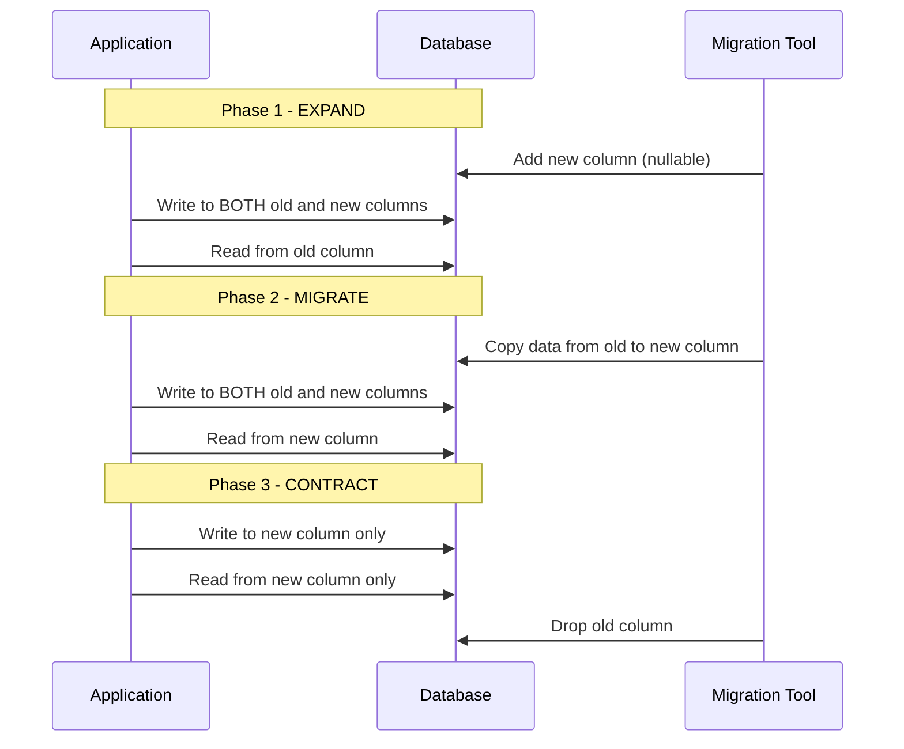
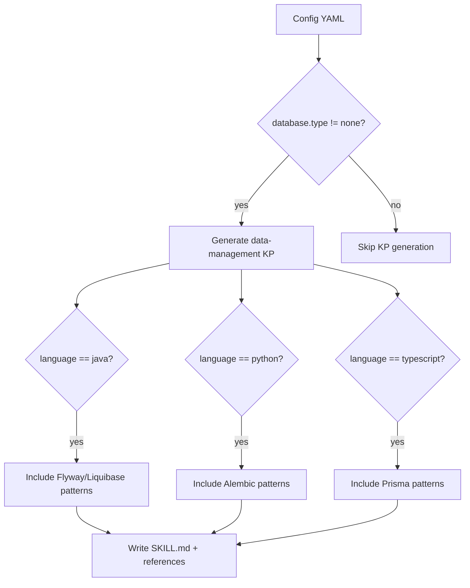

# História: Data Management Knowledge Pack

**ID:** story-0013-0015
**Chave Jira:** SCRUM-18
**Status:** Pendente

## 1. Dependências

| Blocked By | Blocks |
| :--- | :--- |
| -- | story-0013-0016, story-0013-0017 |

## 2. Regras Transversais Aplicáveis

| ID | Título |
| :--- | :--- |
| RULE-001 | Template Consistency |
| RULE-007 | Knowledge Pack Structure |
| RULE-003 | Pebble Template Variables |
| RULE-004 | Conditional Generation |

## 3. Descrição

Como **database engineer**, eu quero um knowledge pack abrangente de data management, para que a IA tenha contexto completo sobre zero-downtime migrations, expand/contract pattern, data governance, backup/restore, particionamento, CDC e validacao de qualidade de dados ao orientar equipes.

### Contexto

O ia-dev-env possui um `database-patterns` KP que cobre repository pattern, unit of work, cache-aside e event store, mas nao possui um knowledge pack dedicado ao ciclo de vida de gestao de dados. Isso significa que a IA nao tem acesso a patterns de migracoes zero-downtime (expand/contract), governanca de dados (classificacao, retencao, PII handling), estrategias de backup e restore (RTO/RPO, tipos de backup), particionamento (horizontal, sharding), CDC (Change Data Capture, outbox pattern) e validacao de qualidade. Essas lacunas sao criticas para projetos que usam bancos de dados relacionais ou NoSQL.

Este knowledge pack e CONDICIONAL: so e gerado quando `data.database.type != "none"`. Projetos CLI sem banco de dados nao recebem este KP.

### 3.1 Estrutura do Knowledge Pack

- Path: `skills-templates/data-management/SKILL.md`
- Frontmatter: `user-invocable: false` (knowledge pack interno)
- Condicao de geracao: `data.database.type != "none"`
- Referenciado por: `database-engineer` agent (story-0013-0017), `x-review` skill

### 3.2 Conteudo Principal

**Zero-Downtime Migrations:**
- Expand/contract pattern: add new -> migrate data -> remove old
- Backward-compatible changes: add column (nullable or with default), add table, add index
- Dangerous changes: rename column, change type, drop column, drop table
- Migration ordering: schema first, then data, then cleanup
- Rollback strategies: reverse migration script, dual-write during transition

**Schema Versioning:**
- Migration numbering: timestamp-based (V20260326_001__description) vs sequential (V001)
- Idempotent migrations: IF NOT EXISTS, CREATE OR REPLACE
- Migration testing: test migrations against production-like data
- Environment-specific migrations: seed data for dev, test data for staging

**Data Governance:**
- Data classification scheme: PUBLIC, INTERNAL, CONFIDENTIAL, RESTRICTED
- Retention policies: regulatory requirements, storage costs, archival strategies
- Data lineage tracking: source -> transformation -> destination
- PII handling: encryption at rest, masking in logs, access audit trail

**Backup & Restore:**
- Backup types: full (complete snapshot), incremental (changes since last backup), differential (changes since last full)
- Verification testing: periodic restore drills, data integrity checks
- RTO/RPO targets: Recovery Time Objective, Recovery Point Objective
- Restore procedures: point-in-time recovery, selective restore, cross-region restore

**Partitioning Strategies:**
- Horizontal partitioning: range (date-based), hash (even distribution), list (categorical)
- Sharding keys: cardinality, query patterns, data distribution
- Range vs hash: pros/cons, when to use each
- Rebalancing: online rebalancing, resharding strategies

**Change Data Capture (CDC):**
- CDC patterns: log-based (Debezium), trigger-based, timestamp-based
- Debezium integration: connectors, transforms, schema registry
- Outbox pattern integration: transactional outbox -> CDC -> event bus
- Event sourcing alignment: CDC as complement to event store

**Data Quality:**
- Validation rules: schema validation, referential integrity, business rules
- Data profiling: completeness, uniqueness, consistency metrics
- Anomaly detection: statistical outliers, data drift
- Quality metrics: accuracy, completeness, timeliness, consistency

### 3.3 Migration Tool Patterns

| Linguagem | Ferramenta | Pattern |
| :--- | :--- | :--- |
| Java | Flyway | V{version}__{description}.sql, callbacks, repeatable migrations |
| Java | Liquibase | changelog.xml/yaml, changesets, rollback commands |
| Python | Alembic | revision --autogenerate, upgrade/downgrade, branch labels |
| MongoDB | Mongock | @ChangeUnit, runner, transaction support |
| Go | golang-migrate | up/down files, database URL, CLI commands |
| Rust | diesel | diesel migration run/revert, schema.rs generation |
| TypeScript | Prisma | prisma migrate dev/deploy, schema.prisma, shadow database |

### 3.4 Referencias

- `references/migration-safety-checklist.md` -- Pre-flight checklist for production migrations
- `references/backup-strategy-matrix.md` -- Backup type x DB type x RTO/RPO matrix
- `references/partitioning-decision-tree.md` -- Flowchart for selecting partitioning strategy

## 3.5 Entrega de Valor

- **Valor Principal:** IA tem conhecimento completo de data management para orientar migrations, governance e backup
- **Metrica de Sucesso:** KP gerado apenas para projetos com banco de dados, com tool patterns corretos por linguagem
- **Impacto no Negocio:** Reducao de incidentes de dados e migrations mais seguras

## 4. Definições de Qualidade Locais

### DoR Local

- [ ] `database-patterns` KP existente revisado para evitar sobreposicao
- [ ] Knowledge packs existentes revisados para consistencia de formato
- [ ] Migration tools por linguagem pesquisados (Flyway, Alembic, Prisma, etc.)
- [ ] `SkillsAssembler` compreendido para geracao condicional
- [ ] Configuracao de `data.database.type` no schema YAML compreendida

### DoD Local

- [ ] `SKILL.md` criado com todas as 7 secoes de data management
- [ ] Secao de migration tool patterns com 7 linguagens
- [ ] `references/migration-safety-checklist.md` criado
- [ ] `references/backup-strategy-matrix.md` criado
- [ ] `references/partitioning-decision-tree.md` criado
- [ ] Frontmatter YAML valido com `user-invocable: false`
- [ ] Template usa variaveis Pebble para secoes language-specific
- [ ] KP NAO gerado quando `data.database.type == "none"`
- [ ] Integration test: KP gerado para perfis com banco de dados

### Global DoD

- **Cobertura:** >= 95% Line, >= 90% Branch
- **Regressao:** Golden file tests passando
- **TDD Compliance:** Test-first pattern
- **Multi-Target:** Claude (.claude/skills/) + GitHub (.github/skills/)

## 5. Contratos de Dados

**SKILL.md Frontmatter:**

| Campo | Formato | Obrigatorio | Valor |
| :--- | :--- | :--- | :--- |
| `name` | String | M | "data-management" |
| `description` | String | M | "Data management lifecycle patterns..." |
| `user-invocable` | Boolean | M | false |

**Template Variables Used:**

| Variavel | Tipo | Condicional | Descrição |
| :--- | :--- | :--- | :--- |
| `{{LANGUAGE}}` | String | N | Linguagem do projeto (para migration tool content) |
| `{{DATABASE_TYPE}}` | String | S | Tipo de banco de dados (postgresql, mongodb, etc.) |
| `{{MIGRATION_TOOL}}` | String | S | Ferramenta de migration (flyway, alembic, prisma, etc.) |

**Generation Condition:**

| Campo Config | Operador | Valor | Resultado |
| :--- | :--- | :--- | :--- |
| `data.database.type` | `==` | `"none"` | KP NAO gerado |
| `data.database.type` | `!=` | `"none"` | KP gerado |

**Reference Files:**

| Arquivo | Formato | Conteudo |
| :--- | :--- | :--- |
| `references/migration-safety-checklist.md` | Markdown | Pre-flight checklist with items for prod migrations |
| `references/backup-strategy-matrix.md` | Markdown | Backup type x DB type x RTO/RPO targets |
| `references/partitioning-decision-tree.md` | Markdown | Flowchart: data volume x query pattern -> partition strategy |

## 6. Diagramas

### 6.1 Expand/Contract Migration Pattern



### 6.2 Conditional Generation



## 7. Critérios de Aceite (Gherkin)

```gherkin
Cenario: KP NAO gerado quando database type e none
  DADO que o config YAML define data.database.type="none"
  QUANDO o pipeline executa o assembler de skills
  ENTAO o diretorio `skills/data-management/` NAO existe no output
  E nenhum arquivo de data-management e gerado

Cenario: KP gerado com Flyway patterns para Java/PostgreSQL
  DADO que o config YAML define language.name="java" e data.database.type="postgresql"
  E migration_tool="flyway"
  QUANDO o pipeline gera o knowledge pack
  ENTAO o SKILL.md contem secao "Migration Tool Patterns"
  E contem referencia a "Flyway"
  E contem referencia a "V{version}__{description}.sql"
  E contem secao "Zero-Downtime Migrations"

Cenario: KP gerado com Alembic patterns para Python
  DADO que o config YAML define language.name="python" e data.database.type="postgresql"
  E migration_tool="alembic"
  QUANDO o pipeline gera o knowledge pack
  ENTAO o SKILL.md contem referencia a "Alembic"
  E contem referencia a "revision --autogenerate"

Cenario: KP inclui secoes de backup e restore
  DADO que o config YAML define data.database.type="postgresql"
  QUANDO o pipeline gera o knowledge pack
  ENTAO o SKILL.md contem secao "Backup & Restore"
  E contem referencia a "RTO" e "RPO"
  E contem referencia a "point-in-time recovery"

Cenario: Reference files gerados junto com SKILL.md
  DADO que o pipeline e executado para perfil com banco de dados
  QUANDO o data-management KP e gerado
  ENTAO existe arquivo `references/migration-safety-checklist.md`
  E existe arquivo `references/backup-strategy-matrix.md`
  E existe arquivo `references/partitioning-decision-tree.md`

Cenario: KP gerado para ambos targets Claude e GitHub
  DADO que o pipeline e executado para perfil java-spring
  QUANDO o data-management KP e gerado
  ENTAO o SKILL.md existe em `.claude/skills/data-management/`
  E o SKILL.md existe em `.github/skills/data-management/`
```

### 7.1 Scenario Ordering (TPP)

> TPP: degenerate (database=none, KP nao gerado) -> unconditional (Java/Flyway) -> condicional (Python/Alembic) -> condicional (backup patterns) -> boundary (reference files) -> multi-target.

### 7.2 Mandatory Scenario Categories

- [x] Degenerate cases (database=none, KP nao gerado)
- [x] Happy path (Java/PostgreSQL/Flyway, Python/Alembic)
- [x] Error paths (implicit: database=none prevents generation)
- [x] Boundary values (reference files, multi-target output)

## 8. Sub-tarefas

- [ ] [Test] Unit test: KP NAO gerado quando database.type="none"
- [ ] [Dev] Configurar geracao condicional no assembler de skills
- [ ] [Test] Unit test: SKILL.md gerado com frontmatter valido e `user-invocable: false`
- [ ] [Dev] Criar `skills-templates/data-management/SKILL.md` com secoes base
- [ ] [Test] Unit test: secoes de migration tool renderizadas corretamente por linguagem
- [ ] [Dev] Adicionar blocos condicionais Pebble para migration tool por linguagem
- [ ] [Dev] Adicionar secoes de Data Governance, Backup, Partitioning, CDC, Data Quality
- [ ] [Dev] Criar `references/migration-safety-checklist.md`
- [ ] [Dev] Criar `references/backup-strategy-matrix.md`
- [ ] [Dev] Criar `references/partitioning-decision-tree.md`
- [ ] [Test] Integration test: KP gerado para perfis java-spring e python-fastapi
- [ ] [Test] Integration test: KP NAO gerado para perfil python-click-cli (database=none)
- [ ] [Test] Atualizar golden file manifests
- [ ] [Doc] Registrar KP na tabela de knowledge packs do CLAUDE.md
