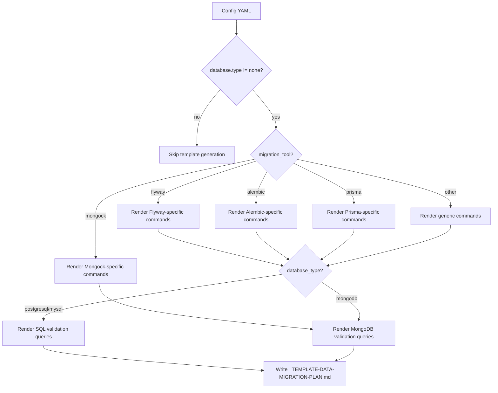
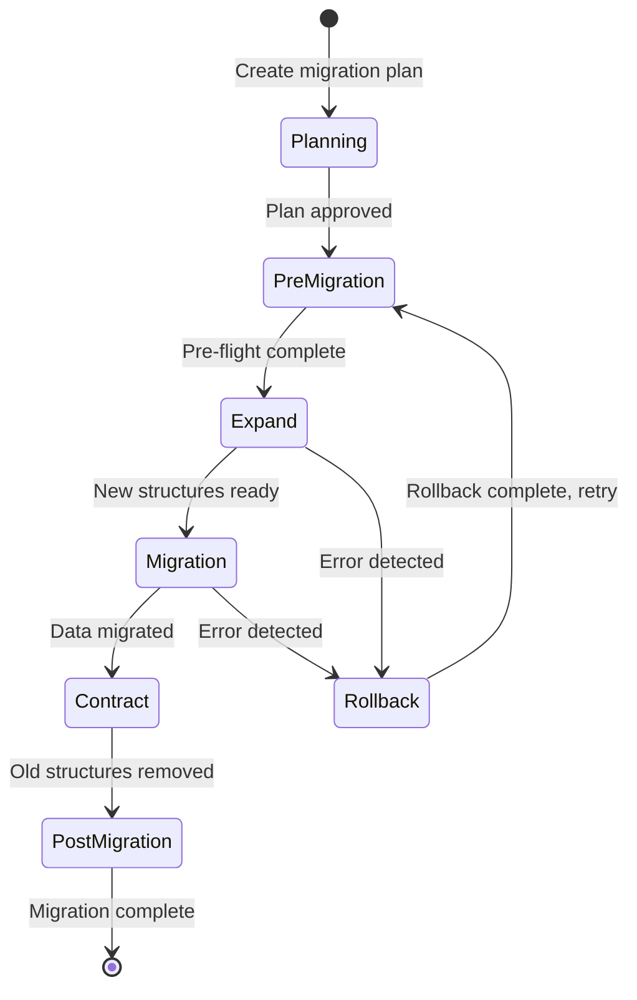

# História: Data Migration Plan Template

**ID:** story-0013-0016
**Chave Jira:** SCRUM-19
**Status:** Pendente

## 1. Dependências

| Blocked By | Blocks |
| :--- | :--- |
| story-0013-0015 | story-0013-0026 |

## 2. Regras Transversais Aplicáveis

| ID | Título |
| :--- | :--- |
| RULE-001 | Template Consistency |
| RULE-002 | Assembler Integration |
| RULE-003 | Pebble Template Variables |
| RULE-004 | Conditional Generation |

## 3. Descrição

Como **database engineer**, eu quero um template de plano de migracao de dados padronizado gerado para cada projeto com banco de dados, para que equipes tenham uma estrutura formal para planejar migracoes complexas (renomear colunas, dividir tabelas, alterar tipos) com estrategia de rollback, queries de validacao e estimativas de tempo.

### Contexto

O ia-dev-env gera templates de documentacao como `_TEMPLATE-DEPLOY-RUNBOOK.md` para deployment operacional, mas nao existe um template para planos de migracao de dados. Quando equipes precisam fazer migracoes breaking (como renomear colunas, dividir tabelas, alterar tipos de dados), nao ha uma estrutura formal cobrindo: avaliacao de risco, fases expand/contract, scripts de transformacao, batch size, monitoring de progresso, queries de validacao e plano de rollback. Migracoes sem planejamento formal sao a maior causa de incidentes de dados.

Este template e CONDICIONAL: so e gerado quando `data.database.type != "none"`.

### 3.1 Template Path

- Path: `templates/_TEMPLATE-DATA-MIGRATION-PLAN.md`
- Template Pebble: `_TEMPLATE-DATA-MIGRATION-PLAN.md.peb`
- Condicao de geracao: `data.database.type != "none"`

### 3.2 Pebble Variables

| Variavel | Tipo | Origem |
| :--- | :--- | :--- |
| `{{DATABASE_TYPE}}` | String | Config YAML `data.database.type` |
| `{{MIGRATION_TOOL}}` | String | Config YAML `data.migration_tool` |
| `{{PROJECT_NAME}}` | String | Config YAML `project.name` |

### 3.3 Secoes do Template

**Migration Summary:**
- Description: [Brief description of the migration]
- Affected tables/collections: [List of affected data structures]
- Estimated duration: [Time estimate for complete migration]
- Migration type: [Schema-only / Data + Schema / Data-only]
- Ticket/Issue reference: [Link to story or issue]

**Risk Assessment:**
- Data volume: [Number of rows/documents affected]
- Downtime window: [Required downtime, if any]
- Rollback complexity: LOW / MEDIUM / HIGH
- Data loss risk: NONE / LOW / MEDIUM / HIGH
- Dependencies: [Other services or migrations that must complete first]

**Pre-Migration Steps:**
- [ ] Backup verified and tested ({{MIGRATION_TOOL}} specific commands)
- [ ] Migration tested in staging environment with production-like data
- [ ] Communication sent to affected teams
- [ ] Monitoring dashboards prepared
- [ ] Rollback script tested and verified
- [ ] Maintenance window scheduled (if downtime required)

**Expand Phase:**
- [ ] New columns/tables created ({{MIGRATION_TOOL}} migration script)
- [ ] Application code deployed reading from old, writing to both old and new
- [ ] Data consistency check between old and new structures
- [ ] Performance metrics within acceptable range

**Migration Phase:**
- Data transformation script: [Script path or inline]
- Batch size: [Number of rows per batch]
- Progress monitoring: [How to track progress — logs, metrics, queries]
- Estimated batches: [Total rows / batch size]
- Pause/resume strategy: [How to pause and resume safely]

**Contract Phase:**
- [ ] Application code deployed reading and writing only to new structures
- [ ] Old columns/tables marked for removal
- [ ] Cleanup migration script prepared
- [ ] Old structures dropped after observation period

**Validation Queries:**
- Data integrity check: [SQL/query to verify data correctness]
- Row count verification: [Before and after counts match]
- Constraint validation: [Foreign keys, unique constraints verified]
- Business rule validation: [Application-specific data invariants]

**Rollback Plan:**
- Rollback migration script: [Path or inline — reverse of expand phase]
- Rollback deployment: [Application version to redeploy]
- Data restore procedure: [Steps if rollback migration insufficient]
- Rollback time estimate: [How long to fully rollback]
- Rollback decision criteria: [When to trigger rollback vs fix-forward]

**Post-Migration:**
- [ ] Monitoring dashboard reviewed (error rate, query latency)
- [ ] Alerting rules verified for new structures
- [ ] Cleanup tasks scheduled (drop old columns after observation period)
- [ ] Documentation updated (schema diagrams, data dictionary)
- [ ] Lessons learned documented

### 3.4 Conditional Sections

| Secao/Item | Condicao | Renderizado quando |
| :--- | :--- | :--- |
| Flyway-specific commands | `migration_tool == "flyway"` | Java + Flyway |
| Alembic-specific commands | `migration_tool == "alembic"` | Python + Alembic |
| Mongock-specific commands | `migration_tool == "mongock"` | MongoDB + Mongock |
| Prisma-specific commands | `migration_tool == "prisma"` | TypeScript + Prisma |
| SQL validation queries | `database_type in [postgresql, mysql]` | SQL databases |
| MongoDB validation queries | `database_type == "mongodb"` | MongoDB |

## 3.5 Entrega de Valor

- **Valor Principal:** Template formal de plano de migracao que reduz risco de incidentes de dados
- **Metrica de Sucesso:** Template gerado com secoes corretas por database type e migration tool
- **Impacto no Negocio:** Migracoes planejadas formalmente, com rollback verificado antes da execucao

## 4. Definições de Qualidade Locais

### DoR Local

- [ ] Data management KP (story-0013-0015) concluido
- [ ] Templates de documentacao existentes revisados (`_TEMPLATE-*.md`)
- [ ] Comandos de migration tool por linguagem pesquisados
- [ ] `DocsAssembler` compreendido para geracao condicional de templates

### DoD Local

- [ ] Template Pebble `_TEMPLATE-DATA-MIGRATION-PLAN.md.peb` criado em resources
- [ ] Template NAO gerado quando `data.database.type == "none"`
- [ ] Template renderiza corretamente para PostgreSQL + Flyway
- [ ] Template renderiza corretamente para MongoDB + Mongock
- [ ] Secoes condicionais de migration tool renderizadas apenas para a tool correta
- [ ] Secoes de validation queries adaptadas ao tipo de banco
- [ ] Assembler registrado (ou integrado ao DocsAssembler existente)
- [ ] Unit tests para todas as combinacoes de database type + migration tool

### Global DoD

- **Cobertura:** >= 95% Line, >= 90% Branch
- **Regressao:** Golden file tests passando
- **TDD Compliance:** Test-first, refactoring explicito
- **Multi-Target:** Template gerado no output directory do projeto

## 5. Contratos de Dados

**Template Input (Config YAML):**

| Campo | Tipo | Default | Impacto no Template |
| :--- | :--- | :--- | :--- |
| `project.name` | String | N/A | Header do plano |
| `data.database.type` | String | "none" | Tipo de queries de validacao e comandos (SQL vs MongoDB) |
| `data.migration_tool` | String | N/A | Comandos de migration tool especificos |

**Generation Condition:**

| Campo Config | Operador | Valor | Resultado |
| :--- | :--- | :--- | :--- |
| `data.database.type` | `==` | `"none"` | Template NAO gerado |
| `data.database.type` | `!=` | `"none"` | Template gerado |

**Template Output per Profile:**

| Perfil | Database | Migration Tool | Template Gerado |
| :--- | :--- | :--- | :--- |
| python-click-cli | none | N/A | NAO |
| java-spring | postgresql | flyway | SIM (Flyway + SQL) |
| java-quarkus | postgresql | flyway | SIM (Flyway + SQL) |
| python-fastapi | postgresql | alembic | SIM (Alembic + SQL) |
| typescript-nestjs | postgresql | prisma | SIM (Prisma + SQL) |
| go-gin | postgresql | golang-migrate | SIM (golang-migrate + SQL) |
| rust-axum | postgresql | diesel | SIM (diesel + SQL) |
| kotlin-ktor | postgresql | flyway | SIM (Flyway + SQL) |

## 6. Diagramas

### 6.1 Template Conditional Rendering



### 6.2 Migration Plan Phases



## 7. Critérios de Aceite (Gherkin)

```gherkin
Cenario: Template NAO gerado quando database type e none
  DADO que o config YAML define data.database.type="none"
  QUANDO o pipeline executa o assembler de templates
  ENTAO o arquivo "_TEMPLATE-DATA-MIGRATION-PLAN.md" NAO existe no output

Cenario: Template gerado com comandos Flyway para PostgreSQL
  DADO que o config YAML define data.database.type="postgresql"
  E data.migration_tool="flyway"
  QUANDO o pipeline gera o template de migracao
  ENTAO o arquivo "_TEMPLATE-DATA-MIGRATION-PLAN.md" existe
  E contem referencia a "flyway" nos comandos de migration
  E contem queries de validacao SQL (SELECT COUNT, constraint check)

Cenario: Template gerado com comandos Mongock para MongoDB
  DADO que o config YAML define data.database.type="mongodb"
  E data.migration_tool="mongock"
  QUANDO o pipeline gera o template de migracao
  ENTAO o arquivo contem referencia a "Mongock"
  E contem queries de validacao MongoDB (db.collection.count, aggregate)

Cenario: Template inclui todas as secoes obrigatorias
  DADO que o config YAML define data.database.type="postgresql"
  QUANDO o pipeline gera o template de migracao
  ENTAO o arquivo contem secao "Migration Summary"
  E contem secao "Risk Assessment"
  E contem secao "Pre-Migration Steps"
  E contem secao "Expand Phase"
  E contem secao "Migration Phase"
  E contem secao "Contract Phase"
  E contem secao "Validation Queries"
  E contem secao "Rollback Plan"
  E contem secao "Post-Migration"

Cenario: Template gerado para todos os perfis com banco de dados
  DADO que cada um dos perfis com database != none e processado
  QUANDO o pipeline completo e executado
  ENTAO o data migration plan template e gerado para cada perfil com banco
  E o template contem a migration tool correta para cada perfil
  E nenhum erro e lancado

Cenario: Secoes condicionais de migration tool corretas
  DADO que dois perfis sao processados: java-spring (flyway) e python-fastapi (alembic)
  QUANDO ambos data migration plans sao comparados
  ENTAO java-spring contem comandos Flyway e NAO contem Alembic
  E python-fastapi contem comandos Alembic e NAO contem Flyway
```

### 7.1 Scenario Ordering (TPP)

> TPP: degenerate (database=none, nao gerado) -> unconditional (PostgreSQL/Flyway) -> condicional (MongoDB/Mongock) -> unconditional (todas as secoes) -> boundary (todos os perfis) -> aceitacao (comparacao entre perfis).

### 7.2 Mandatory Scenario Categories

- [x] Degenerate cases (database=none, template nao gerado)
- [x] Happy path (PostgreSQL/Flyway, MongoDB/Mongock)
- [x] Error paths (implicit: database=none prevents generation)
- [x] Boundary values (todos os perfis com DB, comparacao entre perfis)

## 8. Sub-tarefas

- [ ] [Test] Unit test: template NAO gerado quando database.type="none"
- [ ] [Dev] Configurar geracao condicional no assembler de templates
- [ ] [Test] Unit test: template renderizado com comandos Flyway para PostgreSQL
- [ ] [Dev] Criar template Pebble `_TEMPLATE-DATA-MIGRATION-PLAN.md.peb` com secoes base
- [ ] [Test] Unit test: template renderizado com comandos Mongock para MongoDB
- [ ] [Dev] Adicionar blocos condicionais Pebble para migration tool (Flyway, Alembic, Mongock, Prisma)
- [ ] [Test] Unit test: template renderizado com queries SQL para bancos relacionais
- [ ] [Dev] Adicionar blocos condicionais Pebble para validation queries por database type
- [ ] [Dev] Registrar template no assembler de docs
- [ ] [Test] Integration test: template gerado para perfil java-spring (Flyway/PostgreSQL)
- [ ] [Test] Integration test: template NAO gerado para perfil python-click-cli (no DB)
- [ ] [Test] Atualizar golden file manifests com novo template
