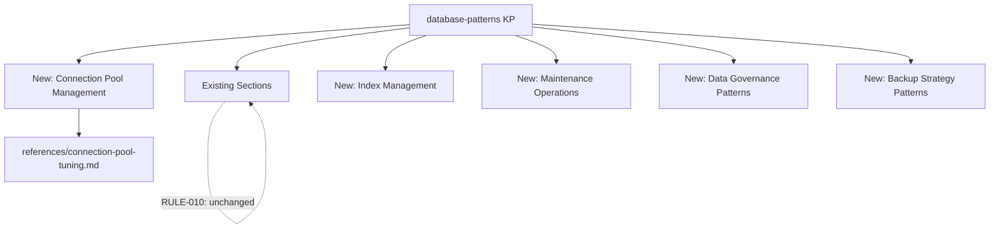
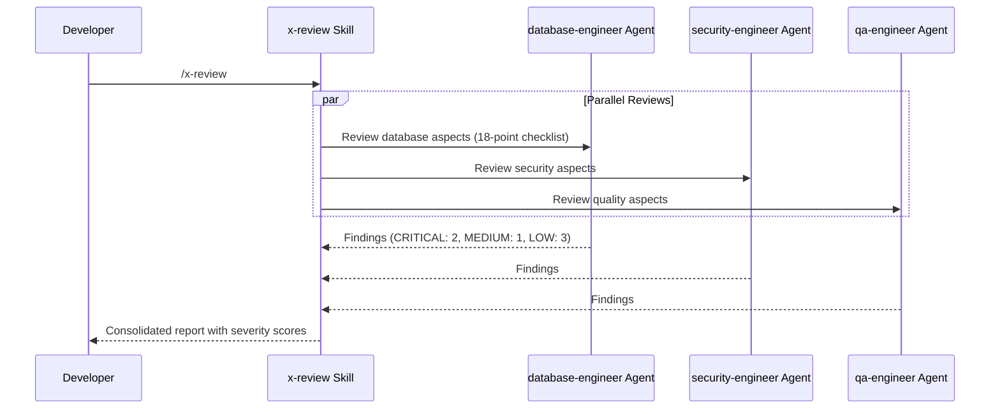
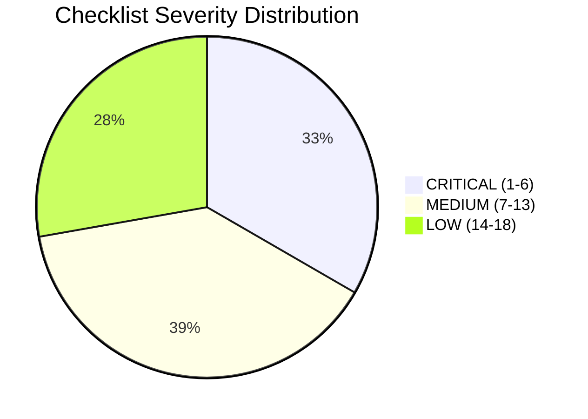

# História: Extensão Database Patterns KP e Database Engineer Agent

**ID:** story-0013-0017
**Chave Jira:** SCRUM-20
**Status:** Pendente

## 1. Dependências

| Blocked By | Blocks |
| :--- | :--- |
| story-0013-0015 | story-0013-0026 |

## 2. Regras Transversais Aplicáveis

| ID | Título |
| :--- | :--- |
| RULE-001 | Template Consistency |
| RULE-007 | Knowledge Pack Structure |
| RULE-009 | Agent Persona Contract |
| RULE-010 | Backward Compatibility |

## 3. Descrição

Como **database engineer**, eu quero que o knowledge pack `database-patterns` seja estendido com secoes de connection pool management, index management, maintenance operations, data governance patterns e backup strategy patterns, e que um novo agent `database-engineer` seja criado com checklist de 18 pontos para code reviews focados em banco de dados.

### Contexto

O `database-patterns` KP cobre query patterns, tipos e convencoes por banco de dados, mas esta incompleto em areas criticas: gestao de connection pool (sizing, timeouts, monitoring), gestao de indices (criacao, deteccao de indices nao usados, indices parciais e covering), operacoes de manutencao (VACUUM, ANALYZE, REINDEX para PostgreSQL; compact, repair para MongoDB), patterns de data governance (classificacao, retencao, audit trail) e estrategias de backup (pg_dump, mongodump, point-in-time recovery, WAL archiving).

Alem disso, nao existe um agent especialista em banco de dados para code reviews. O `devops-engineer` agent cobre alguns conceitos de DB mas sem a profundidade necessaria. O novo `database-engineer` agent fornece uma persona especializada com checklist de 18 pontos classificados por severidade (CRITICAL/MEDIUM/LOW), utilizado pelo `x-review` skill como reviewer paralelo.

Esta story tem DUAS entregas distintas, ambas sujeitas a RULE-010 (backward compatibility): extensoes ao KP existente sao aditivas (nenhuma secao existente e modificada ou removida).

### 3.1 Database Patterns KP Extension

**Secoes novas a adicionar (apos secoes existentes):**

**Connection Pool Management:**
- Sizing formulas: connections = ((core_count * 2) + effective_spindle_count) for PostgreSQL
- Timeout configuration: connectionTimeout, idleTimeout, maxLifetime
- Monitoring: active connections, idle connections, wait time, timeout events
- Pool per service vs shared pool: trade-offs
- Framework-specific: HikariCP (Java), asyncpg pool (Python), pgx pool (Go), sqlx pool (Rust), Prisma connection pool (TypeScript)

**Index Management:**
- Creation strategy: measure before creating, avoid index bloat
- Unused index detection: pg_stat_user_indexes, db.collection.aggregate for MongoDB
- Partial indexes: WHERE clause, when to use (sparse data, frequent filtered queries)
- Covering indexes: INCLUDE columns (PostgreSQL 11+), compound indexes (MongoDB)
- Index maintenance: REINDEX, online reindexing, concurrent index creation

**Maintenance Operations:**
- PostgreSQL: VACUUM (regular, full, freeze), ANALYZE, REINDEX, pg_repack
- MongoDB: compact, repair, validate, index rebuild
- Scheduling: autovacuum tuning, maintenance windows
- Monitoring: bloat detection, dead tuple ratio, fragmentation

**Data Governance Patterns:**
- Classification enforcement: column-level classification tags, access policies
- Retention automation: time-based partitioning + partition drop, TTL indexes (MongoDB)
- Audit trail for data changes: trigger-based audit tables, temporal tables (SQL:2011)
- Data masking: views with masking functions, dynamic masking

**Backup Strategy Patterns:**
- PostgreSQL: pg_dump (logical), pg_basebackup (physical), WAL archiving, pgBackRest
- MongoDB: mongodump (logical), filesystem snapshots, oplog-based PITR
- Point-in-time recovery: WAL replay (PostgreSQL), oplog replay (MongoDB)
- Backup verification: periodic restore tests, checksum validation

**Nova referencia:**
- `references/connection-pool-tuning.md` -- Sizing guide per database and language

### 3.2 Database Engineer Agent

- Path: `agents-templates/database-engineer.md`
- Role: Database engineering specialist for code reviews and architectural guidance
- Expertise: schema design, query optimization, migration safety, index strategy, connection pool tuning, backup/restore

**Checklist (18 pontos):**

| # | Item | Severidade |
| :--- | :--- | :--- |
| 1 | Schema design normalized to appropriate level (3NF minimum, denormalize with justification) | CRITICAL |
| 2 | Indexes cover all frequent query patterns (verified with EXPLAIN) | CRITICAL |
| 3 | No N+1 query patterns (batch fetch or JOIN used) | CRITICAL |
| 4 | Connection pool sized appropriately (formula-based, not arbitrary) | CRITICAL |
| 5 | Migration is backward-compatible (expand/contract pattern for breaking changes) | CRITICAL |
| 6 | Migration has rollback script (tested and verified) | CRITICAL |
| 7 | No raw SQL in application code (use parameterized queries or ORM) | MEDIUM |
| 8 | Sensitive data encrypted at rest (column-level or tablespace encryption) | MEDIUM |
| 9 | Audit logging for data modifications (trigger-based or application-level) | MEDIUM |
| 10 | Backup strategy defined and tested (restore drill completed) | MEDIUM |
| 11 | Data retention policy implemented (automated cleanup or archival) | MEDIUM |
| 12 | Foreign keys and constraints appropriate (not over-constrained, not under-constrained) | MEDIUM |
| 13 | Batch operations use pagination (LIMIT/OFFSET or cursor-based) | MEDIUM |
| 14 | Transaction scope minimized (short transactions, no long-running locks) | LOW |
| 15 | Read replicas used for heavy reads (when available) | LOW |
| 16 | Cache invalidation strategy defined (TTL, event-based, or write-through) | LOW |
| 17 | Data validation at database level (CHECK constraints, NOT NULL, domain types) | LOW |
| 18 | Monitoring for slow queries configured (pg_stat_statements, profiler) | LOW |

**Severity Distribution:**
- CRITICAL (1-6): Blocking issues that must be fixed before merge
- MEDIUM (7-13): Important issues, fix recommended before merge
- LOW (14-18): Improvement suggestions, may be deferred to next iteration

**Integration Notes:**
- Used by `x-review` skill as parallel reviewer alongside security, QA, performance engineers
- Reads `database-patterns` KP and `data-management` KP for context
- Generates findings report with severity classification

## 3.5 Entrega de Valor

- **Valor Principal:** Patterns de governance/backup/pool no KP existente e persona DBA para reviews especializados
- **Metrica de Sucesso:** KP estendido sem quebrar conteudo existente + agent com 18-point checklist gerado para todos os targets
- **Impacto no Negocio:** Reviews de banco de dados com profundidade especializada e patterns de governanca acessiveis

## 4. Definições de Qualidade Locais

### DoR Local

- [ ] Data management KP (story-0013-0015) concluido
- [ ] `database-patterns` KP existente revisado (secoes atuais mapeadas)
- [ ] Agents existentes revisados para padrao de checklist e severidade
- [ ] `x-review` skill revisado para entender integracao de reviewers paralelos
- [ ] RULE-010 compreendida: apenas adicoes, nenhuma modificacao em conteudo existente

### DoD Local

- [ ] Novas secoes adicionadas ao `database-patterns` KP (Connection Pool, Index, Maintenance, Governance, Backup)
- [ ] Conteudo existente do `database-patterns` KP preservado integralmente (RULE-010)
- [ ] `references/connection-pool-tuning.md` criado
- [ ] `database-engineer.md` agent criado com 18-point checklist
- [ ] Agent inclui severity classification (CRITICAL 1-6, MEDIUM 7-13, LOW 14-18)
- [ ] Agent inclui integration notes com `x-review` skill
- [ ] Unit tests para extensao do KP (conteudo existente + novas secoes)
- [ ] Unit tests para agent (checklist, severidade, frontmatter)
- [ ] Integration test: ambos gerados para todos os perfis com DB

### Global DoD

- **Cobertura:** >= 95% Line, >= 90% Branch
- **Regressao:** Golden file tests passando (incluindo KP existente inalterado)
- **TDD Compliance:** Test-first, refactoring explicito
- **Multi-Target:** KP: Claude + GitHub; Agent: Claude + GitHub + Codex

## 5. Contratos de Dados

**Database Patterns KP Extension (Additions Only):**

| Secao Nova | Posicao | Conteudo |
| :--- | :--- | :--- |
| Connection Pool Management | Apos ultima secao existente | Sizing, timeouts, monitoring, framework-specific |
| Index Management | Apos Connection Pool | Creation, unused detection, partial, covering |
| Maintenance Operations | Apos Index Management | VACUUM, compact, scheduling, monitoring |
| Data Governance Patterns | Apos Maintenance | Classification, retention, audit, masking |
| Backup Strategy Patterns | Apos Data Governance | pg_dump, mongodump, PITR, verification |

**Database Engineer Agent Frontmatter:**

| Campo | Formato | Obrigatorio | Valor |
| :--- | :--- | :--- | :--- |
| `name` | String | M | "database-engineer" |
| `description` | String | M | "Database engineering specialist..." |
| `tools` | List | M | [Read, Grep, Glob] |
| `disallowed-tools` | List | M | [Write, Edit, Bash] |

**Agent Checklist Contract:**

| Faixa | Severidade | Pontos | Acao |
| :--- | :--- | :--- | :--- |
| 1-6 | CRITICAL | 6 | Bloqueia merge |
| 7-13 | MEDIUM | 7 | Fix recomendado |
| 14-18 | LOW | 5 | Melhoria futura |

**Reference File:**

| Arquivo | Formato | Conteudo |
| :--- | :--- | :--- |
| `references/connection-pool-tuning.md` | Markdown | Sizing guide: formula, per-DB defaults, framework-specific config |

## 6. Diagramas

### 6.1 KP Extension (Additive)



### 6.2 Database Engineer Agent in x-review



### 6.3 Agent Severity Distribution



## 7. Critérios de Aceite (Gherkin)

```gherkin
Cenario: KP extension preserva conteudo existente integralmente
  DADO que o database-patterns KP existente tem secoes A, B, C
  QUANDO as novas secoes sao adicionadas
  ENTAO as secoes A, B, C permanecem identicas ao conteudo original
  E as novas secoes aparecem APOS as secoes existentes
  E a ordem das secoes existentes nao e alterada

Cenario: Novas secoes de Connection Pool e Index adicionadas ao KP
  DADO que o pipeline e executado para perfil com banco de dados
  QUANDO o database-patterns KP e gerado
  ENTAO o SKILL.md contem secao "Connection Pool Management"
  E contem secao "Index Management"
  E contem secao "Maintenance Operations"
  E contem secao "Data Governance Patterns"
  E contem secao "Backup Strategy Patterns"

Cenario: Agent gerado com 18-point checklist
  DADO que o pipeline e executado para qualquer perfil com banco de dados
  QUANDO o database-engineer agent e gerado
  ENTAO o arquivo contem exatamente 18 itens de checklist
  E os itens 1-6 sao classificados como CRITICAL
  E os itens 7-13 sao classificados como MEDIUM
  E os itens 14-18 sao classificados como LOW

Cenario: Agent e KP gerados para todos os targets
  DADO que o pipeline e executado para perfil java-spring
  QUANDO os artefatos de database sao gerados
  ENTAO o database-patterns KP existe em `.claude/skills/database-patterns/`
  E o database-patterns KP existe em `.github/skills/database-patterns/`
  E o database-engineer agent existe em `.claude/agents/`
  E o database-engineer agent existe em `.github/agents/`

Cenario: Reference de connection pool tuning gerado
  DADO que o pipeline e executado para perfil com banco de dados
  QUANDO o database-patterns KP e gerado
  ENTAO existe arquivo `references/connection-pool-tuning.md`
  E o arquivo contem formulas de sizing por database
  E o arquivo contem configuracoes por framework (HikariCP, asyncpg, pgx)

Cenario: KP e agent NAO gerados para perfil sem banco de dados
  DADO que o config YAML define data.database.type="none"
  QUANDO o pipeline e executado
  ENTAO as extensoes de database-patterns NAO sao geradas
  E o database-engineer agent NAO e gerado
```

### 7.1 Scenario Ordering (TPP)

> TPP: degenerate (preservacao de conteudo existente) -> unconditional (novas secoes adicionadas) -> unconditional (agent 18-point checklist) -> boundary (todos os targets) -> boundary (reference file) -> erro (database=none, nao gerado).

### 7.2 Mandatory Scenario Categories

- [x] Degenerate cases (conteudo existente preservado, RULE-010)
- [x] Happy path (novas secoes no KP, agent com checklist)
- [x] Error paths (database=none, artefatos nao gerados)
- [x] Boundary values (todos os targets, reference file com conteudo)

## 8. Sub-tarefas

- [ ] [Test] Unit test: conteudo existente do database-patterns KP preservado (RULE-010 compliance)
- [ ] [Dev] Adicionar secao "Connection Pool Management" ao database-patterns KP template
- [ ] [Dev] Adicionar secao "Index Management" ao database-patterns KP template
- [ ] [Dev] Adicionar secao "Maintenance Operations" ao database-patterns KP template
- [ ] [Dev] Adicionar secao "Data Governance Patterns" ao database-patterns KP template
- [ ] [Dev] Adicionar secao "Backup Strategy Patterns" ao database-patterns KP template
- [ ] [Dev] Criar `references/connection-pool-tuning.md` com sizing guide
- [ ] [Test] Unit test: novas secoes presentes no KP gerado
- [ ] [Test] Unit test: database-engineer agent gerado com frontmatter valido
- [ ] [Dev] Criar `agents-templates/database-engineer.md` com role, expertise e 18-point checklist
- [ ] [Test] Unit test: agent contem 18 itens com severity classification correta
- [ ] [Test] Integration test: KP estendido e agent gerados para perfil java-spring
- [ ] [Test] Integration test: artefatos NAO gerados para perfil python-click-cli (no DB)
- [ ] [Test] Atualizar golden file manifests com novos artefatos
- [ ] [Doc] Atualizar tabela de agents no CLAUDE.md
