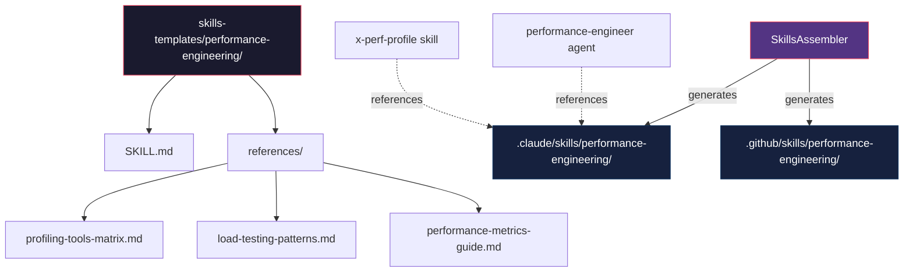
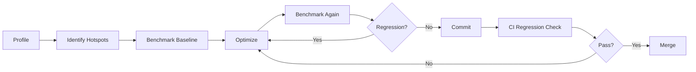

# Historia: Performance Engineering Knowledge Pack

**ID:** story-0013-0018
**Chave Jira:** --
**Status:** Pendente

## 1. Dependencias

| Blocked By | Blocks |
| :--- | :--- |
| -- | story-0013-0019 |

## 2. Regras Transversais Aplicaveis

| ID | Titulo |
| :--- | :--- |
| RULE-001 | Template Consistency |
| RULE-007 | Knowledge Pack Structure |
| RULE-003 | Pebble Template Variables |

## 3. Descricao

Como **performance engineer**, eu quero um knowledge pack dedicado a engenharia de performance, para que a IA tenha contexto completo sobre profiling, benchmarking, otimizacao e deteccao de regressoes ao auxiliar decisoes de performance.

### Contexto

O agent `performance-engineer` existe no ia-dev-env mas nao possui um knowledge pack dedicado para referenciar. O KP de resilience cobre metricas de resiliencia (circuit breakers, retries, timeouts) mas nao aborda profiling, benchmarking ou estrategias de otimizacao. O KP de testing menciona testes de performance superficialmente, sem cobrir ferramentas de profiling, frameworks de benchmarking, deteccao de regressoes ou gestao de memoria. Isso significa que quando o agent `performance-engineer` e acionado em reviews, ele opera sem contexto tecnico especializado.

### 3.1 Estrutura do Knowledge Pack

- Path: `skills-templates/performance-engineering/SKILL.md`
- Frontmatter: `user-invocable: false` (knowledge pack interno)
- Referenciado por: `performance-engineer` agent, `x-perf-profile` skill (story-0013-0019)

### 3.2 Conteudo Principal

**Profiling Tools & Patterns:**
- JFR (Java Flight Recorder): continuous profiling, event-based recording, low-overhead production profiling
- async-profiler: CPU sampling, allocation profiling, wall-clock profiling for JVM
- pprof (Go): CPU, memory, goroutine, block profiling with HTTP endpoints
- perf (Linux): hardware counters, cache misses, branch mispredictions, kernel tracing
- py-spy (Python): sampling profiler, no code modification, production-safe
- Flamegraph generation: flame chart interpretation, stack frame analysis, hot path identification

**Benchmarking Frameworks:**
- JMH (Java Microbenchmark Harness): benchmark modes, warmup iterations, fork configuration
- BenchmarkDotNet (C#): memory diagnoser, statistical analysis
- criterion (Rust): statistical benchmarking, regression detection
- hyperfine (CLI): command-line benchmarking, warmup, parameter sweeps
- k6/Gatling/Locust: load testing frameworks, virtual users, scenarios, thresholds

**Performance Anti-Patterns:**
- N+1 queries: detection patterns, eager loading strategies
- Unbounded collections: pagination enforcement, streaming alternatives
- Synchronous I/O in hot paths: async alternatives, non-blocking I/O
- Excessive object allocation: object pooling, value types, flyweight pattern
- String concatenation in loops: StringBuilder, StringJoiner, template engines
- Missing connection pooling: pool sizing, idle timeout, leak detection

**Optimization Strategies:**
- Hot path optimization: identify via profiling, minimize allocations, reduce branching
- Lazy initialization: deferred computation, lazy collections, on-demand loading
- Caching strategies: L1 (in-process), L2 (distributed), L3 (CDN), cache invalidation patterns
- Connection pooling: HikariCP (Java), pgbouncer (PostgreSQL), sizing formulas
- Batch processing: chunk-based processing, bulk operations, write-behind patterns
- Async I/O: reactive streams, virtual threads (Java 21), goroutines (Go), async/await
- Pagination: cursor-based vs offset-based, keyset pagination, total count avoidance

**Load Testing Patterns:**
- Ramp-up strategies: linear ramp, stepped ramp, spike testing
- Steady-state duration: minimum 10 minutes for stable percentiles
- Percentile-based SLOs: p50/p95/p99 latency targets, throughput baselines
- Saturation testing: find breaking point, resource exhaustion behavior
- Soak testing: extended duration (hours), memory leak detection, resource drift

**Performance Regression Detection:**
- Baseline establishment: golden run metrics, statistical significance
- Threshold definition: percentage-based (p99 < baseline * 1.1), absolute (p99 < 200ms)
- Automated comparison: CI integration, benchmark result storage, trend analysis
- Alerting: regression alerts in CI, dashboard integration, blame detection

**Memory Management:**
- Leak detection: heap dump analysis, allocation tracking, reference chain analysis
- GC tuning (JVM): G1GC, ZGC, Shenandoah — pause time vs throughput tradeoffs
- Memory profiling: resident set size, virtual memory, off-heap tracking
- Allocation rate monitoring: young gen churn, promotion rate, tenuring threshold

### 3.3 Referencias

- `references/profiling-tools-matrix.md` — ferramenta de profiling recomendada por linguagem/runtime
- `references/load-testing-patterns.md` — patterns de teste de carga com exemplos de configuracao
- `references/performance-metrics-guide.md` — guia de metricas de performance (latencia, throughput, saturacao)

## 3.5 Entrega de Valor

- **Valor Principal:** IA tem conhecimento especializado de performance engineering para profiling, benchmarking e otimizacao
- **Metrica de Sucesso:** Knowledge pack gerado em `.claude/skills/performance-engineering/` com 3 reference files
- **Impacto no Negocio:** Agent `performance-engineer` opera com contexto tecnico completo em reviews

## 4. Definicoes de Qualidade Locais

### DoR Local

- [ ] Knowledge packs existentes revisados para manter consistencia de formato (resilience, testing, observability)
- [ ] Agent `performance-engineer` existente revisado para identificar gaps de conhecimento
- [ ] Ferramentas de profiling por linguagem pesquisadas e validadas
- [ ] `SkillsAssembler` compreendido para saber como KPs sao copiados

### DoD Local

- [ ] `SKILL.md` criado com todas as secoes de performance engineering
- [ ] `references/profiling-tools-matrix.md` criado com matriz linguagem x ferramenta
- [ ] `references/load-testing-patterns.md` criado com patterns de carga
- [ ] `references/performance-metrics-guide.md` criado com guia de metricas
- [ ] Frontmatter YAML valido com `user-invocable: false`
- [ ] Template usa variaveis Pebble corretas para secoes language-specific
- [ ] Integration test: KP e gerado pelo pipeline para todos os perfis

### Global DoD

- **Cobertura:** >= 95% Line, >= 90% Branch
- **Regressao:** Golden file tests passando
- **TDD Compliance:** Test-first pattern
- **Multi-Target:** Claude (.claude/skills/) + GitHub (.github/skills/)

## 5. Contratos de Dados

**SKILL.md Frontmatter:**

| Campo | Formato | Obrigatorio | Valor |
| :--- | :--- | :--- | :--- |
| `name` | String | M | "performance-engineering" |
| `description` | String | M | "Performance engineering patterns: profiling, benchmarking, optimization, regression detection, and memory management" |
| `user-invocable` | Boolean | M | false |

**Template Variables Used:**

| Variavel | Tipo | Condicional | Descricao |
| :--- | :--- | :--- | :--- |
| `{{LANGUAGE}}` | String | N | Linguagem do projeto (determina ferramentas de profiling) |
| `{{FRAMEWORK}}` | String | N | Framework do projeto |
| `{{BUILD_TOOL}}` | String | N | Ferramenta de build (determina integracao de benchmarks) |
| `{{CONTAINER}}` | String | S | Container runtime (impacta metricas de resource limits) |

**Reference Files Structure:**

| Arquivo | Formato | Conteudo |
| :--- | :--- | :--- |
| `profiling-tools-matrix.md` | Markdown table | Linguagem x Ferramenta x Tipo (CPU/Memory/IO) x Overhead |
| `load-testing-patterns.md` | Markdown sections | Patterns de carga com exemplos de config k6/Gatling/Locust |
| `performance-metrics-guide.md` | Markdown sections | Metricas RED (Rate, Errors, Duration) e USE (Utilization, Saturation, Errors) |

## 6. Diagramas

### 6.1 Estrutura do Knowledge Pack



### 6.2 Fluxo de Performance Engineering



## 7. Criterios de Aceite (Gherkin)

```gherkin
Cenario: KP gerado com secao de profiling para qualquer perfil
  DADO que o pipeline e executado para qualquer perfil
  QUANDO o performance-engineering KP e gerado
  ENTAO o SKILL.md contem secao "Profiling Tools & Patterns"
  E contem secao "Benchmarking Frameworks"
  E contem secao "Performance Anti-Patterns"

Cenario: KP inclui ferramentas de profiling especificas para Java
  DADO que o config YAML define language.name="java"
  QUANDO o performance-engineering KP e gerado
  ENTAO o SKILL.md contem referencia a "JFR" (Java Flight Recorder)
  E contem referencia a "async-profiler"
  E contem referencia a "JMH" (Java Microbenchmark Harness)

Cenario: KP inclui ferramentas de profiling especificas para Go
  DADO que o config YAML define language.name="go"
  QUANDO o performance-engineering KP e gerado
  ENTAO o SKILL.md contem referencia a "pprof"
  E contem referencia a CPU, memory e goroutine profiling

Cenario: Load testing patterns incluidos com SLOs percentile-based
  DADO que o pipeline e executado para qualquer perfil
  QUANDO o performance-engineering KP e gerado
  ENTAO o SKILL.md contem secao "Load Testing Patterns"
  E contem referencia a p50, p95 e p99 latency
  E contem referencia a ramp-up strategies e soak testing

Cenario: Reference files gerados junto com SKILL.md
  DADO que o pipeline e executado para qualquer perfil
  QUANDO o performance-engineering KP e gerado
  ENTAO existem 3 reference files em `.claude/skills/performance-engineering/references/`
  E o arquivo `profiling-tools-matrix.md` contem matriz linguagem x ferramenta
  E o arquivo `load-testing-patterns.md` contem patterns de carga
  E o arquivo `performance-metrics-guide.md` contem guia de metricas

Cenario: KP gerado para ambos targets Claude e GitHub
  DADO que o pipeline e executado para perfil java-spring
  QUANDO o performance-engineering KP e gerado
  ENTAO o SKILL.md existe em `.claude/skills/performance-engineering/`
  E o SKILL.md existe em `.github/skills/performance-engineering/`
  E o conteudo e identico em ambos os targets
```

### 7.1 Scenario Ordering (TPP)

> TPP: degenerate (KP com secoes base para qualquer perfil) -> constant (ferramentas Java-specific) ->
> constant+ (ferramentas Go-specific) -> scalar (load testing com SLOs) ->
> composite (reference files completos) -> boundary (multi-target output).

### 7.2 Mandatory Scenario Categories

- [x] Degenerate cases (KP gerado com secoes base para qualquer perfil)
- [x] Happy path (ferramentas Java-specific, Go-specific, load testing patterns)
- [x] Error paths (N/A - KP sempre gerado)
- [x] Boundary values (reference files, multi-target output)

## 8. Sub-tarefas

- [ ] [Test] Unit test: SKILL.md gerado com frontmatter valido e secoes obrigatorias
- [ ] [Dev] Criar `skills-templates/performance-engineering/SKILL.md` com secoes base
- [ ] [Test] Unit test: secoes language-specific renderizadas para Java (JFR, JMH, async-profiler)
- [ ] [Dev] Adicionar blocos condicionais Pebble para ferramentas por linguagem
- [ ] [Dev] Criar `references/profiling-tools-matrix.md`
- [ ] [Dev] Criar `references/load-testing-patterns.md`
- [ ] [Dev] Criar `references/performance-metrics-guide.md`
- [ ] [Test] Integration test: KP gerado para perfis java-spring e go-gin com ferramentas corretas
- [ ] [Test] Integration test: 3 reference files presentes no output
- [ ] [Test] Atualizar golden file manifests
- [ ] [Doc] Registrar KP na tabela de knowledge packs do CLAUDE.md
