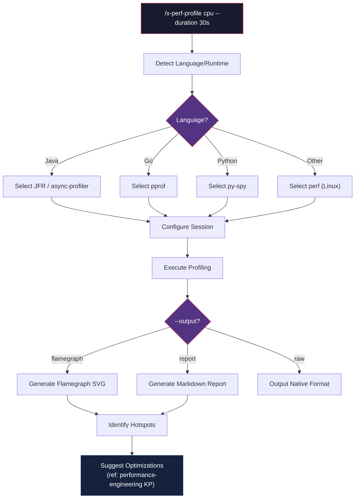
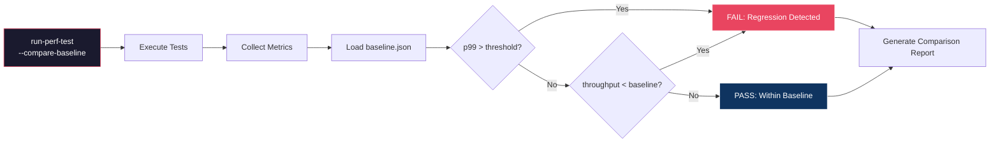

# História: Skill x-perf-profile e Extensão run-perf-test

**ID:** story-0013-0019
**Chave Jira:** SCRUM-22
**Status:** Pendente

## 1. Dependências

| Blocked By | Blocks |
| :--- | :--- |
| story-0013-0018 | story-0013-0026 |

## 2. Regras Transversais Aplicáveis

| ID | Título |
| :--- | :--- |
| RULE-001 | Template Consistency |
| RULE-008 | Skill Invocability |
| RULE-010 | Backward Compatibility |

## 3. Descrição

Como **performance engineer**, eu quero uma skill de profiling automatizado (`x-perf-profile`) e uma extensao da skill `run-perf-test` com deteccao de regressao, para que a IA possa executar sessoes de profiling e detectar degradacoes de performance automaticamente.

### Contexto

Nao existe nenhuma skill de profiling no ia-dev-env. O agent `performance-engineer` participa de reviews mas nao tem uma skill dedicada para executar profiling, gerar flamegraphs ou identificar hotspots. A skill `run-perf-test` existente executa testes de performance mas nao compara resultados contra um baseline nem detecta regressoes. Esta story entrega duas capacidades complementares: profiling interativo e deteccao automatica de regressao.

### 3.1 Nova Skill x-perf-profile

- Path: `skills-templates/x-perf-profile/SKILL.md`
- Frontmatter:
  - `user-invocable: true`
  - `argument-hint: "[cpu|memory|io|all] [--duration 30s] [--output flamegraph]"`
  - `allowed-tools: [Read, Bash, Glob, Grep, Agent]`

**Workflow:**
1. **Detect language/runtime:** Analisar `pom.xml`, `package.json`, `go.mod`, `Cargo.toml`, `pyproject.toml` para identificar stack
2. **Select appropriate profiler:** JFR para Java, pprof para Go, py-spy para Python, perf para Linux nativo
3. **Configure profiling session:** Definir duracao, tipo (CPU/memory/IO/all), sampling rate
4. **Execute profiling:** Executar profiler com parametros configurados
5. **Generate flamegraph/report:** Converter output do profiler em flamegraph SVG ou report textual
6. **Identify hotspots:** Analisar flamegraph e identificar funcoes com maior consumo
7. **Suggest optimizations:** Referenciar performance-engineering KP para sugestoes contextualizadas

**Integration Notes:**
- Usa agent `performance-engineer` para analise de resultados
- Referencia KP `performance-engineering` (story-0013-0018) para patterns de otimizacao
- Output modes: `flamegraph` (SVG), `report` (Markdown), `raw` (profiler native format)

### 3.2 Extensão run-perf-test

Adicionar capacidades a skill `run-perf-test` existente (RULE-010: apenas adicoes, conteudo existente preservado):

- **Regression detection:** Comparar resultados atuais contra baseline armazenado em `docs/performance/baseline.json`
- **Threshold validation:** Falhar se p99 latency exceder threshold configurado ou throughput cair abaixo do baseline
- **Baseline management:** Comandos para criar/atualizar baseline (`--save-baseline`, `--compare-baseline`)
- **Report generation:** Gerar report de comparacao com delta percentual por endpoint/operacao

**baseline.json structure:**
```json
{
  "version": "1.0",
  "timestamp": "ISO-8601",
  "metrics": {
    "endpoint_or_operation": {
      "p50_ms": 10,
      "p95_ms": 45,
      "p99_ms": 95,
      "throughput_rps": 1200,
      "error_rate_pct": 0.1
    }
  }
}
```

## 3.5 Entrega de Valor

- **Valor Principal:** Profiling automatizado e deteccao de regressao de performance integrados ao workflow de desenvolvimento
- **Metrica de Sucesso:** Skill `x-perf-profile` gerada com workflow completo; `run-perf-test` estendida com comparacao de baseline
- **Impacto no Negocio:** Regressoes de performance detectadas antes de chegar a producao

## 4. Definições de Qualidade Locais

### DoR Local

- [ ] Performance Engineering KP (story-0013-0018) implementado
- [ ] Skill `run-perf-test` existente revisada para entender estrutura atual
- [ ] Skills invocaveis existentes revisadas para manter consistencia de frontmatter
- [ ] Ferramentas de profiling por linguagem validadas (JFR, pprof, py-spy)

### DoD Local

- [ ] `x-perf-profile/SKILL.md` criado com workflow de 7 passos
- [ ] Frontmatter YAML valido com `user-invocable: true`, `argument-hint`, `allowed-tools`
- [ ] `run-perf-test` estendido com secoes de regression detection e baseline management
- [ ] Conteudo existente de `run-perf-test` preservado integralmente (RULE-010)
- [ ] Unit tests para x-perf-profile (frontmatter, workflow, tool list)
- [ ] Unit tests para run-perf-test estendido (novas secoes presentes, secoes antigas preservadas)

### Global DoD

- **Cobertura:** >= 95% Line, >= 90% Branch
- **Regressao:** Golden file tests passando
- **TDD Compliance:** Test-first pattern
- **Multi-Target:** Claude (.claude/skills/) + GitHub (.github/skills/) + Codex (.codex/skills/)

## 5. Contratos de Dados

**x-perf-profile SKILL.md Frontmatter:**

| Campo | Formato | Obrigatorio | Valor |
| :--- | :--- | :--- | :--- |
| `name` | String | M | "x-perf-profile" |
| `description` | String | M | "Automated profiling: detect language, select profiler, execute session, generate flamegraph, identify hotspots, suggest optimizations" |
| `user-invocable` | Boolean | M | true |
| `argument-hint` | String | M | "[cpu\|memory\|io\|all] [--duration 30s] [--output flamegraph]" |
| `allowed-tools` | List | M | [Read, Bash, Glob, Grep, Agent] |

**run-perf-test Extension (new sections):**

| Seção | Tipo | Descrição |
| :--- | :--- | :--- |
| `## Regression Detection` | New section | Comparacao contra baseline.json |
| `## Baseline Management` | New section | Criar/atualizar baseline com --save-baseline |
| `## Threshold Validation` | New section | Regras de falha: p99 > threshold ou throughput < baseline |
| `## Comparison Report` | New section | Report com delta percentual por operacao |

**baseline.json Contract:**

| Campo | Formato | Obrigatorio | Descrição |
| :--- | :--- | :--- | :--- |
| `version` | String | M | Schema version (semver) |
| `timestamp` | String (ISO-8601) | M | Quando o baseline foi criado |
| `metrics` | Object | M | Map de endpoint/operacao para metricas |
| `metrics.*.p50_ms` | Number | M | Latencia percentil 50 em ms |
| `metrics.*.p95_ms` | Number | M | Latencia percentil 95 em ms |
| `metrics.*.p99_ms` | Number | M | Latencia percentil 99 em ms |
| `metrics.*.throughput_rps` | Number | M | Throughput em requests por segundo |
| `metrics.*.error_rate_pct` | Number | M | Taxa de erro em percentual |

## 6. Diagramas

### 6.1 Workflow x-perf-profile



### 6.2 Fluxo de Regression Detection (run-perf-test)



## 7. Critérios de Aceite (Gherkin)

```gherkin
Cenario: x-perf-profile detecta projeto Java e seleciona JFR
  DADO que o projeto contem um arquivo pom.xml na raiz
  QUANDO o skill x-perf-profile e invocado com argumento "cpu"
  ENTAO o workflow deve identificar a linguagem como "java"
  E deve selecionar "JFR" como profiler primario
  E o SKILL.md deve conter instrucoes de configuracao do JFR

Cenario: x-perf-profile com --output flamegraph gera instrucoes de flamegraph
  DADO que o skill x-perf-profile e invocado com "--output flamegraph"
  QUANDO o workflow de profiling e executado
  ENTAO o SKILL.md deve conter instrucoes para geracao de flamegraph SVG
  E deve conter orientacao para interpretacao do flamegraph (hot path identification)

Cenario: x-perf-profile detecta projeto Go e seleciona pprof
  DADO que o projeto contem um arquivo go.mod na raiz
  QUANDO o skill x-perf-profile e invocado com argumento "memory"
  ENTAO o workflow deve identificar a linguagem como "go"
  E deve selecionar "pprof" como profiler primario

Cenario: run-perf-test detecta regressao acima do threshold
  DADO que o baseline.json define p99_ms=100 para endpoint "/api/orders"
  E o resultado atual mostra p99_ms=150 para o mesmo endpoint
  QUANDO o run-perf-test e executado com --compare-baseline
  ENTAO o resultado deve indicar FAIL com regressao detectada
  E o report deve mostrar delta de +50% para p99 de "/api/orders"

Cenario: run-perf-test passa quando resultados estao dentro do baseline
  DADO que o baseline.json define p99_ms=100 e throughput_rps=1000
  E o resultado atual mostra p99_ms=95 e throughput_rps=1050
  QUANDO o run-perf-test e executado com --compare-baseline
  ENTAO o resultado deve indicar PASS
  E o report deve mostrar melhoria de -5% para p99 e +5% para throughput

Cenario: run-perf-test preserva conteudo existente apos extensao
  DADO que o skill run-perf-test existente tem secoes originais
  QUANDO a extensao e aplicada
  ENTAO todas as secoes originais devem estar presentes e inalteradas
  E as novas secoes Regression Detection, Baseline Management, Threshold Validation e Comparison Report devem estar presentes

Cenario: x-perf-profile gerado para ambos targets
  DADO que o pipeline e executado para perfil java-spring
  QUANDO o x-perf-profile skill e gerado
  ENTAO o SKILL.md existe em `.claude/skills/x-perf-profile/`
  E o SKILL.md existe em `.github/skills/x-perf-profile/`
```

### 7.1 Scenario Ordering (TPP)

> TPP: degenerate (detecta Java e seleciona JFR) -> constant (flamegraph output) ->
> constant+ (detecta Go e seleciona pprof) -> scalar (regressao acima do threshold) ->
> conditions (resultados dentro do baseline) -> composite (preservacao de conteudo existente) ->
> boundary (multi-target output).

### 7.2 Mandatory Scenario Categories

- [x] Degenerate cases (deteccao de linguagem e selecao de profiler)
- [x] Happy path (profiling com flamegraph, regressao detectada, within baseline)
- [x] Error paths (regressao acima do threshold gera FAIL)
- [x] Boundary values (conteudo existente preservado, multi-target output)

## 8. Sub-tarefas

- [ ] [Test] Unit test: x-perf-profile SKILL.md gerado com frontmatter valido (user-invocable, argument-hint, allowed-tools)
- [ ] [Dev] Criar `skills-templates/x-perf-profile/SKILL.md` com workflow de 7 passos
- [ ] [Test] Unit test: x-perf-profile contem instrucoes de deteccao de linguagem e selecao de profiler
- [ ] [Dev] Adicionar blocos condicionais Pebble para profiler por linguagem (JFR, pprof, py-spy)
- [ ] [Test] Unit test: run-perf-test estendido contem secoes de regression detection
- [ ] [Dev] Estender `skills-templates/x-test-run/SKILL.md` com secoes de baseline e regressao (RULE-010)
- [ ] [Test] Unit test: conteudo original de run-perf-test preservado apos extensao
- [ ] [Test] Integration test: x-perf-profile gerado para perfis java-spring e go-gin
- [ ] [Test] Integration test: run-perf-test estendido gerado com secoes novas e antigas
- [ ] [Test] Atualizar golden file manifests
- [ ] [Doc] Registrar skill x-perf-profile na tabela de skills do CLAUDE.md
