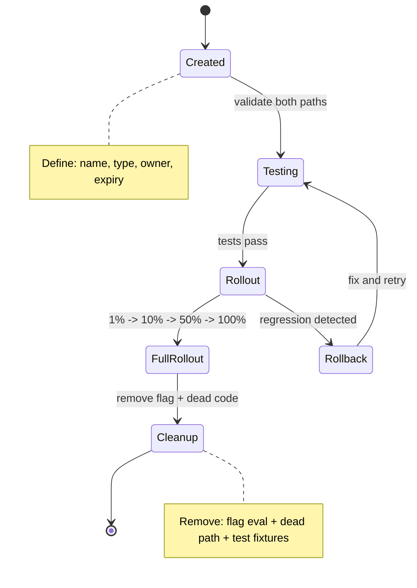
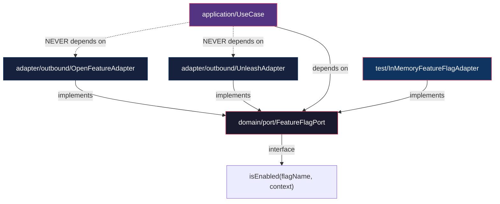

# Historia: Feature Flags Knowledge Pack

**ID:** story-0013-0020
**Chave Jira:** --
**Status:** Pendente

## 1. Dependencias

| Blocked By | Blocks |
| :--- | :--- |
| -- | story-0013-0026 |

## 2. Regras Transversais Aplicaveis

| ID | Titulo |
| :--- | :--- |
| RULE-001 | Template Consistency |
| RULE-007 | Knowledge Pack Structure |
| RULE-003 | Pebble Template Variables |

## 3. Descricao

Como **architect**, eu quero um knowledge pack dedicado a feature flags e progressive delivery, para que a IA tenha contexto completo sobre toggle types, lifecycle management, evaluation strategies, cleanup policies e integracao com arquitetura hexagonal.

### Contexto

Feature flags sao mencionados superficialmente em cloud-native-principles (como estrategia de canary deployment) e em PCI-DSS compliance (como mecanismo de kill switch), mas nao existe um knowledge pack dedicado. Isso significa que a IA nao tem conhecimento sobre tipos de toggles (release, experiment, ops, permission), ciclo de vida de flags (criacao ate cleanup), estrategias de avaliacao (server-side vs client-side), frameworks (OpenFeature, Unleash, LaunchDarkly), nem sobre anti-patterns como nested flags ou flags permanentes. Esta story cria um KP completo que tambem define como feature flags se integram com a arquitetura hexagonal (domain nao depende de flag framework, avaliacao via port).

### 3.1 Estrutura do Knowledge Pack

- Path: `skills-templates/feature-flags/SKILL.md`
- Frontmatter: `user-invocable: false` (knowledge pack interno)
- Referenciado por: `architect` agent, skills de implementacao

### 3.2 Conteudo Principal

**Toggle Types:**
- Release toggles: short-lived, binary (on/off), removed after full rollout, maximum age 2 sprints
- Experiment toggles: A/B testing, multivariate, data-driven decision, removed after experiment conclusion
- Ops toggles: circuit breaker, kill switch, manual override, may be long-lived with documented justification
- Permission toggles: role-based feature access, premium features, internal tools, lifecycle tied to product decisions

**Toggle Lifecycle:**
- Creation: define flag name, type, default value, owner, expiry date
- Testing: validate both flag-on and flag-off paths, ensure no coupling between flags
- Rollout: percentage-based rollout (1% -> 10% -> 50% -> 100%), monitoring at each stage
- Cleanup: remove flag + dead code path, verify no references remain, maximum age enforcement per toggle type

**Evaluation Strategies:**
- Server-side evaluation: consistent, secure, no client exposure of flag logic
- Client-side evaluation: faster, reduced network calls, requires flag data sync
- Caching: local cache with TTL, stale-while-revalidate, cache invalidation on flag change
- Context-based targeting: user attributes, environment, percentage rollout, user segment targeting
- Percentage rollout: sticky hashing (user ID + flag name), consistent bucket assignment

**Feature Flag Frameworks:**
- OpenFeature: vendor-neutral API, provider pattern, hooks, evaluation context (RECOMMENDED)
- Unleash: open-source, self-hosted, activation strategies, client SDKs
- LaunchDarkly: SaaS, targeting rules, experiments, analytics
- Flagsmith: open-source, self-hosted or cloud, segment-based targeting
- SDK availability per language matrix

**Progressive Delivery:**
- Canary deployments with flag-based routing: route traffic based on flag evaluation
- Blue-green with flags: new version behind flag, instant rollback via flag toggle
- Ring deployments: concentric rings of users (internal -> beta -> general)
- Dark launches: deploy feature to production disabled, test in production without user impact

**Integration with Architecture:**
- Hexagonal port for feature flag evaluation: `FeatureFlagPort` interface in domain layer
- No domain dependency on flag framework: adapter-layer integration only
- Port contract: `boolean isEnabled(String flagName, EvaluationContext context)`
- Adapter implementation: wraps specific framework SDK (OpenFeature, Unleash, etc.)
- Testing: in-memory implementation for unit tests, no mock of flag framework in domain

**Cleanup Policies:**
- Stale flag detection: automated scan for flags older than maximum age per type
- Automated cleanup reminders: CI check for expired flags, PR comment with cleanup instructions
- Code removal strategy: remove flag evaluation + dead code path + test fixtures in single PR
- Flag audit log: track creation, modification, evaluation frequency, last evaluated timestamp

**Anti-Patterns:**
- Nested flags: flag evaluation depending on another flag's result (combinatorial explosion)
- Flag-driven branching in domain logic: business rules should not branch on flags
- Permanent flags without expiry: all flags MUST have an expiry date or documented justification
- Testing only flagged-on path: both paths MUST be tested
- Flag naming without convention: use format `{type}.{feature}.{variant}` (e.g., `release.checkout-v2.enabled`)

### 3.3 Referencias

- `references/openfeature-setup.md` — guia de setup do OpenFeature com provider pattern
- `references/progressive-delivery-patterns.md` — patterns de entrega progressiva com exemplos

## 3.5 Entrega de Valor

- **Valor Principal:** IA tem conhecimento completo de feature flags para guiar implementacao e progressive delivery
- **Metrica de Sucesso:** Knowledge pack gerado em `.claude/skills/feature-flags/` com 2 reference files
- **Impacto no Negocio:** Implementacao de feature flags segue best practices e se integra com arquitetura hexagonal

## 4. Definicoes de Qualidade Locais

### DoR Local

- [ ] Knowledge packs existentes revisados para manter consistencia de formato
- [ ] Arquitetura hexagonal do ia-dev-env compreendida (ports/adapters pattern)
- [ ] Frameworks de feature flags pesquisados (OpenFeature, Unleash, LaunchDarkly, Flagsmith)
- [ ] `SkillsAssembler` compreendido para saber como KPs sao copiados

### DoD Local

- [ ] `SKILL.md` criado com todas as secoes de feature flags
- [ ] `references/openfeature-setup.md` criado com guia de setup
- [ ] `references/progressive-delivery-patterns.md` criado com patterns
- [ ] Frontmatter YAML valido com `user-invocable: false`
- [ ] Secao de integracao referencia arquitetura hexagonal (port no domain, adapter no adapter layer)
- [ ] Cleanup policies incluem deteccao automatica de flags stale
- [ ] Integration test: KP e gerado pelo pipeline para todos os perfis

### Global DoD

- **Cobertura:** >= 95% Line, >= 90% Branch
- **Regressao:** Golden file tests passando
- **TDD Compliance:** Test-first pattern
- **Multi-Target:** Claude (.claude/skills/) + GitHub (.github/skills/)

## 5. Contratos de Dados

**SKILL.md Frontmatter:**

| Campo | Formato | Obrigatorio | Valor |
| :--- | :--- | :--- | :--- |
| `name` | String | M | "feature-flags" |
| `description` | String | M | "Feature flags patterns: toggle types, lifecycle management, evaluation strategies, progressive delivery, cleanup policies, and hexagonal architecture integration" |
| `user-invocable` | Boolean | M | false |

**Template Variables Used:**

| Variavel | Tipo | Condicional | Descricao |
| :--- | :--- | :--- | :--- |
| `{{LANGUAGE}}` | String | N | Linguagem do projeto (determina SDK recommendations) |
| `{{FRAMEWORK}}` | String | N | Framework do projeto |
| `{{ARCHITECTURE}}` | String | N | Estilo de arquitetura (hexagonal port integration) |

**Toggle Types Summary:**

| Tipo | Lifetime | Default Max Age | Removal Trigger |
| :--- | :--- | :--- | :--- |
| Release | Short-lived | 2 sprints | Full rollout completed |
| Experiment | Short-lived | Experiment duration | Data-driven decision made |
| Ops | Long-lived | Documented justification | Operational decision |
| Permission | Product-driven | Product lifecycle | Product decision |

## 6. Diagramas

### 6.1 Toggle Lifecycle



### 6.2 Integracao com Arquitetura Hexagonal



## 7. Criterios de Aceite (Gherkin)

```gherkin
Cenario: KP gerado com todos os toggle types documentados
  DADO que o pipeline e executado para qualquer perfil
  QUANDO o feature-flags KP e gerado
  ENTAO o SKILL.md contem secao "Toggle Types"
  E contem documentacao para Release, Experiment, Ops e Permission toggles
  E cada tipo define lifecycle e maximum age

Cenario: Secao de integracao referencia arquitetura hexagonal
  DADO que o pipeline e executado para qualquer perfil
  QUANDO o feature-flags KP e gerado
  ENTAO o SKILL.md contem secao "Integration with Architecture"
  E contem referencia a "FeatureFlagPort" como interface no domain
  E contem indicacao de que adapter-layer implementa o port
  E contem indicacao de que domain NUNCA depende de flag framework

Cenario: Cleanup policies incluem deteccao de flags stale
  DADO que o pipeline e executado para qualquer perfil
  QUANDO o feature-flags KP e gerado
  ENTAO o SKILL.md contem secao "Cleanup Policies"
  E contem referencia a deteccao automatica de flags expiradas
  E contem estrategia de remocao de codigo (flag + dead path + test fixtures)

Cenario: Anti-patterns documentados com nested flags e flags permanentes
  DADO que o pipeline e executado para qualquer perfil
  QUANDO o feature-flags KP e gerado
  ENTAO o SKILL.md contem secao "Anti-Patterns"
  E contem "nested flags" como anti-pattern
  E contem "permanent flags without expiry" como anti-pattern
  E contem "testing only flagged-on path" como anti-pattern

Cenario: Reference files gerados junto com SKILL.md
  DADO que o pipeline e executado para qualquer perfil
  QUANDO o feature-flags KP e gerado
  ENTAO existem 2 reference files em `.claude/skills/feature-flags/references/`
  E o arquivo `openfeature-setup.md` contem guia de setup
  E o arquivo `progressive-delivery-patterns.md` contem patterns de entrega progressiva

Cenario: KP gerado para ambos targets Claude e GitHub
  DADO que o pipeline e executado para perfil java-spring
  QUANDO o feature-flags KP e gerado
  ENTAO o SKILL.md existe em `.claude/skills/feature-flags/`
  E o SKILL.md existe em `.github/skills/feature-flags/`
  E o conteudo e identico em ambos os targets
```

### 7.1 Scenario Ordering (TPP)

> TPP: degenerate (KP com toggle types base) -> constant (integracao hexagonal) ->
> constant+ (cleanup policies) -> scalar (anti-patterns) ->
> composite (reference files) -> boundary (multi-target output).

### 7.2 Mandatory Scenario Categories

- [x] Degenerate cases (KP gerado com todos os toggle types)
- [x] Happy path (integracao hexagonal, cleanup policies, anti-patterns)
- [x] Error paths (N/A - KP sempre gerado)
- [x] Boundary values (reference files, multi-target output)

## 8. Sub-tarefas

- [ ] [Test] Unit test: SKILL.md gerado com frontmatter valido e secoes obrigatorias
- [ ] [Dev] Criar `skills-templates/feature-flags/SKILL.md` com secoes base
- [ ] [Test] Unit test: secao Integration with Architecture referencia FeatureFlagPort e adapter pattern
- [ ] [Dev] Adicionar secoes de toggle types, lifecycle, evaluation strategies
- [ ] [Dev] Adicionar secoes de cleanup policies e anti-patterns
- [ ] [Dev] Criar `references/openfeature-setup.md`
- [ ] [Dev] Criar `references/progressive-delivery-patterns.md`
- [ ] [Test] Integration test: KP gerado para perfis java-spring e typescript-nestjs
- [ ] [Test] Integration test: 2 reference files presentes no output
- [ ] [Test] Atualizar golden file manifests
- [ ] [Doc] Registrar KP na tabela de knowledge packs do CLAUDE.md
