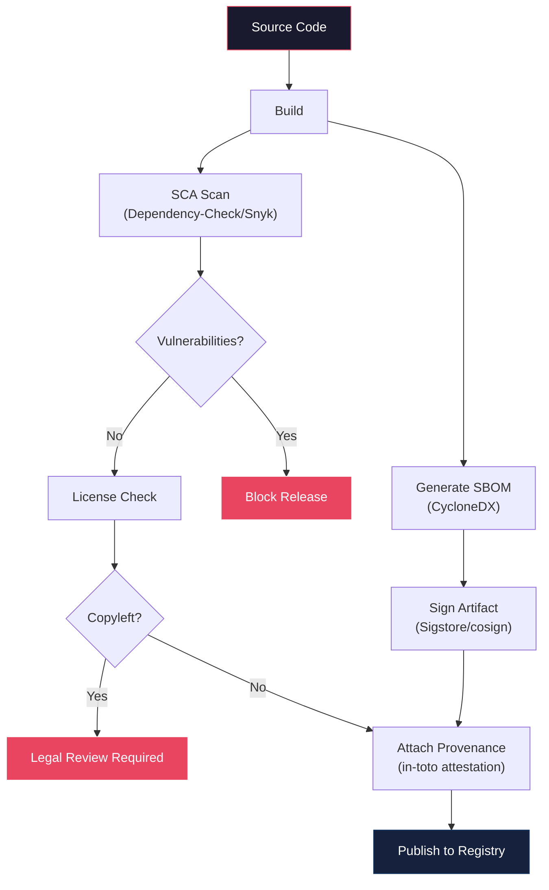
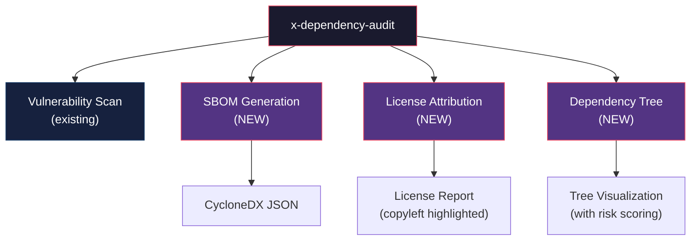

# História: Extensão Security KP (SBOM/Supply Chain) e x-dependency-audit

**ID:** story-0013-0021
**Chave Jira:** SCRUM-24
**Status:** Pendente

## 1. Dependências

| Blocked By | Blocks |
| :--- | :--- |
| -- | story-0013-0026 |

## 2. Regras Transversais Aplicáveis

| ID | Título |
| :--- | :--- |
| RULE-001 | Template Consistency |
| RULE-007 | Knowledge Pack Structure |
| RULE-008 | Skill Invocability |
| RULE-010 | Backward Compatibility |

## 3. Descrição

Como **security engineer**, eu quero que o security KP seja estendido com secoes de SBOM e supply chain security, e que a skill `x-dependency-audit` ganhe capacidades de geracao de SBOM e analise de licencas, para que a IA tenha conhecimento completo de seguranca da cadeia de suprimentos de software.

### Contexto

O security KP existente cobre OWASP Top 10, criptografia, autenticacao e autorizacao, mas nao aborda seguranca da cadeia de suprimentos (supply chain). Nao ha cobertura de SBOM (Software Bill of Materials), assinatura de artefatos (Sigstore/cosign), framework SLSA, SCA (Software Composition Analysis) ou compliance de licencas. A skill `x-dependency-audit` existente verifica vulnerabilidades em dependencias mas nao gera SBOM, nao analisa licencas e nao visualiza a arvore de dependencias transitivas. Esta story estende ambos os artefatos sem alterar conteudo existente (RULE-010).

### 3.1 Security KP Extension

Adicionar secoes ao `skills-templates/security/SKILL.md` existente (RULE-010: apenas adicoes):

**"Supply Chain Security" section:**
- SBOM generation: CycloneDX format (preferred, OWASP standard), SPDX format (ISO standard)
- Artifact signing: Sigstore/cosign for container images and binaries, keyless signing with OIDC
- SLSA framework: Level 1 (build provenance), Level 2 (hosted build), Level 3 (hardened builds), Level 4 (two-party review)
- Provenance attestation: in-toto attestation format, build metadata, source verification
- Dependency pinning: lock file integrity verification, hash pinning, reproducible builds
- Lock file integrity: automated verification in CI, reject PRs with unpinned dependencies

**"Software Composition Analysis" section:**
- SCA tools per language: OWASP Dependency-Check (Java, .NET), Snyk (multi-language), Grype (container-focused), npm audit (Node.js), pip-audit (Python), cargo-audit (Rust)
- License compliance: SPDX license identifiers, copyleft detection (GPL, AGPL), license compatibility matrix
- Transitive dependency risk: depth-limited scanning, transitive vulnerability propagation, phantom dependency detection

**New references:**
- `references/sbom-generation-guide.md` — guia de geracao de SBOM com CycloneDX e SPDX
- `references/supply-chain-hardening.md` — hardening guide com SLSA levels e Sigstore setup

### 3.2 x-dependency-audit Skill Extension

Adicionar capacidades a skill `x-dependency-audit` existente (RULE-010: apenas adicoes):

- **SBOM generation:** Output CycloneDX JSON com lista completa de dependencias (diretas e transitivas)
- **License attribution report:** Gerar report com licenca de cada dependencia, highlighting copyleft licenses
- **Transitive dependency tree visualization:** Gerar arvore de dependencias com profundidade e risk scoring

## 3.5 Entrega de Valor

- **Valor Principal:** Seguranca da cadeia de suprimentos coberta no security KP e skill de auditoria
- **Metrica de Sucesso:** Security KP estendido com 2 novas secoes e 2 reference files; x-dependency-audit com 3 novas capacidades
- **Impacto no Negocio:** Projetos gerados seguem best practices de supply chain security (SBOM, SLSA, SCA)

## 4. Definições de Qualidade Locais

### DoR Local

- [ ] Security KP existente revisado para entender estrutura e secoes atuais
- [ ] Skill `x-dependency-audit` existente revisada para entender capacidades atuais
- [ ] CycloneDX e SPDX formats pesquisados
- [ ] SLSA framework levels compreendidos

### DoD Local

- [ ] Security KP estendido com secao "Supply Chain Security"
- [ ] Security KP estendido com secao "Software Composition Analysis"
- [ ] `references/sbom-generation-guide.md` criado
- [ ] `references/supply-chain-hardening.md` criado
- [ ] `x-dependency-audit` estendido com SBOM generation, license report e dependency tree
- [ ] Conteudo existente de ambos os artefatos preservado integralmente (RULE-010)
- [ ] Unit tests para extensoes (novas secoes presentes, secoes antigas preservadas)

### Global DoD

- **Cobertura:** >= 95% Line, >= 90% Branch
- **Regressao:** Golden file tests passando
- **TDD Compliance:** Test-first pattern
- **Multi-Target:** Claude (.claude/skills/) + GitHub (.github/skills/)

## 5. Contratos de Dados

**Security KP Extension (new sections):**

| Seção | Tipo | Descrição |
| :--- | :--- | :--- |
| `## Supply Chain Security` | New section | SBOM, artifact signing, SLSA, provenance, dependency pinning |
| `### SBOM Generation` | New subsection | CycloneDX e SPDX formats, generation tools |
| `### Artifact Signing` | New subsection | Sigstore/cosign, keyless signing |
| `### SLSA Framework` | New subsection | Levels 1-4 com requisitos |
| `### Dependency Pinning` | New subsection | Lock file integrity, hash pinning |
| `## Software Composition Analysis` | New section | SCA tools, license compliance, transitive risk |
| `### SCA Tools` | New subsection | Ferramenta por linguagem |
| `### License Compliance` | New subsection | SPDX identifiers, copyleft detection |
| `### Transitive Dependency Risk` | New subsection | Depth scanning, phantom dependencies |

**x-dependency-audit Extension (new sections):**

| Seção | Tipo | Descrição |
| :--- | :--- | :--- |
| `## SBOM Generation` | New section | Gerar CycloneDX JSON |
| `## License Attribution Report` | New section | Report de licencas com copyleft highlighting |
| `## Dependency Tree Visualization` | New section | Arvore com profundidade e risk scoring |

**New Reference Files:**

| Arquivo | Formato | Conteudo |
| :--- | :--- | :--- |
| `sbom-generation-guide.md` | Markdown sections | CycloneDX vs SPDX, tools by language, CI integration |
| `supply-chain-hardening.md` | Markdown sections | SLSA levels, Sigstore setup, provenance attestation |

## 6. Diagramas

### 6.1 Supply Chain Security Flow



### 6.2 x-dependency-audit Extended Capabilities



## 7. Critérios de Aceite (Gherkin)

```gherkin
Cenario: Security KP estendido com secao Supply Chain Security
  DADO que o pipeline e executado para qualquer perfil
  QUANDO o security KP e gerado
  ENTAO o SKILL.md contem secao "Supply Chain Security"
  E contem subsecoes SBOM Generation, Artifact Signing, SLSA Framework, Dependency Pinning
  E contem referencia a CycloneDX e SPDX como formatos de SBOM

Cenario: Security KP estendido com secao Software Composition Analysis
  DADO que o pipeline e executado para qualquer perfil
  QUANDO o security KP e gerado
  ENTAO o SKILL.md contem secao "Software Composition Analysis"
  E contem subsecoes SCA Tools, License Compliance, Transitive Dependency Risk
  E contem ferramentas SCA por linguagem (Dependency-Check, Snyk, Grype)

Cenario: SBOM reference file gerado com guia de CycloneDX e SPDX
  DADO que o pipeline e executado para qualquer perfil
  QUANDO o security KP e gerado
  ENTAO o arquivo `references/sbom-generation-guide.md` existe
  E contem comparacao CycloneDX vs SPDX
  E contem instrucoes de integracao com CI

Cenario: Supply chain hardening reference gerado
  DADO que o pipeline e executado para qualquer perfil
  QUANDO o security KP e gerado
  ENTAO o arquivo `references/supply-chain-hardening.md` existe
  E contem SLSA levels 1-4 com requisitos
  E contem setup de Sigstore/cosign

Cenario: x-dependency-audit estendido com capacidade de SBOM generation
  DADO que o pipeline e executado para qualquer perfil
  QUANDO o x-dependency-audit skill e gerado
  ENTAO o SKILL.md contem secao "SBOM Generation"
  E contem instrucoes para gerar CycloneDX JSON
  E o conteudo existente da skill esta preservado

Cenario: Conteudo existente do security KP preservado apos extensao
  DADO que o security KP existente tem secoes OWASP Top 10, criptografia e autenticacao
  QUANDO a extensao e aplicada
  ENTAO todas as secoes originais devem estar presentes e inalteradas
  E as novas secoes Supply Chain Security e Software Composition Analysis devem estar presentes

Cenario: Conteudo existente do x-dependency-audit preservado apos extensao
  DADO que o x-dependency-audit existente tem capacidade de vulnerability scan
  QUANDO a extensao e aplicada
  ENTAO todas as secoes originais devem estar presentes e inalteradas
  E as novas secoes SBOM Generation, License Attribution e Dependency Tree devem estar presentes
```

### 7.1 Scenario Ordering (TPP)

> TPP: degenerate (security KP com supply chain section) -> constant (SCA section) ->
> constant+ (SBOM reference file) -> scalar (supply chain hardening reference) ->
> conditions (x-dependency-audit SBOM capability) -> composite (conteudo existente preservado security KP) ->
> boundary (conteudo existente preservado x-dependency-audit).

### 7.2 Mandatory Scenario Categories

- [x] Degenerate cases (security KP estendido com novas secoes)
- [x] Happy path (SBOM reference, supply chain hardening, x-dependency-audit SBOM)
- [x] Error paths (conteudo existente preservado em ambos os artefatos)
- [x] Boundary values (reference files existem, backward compatibility)

## 8. Sub-tarefas

- [ ] [Test] Unit test: security KP estendido contem secao "Supply Chain Security" com subsecoes
- [ ] [Dev] Adicionar secao "Supply Chain Security" ao `skills-templates/security/SKILL.md`
- [ ] [Test] Unit test: security KP estendido contem secao "Software Composition Analysis"
- [ ] [Dev] Adicionar secao "Software Composition Analysis" ao security KP
- [ ] [Dev] Criar `references/sbom-generation-guide.md` no diretorio do security KP
- [ ] [Dev] Criar `references/supply-chain-hardening.md` no diretorio do security KP
- [ ] [Test] Unit test: x-dependency-audit estendido contem secoes SBOM, License e Dependency Tree
- [ ] [Dev] Estender `skills-templates/x-dependency-audit/SKILL.md` com 3 novas secoes (RULE-010)
- [ ] [Test] Unit test: conteudo original de ambos os artefatos preservado apos extensao
- [ ] [Test] Integration test: security KP com novas secoes e reference files gerados
- [ ] [Test] Integration test: x-dependency-audit com novas capacidades gerado
- [ ] [Test] Atualizar golden file manifests
- [ ] [Doc] Atualizar contagem de artefatos no CLAUDE.md
