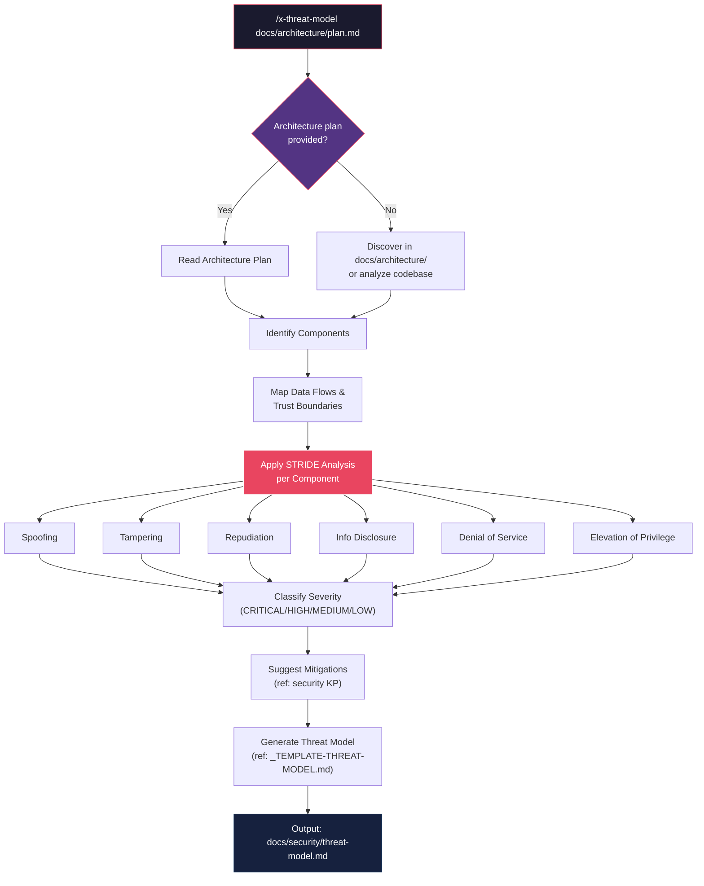
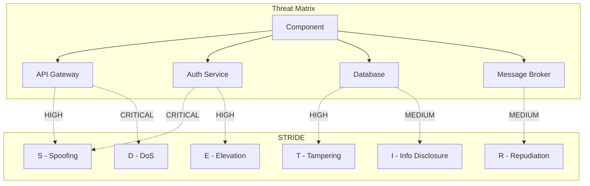

# História: Skill x-threat-model

**ID:** story-0013-0022
**Chave Jira:** SCRUM-25
**Status:** Pendente

## 1. Dependências

| Blocked By | Blocks |
| :--- | :--- |
| -- | story-0013-0026 |

## 2. Regras Transversais Aplicáveis

| ID | Título |
| :--- | :--- |
| RULE-001 | Template Consistency |
| RULE-008 | Skill Invocability |

## 3. Descrição

Como **security engineer**, eu quero uma skill que gere threat models automatizados usando analise STRIDE, para que a IA possa identificar ameacas, classificar por severidade e sugerir mitigacoes ao analisar planos de arquitetura ou codigo existente.

### Contexto

O template `_TEMPLATE-THREAT-MODEL.md` existe no ia-dev-env com estrutura STRIDE, mas nenhuma skill automatiza a geracao de threat models. Quando um plano de arquitetura e criado (via `x-dev-architecture-plan`), o engenheiro precisa manualmente analisar trust boundaries, data flows e componentes para aplicar STRIDE. Esta skill automatiza esse processo: le o plano de arquitetura (ou analisa o codebase diretamente), identifica componentes e fluxos de dados, aplica STRIDE por componente, classifica ameacas por severidade e gera o documento de threat model usando o template existente.

### 3.1 Skill x-threat-model

- Path: `skills-templates/x-threat-model/SKILL.md`
- Frontmatter:
  - `user-invocable: true`
  - `argument-hint: "[architecture-plan-path] [--format stride|pasta|linddun] [--output docs/security/]"`
  - `allowed-tools: [Read, Write, Glob, Grep, Agent]`

**Workflow:**
1. **Read architecture plan:** Ler plano de arquitetura do path fornecido, ou descobrir automaticamente em `docs/architecture/`
2. **Identify components:** Extrair componentes do sistema (servicos, databases, APIs externas, message brokers, caches)
3. **Map data flows:** Identificar fluxos de dados entre componentes, trust boundaries (interno vs externo), e protocolos de comunicacao
4. **Apply STRIDE analysis:** Para cada componente, analisar as 6 categorias STRIDE:
   - **S**poofing: autenticacao e identidade
   - **T**ampering: integridade dos dados
   - **R**epudiation: auditoria e logging
   - **I**nformation Disclosure: confidencialidade
   - **D**enial of Service: disponibilidade
   - **E**levation of Privilege: autorizacao
5. **Classify threats:** Classificar cada ameaca por severidade (CRITICAL/HIGH/MEDIUM/LOW) usando impacto x probabilidade
6. **Suggest mitigations:** Para cada ameaca, referenciar mitigacoes do security KP (criptografia, autenticacao, rate limiting, etc.)
7. **Generate document:** Criar threat model usando `_TEMPLATE-THREAT-MODEL.md`, incluindo threat matrix (componente x categoria STRIDE)

**Integration Notes:**
- Usa agent `security-engineer` para analise aprofundada
- Referencia security KP para mitigacoes
- Referencia `_TEMPLATE-THREAT-MODEL.md` para formato do output
- Funciona com ou sem plano de arquitetura (fallback: analise de codebase)

### 3.2 Formatos Suportados

- **STRIDE** (default): analise por categoria de ameaca
- **PASTA** (Process for Attack Simulation and Threat Analysis): risk-centric, 7 stages
- **LINDDUN**: privacy-focused threat modeling (Linkability, Identifiability, Non-repudiation, Detectability, Disclosure, Unawareness, Non-compliance)

## 3.5 Entrega de Valor

- **Valor Principal:** Geracao automatizada de threat models STRIDE a partir de planos de arquitetura ou codebase
- **Metrica de Sucesso:** Skill gerada com workflow de 7 passos, cobrindo todas as 6 categorias STRIDE
- **Impacto no Negocio:** Threat modeling integrado ao ciclo de desenvolvimento, nao apenas como atividade ad-hoc

## 4. Definições de Qualidade Locais

### DoR Local

- [ ] Template `_TEMPLATE-THREAT-MODEL.md` existente revisado para entender estrutura
- [ ] Security KP existente revisado para identificar mitigacoes disponiveis
- [ ] STRIDE methodology compreendida (6 categorias com exemplos)
- [ ] Skills invocaveis existentes revisadas para manter consistencia de frontmatter

### DoD Local

- [ ] `x-threat-model/SKILL.md` criado com workflow de 7 passos
- [ ] Frontmatter YAML valido com `user-invocable: true`, `argument-hint`, `allowed-tools`
- [ ] Todas as 6 categorias STRIDE documentadas com exemplos
- [ ] Classificacao de severidade (CRITICAL/HIGH/MEDIUM/LOW) documentada
- [ ] Instrucoes de fallback quando plano de arquitetura nao existe
- [ ] Unit tests para x-threat-model (frontmatter, workflow, STRIDE categories)

### Global DoD

- **Cobertura:** >= 95% Line, >= 90% Branch
- **Regressao:** Golden file tests passando
- **TDD Compliance:** Test-first pattern
- **Multi-Target:** Claude (.claude/skills/) + GitHub (.github/skills/) + Codex (.codex/skills/)

## 5. Contratos de Dados

**x-threat-model SKILL.md Frontmatter:**

| Campo | Formato | Obrigatorio | Valor |
| :--- | :--- | :--- | :--- |
| `name` | String | M | "x-threat-model" |
| `description` | String | M | "Generate threat models using STRIDE analysis: identify components, map data flows, analyze threats per category, classify severity, suggest mitigations, and produce threat model document" |
| `user-invocable` | Boolean | M | true |
| `argument-hint` | String | M | "[architecture-plan-path] [--format stride\|pasta\|linddun] [--output docs/security/]" |
| `allowed-tools` | List | M | [Read, Write, Glob, Grep, Agent] |

**STRIDE Categories:**

| Categoria | Foco | Exemplo de Ameaca |
| :--- | :--- | :--- |
| Spoofing | Identidade e autenticacao | Token falsificado, session hijacking |
| Tampering | Integridade de dados | SQL injection, request tampering |
| Repudiation | Auditoria e rastreabilidade | Logs insuficientes, acao nao rastreavel |
| Information Disclosure | Confidencialidade | Data leakage, verbose error messages |
| Denial of Service | Disponibilidade | Resource exhaustion, DDoS |
| Elevation of Privilege | Autorizacao | Broken access control, privilege escalation |

**Severity Classification:**

| Severidade | Impacto | Probabilidade | Acao |
| :--- | :--- | :--- | :--- |
| CRITICAL | Alto impacto + alta probabilidade | Exploit known/easy | Fix before release |
| HIGH | Alto impacto ou alta probabilidade | Exploit possible | Fix in current sprint |
| MEDIUM | Impacto moderado | Exploit requires effort | Fix in next sprint |
| LOW | Baixo impacto | Exploit unlikely | Track in backlog |

**Threat Matrix Structure:**

| Campo | Formato | Descrição |
| :--- | :--- | :--- |
| Componente (linhas) | String | Cada componente do sistema |
| STRIDE categories (colunas) | S/T/R/I/D/E | Ameaca identificada (severity color-coded) |
| Mitigacao | String | Referencia ao security KP |

## 6. Diagramas

### 6.1 Workflow x-threat-model



### 6.2 Threat Matrix Example



## 7. Critérios de Aceite (Gherkin)

```gherkin
Cenario: Threat model gerado a partir de plano de arquitetura
  DADO que existe um plano de arquitetura em "docs/architecture/plan.md"
  E o plano define componentes API Gateway, Auth Service e Database
  QUANDO o skill x-threat-model e invocado com path "docs/architecture/plan.md"
  ENTAO o threat model deve ser gerado em "docs/security/threat-model.md"
  E deve conter analise STRIDE para cada componente listado

Cenario: Analise STRIDE cobre todas as 6 categorias
  DADO que o skill x-threat-model e invocado para um plano de arquitetura
  QUANDO a analise STRIDE e executada
  ENTAO o documento deve conter secoes para Spoofing, Tampering, Repudiation
  E deve conter secoes para Information Disclosure, Denial of Service, Elevation of Privilege
  E cada categoria deve ter pelo menos uma ameaca identificada por componente

Cenario: Mitigacoes referenciam security KP
  DADO que o skill x-threat-model identificou ameacas
  QUANDO as mitigacoes sao sugeridas
  ENTAO cada mitigacao deve referenciar uma secao especifica do security KP
  E deve incluir acoes concretas (ex: "implement rate limiting per security KP section X")

Cenario: Output segue formato do _TEMPLATE-THREAT-MODEL.md
  DADO que o skill x-threat-model e invocado
  QUANDO o documento de threat model e gerado
  ENTAO a estrutura deve seguir o template `_TEMPLATE-THREAT-MODEL.md`
  E deve conter threat matrix (componente x categoria STRIDE)
  E deve conter classificacao de severidade para cada ameaca

Cenario: Skill funciona sem plano de arquitetura usando analise de codebase
  DADO que NAO existe plano de arquitetura em docs/architecture/
  QUANDO o skill x-threat-model e invocado sem path
  ENTAO a skill deve analisar o codebase diretamente
  E deve identificar componentes a partir de package structure e configuracao
  E deve gerar threat model baseado nos componentes descobertos

Cenario: Classificacao de severidade com 4 niveis
  DADO que o skill x-threat-model identificou ameacas
  QUANDO a classificacao de severidade e aplicada
  ENTAO cada ameaca deve ser classificada como CRITICAL, HIGH, MEDIUM ou LOW
  E ameacas CRITICAL devem recomendar "fix before release"
  E a classificacao deve considerar impacto x probabilidade

Cenario: Skill gerado para todos os 3 targets
  DADO que o pipeline e executado para perfil java-spring
  QUANDO o x-threat-model skill e gerado
  ENTAO o SKILL.md existe em `.claude/skills/x-threat-model/`
  E o SKILL.md existe em `.github/skills/x-threat-model/`
```

### 7.1 Scenario Ordering (TPP)

> TPP: degenerate (threat model de plano de arquitetura) -> constant (6 categorias STRIDE) ->
> constant+ (mitigacoes referenciam security KP) -> scalar (output segue template) ->
> conditions (funciona sem plano, analise de codebase) -> composite (classificacao de severidade) ->
> boundary (multi-target output).

### 7.2 Mandatory Scenario Categories

- [x] Degenerate cases (threat model gerado de plano de arquitetura)
- [x] Happy path (STRIDE completo, mitigacoes, template format)
- [x] Error paths (funciona sem plano de arquitetura, fallback para codebase analysis)
- [x] Boundary values (classificacao de severidade 4 niveis, multi-target)

## 8. Sub-tarefas

- [ ] [Test] Unit test: x-threat-model SKILL.md gerado com frontmatter valido (user-invocable, argument-hint, allowed-tools)
- [ ] [Dev] Criar `skills-templates/x-threat-model/SKILL.md` com workflow de 7 passos
- [ ] [Test] Unit test: SKILL.md contem todas as 6 categorias STRIDE documentadas
- [ ] [Dev] Adicionar secoes de STRIDE analysis, severity classification e threat matrix
- [ ] [Test] Unit test: SKILL.md contem instrucoes de fallback (codebase analysis quando sem plano)
- [ ] [Dev] Adicionar instrucoes de fallback e formatos alternativos (PASTA, LINDDUN)
- [ ] [Test] Unit test: SKILL.md referencia security KP e _TEMPLATE-THREAT-MODEL.md
- [ ] [Test] Integration test: x-threat-model gerado para perfis java-spring e go-gin
- [ ] [Test] Atualizar golden file manifests
- [ ] [Doc] Registrar skill x-threat-model na tabela de skills do CLAUDE.md
