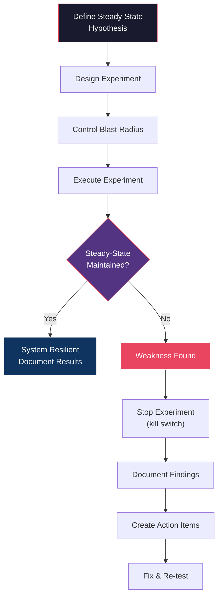
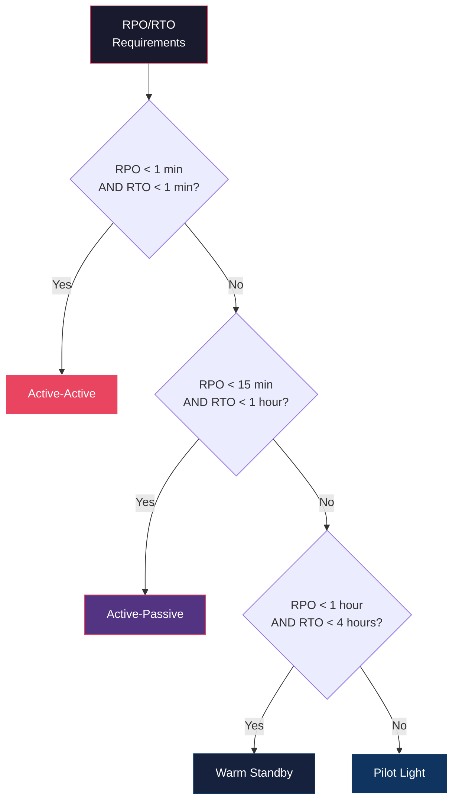
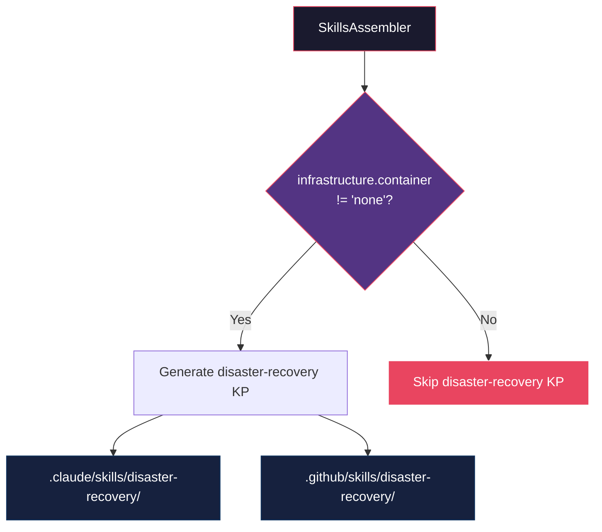

# História: Extensão Resilience KP (Chaos Engineering) e Disaster Recovery KP

**ID:** story-0013-0023
**Chave Jira:** SCRUM-26
**Status:** Pendente

## 1. Dependências

| Blocked By | Blocks |
| :--- | :--- |
| story-0013-0008 | story-0013-0026 |

## 2. Regras Transversais Aplicáveis

| ID | Título |
| :--- | :--- |
| RULE-001 | Template Consistency |
| RULE-007 | Knowledge Pack Structure |
| RULE-010 | Backward Compatibility |

## 3. Descrição

Como **SRE engineer**, eu quero que o resilience KP seja estendido com uma secao de chaos engineering e que um novo KP de disaster recovery seja criado, para que a IA tenha conhecimento completo de praticas de resiliencia proativa (chaos engineering) e recuperacao de desastres.

### Contexto

O resilience KP existente cobre circuit breakers, retries, timeouts, bulkheads e rate limiting — padroes de resiliencia reativa. Porem, nao aborda resiliencia proativa via chaos engineering (injecao deliberada de falhas para validar a robustez do sistema). Alem disso, nao existe um KP dedicado a disaster recovery (DR), que cubra estrategias de failover, RPO/RTO, testes de DR e procedimentos de recuperacao por componente. O SRE Practices KP (story-0013-0008) cobre practices genericas de SRE mas nao entra em profundidade em chaos engineering ou DR. Esta story preenche ambas as lacunas.

### 3.1 Resilience KP Extension

Adicionar secao ao `skills-templates/resilience/SKILL.md` existente (RULE-010: apenas adicoes):

**"Chaos Engineering" section:**
- Principles: steady-state hypothesis, vary real-world events, run in production, automate experiments, minimize blast radius
- Experiment types:
  - Network failure: packet loss, latency injection, DNS failure, partition simulation
  - Latency injection: response delay, slow connections, timeout simulation
  - Resource exhaustion: CPU stress, memory pressure, disk full, thread pool exhaustion
  - Dependency failure: downstream service unavailability, degraded responses, malformed responses
- Tools: Chaos Monkey (Netflix), Litmus (Kubernetes-native), Gremlin (SaaS), Toxiproxy (network-level), Chaos Mesh (K8s)
- Game day planning: objectives, scope, participants, communication plan, rollback procedures
- Blast radius control: start small (single instance), expand gradually, automated kill switch, monitoring thresholds
- Experiment runbook template: hypothesis, steady-state metrics, experiment steps, expected vs actual results, findings, action items

**New reference:**
- `references/chaos-engineering-experiments.md` — catalogo de experimentos por tipo com setup instructions

### 3.2 Disaster Recovery KP

- Path: `skills-templates/disaster-recovery/SKILL.md`
- Frontmatter: `user-invocable: false` (knowledge pack interno)
- **CONDITIONAL:** gerado apenas quando `infrastructure.container != "none"` (implica deployment em producao)

**Content:**
- **DR Strategies:** active-active (multi-region active, lowest RPO/RTO, highest cost), active-passive (standby region, moderate RPO/RTO), pilot light (minimal resources in standby, activated on failure), warm standby (scaled-down replica, fast activation)
- **RPO/RTO Definitions:** Recovery Point Objective (data loss tolerance), Recovery Time Objective (downtime tolerance), calculation methods, SLA alignment
- **Failover Automation:** DNS failover (Route53, CloudFlare), load balancer failover (health check-based), database failover (read replica promotion, multi-master), automated runbook execution
- **DR Testing Cadence:** tabletop exercises (quarterly, low cost, validate communication), simulation tests (bi-annually, partial failover), full failover tests (annually, complete switchover, highest confidence)
- **Multi-Region Patterns:** data replication (sync vs async, conflict resolution), eventual consistency (convergence guarantees, read-your-writes), conflict resolution (last-writer-wins, merge, CRDT)
- **Communication Plan:** internal (engineering, management, support), external (customers, partners, regulatory), templates per severity level
- **Recovery Procedures per Component:** application (container restart, scaling, redeployment), database (failover, restore from backup, point-in-time recovery), cache (warmup, rebuild, fallback to database), message broker (replay, dead letter processing, partition recovery)

**References:**
- `references/dr-strategy-decision-tree.md` — arvore de decisao para selecao de estrategia de DR
- `references/rpo-rto-calculator.md` — guia de calculo de RPO/RTO baseado em SLAs

## 3.5 Entrega de Valor

- **Valor Principal:** Chaos engineering integrado ao resilience KP e disaster recovery como KP dedicado
- **Metrica de Sucesso:** Resilience KP estendido com secao chaos; DR KP gerado condicionalmente para projetos containerizados
- **Impacto no Negocio:** Praticas de resiliencia proativa e recuperacao de desastres disponveis no contexto da IA

## 4. Definições de Qualidade Locais

### DoR Local

- [ ] Resilience KP existente revisado para entender estrutura e secoes atuais
- [ ] SRE Practices KP (story-0013-0008) implementado
- [ ] Chaos engineering principles pesquisados (Netflix, Principles of Chaos Engineering)
- [ ] DR strategies e RPO/RTO concepts pesquisados

### DoD Local

- [ ] Resilience KP estendido com secao "Chaos Engineering"
- [ ] `references/chaos-engineering-experiments.md` criado
- [ ] DR KP criado em `skills-templates/disaster-recovery/SKILL.md`
- [ ] `references/dr-strategy-decision-tree.md` criado
- [ ] `references/rpo-rto-calculator.md` criado
- [ ] DR KP gerado condicionalmente (apenas quando `infrastructure.container != "none"`)
- [ ] Conteudo existente do resilience KP preservado (RULE-010)
- [ ] Unit tests para ambos os artefatos

### Global DoD

- **Cobertura:** >= 95% Line, >= 90% Branch
- **Regressao:** Golden file tests passando
- **TDD Compliance:** Test-first pattern
- **Multi-Target:** Claude (.claude/skills/) + GitHub (.github/skills/)

## 5. Contratos de Dados

**Resilience KP Extension (new section):**

| Seção | Tipo | Descrição |
| :--- | :--- | :--- |
| `## Chaos Engineering` | New section | Principles, experiment types, tools, game day planning |
| `### Principles` | New subsection | Steady-state hypothesis, blast radius control |
| `### Experiment Types` | New subsection | Network, latency, resource, dependency failure |
| `### Tools` | New subsection | Chaos Monkey, Litmus, Gremlin, Toxiproxy |
| `### Game Day Planning` | New subsection | Objectives, scope, communication, rollback |
| `### Experiment Runbook Template` | New subsection | Template com hypothesis, steps, results |

**Disaster Recovery KP Frontmatter:**

| Campo | Formato | Obrigatorio | Valor |
| :--- | :--- | :--- | :--- |
| `name` | String | M | "disaster-recovery" |
| `description` | String | M | "Disaster recovery patterns: DR strategies, RPO/RTO, failover automation, DR testing, multi-region patterns, and recovery procedures" |
| `user-invocable` | Boolean | M | false |

**Conditional Generation:**

| Variavel | Tipo | Condicao | Efeito |
| :--- | :--- | :--- | :--- |
| `{{CONTAINER}}` | String | `infrastructure.container != "none"` | DR KP gerado |
| `{{CONTAINER}}` | String | `infrastructure.container == "none"` | DR KP NAO gerado |

**DR Strategy Comparison:**

| Estrategia | RPO | RTO | Custo | Complexidade |
| :--- | :--- | :--- | :--- | :--- |
| Active-Active | ~0 | ~0 | Muito Alto | Muito Alta |
| Active-Passive | Minutos | Minutos-Horas | Alto | Alta |
| Warm Standby | Minutos | Minutos | Medio | Media |
| Pilot Light | Horas | Horas | Baixo | Media |

## 6. Diagramas

### 6.1 Chaos Engineering Experiment Flow



### 6.2 DR Strategy Decision Tree



### 6.3 Geracao Condicional do DR KP



## 7. Critérios de Aceite (Gherkin)

```gherkin
Cenario: Resilience KP estendido com secao Chaos Engineering
  DADO que o pipeline e executado para qualquer perfil
  QUANDO o resilience KP e gerado
  ENTAO o SKILL.md contem secao "Chaos Engineering"
  E contem subsecoes Principles, Experiment Types, Tools, Game Day Planning
  E contem referencia a steady-state hypothesis e blast radius control

Cenario: Chaos engineering reference file com catalogo de experimentos
  DADO que o pipeline e executado para qualquer perfil
  QUANDO o resilience KP e gerado
  ENTAO o arquivo `references/chaos-engineering-experiments.md` existe
  E contem experimentos categorizados por tipo (network, latency, resource, dependency)

Cenario: DR KP gerado para projetos containerizados
  DADO que o config YAML define infrastructure.container="docker"
  QUANDO o pipeline de geracao e executado
  ENTAO o KP `disaster-recovery` existe em `.claude/skills/disaster-recovery/`
  E contem secoes DR Strategies, RPO/RTO, Failover Automation, DR Testing
  E contem secoes Multi-Region Patterns e Recovery Procedures

Cenario: DR KP NAO gerado para projetos CLI sem container
  DADO que o config YAML define infrastructure.container="none"
  QUANDO o pipeline de geracao e executado
  ENTAO o diretorio `.claude/skills/disaster-recovery/` NAO existe
  E o diretorio `.github/skills/disaster-recovery/` NAO existe

Cenario: DR KP reference files gerados com decision tree e calculator
  DADO que o config YAML define infrastructure.container="docker"
  QUANDO o disaster-recovery KP e gerado
  ENTAO o arquivo `references/dr-strategy-decision-tree.md` existe
  E o arquivo `references/rpo-rto-calculator.md` existe
  E o decision tree cobre 4 estrategias (active-active, active-passive, warm standby, pilot light)

Cenario: Conteudo existente do resilience KP preservado apos extensao
  DADO que o resilience KP existente tem secoes circuit breaker, retry, timeout, bulkhead
  QUANDO a extensao com chaos engineering e aplicada
  ENTAO todas as secoes originais devem estar presentes e inalteradas
  E a nova secao Chaos Engineering deve estar presente
  E o reference file de chaos engineering deve existir

Cenario: DR KP gerado para ambos targets quando container configurado
  DADO que o config YAML define infrastructure.container="docker"
  QUANDO o disaster-recovery KP e gerado
  ENTAO o SKILL.md existe em `.claude/skills/disaster-recovery/`
  E o SKILL.md existe em `.github/skills/disaster-recovery/`
```

### 7.1 Scenario Ordering (TPP)

> TPP: degenerate (resilience KP com chaos section) -> constant (chaos reference file) ->
> constant+ (DR KP gerado para containerized) -> conditions (DR KP NAO gerado para CLI) ->
> composite (DR reference files) -> composite+ (conteudo existente preservado) ->
> boundary (multi-target output).

### 7.2 Mandatory Scenario Categories

- [x] Degenerate cases (resilience KP estendido com chaos engineering)
- [x] Happy path (DR KP gerado para projetos containerizados, reference files)
- [x] Error paths (DR KP nao gerado para CLI, conteudo existente preservado)
- [x] Boundary values (geracao condicional, multi-target output)

## 8. Sub-tarefas

- [ ] [Test] Unit test: resilience KP estendido contem secao "Chaos Engineering" com subsecoes
- [ ] [Dev] Adicionar secao "Chaos Engineering" ao `skills-templates/resilience/SKILL.md` (RULE-010)
- [ ] [Dev] Criar `references/chaos-engineering-experiments.md` no diretorio do resilience KP
- [ ] [Test] Unit test: conteudo original do resilience KP preservado apos extensao
- [ ] [Test] Unit test: DR KP gerado com frontmatter valido e secoes obrigatorias
- [ ] [Dev] Criar `skills-templates/disaster-recovery/SKILL.md` com secoes de DR
- [ ] [Dev] Criar `references/dr-strategy-decision-tree.md`
- [ ] [Dev] Criar `references/rpo-rto-calculator.md`
- [ ] [Test] Unit test: DR KP gerado condicionalmente (container != none)
- [ ] [Dev] Adicionar logica condicional no assembler para geracao do DR KP
- [ ] [Test] Integration test: DR KP gerado para java-spring (docker), NAO gerado para python-click-cli (none)
- [ ] [Test] Integration test: resilience KP com nova secao para todos os perfis
- [ ] [Test] Atualizar golden file manifests
- [ ] [Doc] Registrar DR KP na tabela de knowledge packs do CLAUDE.md
