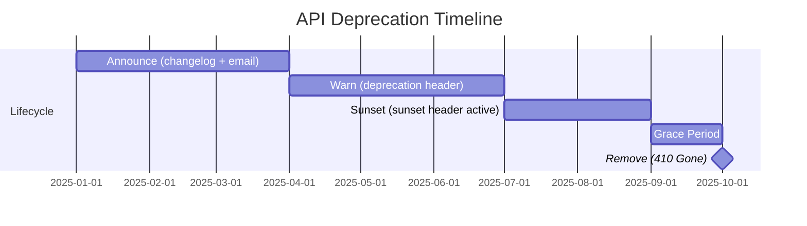
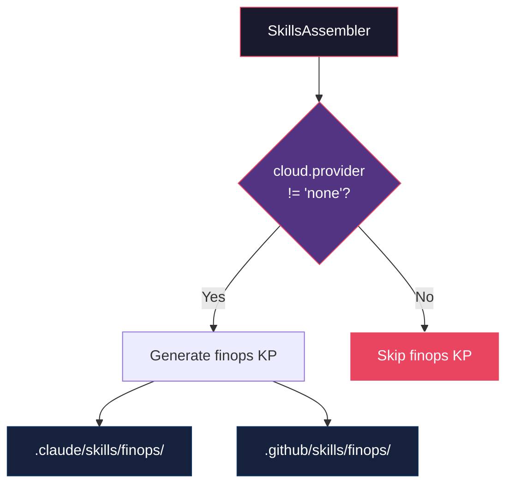
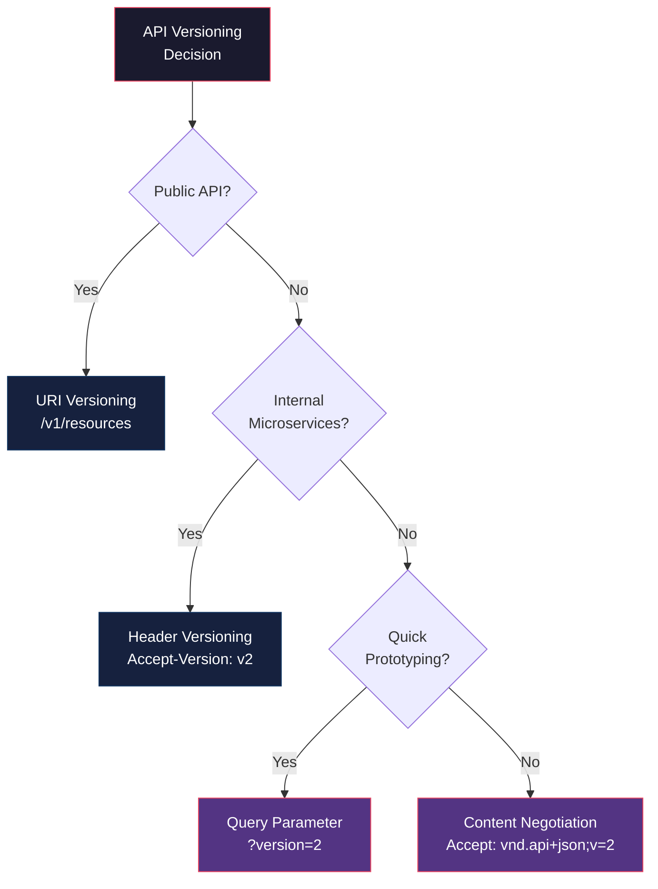

# Historia: Extensao API Design KP (Deprecation) e FinOps KP

**ID:** story-0013-0024
**Chave Jira:** --
**Status:** Pendente

## 1. Dependencias

| Blocked By | Blocks |
| :--- | :--- |
| -- | story-0013-0026 |

## 2. Regras Transversais Aplicaveis

| ID | Titulo |
| :--- | :--- |
| RULE-001 | Template Consistency |
| RULE-007 | Knowledge Pack Structure |
| RULE-010 | Backward Compatibility |

## 3. Descricao

Como **architect**, eu quero que o API Design KP seja estendido com secoes de deprecation strategy e versioning patterns, e que um novo KP de FinOps seja criado, para que a IA tenha conhecimento de ciclo de vida de APIs e gestao de custos cloud.

### Contexto

O API Design KP existente cobre patterns de design (REST, gRPC, GraphQL), error handling, pagination e HATEOAS, mas nao aborda o ciclo de vida de deprecacao de APIs (Sunset header, timeline, migration guides) nem patterns de versionamento (URI, header, query parameter). Alem disso, nao existe nenhum KP que cubra FinOps — praticas de gestao financeira de recursos cloud (rightsizing, cost allocation, spot instances, reserved capacity). O FinOps KP e relevante apenas para projetos com cloud provider configurado, sendo condicional.

### 3.1 API Design KP Extension

Adicionar secoes ao `skills-templates/api-design/SKILL.md` existente (RULE-010: apenas adicoes):

**"API Deprecation Strategy" section:**
- Sunset header (RFC 8594): `Sunset: Sat, 31 Dec 2025 23:59:59 GMT` — indica data de descontinuacao
- Deprecation timeline: announce (6 months before) -> warn (3 months, log usage) -> sunset (deprecation header active) -> remove (endpoint returns 410 Gone)
- Migration guides: document alternative endpoints, provide code examples, offer automated migration tools
- Consumer notification: email subscribers, API changelog entry, dashboard banner, deprecation response header
- API changelog format: date, endpoint, change type (deprecated/removed/added/modified), migration guide link

**"API Versioning Patterns" section:**
- URI versioning (`/v1/resources`): pros (explicit, discoverable), cons (URL pollution, harder routing), when (public APIs with long-lived versions)
- Header versioning (`Accept-Version: v2`): pros (clean URLs), cons (hidden, harder to test), when (internal APIs, microservices)
- Query parameter versioning (`?version=2`): pros (explicit, easy to test), cons (mixes concerns), when (quick iteration, prototyping)
- Content negotiation (`Accept: application/vnd.api+json;version=2`): pros (RESTful, fine-grained), cons (complex, tooling support), when (API-first companies, public APIs)
- Recommendation: URI versioning for public APIs, header versioning for internal services

**New reference:**
- `references/api-deprecation-checklist.md` — checklist passo-a-passo para deprecar um endpoint

### 3.2 FinOps KP

- Path: `skills-templates/finops/SKILL.md`
- Frontmatter: `user-invocable: false` (knowledge pack interno)
- **CONDITIONAL:** gerado apenas quando `cloud.provider != "none"`

**Content:**
- **Resource Rightsizing:** CPU/memory analysis (actual usage vs provisioned), recommendation engines (AWS Compute Optimizer, Azure Advisor, GCP Recommender), rightsizing cadence (monthly review), container resource limits alignment
- **Cost Allocation:** tagging strategy (mandatory tags: team, environment, service, cost-center), cost centers and ownership, showback (visibility) vs chargeback (billing), untagged resource detection and enforcement
- **Spot/Preemptible Instances:** interruption handling (graceful shutdown, checkpointing), workload suitability (stateless, fault-tolerant, batch), spot fleet strategies, fallback to on-demand
- **Reserved Capacity:** RI vs Savings Plans comparison, break-even analysis (typically 7-9 months), commitment period (1yr vs 3yr), coverage recommendations (70-80% baseline)
- **Cost Alerting:** budget alerts (per team, per environment, per service), anomaly detection (unexpected cost spikes), billing threshold notifications, daily/weekly cost reports
- **FinOps Practices:** cost review cadence (weekly team review, monthly org review), optimization sprints (dedicated time for cost reduction), unit economics (cost per transaction, cost per user, cost per request)
- **Cloud-Specific Cost Tools:** AWS (Cost Explorer, Trusted Advisor, Savings Plans), Azure (Cost Management, Advisor, Reservations), GCP (Billing, Recommender, Committed Use Discounts)

**References:**
- `references/cost-optimization-checklist.md` — checklist de otimizacao de custos por layer (compute, storage, network, database)
- `references/tagging-strategy-template.md` — template de estrategia de tagging com tags obrigatorias e opcionais

## 3.5 Entrega de Valor

- **Valor Principal:** API lifecycle completo (incluindo deprecacao) e gestao de custos cloud no contexto da IA
- **Metrica de Sucesso:** API KP estendido com 2 novas secoes e 1 reference; FinOps KP gerado condicionalmente com 2 references
- **Impacto no Negocio:** APIs deprecadas seguem processo formal; custos cloud gerenciados proativamente

## 4. Definicoes de Qualidade Locais

### DoR Local

- [ ] API Design KP existente revisado para entender estrutura e secoes atuais
- [ ] RFC 8594 (Sunset header) compreendido
- [ ] FinOps practices pesquisados (FinOps Foundation framework)
- [ ] Cloud cost tools por provider pesquisados

### DoD Local

- [ ] API Design KP estendido com secao "API Deprecation Strategy"
- [ ] API Design KP estendido com secao "API Versioning Patterns"
- [ ] `references/api-deprecation-checklist.md` criado
- [ ] FinOps KP criado em `skills-templates/finops/SKILL.md`
- [ ] `references/cost-optimization-checklist.md` criado
- [ ] `references/tagging-strategy-template.md` criado
- [ ] FinOps KP gerado condicionalmente (apenas quando `cloud.provider != "none"`)
- [ ] Conteudo existente do API Design KP preservado (RULE-010)

### Global DoD

- **Cobertura:** >= 95% Line, >= 90% Branch
- **Regressao:** Golden file tests passando
- **TDD Compliance:** Test-first pattern
- **Multi-Target:** Claude (.claude/skills/) + GitHub (.github/skills/)

## 5. Contratos de Dados

**API Design KP Extension (new sections):**

| Secao | Tipo | Descricao |
| :--- | :--- | :--- |
| `## API Deprecation Strategy` | New section | Sunset header, timeline, migration, notification |
| `### Sunset Header (RFC 8594)` | New subsection | Header format e semantica |
| `### Deprecation Timeline` | New subsection | 4 fases: announce -> warn -> sunset -> remove |
| `### Migration Guides` | New subsection | Documentacao de alternativas |
| `### Consumer Notification` | New subsection | Canais de notificacao |
| `### API Changelog Format` | New subsection | Formato padrao de changelog |
| `## API Versioning Patterns` | New section | URI, header, query param, content negotiation |
| `### URI Versioning` | New subsection | /v1/ pattern com pros/cons |
| `### Header Versioning` | New subsection | Accept-Version com pros/cons |
| `### Query Parameter Versioning` | New subsection | ?version= com pros/cons |
| `### Content Negotiation Versioning` | New subsection | Accept header com pros/cons |

**FinOps KP Frontmatter:**

| Campo | Formato | Obrigatorio | Valor |
| :--- | :--- | :--- | :--- |
| `name` | String | M | "finops" |
| `description` | String | M | "FinOps practices: resource rightsizing, cost allocation, spot instances, reserved capacity, cost alerting, and cloud-specific cost optimization tools" |
| `user-invocable` | Boolean | M | false |

**Conditional Generation:**

| Variavel | Tipo | Condicao | Efeito |
| :--- | :--- | :--- | :--- |
| `{{CLOUD_PROVIDER}}` | String | `cloud.provider != "none"` | FinOps KP gerado |
| `{{CLOUD_PROVIDER}}` | String | `cloud.provider == "none"` | FinOps KP NAO gerado |

**Deprecation Timeline:**

| Fase | Tempo | Acao | HTTP Response |
| :--- | :--- | :--- | :--- |
| Announce | T-6 months | Changelog + email + dashboard | Normal (200) |
| Warn | T-3 months | Deprecation header + usage logging | Normal + `Deprecation: true` |
| Sunset | T-0 | Sunset header active | Normal + `Sunset: <date>` |
| Remove | T+grace | Endpoint removed | 410 Gone |

## 6. Diagramas

### 6.1 API Deprecation Timeline



### 6.2 FinOps KP Conditional Generation



### 6.3 Versioning Patterns Decision



## 7. Criterios de Aceite (Gherkin)

```gherkin
Cenario: API Design KP estendido com secao API Deprecation Strategy
  DADO que o pipeline e executado para qualquer perfil
  QUANDO o api-design KP e gerado
  ENTAO o SKILL.md contem secao "API Deprecation Strategy"
  E contem referencia ao Sunset header (RFC 8594)
  E contem as 4 fases da timeline (announce, warn, sunset, remove)

Cenario: API Design KP estendido com secao API Versioning Patterns
  DADO que o pipeline e executado para qualquer perfil
  QUANDO o api-design KP e gerado
  ENTAO o SKILL.md contem secao "API Versioning Patterns"
  E contem 4 patterns (URI, header, query parameter, content negotiation)
  E cada pattern tem pros, cons e when-to-use

Cenario: Sunset header documentado com formato RFC 8594
  DADO que o pipeline e executado para qualquer perfil
  QUANDO o api-design KP e gerado
  ENTAO a secao Deprecation Strategy contem formato do Sunset header
  E contem exemplo com data no formato RFC 7231 (HTTP-date)
  E contem referencia a RFC 8594

Cenario: FinOps KP gerado para projetos com cloud provider
  DADO que o config YAML define cloud.provider="aws"
  QUANDO o pipeline de geracao e executado
  ENTAO o KP `finops` existe em `.claude/skills/finops/`
  E contem secoes Resource Rightsizing, Cost Allocation, Spot Instances
  E contem secoes Reserved Capacity, Cost Alerting, FinOps Practices

Cenario: FinOps KP NAO gerado quando cloud provider e none
  DADO que o config YAML define cloud.provider="none"
  QUANDO o pipeline de geracao e executado
  ENTAO o diretorio `.claude/skills/finops/` NAO existe
  E o diretorio `.github/skills/finops/` NAO existe

Cenario: Reference files gerados para ambos os KPs
  DADO que o pipeline e executado para perfil java-spring com cloud.provider="aws"
  QUANDO os KPs sao gerados
  ENTAO o arquivo `references/api-deprecation-checklist.md` existe no api-design KP
  E o arquivo `references/cost-optimization-checklist.md` existe no finops KP
  E o arquivo `references/tagging-strategy-template.md` existe no finops KP

Cenario: Conteudo existente do API Design KP preservado apos extensao
  DADO que o api-design KP existente tem secoes REST patterns, error handling, pagination
  QUANDO a extensao com deprecation e versioning e aplicada
  ENTAO todas as secoes originais devem estar presentes e inalteradas
  E as novas secoes API Deprecation Strategy e API Versioning Patterns devem estar presentes
```

### 7.1 Scenario Ordering (TPP)

> TPP: degenerate (API KP com deprecation section) -> constant (versioning patterns) ->
> constant+ (sunset header RFC 8594) -> scalar (FinOps KP gerado para cloud) ->
> conditions (FinOps NAO gerado sem cloud) -> composite (reference files) ->
> boundary (conteudo existente preservado).

### 7.2 Mandatory Scenario Categories

- [x] Degenerate cases (API KP estendido com deprecation e versioning)
- [x] Happy path (FinOps KP gerado para cloud, reference files)
- [x] Error paths (FinOps NAO gerado sem cloud, conteudo existente preservado)
- [x] Boundary values (geracao condicional, reference files)

## 8. Sub-tarefas

- [ ] [Test] Unit test: API Design KP estendido contem secao "API Deprecation Strategy" com Sunset header
- [ ] [Dev] Adicionar secao "API Deprecation Strategy" ao `skills-templates/api-design/SKILL.md` (RULE-010)
- [ ] [Test] Unit test: API Design KP estendido contem secao "API Versioning Patterns" com 4 patterns
- [ ] [Dev] Adicionar secao "API Versioning Patterns" ao api-design KP
- [ ] [Dev] Criar `references/api-deprecation-checklist.md` no diretorio do api-design KP
- [ ] [Test] Unit test: conteudo original do API Design KP preservado apos extensao
- [ ] [Test] Unit test: FinOps KP gerado com frontmatter valido e secoes obrigatorias
- [ ] [Dev] Criar `skills-templates/finops/SKILL.md` com secoes de FinOps
- [ ] [Dev] Criar `references/cost-optimization-checklist.md`
- [ ] [Dev] Criar `references/tagging-strategy-template.md`
- [ ] [Test] Unit test: FinOps KP gerado condicionalmente (cloud.provider != none)
- [ ] [Dev] Adicionar logica condicional no assembler para geracao do FinOps KP
- [ ] [Test] Integration test: FinOps KP gerado para perfil com cloud, NAO gerado para perfil sem cloud
- [ ] [Test] Integration test: API Design KP com novas secoes para todos os perfis
- [ ] [Test] Atualizar golden file manifests
- [ ] [Doc] Registrar FinOps KP na tabela de knowledge packs do CLAUDE.md
