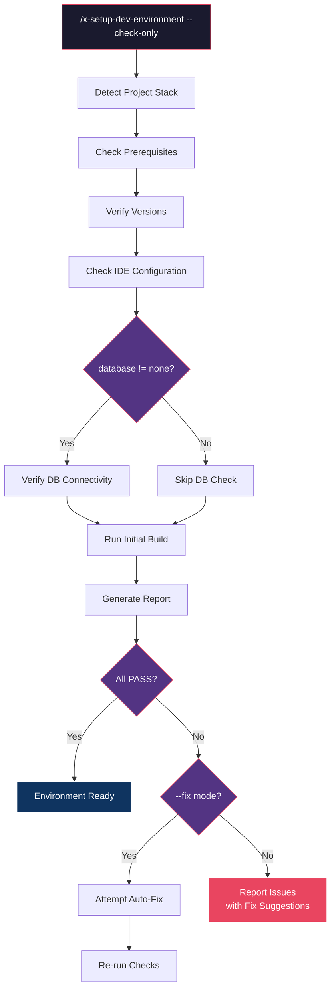
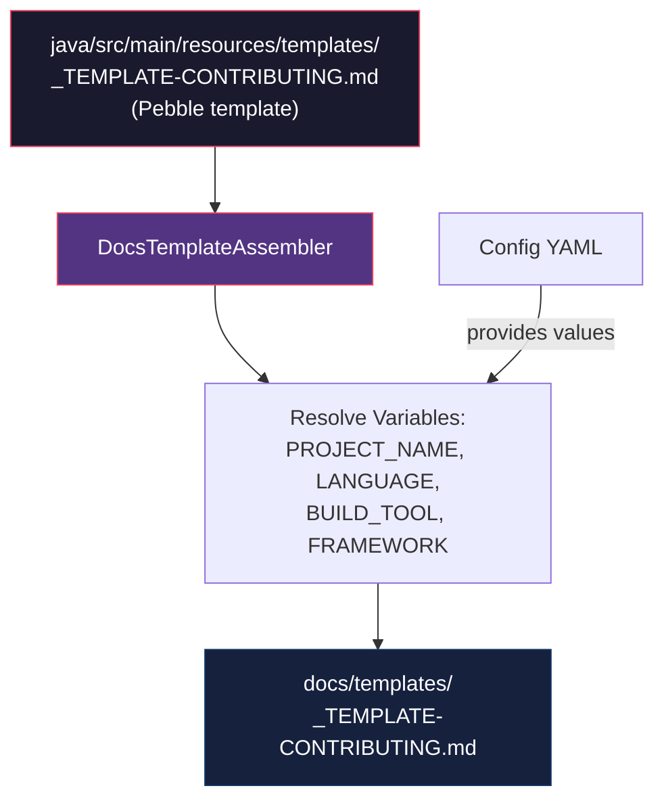

# Historia: Skill x-setup-dev-environment e Contributing Guide Template

**ID:** story-0013-0025
**Chave Jira:** --
**Status:** Pendente

## 1. Dependencias

| Blocked By | Blocks |
| :--- | :--- |
| -- | story-0013-0026 |

## 2. Regras Transversais Aplicaveis

| ID | Titulo |
| :--- | :--- |
| RULE-001 | Template Consistency |
| RULE-002 | Assembler Integration |
| RULE-008 | Skill Invocability |

## 3. Descricao

Como **developer (new to project)**, eu quero uma skill que valide e configure automaticamente meu ambiente de desenvolvimento local e um template de contributing guide, para que eu possa comecar a contribuir rapidamente sem depender de documentacao fragmentada ou configuracao manual.

### Contexto

Novos desenvolvedores que chegam a projetos gerados pelo ia-dev-env enfrentam dois problemas: (1) nao existe uma forma automatizada de verificar se o ambiente local tem todas as dependencias necessarias (runtime, build tool, Docker, database client) nas versoes corretas, e (2) nao existe um guia padronizado de contribuicao que explique o workflow de desenvolvimento (branching, commits, TDD, PR process). Esta story resolve ambos: uma skill interativa que diagnostica e opcionalmente corrige problemas de setup, e um template de contributing guide com variaveis Pebble que se adapta ao projeto.

### 3.1 Skill x-setup-dev-environment

- Path: `skills-templates/x-setup-dev-environment/SKILL.md`
- Frontmatter:
  - `user-invocable: true`
  - `argument-hint: "[--check-only] [--fix]"`
  - `allowed-tools: [Read, Bash, Glob, Grep, Write]`

**Workflow:**
1. **Detect project stack:** Analisar config files (`pom.xml`, `package.json`, `go.mod`, `Cargo.toml`, `pyproject.toml`, `build.gradle.kts`) para identificar linguagem, framework e build tool
2. **Check prerequisites:** Verificar presenca de: language runtime (java, node, go, rust, python), build tool (maven, npm, cargo, pip), Docker (se container != none), database client (se database != none)
3. **Verify versions:** Comparar versoes instaladas com versoes requeridas pelo projeto (ex: Java 21, Node 20, Go 1.22)
4. **Check IDE configuration:** Verificar `.editorconfig` (indentation, charset, EOL), `.vscode/settings.json` ou `.idea/` (formatters, linters)
5. **Verify database connectivity:** Se database configurado, testar conexao com credenciais de desenvolvimento (ex: `psql -h localhost -p 5432`)
6. **Run initial build:** Executar build completo para validar que todas as dependencias sao resolvidas e compilacao funciona
7. **Report status:** Gerar report com status de cada check (PASS/FAIL/WARN) e sugestoes de fix para itens que falharam

**Modes:**
- `--check-only`: apenas reporta status, nao modifica nada (default)
- `--fix`: tenta corrigir problemas encontrados (ex: instalar dependencias via package manager, criar `.editorconfig` faltante)

### 3.2 Template _TEMPLATE-CONTRIBUTING.md

- Path: `templates/_TEMPLATE-CONTRIBUTING.md`
- Localizado em `java/src/main/resources/templates/`
- Template Pebble com variaveis dinamicas

**Pebble Variables:**
- `{{PROJECT_NAME}}` — nome do projeto
- `{{LANGUAGE}}` — linguagem principal
- `{{BUILD_TOOL}}` — ferramenta de build
- `{{FRAMEWORK}}` — framework principal

**Sections:**
- **Prerequisites:** Lista de softwares necessarios com versoes minimas (dinamico por stack)
- **Getting Started:** Clone, install dependencies, configure environment (build commands dinamicos por `{{BUILD_TOOL}}`)
- **Development Workflow:** Branching strategy (feature branches), commit convention (Conventional Commits), TDD cycle (Red-Green-Refactor)
- **Code Standards:** Referencia ao coding-standards KP e rules do projeto, link para `.claude/rules/03-coding-standards.md`
- **Testing:** Como rodar testes (comando dinamico por build tool), coverage requirements (>= 95% line, >= 90% branch), test naming convention
- **Pull Request Process:** Branch naming (`feat/`, `fix/`, `chore/`), PR template (referencia ao PR template gerado em story-0013-0001), review process, merge requirements
- **Architecture Overview:** Referencia a docs de arquitetura do projeto, link para `.claude/rules/04-architecture-summary.md`
- **Code of Conduct:** Referencia generica a Contributor Covenant

### 3.3 Assembler

O `DocsTemplateAssembler` deve ser estendido para processar o template Pebble `_TEMPLATE-CONTRIBUTING.md` e gerar o output em `docs/templates/`. O template e **INCONDICIONAL** (sempre gerado para todos os perfis), mas o conteudo varia com base nas variaveis Pebble.

## 3.5 Entrega de Valor

- **Valor Principal:** Novos desenvolvedores configuram ambiente local em minutos e tem guia de contribuicao padronizado
- **Metrica de Sucesso:** Skill `x-setup-dev-environment` gerada com workflow de 7 passos; template CONTRIBUTING gerado para todos os perfis
- **Impacto no Negocio:** Reducao do tempo de onboarding de novos membros da equipe

## 4. Definicoes de Qualidade Locais

### DoR Local

- [ ] Skills invocaveis existentes revisadas para manter consistencia de frontmatter
- [ ] Templates existentes em `resources/templates/` revisados para manter formato
- [ ] `DocsTemplateAssembler` compreendido para extensao
- [ ] Variaveis Pebble existentes identificadas no `TemplateVariable` enum

### DoD Local

- [ ] `x-setup-dev-environment/SKILL.md` criado com workflow de 7 passos e 2 modos
- [ ] Frontmatter YAML valido com `user-invocable: true`, `argument-hint`, `allowed-tools`
- [ ] Template `_TEMPLATE-CONTRIBUTING.md` criado em `java/src/main/resources/templates/`
- [ ] Template usa variaveis Pebble corretas (`PROJECT_NAME`, `LANGUAGE`, `BUILD_TOOL`, `FRAMEWORK`)
- [ ] `DocsTemplateAssembler` estendido para processar contributing template
- [ ] Unit tests para skill (frontmatter, workflow, modes)
- [ ] Unit tests para template (variaveis resolvidas, secoes presentes)
- [ ] Golden file tests validando output para multiplos perfis

### Global DoD

- **Cobertura:** >= 95% Line, >= 90% Branch
- **Regressao:** Golden file tests passando
- **TDD Compliance:** Test-first pattern
- **Multi-Target:** Skill: Claude (.claude/skills/) + GitHub (.github/skills/) + Codex (.codex/skills/). Template: output em docs/templates/

## 5. Contratos de Dados

**x-setup-dev-environment SKILL.md Frontmatter:**

| Campo | Formato | Obrigatorio | Valor |
| :--- | :--- | :--- | :--- |
| `name` | String | M | "x-setup-dev-environment" |
| `description` | String | M | "Validate and configure local development environment: detect stack, check prerequisites, verify versions, validate IDE config, test database connectivity, run initial build, and report status with fix suggestions" |
| `user-invocable` | Boolean | M | true |
| `argument-hint` | String | M | "[--check-only] [--fix]" |
| `allowed-tools` | List | M | [Read, Bash, Glob, Grep, Write] |

**_TEMPLATE-CONTRIBUTING.md (estrutura):**

| Campo | Formato | Request | Response | Origem / Regra |
| :--- | :--- | :--- | :--- | :--- |
| `# Contributing to {{PROJECT_NAME}}` | Markdown H1 | — | M | Titulo com nome do projeto |
| `## Prerequisites` | Markdown H2 section | — | M | Lista de dependencias por stack |
| `## Getting Started` | Markdown H2 section | — | M | Clone, install, configure |
| `## Development Workflow` | Markdown H2 section | — | M | Branching, commits, TDD |
| `## Code Standards` | Markdown H2 section | — | M | Referencia ao coding-standards |
| `## Testing` | Markdown H2 section | — | M | Comandos e requisitos de cobertura |
| `## Pull Request Process` | Markdown H2 section | — | M | Naming, template, review |
| `## Architecture Overview` | Markdown H2 section | — | M | Referencia a docs de arquitetura |
| `## Code of Conduct` | Markdown H2 section | — | M | Contributor Covenant reference |

**Pebble Variables Used:**

| Variavel | Tipo | Origem | Descricao |
| :--- | :--- | :--- | :--- |
| `PROJECT_NAME` | String | Project identity `project.name` | Nome do projeto |
| `LANGUAGE` | String | Stack config `language.name` | Linguagem principal |
| `BUILD_TOOL` | String | Stack config `language.build_tool` | Ferramenta de build |
| `FRAMEWORK` | String | Stack config `framework.name` | Framework principal |

**Setup Check Report Structure:**

| Check | Status | Descricao |
| :--- | :--- | :--- |
| Language Runtime | PASS/FAIL/WARN | Presenca e versao do runtime |
| Build Tool | PASS/FAIL/WARN | Presenca e versao do build tool |
| Docker | PASS/FAIL/SKIP | Presenca (skip se container=none) |
| Database Client | PASS/FAIL/SKIP | Presenca (skip se database=none) |
| IDE Configuration | PASS/WARN | .editorconfig, formatter configs |
| Database Connectivity | PASS/FAIL/SKIP | Conexao com DB local |
| Initial Build | PASS/FAIL | Build completo funciona |

## 6. Diagramas

### 6.1 Workflow x-setup-dev-environment



### 6.2 Contributing Template Generation



## 7. Criterios de Aceite (Gherkin)

```gherkin
Cenario: Setup skill detecta projeto Java/Maven e verifica prerequisites
  DADO que o projeto contem um arquivo pom.xml na raiz
  QUANDO o skill x-setup-dev-environment e invocado com --check-only
  ENTAO o workflow deve detectar linguagem "java" e build tool "maven"
  E deve verificar presenca de JDK e Maven nas versoes requeridas
  E o SKILL.md deve conter instrucoes para verificar JDK e Maven

Cenario: Setup skill reporta missing prerequisites com sugestoes de fix
  DADO que o skill x-setup-dev-environment detectou que Docker nao esta instalado
  E o projeto configura infrastructure.container="docker"
  QUANDO o report e gerado
  ENTAO o check "Docker" deve mostrar status FAIL
  E deve incluir sugestao de instalacao (ex: "Install Docker Desktop from docker.com")

Cenario: Contributing template gerado com variaveis Pebble resolvidas
  DADO que o config YAML define project.name="payment-service", language.name="java", build_tool="maven"
  QUANDO o ia-dev-env gera o contributing guide
  ENTAO o arquivo docs/templates/_TEMPLATE-CONTRIBUTING.md deve existir
  E o titulo deve ser "# Contributing to payment-service"
  E a secao Prerequisites deve listar Java e Maven
  E a secao Testing deve conter comando "mvn test"

Cenario: Contributing template gerado com secoes obrigatorias para todos os perfis
  DADO que o ia-dev-env e executado para o perfil "<perfil>"
  QUANDO a geracao de templates e concluida
  ENTAO o arquivo docs/templates/_TEMPLATE-CONTRIBUTING.md deve existir
  E deve conter as 8 secoes: Prerequisites, Getting Started, Development Workflow, Code Standards, Testing, Pull Request Process, Architecture Overview, Code of Conduct

  Exemplos:
    | perfil             |
    | java-spring        |
    | java-quarkus       |
    | go-gin             |
    | python-fastapi     |
    | typescript-nestjs  |
    | rust-axum          |
    | kotlin-ktor        |
    | python-click-cli   |

Cenario: Setup skill com modo --fix tenta corrigir problemas
  DADO que o skill x-setup-dev-environment detectou .editorconfig ausente
  QUANDO invocado com modo --fix
  ENTAO o SKILL.md deve conter instrucoes para criar .editorconfig com valores padrao
  E deve indicar que o fix e nao-destrutivo (nao sobrescreve arquivos existentes)

Cenario: Setup skill pula verificacao de database quando database e none
  DADO que o config YAML define data.database.type="none"
  QUANDO o skill x-setup-dev-environment e invocado
  ENTAO o check "Database Client" deve mostrar status SKIP
  E o check "Database Connectivity" deve mostrar status SKIP

Cenario: Skill gerado para todos os 3 targets
  DADO que o pipeline e executado para perfil java-spring
  QUANDO o x-setup-dev-environment skill e gerado
  ENTAO o SKILL.md existe em `.claude/skills/x-setup-dev-environment/`
  E o SKILL.md existe em `.github/skills/x-setup-dev-environment/`

Cenario: Golden file tests existentes nao quebram com novo template
  DADO que os golden file tests existentes estao passando
  QUANDO o template contributing e adicionado ao pipeline
  ENTAO todos os golden file tests existentes devem continuar passando
  E o novo template deve aparecer nos manifestos de artefatos esperados
```

### 7.1 Scenario Ordering (TPP)

> TPP: degenerate (detecta Java/Maven e verifica prerequisites) -> constant (reporta missing prerequisites) ->
> constant+ (contributing template com variaveis resolvidas) -> iterations (template para todos os perfis) ->
> conditions (--fix mode, skip database when none) -> composite (multi-target output) ->
> edge cases (golden file backward compatibility).

### 7.2 Mandatory Scenario Categories

- [x] Degenerate cases (deteccao de stack e verificacao de prerequisites)
- [x] Happy path (contributing template com variaveis, setup com fix mode)
- [x] Error paths (missing prerequisites reportados, database skip, golden files nao quebram)
- [x] Boundary values (todos os perfis, multi-target output)

## 8. Sub-tarefas

- [ ] [Test] Unit test: x-setup-dev-environment SKILL.md gerado com frontmatter valido (user-invocable, argument-hint, allowed-tools)
- [ ] [Dev] Criar `skills-templates/x-setup-dev-environment/SKILL.md` com workflow de 7 passos e 2 modos
- [ ] [Test] Unit test: SKILL.md contem instrucoes de deteccao de stack e verificacao por linguagem
- [ ] [Dev] Adicionar blocos condicionais Pebble para checks por stack (Java, Node, Go, Rust, Python)
- [ ] [Test] Unit test: _TEMPLATE-CONTRIBUTING.md gerado com variaveis Pebble resolvidas
- [ ] [Dev] Criar template `java/src/main/resources/templates/_TEMPLATE-CONTRIBUTING.md` com Pebble variables
- [ ] [Test] Unit test: contributing template contem 8 secoes obrigatorias
- [ ] [Dev] Estender `DocsTemplateAssembler` para processar contributing template
- [ ] [Test] Integration test: contributing template gerado para perfis java-spring e typescript-nestjs com variaveis corretas
- [ ] [Test] Integration test: x-setup-dev-environment gerado para multiplos perfis
- [ ] [Test] Integration test: golden file tests validando output para todos os perfis
- [ ] [Test] Regressao: confirmar que golden file tests existentes continuam passando
- [ ] [Doc] Registrar skill e template na tabela do CLAUDE.md
