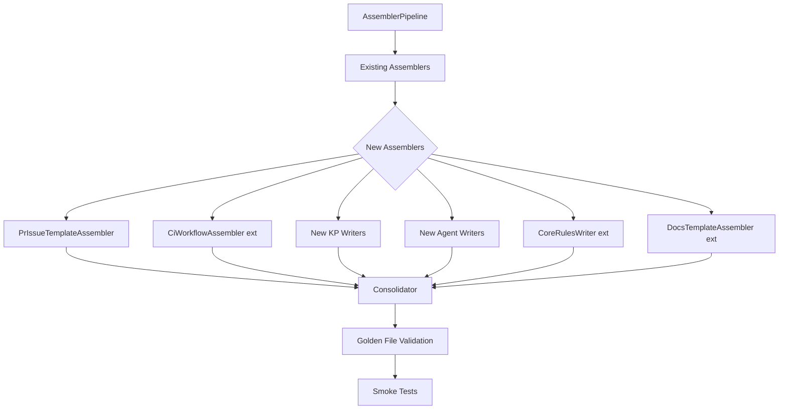

# História: Integração no Assembler Pipeline e Atualização de Smoke Tests

**ID:** story-0013-0026
**Chave Jira:** SCRUM-29
**Status:** Pendente

## 1. Dependências

| Blocked By | Blocks |
| :--- | :--- |
| story-0013-0001 a story-0013-0025 | — |

## 2. Regras Transversais Aplicáveis

| ID | Título |
| :--- | :--- |
| RULE-002 | Assembler Integration |
| RULE-005 | Golden File Compatibility |
| RULE-006 | Multi-Target Output |
| RULE-010 | Backward Compatibility |

## 3. Descrição

Como **engenheiro de plataforma**, eu quero que todos os novos artefatos criados nas stories 0001-0025 estejam integrados no `AssemblerPipeline`, com golden file tests atualizados e smoke tests validando a geração completa, para garantir que o pipeline de geração produz todos os novos artefatos corretamente para todos os perfis.

### Contexto

As stories anteriores criam templates, knowledge packs, skills, agents e rules individualmente. Esta story de integração garante que: (1) todos os novos assemblers estão registrados no `AssemblerPipeline` na ordem correta, (2) os golden file manifests refletem os novos artefatos, (3) smoke tests validam a geração end-to-end, e (4) a contagem de artefatos no `CLAUDE.md` e `README.md` está atualizada.

### 3.1 Assembler Pipeline Registration

- Verificar que todos os novos assemblers estão registrados no `AssemblerPipeline`
- Ordem de execução: assemblers existentes → novos assemblers (após os existentes, antes do `Consolidator`)
- Assemblers condicionais devem verificar condições ANTES de executar

### 3.2 Golden File Manifest Updates

- Atualizar `tests/golden/{profile}/expected-artifacts.json` para cada um dos 10 perfis
- Perfis com database: incluir artefatos condicionais (data-management KP, migration template, rule 09)
- Perfis sem container: excluir artefatos condicionais (DR KP, deploy workflows)
- Perfis sem cloud: excluir FinOps KP

### 3.3 Smoke Test Validation

- Smoke test que executa pipeline para cada perfil e valida contagem de arquivos
- Smoke test que verifica que NENHUM novo artefato contém placeholders não resolvidos
- Smoke test que verifica frontmatter YAML de todos os novos skills
- Smoke test que verifica que artefatos condicionais são gerados apenas quando condição é verdadeira

### 3.4 Documentation Updates

- Atualizar `CLAUDE.md` com contagem de artefatos atualizada (skills, KPs, agents, rules)
- Atualizar `README.md` se necessário
- Atualizar tabela "Generation Summary" no CLAUDE.md

## 3.5 Entrega de Valor

- **Valor Principal:** Pipeline gera TODOS os novos artefatos corretamente para todos os perfis
- **Métrica de Sucesso:** Todos os golden file tests passam, todos os smoke tests passam, zero regressões
- **Impacto no Negócio:** Garantia de que a expansão do SDLC está completa e integrada

## 4. Definições de Qualidade Locais

### DoR Local

- [ ] Todas as stories 0001-0025 concluídas
- [ ] Todos os templates, skills, agents e rules criados
- [ ] Pipeline de geração executável sem erros para pelo menos 1 perfil
- [ ] Golden file test infrastructure compreendida

### DoD Local

- [ ] Todos os novos assemblers registrados no `AssemblerPipeline`
- [ ] Golden file manifests atualizados para todos os 10 perfis
- [ ] Smoke tests escritos e passando para geração completa
- [ ] Smoke tests cobrindo artefatos condicionais
- [ ] `CLAUDE.md` atualizado com contagens corretas
- [ ] Zero regressões nos testes existentes
- [ ] Pipeline executa com sucesso para todos os 10 perfis

### Global DoD

- **Cobertura:** >= 95% Line, >= 90% Branch
- **Regressão:** TODOS os golden file tests passando
- **TDD Compliance:** Test-first pattern
- **Smoke Tests:** Todos passando para todos os perfis

## 5. Contratos de Dados

**New Artifact Count per Profile Type:**

| Perfil Tipo | Novos Artefatos | Total Esperado | Condições |
| :--- | :--- | :--- | :--- |
| Full stack (Java Spring) | ~45 | ~478+ | database, container, cloud |
| CLI (Python Click) | ~25 | ~395+ | sem database, sem container, sem cloud |
| Microservice (Go Gin) | ~40 | ~465+ | database, container, sem cloud |

**New Artifacts by Category:**

| Categoria | Quantidade | Condicional |
| :--- | :--- | :--- |
| Knowledge Packs | 7 novos | 3 condicionais (data-mgmt, DR, finops) |
| Skills | 6 novos | — |
| Agents | 2 novos | — |
| Rules | 3 novas | 1 condicional (rule 09) |
| Templates | 7 novos | 2 condicionais (migration, runbook sections) |
| GitHub Templates | 4 novos | — |
| CD Workflows | 4 novos | 4 condicionais (release, deploy-staging, deploy-production, rollback) |
| KP Extensions | 5 | — |
| Skill Extensions | 2 | — |

## 6. Diagramas

### 6.1 Pipeline de Integração



## 7. Critérios de Aceite (Gherkin)

```gherkin
Cenario: Pipeline gera todos os artefatos para perfil sem dependências opcionais
  DADO que o perfil python-click-cli não tem database, container nem cloud
  QUANDO o pipeline completo é executado
  ENTÃO artefatos condicionais (data-management KP, DR KP, FinOps KP, rule 09, deploy workflows) NÃO são gerados
  E todos os artefatos incondicionais são gerados
  E a contagem total de arquivos corresponde ao golden file manifest

Cenario: Pipeline gera todos os artefatos para perfil full-stack
  DADO que o perfil java-spring tem database, container e cloud
  QUANDO o pipeline completo é executado
  ENTÃO TODOS os artefatos (condicionais e incondicionais) são gerados
  E a contagem total de arquivos corresponde ao golden file manifest

Cenario: Nenhum novo artefato contém placeholders não resolvidos
  DADO que o pipeline foi executado para qualquer perfil
  QUANDO todos os novos artefatos são escaneados
  ENTÃO nenhum arquivo contém placeholders proibidos (por exemplo `<CHAVE-JIRA>` ou `<PLACEHOLDER>`)
  E qualquer ocorrência de `{{...}}` corresponde a uma allowlist de tokens esperados (por exemplo `COMPILE_COMMAND`, `TEST_COMMAND`, `LANGUAGE`, `FRAMEWORK`, `ARCHITECTURE`, etc.)

Cenario: Frontmatter de todos os novos skills é válido
  DADO que o pipeline foi executado para perfil java-spring
  QUANDO todos os SKILL.md files em .claude/skills/ são parseados
  ENTÃO todos possuem frontmatter YAML válido
  E todos possuem campo "name" e "description"
  E skills user-invocable possuem "allowed-tools"

Cenario: Golden file tests passam para todos os 10 perfis
  DADO que os golden file manifests foram atualizados
  QUANDO os golden file tests são executados
  ENTÃO todos os 10 perfis passam sem falhas

Cenario: Contagem de artefatos no CLAUDE.md está correta
  DADO que o CLAUDE.md foi atualizado
  QUANDO a tabela "Generation Summary" é lida
  ENTÃO a contagem de skills reflete os novos skills adicionados
  E a contagem de agents reflete os novos agents
  E a contagem de rules reflete as novas rules
```

### 7.1 Scenario Ordering (TPP)

> TPP: degenerate (perfil mínimo sem condicionais) → unconditional (perfil full-stack) → validação (placeholders) → validação (frontmatter) → boundary (10 perfis) → documentação (CLAUDE.md).

### 7.2 Mandatory Scenario Categories

- [x] Degenerate cases (perfil sem dependências opcionais)
- [x] Happy path (perfil full-stack)
- [x] Error paths (placeholders não resolvidos)
- [x] Boundary values (todos os 10 perfis)

## 8. Sub-tarefas

- [ ] [Dev] Verificar e registrar todos os novos assemblers no `AssemblerPipeline`
- [ ] [Test] Smoke test: pipeline gera artefatos para python-click-cli (mínimo)
- [ ] [Test] Smoke test: pipeline gera artefatos para java-spring (máximo)
- [ ] [Test] Smoke test: nenhum placeholder não resolvido nos novos artefatos
- [ ] [Test] Smoke test: frontmatter YAML válido em todos os novos skills
- [ ] [Dev] Atualizar golden file manifests para todos os 10 perfis
- [ ] [Test] Golden file tests passando para todos os 10 perfis
- [ ] [Dev] Atualizar `CLAUDE.md` com contagens de artefatos
- [ ] [Dev] Atualizar `README.md` se necessário
- [ ] [Test] Verificar que NENHUM teste existente regrediu
- [ ] [Dev] Atualizar tabela "Generation Summary" com novos totais
