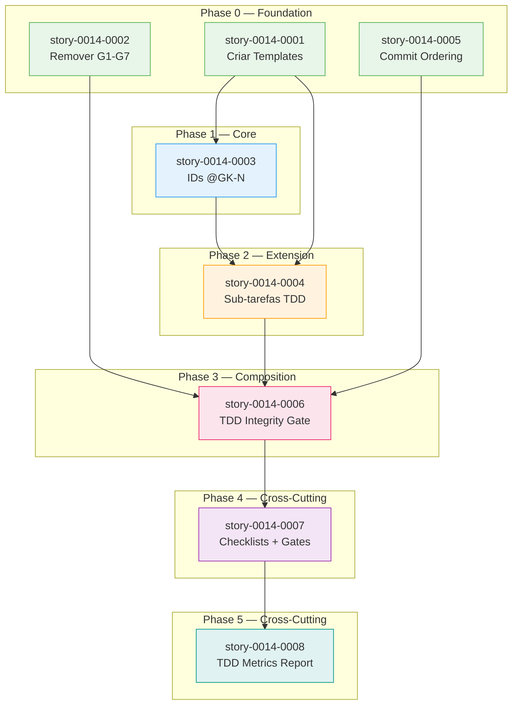

# Implementation Map — EPIC-0014: Fortalecimento do TDD

## 1. Matriz de Dependências

| Story | Título | Blocked By | Blocks | Status | Test Plan |
| :--- | :--- | :--- | :--- | :--- | :--- |
| story-0014-0001 | Criar Templates Ausentes | — | story-0014-0003, story-0014-0004 | Pendente | Pending |
| story-0014-0002 | Remover Fallback G1-G7 | — | story-0014-0006 | Pendente | Pending |
| story-0014-0003 | IDs @GK-N no Gherkin | story-0014-0001 | story-0014-0004 | Pendente | Pending |
| story-0014-0004 | Sub-tarefas TDD-Cycle | story-0014-0001, story-0014-0003 | story-0014-0006 | Pendente | Pending |
| story-0014-0005 | Commit Ordering | — | story-0014-0006 | Pendente | Pending |
| story-0014-0006 | TDD Compliance Integrity Gate | story-0014-0002, story-0014-0004, story-0014-0005 | story-0014-0007 | Pendente | Pending |
| story-0014-0007 | Checklists QA/TL + Quality Gates | story-0014-0006 | story-0014-0008 | Pendente | Pending |
| story-0014-0008 | TDD Metrics no Execution Report | story-0014-0006 | — | Pendente | Pending |

## 2. Diagrama de Fases (ASCII)

```
Phase 0 (Foundation — sem dependências):
┌─────────────────────┐  ┌─────────────────────┐  ┌─────────────────────┐
│  story-0014-0001    │  │  story-0014-0002    │  │  story-0014-0005    │
│  Criar Templates    │  │  Remover G1-G7      │  │  Commit Ordering    │
│  Ausentes           │  │  Fallback           │  │                     │
└──────────┬──────────┘  └──────────┬──────────┘  └──────────┬──────────┘
           │                        │                        │
           ▼                        │                        │
Phase 1 (Core — depende de Phase 0):│                        │
┌─────────────────────┐             │                        │
│  story-0014-0003    │             │                        │
│  IDs @GK-N no       │             │                        │
│  Gherkin            │             │                        │
└──────────┬──────────┘             │                        │
           │                        │                        │
           ▼                        │                        │
Phase 2 (Extension — depende de Phase 0+1):                  │
┌─────────────────────┐             │                        │
│  story-0014-0004    │             │                        │
│  Sub-tarefas        │             │                        │
│  TDD-Cycle          │             │                        │
└──────────┬──────────┘             │                        │
           │                        │                        │
           ▼                        ▼                        ▼
Phase 3 (Composition — depende de Phase 0+2):
┌─────────────────────────────────────────────────────────────┐
│  story-0014-0006                                            │
│  TDD Compliance no Integrity Gate do Epic                   │
│  (depende de: 0002, 0004, 0005)                             │
└──────────┬──────────────────────────────────────────────────┘
           │
           ▼
Phase 4 (Cross-Cutting — depende de Phase 3):
┌─────────────────────┐
│  story-0014-0007    │
│  Checklists QA/TL   │
│  + Quality Gates    │
└──────────┬──────────┘
           │
           ▼
Phase 5 (Cross-Cutting — depende de Phase 4):
┌─────────────────────┐
│  story-0014-0008    │
│  TDD Metrics no     │
│  Execution Report   │
└─────────────────────┘
```

## 3. Análise de Caminho Crítico

**Caminho crítico (6 fases):**

```
story-0014-0001 → story-0014-0003 → story-0014-0004 → story-0014-0006 → story-0014-0007 → story-0014-0008
```

Este é o caminho mais longo do DAG (6 stories em 6 fases). Todos os outros caminhos convergem para story-0014-0006.

**Caminhos paralelos (convergem na Phase 3):**

| Caminho | Stories | Fases |
| :--- | :--- | :--- |
| A (Templates → Gherkin → Sub-tasks) | 0001 → 0003 → 0004 | Phase 0 → 1 → 2 |
| B (Remover Fallback) | 0002 | Phase 0 |
| C (Commit Ordering) | 0005 | Phase 0 |

Caminhos B e C são independentes e executáveis em paralelo com o caminho A desde Phase 0.

## 4. Grafo de Dependências (Mermaid)



## 5. Resumo por Fase

| Fase | Stories | Paralelismo | Arquivos Afetados |
| :--- | :--- | :--- | :--- |
| Phase 0 | story-0014-0001, story-0014-0002, story-0014-0005 | 3 paralelas | `.claude/templates/` (3 novos), `x-dev-lifecycle`, `x-dev-implement` |
| Phase 1 | story-0014-0003 | 1 sequencial | `x-story-create`, `x-test-plan` |
| Phase 2 | story-0014-0004 | 1 sequencial | `x-story-create`, `_TEMPLATE-STORY.md` |
| Phase 3 | story-0014-0006 | 1 sequencial (convergência) | `x-dev-epic-implement` |
| Phase 4 | story-0014-0007 | 1 sequencial | `qa-engineer.md`, `tech-lead.md`, `05-quality-gates.md` |
| Phase 5 | story-0014-0008 | 1 sequencial | `_TEMPLATE-EPIC-EXECUTION-REPORT.md`, `x-dev-epic-implement` |

**Total:** 8 stories, 6 fases, 3 paralelas na Phase 0

## 6. Observações Estratégicas

### Gargalo Principal

**story-0014-0006** (TDD Compliance no Integrity Gate) é o ponto de convergência: depende de 3 stories (0002, 0004, 0005) e bloqueia 2 stories (0007, 0008). Qualquer atraso nas dependências impacta toda a cadeia Phase 3→4→5.

### Histórias Folha

- **story-0014-0008** (TDD Metrics) — sem dependentes, pode ser implementada sem pressão de bloqueio.

### Otimização de Paralelismo

Phase 0 oferece máximo paralelismo (3 stories). Recomenda-se execução paralela via worktrees:
- Worktree A: story-0014-0001 (templates — criação de novos arquivos, sem conflito)
- Worktree B: story-0014-0002 (lifecycle/implement — edição de skills existentes)
- Worktree C: story-0014-0005 (implement — edição de skill existente, diferente das seções de 0002)

**Risco de conflito:** story-0014-0002 e story-0014-0005 ambas editam `x-dev-implement/SKILL.md`, mas em seções diferentes (0002: Step 1/Step 2.4 fallback; 0005: Step ordering/Step 4). Conflito é possível mas resolvível via rebase.

### Convergências

story-0014-0006 recebe output de 3 caminhos paralelos. O integrity gate que ela adiciona depende de:
- Templates existirem (0001) → via 0004
- Fallback removido (0002) → formato de ABORT definido
- Commit format padronizado (0005) → [TDD] suffixes para verificação

### Marco de Validação

Após Phase 3 (story-0014-0006), o sistema tem:
- Templates como single source of truth
- TDD mandatório (sem escape hatch)
- Rastreabilidade @GK-N ↔ AT-N
- Sub-tarefas TDD-cycle
- Commits atômicos por ciclo
- Integrity gate com TDD check

Phases 4-5 são refinamentos de verificação e reporting. O marco de validação é o final da Phase 3.
