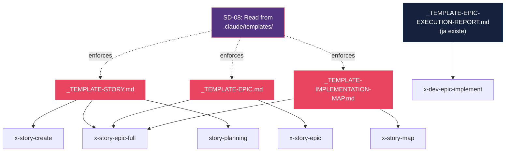
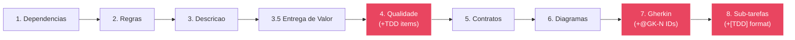

# Historia: Criar Templates Ausentes (_TEMPLATE-STORY, _TEMPLATE-EPIC, _TEMPLATE-IMPLEMENTATION-MAP)

**ID:** story-0014-0001

## 1. Dependencias

| Blocked By | Blocks |
| :--- | :--- |
| -- | story-0014-0003, story-0014-0004 |

## 2. Regras Transversais Aplicaveis

| ID | Titulo |
| :--- | :--- |
| RULE-001 | Template como Single Source of Truth |
| RULE-006 | Backward Compatibility |

## 3. Descricao

Como **Architect**, eu quero que os tres templates ausentes (`_TEMPLATE-STORY.md`, `_TEMPLATE-EPIC.md`, `_TEMPLATE-IMPLEMENTATION-MAP.md`) sejam criados em `.claude/templates/`, para que os 7+ skills que os referenciam possam ler a estrutura em runtime conforme manda a regra SD-08, eliminando o hardcoding de estrutura nos skills.

### Contexto

A regra SD-08 em `story-decomposition.md` declara explicitamente: "FORBIDDEN: Hardcoding template structure. Always read fresh from `.claude/templates/`". Porem, tres dos quatro templates referenciados nao existem. Apenas `_TEMPLATE-EPIC-EXECUTION-REPORT.md` esta presente. Os skills `x-story-create`, `x-story-epic`, `x-story-map`, `x-story-epic-full`, `x-review` e `story-planning/SKILL.md` referenciam templates inexistentes, o que significa que a regra SD-08 e impossivel de seguir. Cada skill acaba duplicando a estrutura internamente, criando divergencia e inconsistencia entre artefatos gerados.

### 3.1 _TEMPLATE-STORY.md

Codifica a estrutura de 8 secoes definida em `x-story-create/SKILL.md`, com adicoes TDD:

- **Secao 1 (Dependencias):** Tabela Blocked By / Blocks
- **Secao 2 (Regras Transversais):** Tabela ID / Titulo referenciando RULE-NNN do epico
- **Secao 3 (Descricao):** User story + contexto tecnico + subsecoes numeradas
- **Secao 3.5 (Entrega de Valor):** Valor principal, metrica de sucesso, impacto no negocio
- **Secao 4 (DoD Local):** Adicoes TDD — referencia mandatoria a test plan, verificacao de mapeamento @GK-N, ordenacao TPP, AT-N GREEN, commits test-first
- **Secao 5 (Contratos de Dados):** Tabela de data contracts
- **Secao 6 (Diagramas):** Blocos Mermaid
- **Secao 7 (Gherkin):** IDs `@GK-N` em cada cenario (imutaveis apos criacao), ordenacao TPP obrigatoria, minimo 4 cenarios
- **Secao 8 (Sub-tarefas):** Formato `[TDD]` com mapeamento AT-N/UT-N, placeholder para pre-test-plan

### 3.2 _TEMPLATE-EPIC.md

Codifica a estrutura de 5 secoes definida em `x-story-epic/SKILL.md`, com adicoes TDD:

- **Secao 1 (Visao Geral):** Chave Jira, autor, data, status
- **Secao 2 (Anexos e Referencias):** Links para skills, regras, planos
- **Secao 3 (Definicoes de Qualidade Globais):** DoR Global + DoD Global com itens TDD explicitos — test plan antes de implementacao, Double-Loop TDD, rastreabilidade @GK-N bidirecional, commits atomicos por ciclo TDD
- **Secao 4 (Regras de Negocio Transversais):** Tabela RULE-NNN
- **Secao 5 (Indice de Historias):** Coluna "Test Plan" com status (Pending/Ready/N/A)

### 3.3 _TEMPLATE-IMPLEMENTATION-MAP.md

Codifica a estrutura definida em `x-story-map/SKILL.md`, com adicoes TDD:

- **Cabecalho:** Epico ID, titulo, autor, data
- **Dependency Matrix:** Colunas — ID, Titulo, Blocked By, Blocks, Wave, "Test Plan Status" (Pending/Ready/N/A)
- **Wave Diagram:** Mermaid gantt chart mostrando waves de execucao paralela
- **Execution Order:** Lista ordenada por waves respeitando dependencias

## 3.5 Entrega de Valor

- **Valor Principal:** Single source of truth para estrutura de artefatos, eliminando violacao de SD-08 em 7+ skills
- **Metrica de Sucesso:** 3 templates criados em `.claude/templates/`, referenciados por pelo menos 6 skills sem duplicacao de estrutura
- **Impacto no Negocio:** Consistencia garantida entre stories, epicos e implementation maps gerados por qualquer skill, com secoes TDD integradas desde a fundacao

## 4. Definicoes de Qualidade Locais

### DoR Local

- [ ] Regra SD-08 em `story-decomposition.md` revisada e compreendida
- [ ] Skills `x-story-create`, `x-story-epic`, `x-story-map` revisados para extrair estrutura atual
- [ ] Template existente `_TEMPLATE-EPIC-EXECUTION-REPORT.md` analisado como referencia de formato
- [ ] Diretorio `.claude/templates/` identificado e verificado

### DoD Local

- [ ] Template `_TEMPLATE-STORY.md` criado em `.claude/templates/` com 8 secoes + adicoes TDD
- [ ] Template `_TEMPLATE-EPIC.md` criado em `.claude/templates/` com 5 secoes + DoD TDD
- [ ] Template `_TEMPLATE-IMPLEMENTATION-MAP.md` criado em `.claude/templates/` com Dependency Matrix + Test Plan Status
- [ ] Secao 4 (DoD Local) do template story inclui referencia mandatoria a test plan
- [ ] Secao 7 (Gherkin) do template story inclui placeholder `@GK-N` com instrucao de imutabilidade
- [ ] Secao 8 (Sub-tarefas) do template story usa formato `[TDD]` com AT-N/UT-N
- [ ] Secao 5 (Indice) do template epic inclui coluna "Test Plan" com status
- [ ] Dependency Matrix do template implementation map inclui coluna "Test Plan Status"
- [ ] Templates validados contra estrutura atual de stories existentes (backward compat)

### Global DoD

- **Cobertura:** >= 95% Line, >= 90% Branch
- **Testes Automatizados:** Testes validando que cada template contem secoes obrigatorias e placeholders corretos
- **TDD Compliance:** Commits test-first, refactoring explicito
- **Backward Compatibility:** Stories e epicos existentes sem @GK-N ou sem coluna "Test Plan" continuam funcionando (RULE-006)
- **Double-Loop TDD:** Acceptance tests derivados dos cenarios Gherkin (outer loop), unit tests guiados por TPP (inner loop)
- **Rastreabilidade:** Todo @GK-N mapeia para >= 1 AT-N, todo AT-N referencia um @GK-N valido

## 5. Contratos de Dados

**_TEMPLATE-STORY.md:**

| Campo | Tipo | Obrigatorio | Descricao |
| :--- | :--- | :--- | :--- |
| `# Historia: {{TITLE}}` | Markdown H1 | Sim | Titulo da historia com placeholder |
| `**ID:** {{STORY_ID}}` | Metadata | Sim | ID unico da historia |
| `## 1. Dependencias` | Tabela Markdown | Sim | Blocked By / Blocks |
| `## 2. Regras Transversais` | Tabela Markdown | Sim | ID / Titulo de RULE-NNN |
| `## 3. Descricao` | Markdown H2 + subsecoes | Sim | User story + contexto + subsecoes 3.N |
| `## 3.5 Entrega de Valor` | Markdown H2 | Sim | Valor principal, metrica, impacto |
| `## 4. Definicoes de Qualidade` | Markdown H2 | Sim | DoR Local + DoD Local + Global DoD |
| `## 5. Contratos de Dados` | Tabela Markdown | Sim | Data contracts do escopo |
| `## 6. Diagramas` | Mermaid blocks | Sim | Pelo menos 1 diagrama |
| `## 7. Criterios de Aceite` | Gherkin block | Sim | Cenarios com @GK-N, min 4, TPP order |
| `## 8. Sub-tarefas` | Checklist | Sim | Formato [TDD] com AT-N/UT-N |

**_TEMPLATE-EPIC.md:**

| Campo | Tipo | Obrigatorio | Descricao |
| :--- | :--- | :--- | :--- |
| `## 1. Visao Geral` | Markdown H2 | Sim | Chave Jira, autor, data, status |
| `## 2. Anexos e Referencias` | Markdown H2 | Sim | Links para artefatos relacionados |
| `## 3. Definicoes de Qualidade Globais` | Markdown H2 | Sim | DoR + DoD com itens TDD |
| `## 4. Regras de Negocio Transversais` | Tabela Markdown | Sim | RULE-NNN com descricao |
| `## 5. Indice de Historias` | Tabela Markdown | Sim | Colunas: ID, Titulo, Deps, Blocks, Valor, Test Plan |

**_TEMPLATE-IMPLEMENTATION-MAP.md:**

| Campo | Tipo | Obrigatorio | Descricao |
| :--- | :--- | :--- | :--- |
| Cabecalho | Metadata | Sim | Epic ID, titulo, autor, data |
| Dependency Matrix | Tabela Markdown | Sim | ID, Titulo, Blocked By, Blocks, Wave, Test Plan Status |
| Wave Diagram | Mermaid gantt | Sim | Visualizacao de waves paralelas |
| Execution Order | Lista ordenada | Sim | Stories ordenadas por wave |

## 6. Diagramas

### 6.1 Relacao Templates -> Skills



### 6.2 Estrutura de Secoes do _TEMPLATE-STORY.md



## 7. Criterios de Aceite (Gherkin)

```gherkin
@GK-1
Cenario: Template story vazio gerado com 8 secoes obrigatorias
  DADO que o diretorio .claude/templates/ existe
  QUANDO o arquivo _TEMPLATE-STORY.md e criado
  ENTAO deve conter as 8 secoes obrigatorias (Dependencias, Regras, Descricao, Entrega de Valor, Qualidade, Contratos, Diagramas, Gherkin, Sub-tarefas)
  E cada secao deve conter placeholders ou instrucoes de preenchimento

@GK-2
Cenario: Template story inclui adicoes TDD na secao DoD Local
  DADO que o _TEMPLATE-STORY.md foi criado
  QUANDO a secao "4. Definicoes de Qualidade Locais" e inspecionada
  ENTAO deve conter item de referencia mandatoria a test plan
  E deve conter item de verificacao de mapeamento @GK-N
  E deve conter item de ordenacao TPP
  E deve conter item de AT-N GREEN

@GK-3
Cenario: Template story inclui @GK-N nos cenarios Gherkin
  DADO que o _TEMPLATE-STORY.md foi criado
  QUANDO a secao "7. Criterios de Aceite" e inspecionada
  ENTAO deve conter placeholder @GK-N antes de cada cenario
  E deve conter instrucao de que IDs sao imutaveis apos criacao
  E deve conter instrucao de minimo 4 cenarios
  E deve conter instrucao de ordenacao TPP

@GK-4
Cenario: Template story inclui formato [TDD] nas sub-tarefas
  DADO que o _TEMPLATE-STORY.md foi criado
  QUANDO a secao "8. Sub-tarefas" e inspecionada
  ENTAO deve conter exemplos no formato "[TDD] AT-N (@GK-N): descricao"
  E deve conter exemplos no formato "[TDD] UT-N: descricao"
  E nao deve conter tags [Dev] ou [Test] isoladas

@GK-5
Cenario: Template epic inclui coluna Test Plan no indice de historias
  DADO que o _TEMPLATE-EPIC.md foi criado
  QUANDO a secao "5. Indice de Historias" e inspecionada
  ENTAO a tabela deve conter coluna "Test Plan"
  E os valores validos devem ser "Pending", "Ready" ou "N/A"

@GK-6
Cenario: Template epic inclui itens TDD no DoD Global
  DADO que o _TEMPLATE-EPIC.md foi criado
  QUANDO a secao "3. Definicoes de Qualidade Globais" e inspecionada
  ENTAO o DoD Global deve conter item "test plan antes de implementacao"
  E deve conter item "Double-Loop TDD"
  E deve conter item "rastreabilidade @GK-N bidirecional"

@GK-7
Cenario: Template implementation map inclui coluna Test Plan Status
  DADO que o _TEMPLATE-IMPLEMENTATION-MAP.md foi criado
  QUANDO a Dependency Matrix e inspecionada
  ENTAO a tabela deve conter coluna "Test Plan Status"
  E os valores validos devem ser "Pending", "Ready" ou "N/A"

@GK-8
Cenario: Templates sao backward-compatible com artefatos existentes
  DADO que existem stories e epicos criados antes do epic-0014
  QUANDO os templates sao usados para validar artefatos existentes
  ENTAO artefatos sem @GK-N devem ser aceitos com WARNING (nao erro)
  E artefatos sem coluna "Test Plan" devem ser aceitos com WARNING
  E nenhum artefato existente deve ser invalidado ou quebrado
```

### 7.1 Scenario Ordering (TPP)

> TPP: degenerate (template vazio com secoes, @GK-1) -> unconditional (adicoes TDD em DoD, @GK-2) -> condicional (Gherkin @GK-N, @GK-3; sub-tarefas [TDD], @GK-4) -> condicional (epic Test Plan column, @GK-5; epic DoD TDD, @GK-6) -> condicional (impl map Test Plan Status, @GK-7) -> edge case (backward compat, @GK-8).

### 7.2 Mandatory Scenario Categories

- [x] Degenerate cases (template vazio com secoes obrigatorias, @GK-1)
- [x] Happy path (adicoes TDD em DoD, Gherkin, sub-tarefas, @GK-2/@GK-3/@GK-4)
- [x] Error paths (N/A -- templates sao arquivos estaticos, validacao via testes)
- [x] Boundary values (backward compatibility com artefatos pre-existentes, @GK-8)
- [x] Edge cases (coluna Test Plan em epic e impl map, @GK-5/@GK-6/@GK-7)

## 8. Sub-tarefas

- [ ] [TDD] AT-1 (@GK-1): Escrever acceptance test validando que _TEMPLATE-STORY.md contem 8 secoes obrigatorias (RED)
- [ ] [TDD] UT-1: Escrever unit test para parser de secoes do template story (RED)
- [ ] [TDD] UT-1: Implementar _TEMPLATE-STORY.md com 8 secoes base (GREEN)
- [ ] [TDD] Refactor: Extrair placeholders e instrucoes para formato consistente
- [ ] [TDD] AT-2 (@GK-2): Escrever acceptance test validando itens TDD na secao DoD Local (RED)
- [ ] [TDD] UT-2: Implementar adicoes TDD na secao 4 do template story (GREEN)
- [ ] [TDD] AT-3 (@GK-3): Escrever acceptance test validando @GK-N nos cenarios Gherkin (RED)
- [ ] [TDD] UT-3: Implementar secao 7 com @GK-N placeholders e instrucoes (GREEN)
- [ ] [TDD] AT-4 (@GK-4): Escrever acceptance test validando formato [TDD] nas sub-tarefas (RED)
- [ ] [TDD] UT-4: Implementar secao 8 com formato [TDD] AT-N/UT-N (GREEN)
- [ ] [TDD] AT-5 (@GK-5): Escrever acceptance test validando coluna Test Plan no template epic (RED)
- [ ] [TDD] UT-5: Implementar _TEMPLATE-EPIC.md com 5 secoes + coluna Test Plan (GREEN)
- [ ] [TDD] AT-6 (@GK-6): Escrever acceptance test validando itens TDD no DoD Global do epic (RED)
- [ ] [TDD] UT-6: Implementar itens TDD na secao 3 do template epic (GREEN)
- [ ] [TDD] AT-7 (@GK-7): Escrever acceptance test validando coluna Test Plan Status no implementation map (RED)
- [ ] [TDD] UT-7: Implementar _TEMPLATE-IMPLEMENTATION-MAP.md com Dependency Matrix + Test Plan Status (GREEN)
- [ ] [TDD] Refactor: Consolidar formato de tabelas e placeholders entre os 3 templates
- [ ] [TDD] AT-8 (@GK-8): Escrever acceptance test de backward compatibility com artefatos existentes (RED)
- [ ] [TDD] UT-8: Implementar logica de WARNING (nao erro) para artefatos sem @GK-N ou sem Test Plan (GREEN)
