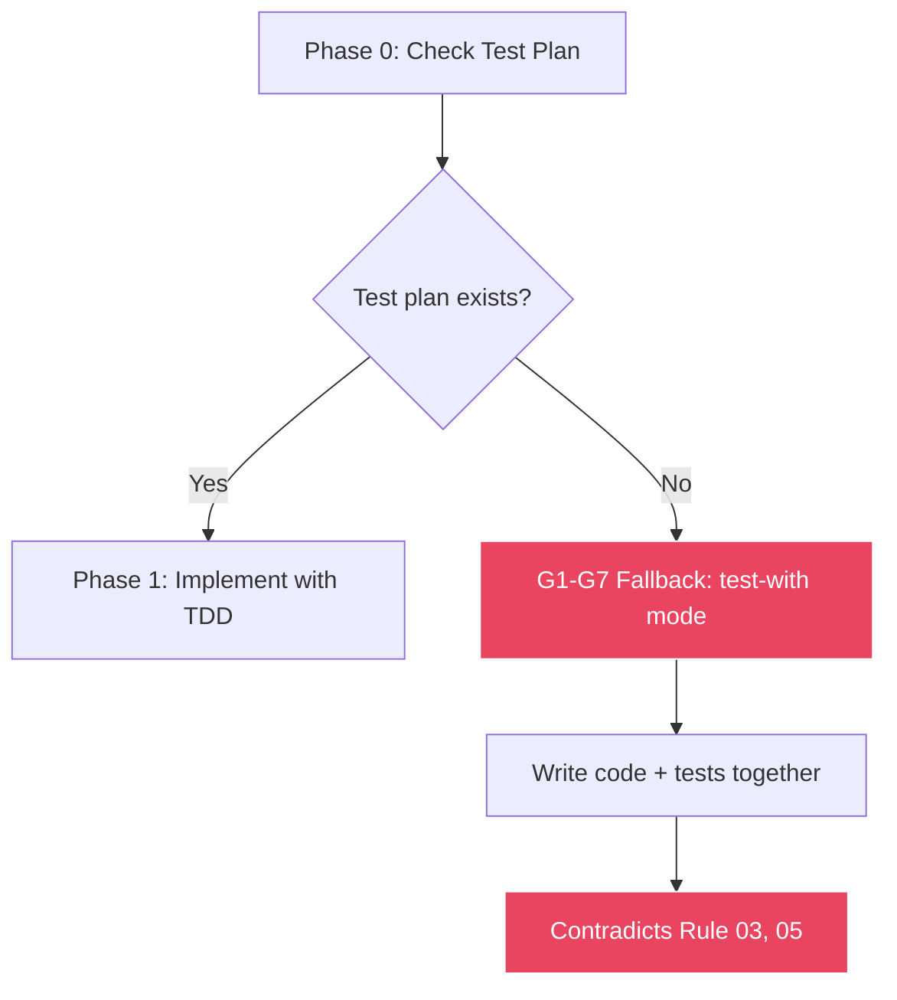
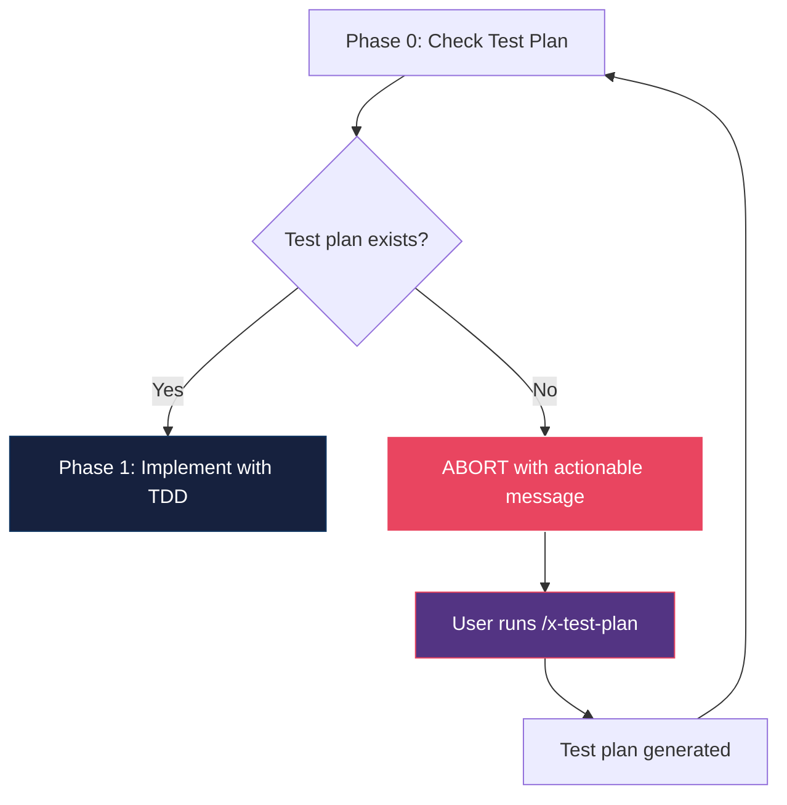
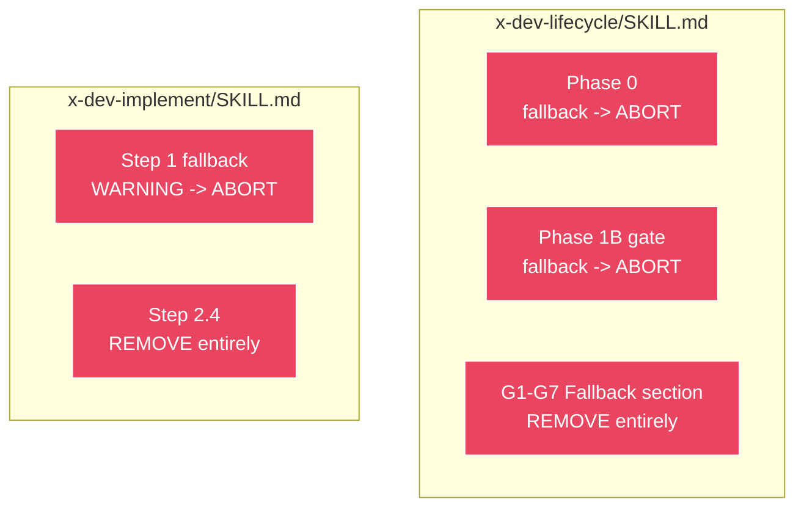

# Historia: Remover Fallback G1-G7 e Tornar Test Plan Mandatorio

**ID:** story-0014-0002

## 1. Dependencias

| Blocked By | Blocks |
| :--- | :--- |
| -- | story-0014-0006 |

## 2. Regras Transversais Aplicaveis

| ID | Titulo |
| :--- | :--- |
| RULE-002 | TDD Sem Escape Hatch |
| RULE-006 | Backward Compatibility |
| RULE-007 | Verificacao em Multiplos Niveis |

## 3. Descricao

Como **Tech Lead**, eu quero que o fallback G1-G7 (test-with mode) seja removido de `x-dev-lifecycle` e `x-dev-implement`, e que a ausencia de test plan cause ABORT explicito, para que nenhuma implementacao possa contornar a mandatoriedade de TDD definida em Rules 03, 05 e testing-philosophy.md.

### Contexto

Atualmente, quando nenhum test plan existe, os skills de desenvolvimento caem silenciosamente num modo de fallback onde testes sao escritos "junto com" o codigo (test-with), contradizendo tres fontes canonicas:

- **Rule 03** (coding-standards): "Red-Green-Refactor is mandatory for all production code"
- **Rule 05** (quality-gates): "Coverage thresholds are NOT a substitute for TDD -- high coverage with test-after is insufficient"
- **testing-philosophy.md**: "NEVER write production code without a failing test first"

O fallback ocorre em 4 pontos especificos:

1. `x-dev-lifecycle/SKILL.md` Phase 0 (linha ~50): Referencia fallback quando test plan nao encontrado
2. `x-dev-lifecycle/SKILL.md` Phase 1B gate: Fallback G1-G7 quando geracao de test plan falha
3. `x-dev-lifecycle/SKILL.md` secao "G1-G7 Fallback (No Test Plan)" (linhas ~218-231): Bloco inteiro que define o modo test-with
4. `x-dev-implement/SKILL.md` Step 1 fallback (linha ~74): WARNING ao inves de ABORT quando test plan ausente
5. `x-dev-implement/SKILL.md` Step 2.4 (linhas ~157-163): Secao inteira que implementa o modo test-with

### 3.1 Mudancas em x-dev-lifecycle/SKILL.md

- **Phase 0:** Substituir referencia a fallback por ABORT com mensagem: `"ABORT: Test plan not found for {{STORY_ID}}. Run /x-test-plan before /x-dev-lifecycle. TDD is mandatory (Rule 03, Rule 05)."`
- **Phase 1B gate:** Substituir fallback G1-G7 por ABORT com mensagem: `"ABORT: Test plan generation failed for {{STORY_ID}}. Cannot proceed without test plan. Run /x-test-plan manually."`
- **Secao G1-G7 Fallback:** Remover integralmente a secao "G1-G7 Fallback (No Test Plan)" (linhas ~218-231). Nao substituir -- simplesmente deletar.

### 3.2 Mudancas em x-dev-implement/SKILL.md

- **Step 1 fallback:** Substituir WARNING por ABORT com mensagem: `"ABORT: No test plan found. TDD is mandatory -- run /x-test-plan first. Implementation cannot proceed without a test plan (Rule 03)."`
- **Step 2.4:** Remover integralmente a secao Step 2.4 que implementa o modo test-with. Nao substituir -- simplesmente deletar.

### 3.3 Backward Compatibility (RULE-006)

- Stories existentes que ja possuem test plan nao sao afetadas
- Stories existentes sem test plan receberao ABORT claro com instrucao de como gerar o test plan (`/x-test-plan`)
- A mensagem de ABORT deve ser autocontida: incluir o ID da story, o comando para gerar test plan, e a regra violada

## 3.5 Entrega de Valor

- **Valor Principal:** Eliminacao do escape hatch que permitia contornar TDD mandatorio, alinhando comportamento dos skills com Rules 03, 05 e testing-philosophy.md
- **Metrica de Sucesso:** Zero caminhos de fallback test-with nos skills de desenvolvimento; toda tentativa de implementar sem test plan resulta em ABORT com mensagem acionavel
- **Impacto no Negocio:** Garantia de que todo codigo produzido pelo pipeline segue TDD, aumentando qualidade e reduzindo regressoes

## 4. Definicoes de Qualidade Locais

### DoR Local

- [ ] Skills `x-dev-lifecycle/SKILL.md` e `x-dev-implement/SKILL.md` lidos e compreendidos
- [ ] Pontos de fallback identificados (Phase 0, Phase 1B gate, G1-G7 section, Step 1 fallback, Step 2.4)
- [ ] Rules 03 e 05 revisadas para confirmar mandatoriedade de TDD
- [ ] `testing-philosophy.md` revisado para confirmar "NEVER write production code without a failing test first"

### DoD Local

- [ ] Phase 0 do `x-dev-lifecycle` alterado: fallback substituido por ABORT
- [ ] Phase 1B gate do `x-dev-lifecycle` alterado: fallback substituido por ABORT
- [ ] Secao "G1-G7 Fallback (No Test Plan)" removida integralmente de `x-dev-lifecycle`
- [ ] Step 1 do `x-dev-implement` alterado: WARNING substituido por ABORT
- [ ] Step 2.4 removido integralmente de `x-dev-implement`
- [ ] Mensagens de ABORT incluem: story ID, comando `/x-test-plan`, regra violada
- [ ] Test plan existente: skill continua funcionando normalmente (backward compat)
- [ ] Test plan ausente: skill aborta com mensagem clara e acionavel

### Global DoD

- **Cobertura:** >= 95% Line, >= 90% Branch
- **Testes Automatizados:** Testes validando que ausencia de test plan causa ABORT (nao fallback)
- **TDD Compliance:** Commits test-first, refactoring explicito
- **Backward Compatibility:** Skills continuam funcionando para stories que ja possuem test plan (RULE-006)
- **Verificacao Multi-Nivel:** ABORT em Phase 0 do lifecycle (nivel 1 de RULE-007), mensagem aponta para `/x-test-plan`

## 5. Contratos de Dados

**Mensagens de ABORT:**

| Campo | Tipo | Obrigatorio | Descricao |
| :--- | :--- | :--- | :--- |
| Phase 0 ABORT | String | Sim | `"ABORT: Test plan not found for {{STORY_ID}}. Run /x-test-plan before /x-dev-lifecycle. TDD is mandatory (Rule 03, Rule 05)."` |
| Phase 1B ABORT | String | Sim | `"ABORT: Test plan generation failed for {{STORY_ID}}. Cannot proceed without test plan. Run /x-test-plan manually."` |
| Step 1 ABORT | String | Sim | `"ABORT: No test plan found. TDD is mandatory -- run /x-test-plan first. Implementation cannot proceed without a test plan (Rule 03)."` |

**Secoes Removidas:**

| Secao | Skill | Linhas Aprox. | Acao |
| :--- | :--- | :--- | :--- |
| G1-G7 Fallback (No Test Plan) | x-dev-lifecycle/SKILL.md | ~218-231 | Remover integralmente |
| Step 2.4 (test-with mode) | x-dev-implement/SKILL.md | ~157-163 | Remover integralmente |

## 6. Diagramas

### 6.1 Fluxo Antes (com Fallback)



### 6.2 Fluxo Depois (sem Fallback)



### 6.3 Pontos de Mudanca nos Skills



## 7. Criterios de Aceite (Gherkin)

```gherkin
@GK-1
Cenario: Skill aborta quando test plan nao existe
  DADO que a story "story-0014-0002" nao possui test plan
  QUANDO o x-dev-lifecycle e invocado para essa story
  ENTAO o skill deve abortar na Phase 0
  E a mensagem deve conter "ABORT"
  E a mensagem deve conter "story-0014-0002"
  E a mensagem deve conter "/x-test-plan"

@GK-2
Cenario: Skill procede normalmente quando test plan existe
  DADO que a story "story-0014-0002" possui test plan gerado
  QUANDO o x-dev-lifecycle e invocado para essa story
  ENTAO o skill deve prosseguir para Phase 1
  E nenhuma mensagem de ABORT deve ser emitida

@GK-3
Cenario: x-dev-implement aborta quando test plan ausente
  DADO que a story nao possui test plan
  QUANDO o x-dev-implement e invocado
  ENTAO o skill deve abortar no Step 1
  E a mensagem deve conter "ABORT"
  E a mensagem deve conter "Rule 03"
  E a mensagem deve conter "/x-test-plan"

@GK-4
Cenario: Secao G1-G7 Fallback nao existe mais no x-dev-lifecycle
  DADO que o x-dev-lifecycle/SKILL.md foi modificado
  QUANDO o conteudo do arquivo e inspecionado
  ENTAO nao deve conter a string "G1-G7 Fallback"
  E nao deve conter a string "test-with"
  E nao deve conter a string "No Test Plan"

@GK-5
Cenario: Step 2.4 nao existe mais no x-dev-implement
  DADO que o x-dev-implement/SKILL.md foi modificado
  QUANDO o conteudo do arquivo e inspecionado
  ENTAO nao deve conter "Step 2.4"
  E nao deve conter secao de fallback test-with

@GK-6
Cenario: Mensagem de ABORT inclui informacao acionavel
  DADO que o skill aborta por ausencia de test plan
  QUANDO a mensagem de ABORT e analisada
  ENTAO deve conter o ID da story
  E deve conter o comando para gerar test plan ("/x-test-plan")
  E deve conter a regra violada ("Rule 03" ou "Rule 05")
  E a mensagem deve ser suficiente para o usuario agir sem consultar documentacao adicional

@GK-7
Cenario: Phase 1B aborta quando geracao de test plan falha
  DADO que a geracao automatica de test plan na Phase 1B falha
  QUANDO o x-dev-lifecycle tenta prosseguir
  ENTAO o skill deve abortar com mensagem de ABORT
  E a mensagem deve sugerir execucao manual de /x-test-plan
  E nao deve cair no modo G1-G7 Fallback
```

### 7.1 Scenario Ordering (TPP)

> TPP: degenerate (test plan ausente -> ABORT, @GK-1) -> unconditional (test plan presente -> prossegue, @GK-2) -> condicional (x-dev-implement ABORT, @GK-3) -> condicional (secao G1-G7 removida, @GK-4; Step 2.4 removido, @GK-5) -> edge case (mensagem acionavel, @GK-6; Phase 1B fallback removido, @GK-7).

### 7.2 Mandatory Scenario Categories

- [x] Degenerate cases (test plan ausente causa ABORT, @GK-1)
- [x] Happy path (test plan existe, skill prossegue, @GK-2)
- [x] Error paths (ABORT em x-dev-implement, @GK-3; Phase 1B ABORT, @GK-7)
- [x] Boundary values (secoes removidas integralmente, @GK-4/@GK-5)
- [x] Edge cases (mensagem acionavel e autocontida, @GK-6)

## 8. Sub-tarefas

- [ ] [TDD] AT-1 (@GK-1): Escrever acceptance test validando que x-dev-lifecycle aborta quando test plan nao existe (RED)
- [ ] [TDD] UT-1: Escrever unit test para logica de verificacao de test plan na Phase 0 (RED)
- [ ] [TDD] UT-1: Modificar Phase 0 do x-dev-lifecycle: substituir fallback por ABORT (GREEN)
- [ ] [TDD] AT-2 (@GK-2): Escrever acceptance test validando que x-dev-lifecycle prossegue com test plan presente (RED)
- [ ] [TDD] UT-2: Verificar que fluxo normal nao e afetado pela mudanca (GREEN)
- [ ] [TDD] AT-3 (@GK-3): Escrever acceptance test validando que x-dev-implement aborta sem test plan (RED)
- [ ] [TDD] UT-3: Modificar Step 1 do x-dev-implement: substituir WARNING por ABORT (GREEN)
- [ ] [TDD] AT-4 (@GK-4): Escrever acceptance test validando ausencia da secao G1-G7 Fallback (RED)
- [ ] [TDD] UT-4: Remover secao "G1-G7 Fallback (No Test Plan)" do x-dev-lifecycle (GREEN)
- [ ] [TDD] AT-5 (@GK-5): Escrever acceptance test validando ausencia do Step 2.4 (RED)
- [ ] [TDD] UT-5: Remover Step 2.4 do x-dev-implement (GREEN)
- [ ] [TDD] Refactor: Consolidar mensagens de ABORT em formato consistente entre os dois skills
- [ ] [TDD] AT-6 (@GK-6): Escrever acceptance test validando que mensagem de ABORT e acionavel (RED)
- [ ] [TDD] UT-6: Implementar formato padrao de mensagem ABORT com story ID, comando e regra (GREEN)
- [ ] [TDD] AT-7 (@GK-7): Escrever acceptance test validando que Phase 1B aborta ao inves de fallback (RED)
- [ ] [TDD] UT-7: Modificar Phase 1B gate: substituir fallback G1-G7 por ABORT (GREEN)
- [ ] [TDD] Refactor: Revisar ambos skills para eliminar qualquer referencia residual a test-with ou fallback
