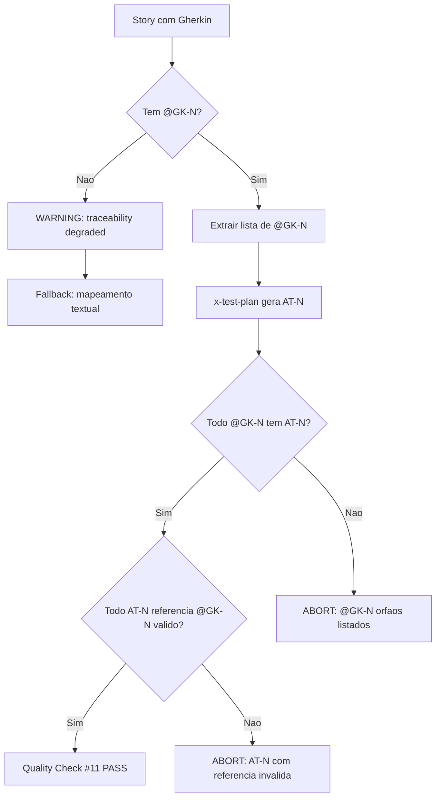
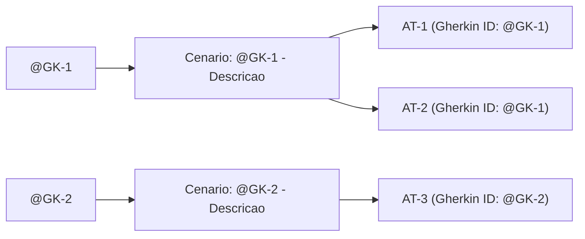

# Historia: Adicionar IDs @GK-N ao Gherkin e Enforcar Mapeamento AT-N

**ID:** story-0014-0003
**Chave Jira:** —
**Status:** Pendente

## 1. Dependencias

| Blocked By | Blocks |
| :--- | :--- |
| story-0014-0001 | story-0014-0004 |

## 2. Regras Transversais Aplicaveis

| ID | Titulo |
| :--- | :--- |
| RULE-003 | Rastreabilidade Bidirecional @GK-N <-> AT-N |
| RULE-006 | Backward Compatibility |

## 3. Descricao

Como **tech lead**, eu quero que cada cenario Gherkin tenha um ID estavel `@GK-N` e que o mapeamento entre cenarios Gherkin e acceptance tests (AT-N) seja bidirecional e enforced, para que nenhum criterio de aceite fique sem teste correspondente e nenhum teste referencie um cenario inexistente.

### Contexto

Atualmente, cenarios Gherkin em historias nao possuem IDs estaveis. O skill `x-test-plan` cria entradas AT-N a partir dos cenarios Gherkin por descricao textual, nao por ID. Se cenarios sao renumerados ou renomeados, o mapeamento quebra silenciosamente. O Quality Check #1 em `x-test-plan` diz "Every Gherkin scenario maps to >=1 acceptance test" mas e um item de checklist, nao uma validacao enforced -- ou seja, a verificacao depende de disciplina manual em vez de mecanismo de enforcement.

Este gap significa que:
- Cenarios podem ser adicionados ao Gherkin sem AT-N correspondente
- AT-N podem referenciar cenarios que foram renomeados ou removidos
- Nao ha forma automatica de verificar cobertura completa

### 3.1 Alteracoes em x-story-create/SKILL.md (Secao 7)

- Adicionar regra: cada cenario Gherkin DEVE ter tag `@GK-N` (sequencial, iniciando em 1)
- Formato: `Cenario: @GK-1 - Entrada nula retorna erro de validacao`
- PROIBIDO: renumerar @GK-N apos criacao inicial
- Novos cenarios recebem o proximo numero disponivel (append-only)
- Cenarios removidos: o numero @GK-N e aposentado, nunca reutilizado

### 3.2 Alteracoes em x-test-plan/SKILL.md (Step 2.1 e Quality Checks)

- Step 2.1 (linhas 72-83): renomear campo "Gherkin" para "Gherkin ID" com formato `@GK-N`
- Quality Check #1: mudar de checklist para validacao ENFORCED (ABORT se incompleto)
- Novo Quality Check #11: rastreabilidade bidirecional
  - Para cada @GK-N na story, deve existir >= 1 AT-N referenciando-o
  - Para cada AT-N no test plan, o @GK-N referenciado deve existir na story
  - Se qualquer violacao detectada: ABORT com mensagem listando @GK-N orfaos e AT-N com referencia invalida

### 3.3 Alteracoes em _TEMPLATE-STORY.md (criado por story-0014-0001)

- Secao 7 deve mostrar formato @GK-N nos cenarios de exemplo
- Incluir nota explicativa sobre imutabilidade dos IDs
- Exemplo: `Cenario: @GK-1 - Caso degenerado retorna vazio`

### 3.4 Backward Compatibility (RULE-006)

- Stories existentes sem @GK-N devem ser trataveis pelo x-test-plan
- Quando @GK-N ausente: x-test-plan emite WARNING e faz mapeamento por descricao textual (fallback)
- WARNING inclui mensagem: "Story lacks @GK-N IDs. Traceability is degraded. Consider adding @GK-N tags."
- Skills NAO devem abortar com stories pre-existentes sem @GK-N

## 3.5 Entrega de Valor

- **Valor Principal:** Rastreabilidade bidirecional entre criterios de aceite e testes, garantindo cobertura completa
- **Metrica de Sucesso:** 100% dos @GK-N mapeados para AT-N e vice-versa em stories novas
- **Impacto no Negocio:** Eliminacao de gaps silenciosos entre requisitos e testes, aumentando confianca na cobertura

## 4. Definicoes de Qualidade Locais

### DoR Local

- [ ] story-0014-0001 concluida (_TEMPLATE-STORY.md existe em `.claude/templates/`)
- [ ] `x-story-create/SKILL.md` Secao 7 (linhas 217-243) revisada
- [ ] `x-test-plan/SKILL.md` Step 2.1 (linhas 72-83) e Quality Checks (linhas 158-167) revisados
- [ ] Formato @GK-N definido e aprovado

### DoD Local

- [ ] `x-story-create/SKILL.md` Secao 7 atualizada com regra @GK-N
- [ ] `x-test-plan/SKILL.md` Step 2.1 campo renomeado para "Gherkin ID"
- [ ] Quality Check #1 enforced (ABORT em vez de checklist)
- [ ] Quality Check #11 criado (rastreabilidade bidirecional)
- [ ] `_TEMPLATE-STORY.md` Secao 7 com formato @GK-N nos exemplos
- [ ] Backward compatibility: WARNING para stories sem @GK-N, sem ABORT
- [ ] Stories existentes no repositorio continuam processaveis pelo x-test-plan

### Global DoD

- **Cobertura:** >= 95% Line, >= 90% Branch
- **Regressao:** Skills existentes continuam funcionais com stories pre-existentes
- **TDD Compliance:** Test-first pattern (teste precede implementacao no git log)
- **Rastreabilidade:** Todo @GK-N mapeia para >= 1 AT-N, todo AT-N referencia @GK-N valido

## 5. Contratos de Dados

**@GK-N Tag Format:**

| Campo | Tipo | Obrigatorio | Descricao |
| :--- | :--- | :--- | :--- |
| @GK-N tag | String pattern `@GK-\d+` | Sim | `@GK-` + inteiro sequencial, imutavel apos criacao |
| AT-N Gherkin ID field | String | Sim | Referencia @GK-N da story no test plan |
| Quality Check #11 | Validation rule | Sim | Bidirecional: todo AT-N -> @GK-N e todo @GK-N -> AT-N |

**Gherkin Scenario Format:**

| Elemento | Formato Anterior | Formato Novo |
| :--- | :--- | :--- |
| Cenario header | `Cenario: Descricao livre` | `Cenario: @GK-N - Descricao livre` |
| AT-N Gherkin field | `Gherkin: "texto descritivo"` | `Gherkin ID: @GK-N` |

**Backward Compatibility Contract:**

| Condicao | Comportamento |
| :--- | :--- |
| Story com @GK-N | Validacao bidirecional enforced |
| Story sem @GK-N | WARNING + fallback por descricao textual |
| @GK-N referenciado por AT-N mas ausente na story | ABORT com lista de referencias invalidas |

## 6. Diagramas

### 6.1 Fluxo de Rastreabilidade @GK-N <-> AT-N



### 6.2 Formato do Cenario Gherkin



## 7. Criterios de Aceite (Gherkin)

```gherkin
Cenario: @GK-1 - Cenario Gherkin sem tag @GK-N processado com warning
  DADO que uma story existente nao possui tags @GK-N nos cenarios
  QUANDO o x-test-plan processa a story
  ENTAO o test plan e gerado usando mapeamento por descricao textual
  E um WARNING e emitido: "Story lacks @GK-N IDs. Traceability is degraded."
  E o processo NAO aborta

Cenario: @GK-2 - Cenario Gherkin com @GK-N gera AT-N com referencia correta
  DADO que uma story possui cenarios com tags @GK-1 e @GK-2
  QUANDO o x-test-plan gera o test plan
  ENTAO cada AT-N gerado possui campo "Gherkin ID" com valor @GK-1 ou @GK-2
  E todo @GK-N da story tem pelo menos um AT-N correspondente

Cenario: @GK-3 - Quality Check #1 aborta quando @GK-N nao tem AT-N
  DADO que uma story possui cenarios @GK-1, @GK-2 e @GK-3
  E o test plan gerado possui AT-N apenas para @GK-1 e @GK-2
  QUANDO o Quality Check #1 executa
  ENTAO o processo ABORTA
  E a mensagem de erro lista "@GK-3" como cenario sem teste correspondente

Cenario: @GK-4 - Quality Check #11 aborta quando AT-N referencia @GK-N inexistente
  DADO que um test plan possui AT-1 referenciando @GK-1 e AT-2 referenciando @GK-5
  E a story possui apenas cenarios @GK-1, @GK-2 e @GK-3
  QUANDO o Quality Check #11 executa
  ENTAO o processo ABORTA
  E a mensagem de erro lista "AT-2 referencia @GK-5 inexistente"

Cenario: @GK-5 - Novos cenarios recebem proximo @GK-N disponivel
  DADO que uma story possui cenarios @GK-1, @GK-2 e @GK-3
  QUANDO um novo cenario e adicionado a story
  ENTAO o novo cenario recebe @GK-4
  E os cenarios existentes mantem seus IDs inalterados

Cenario: @GK-6 - IDs @GK-N removidos nao sao reutilizados
  DADO que uma story possuia cenarios @GK-1, @GK-2 e @GK-3
  E o cenario @GK-2 foi removido
  QUANDO um novo cenario e adicionado
  ENTAO o novo cenario recebe @GK-4, nao @GK-2
  E o numero @GK-2 permanece aposentado

Cenario: @GK-7 - Rastreabilidade bidirecional completa passa Quality Checks
  DADO que uma story possui cenarios @GK-1, @GK-2, @GK-3 e @GK-4
  E o test plan possui AT-N para cada um dos 4 cenarios
  E todo AT-N referencia um @GK-N existente na story
  QUANDO os Quality Checks #1 e #11 executam
  ENTAO ambos os checks passam
  E nenhum WARNING ou ABORT e emitido
```

### 7.2 Mandatory Scenario Categories

- [x] Degenerate cases (@GK-1: story sem @GK-N, fallback com warning)
- [x] Happy path (@GK-2: mapeamento correto, @GK-7: rastreabilidade completa)
- [x] Error paths (@GK-3: @GK-N orfao, @GK-4: AT-N com referencia invalida)
- [x] Boundary values (@GK-5: sequenciamento de novos IDs)
- [x] Edge cases (@GK-6: IDs removidos nao reutilizados)

## 8. Sub-tarefas

### Ciclos TDD

- [ ] [TDD] AT-1 (@GK-1): Escrever acceptance test — story sem @GK-N gera warning sem abort (RED)
- [ ] [TDD] AT-1 (@GK-1): Implementar fallback por descricao textual com warning em x-test-plan (GREEN)
- [ ] [TDD] AT-1 (@GK-1): Refatorar logica de deteccao de @GK-N (REFACTOR)
- [ ] [TDD] AT-2 (@GK-2): Escrever acceptance test — @GK-N gera AT-N com Gherkin ID correto (RED)
- [ ] [TDD] AT-2 (@GK-2): Implementar campo "Gherkin ID" no x-test-plan Step 2.1 (GREEN)
- [ ] [TDD] AT-2 (@GK-2): Refatorar extracao de @GK-N para funcao reutilizavel (REFACTOR)
- [ ] [TDD] AT-3 (@GK-3): Escrever acceptance test — Quality Check #1 aborta para @GK-N orfao (RED)
- [ ] [TDD] AT-3 (@GK-3): Implementar Quality Check #1 enforced com ABORT em x-test-plan (GREEN)
- [ ] [TDD] AT-4 (@GK-4): Escrever acceptance test — Quality Check #11 aborta para referencia invalida (RED)
- [ ] [TDD] AT-4 (@GK-4): Implementar Quality Check #11 bidirecional em x-test-plan (GREEN)
- [ ] [TDD] AT-4 (@GK-4): Refatorar Quality Checks #1 e #11 para compartilhar parser de @GK-N (REFACTOR)
- [ ] [TDD] AT-5 (@GK-5): Escrever acceptance test — novo cenario recebe proximo @GK-N (RED)
- [ ] [TDD] AT-5 (@GK-5): Implementar regra de sequenciamento em x-story-create Secao 7 (GREEN)
- [ ] [TDD] AT-6 (@GK-6): Escrever acceptance test — @GK-N removido nao e reutilizado (RED)
- [ ] [TDD] AT-6 (@GK-6): Implementar regra de aposentadoria de IDs (GREEN)
- [ ] [TDD] AT-7 (@GK-7): Escrever acceptance test — rastreabilidade bidirecional completa (RED)
- [ ] [TDD] AT-7 (@GK-7): Verificar que todos os checks passam com mapeamento completo (GREEN)

### Tarefas nao-TDD

- [ ] [Doc] Atualizar x-story-create/SKILL.md Secao 7 com regra @GK-N
- [ ] [Doc] Atualizar x-test-plan/SKILL.md Step 2.1 (renomear campo para "Gherkin ID")
- [ ] [Doc] Atualizar _TEMPLATE-STORY.md Secao 7 com formato @GK-N nos exemplos
- [ ] [Doc] Documentar contrato de backward compatibility para stories sem @GK-N
