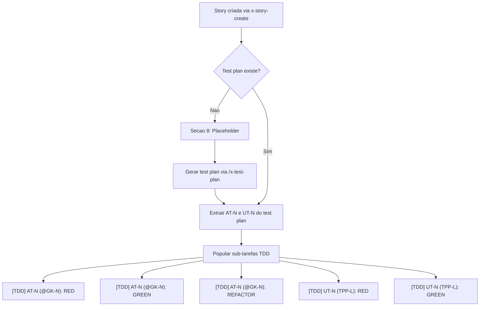
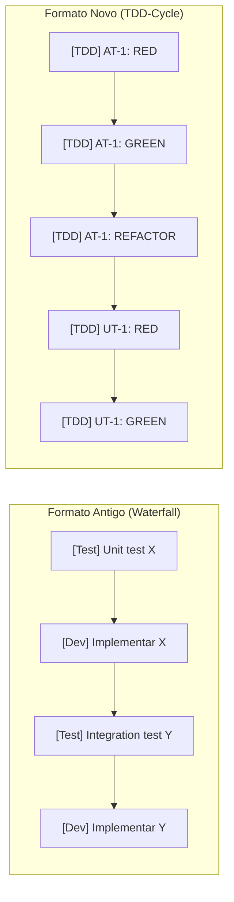

# Historia: Reestruturar Sub-tarefas para Formato TDD-Cycle

**ID:** story-0014-0004
**Chave Jira:** —
**Status:** Pendente

## 1. Dependencias

| Blocked By | Blocks |
| :--- | :--- |
| story-0014-0001, story-0014-0003 | story-0014-0006 |

## 2. Regras Transversais Aplicaveis

| ID | Titulo |
| :--- | :--- |
| RULE-004 | Sub-tarefas Refletem Ciclos TDD |
| RULE-003 | Rastreabilidade Bidirecional @GK-N <-> AT-N |
| RULE-006 | Backward Compatibility |

## 3. Descricao

Como **tech lead**, eu quero que sub-tarefas em historias usem formato TDD-cycle com tags `[TDD]` e referencias a AT-N/UT-N, substituindo o formato `[Dev]`/`[Test]` atual, para que o progresso das sub-tarefas reflita aderencia real ao TDD em vez de sugerir fases sequenciais (implementa tudo, depois testa tudo).

### Contexto

Atualmente, sub-tarefas em historias usam tags baseadas em papel: `[Dev]`, `[Test]`, `[Doc]`. Este formato encoraja uma mentalidade waterfall: primeiro implementar tudo, depois testar. TDD requer intercalamento: escrever teste, escrever codigo, refatorar. O progresso de sub-tarefas deveria refletir ciclos TDD completos, nao fases sequenciais.

O formato atual:
```
- [ ] [Test] Unit test: funcao X retorna Y
- [ ] [Dev] Implementar funcao X
- [ ] [Test] Integration test: pipeline gera Z
- [ ] [Doc] Documentar funcao X
```

O formato proposto:
```
- [ ] [TDD] AT-1 (@GK-1): Escrever acceptance test (RED)
- [ ] [TDD] AT-1 (@GK-1): Implementar codigo minimo (GREEN)
- [ ] [TDD] AT-1 (@GK-1): Refatorar (REFACTOR)
- [ ] [TDD] UT-1 (TPP-1: nil->constant): Unit test para caso nulo (RED)
- [ ] [TDD] UT-1 (TPP-1): Implementar retorno constante (GREEN)
- [ ] [Doc] Documentar funcao X
```

### 3.1 Alteracoes em x-story-create/SKILL.md (Secao 8)

- Substituir formato `[Dev]`/`[Test]` pelo formato hibrido TDD:
  - **Secao "Ciclos TDD"**: sub-tarefas com tag `[TDD]` seguidas de referencia AT-N ou UT-N
    - AT-N sub-tarefas incluem referencia @GK-N: `[TDD] AT-N (@GK-N): descricao (RED/GREEN/REFACTOR)`
    - UT-N sub-tarefas incluem nivel TPP: `[TDD] UT-N (TPP-L: transformacao): descricao (RED/GREEN)`
  - **Secao "Tarefas nao-TDD"**: sub-tarefas com tag `[Doc]` para documentacao, configuracao, etc.
- Regra: sub-tarefas TDD sao populadas APOS geracao do test plan; antes disso, placeholder

### 3.2 Formato do Placeholder (pre-test-plan)

Antes da geracao do test plan, Secao 8 deve conter:

```
### Ciclos TDD

> Sub-tarefas TDD serao populadas apos geracao do test plan via `/x-test-plan`.
> Cada AT-N e UT-N do test plan gerara entradas [TDD] com ciclos RED/GREEN/REFACTOR.

### Tarefas nao-TDD

- [ ] [Doc] (tarefas de documentacao identificadas durante planejamento)
```

### 3.3 Alteracoes em _TEMPLATE-STORY.md (criado por story-0014-0001)

- Secao 8 deve mostrar formato TDD-cycle com exemplos concretos
- Incluir placeholder para estado pre-test-plan
- Incluir exemplo completo para estado pos-test-plan

### 3.4 Novo item no DoD Local de x-story-create

Adicionar os seguintes itens ao DoD Local gerado por x-story-create:

- `- [ ] Test plan exists at docs/stories/epic-XXXX/plans/tests-story-XXXX-YYYY.md`
- `- [ ] All @GK-N mapped to AT-N`
- `- [ ] TPP ordering verified`
- `- [ ] All AT-N GREEN`
- `- [ ] Commits show test-first pattern`

### 3.5 Backward Compatibility (RULE-006)

- Stories existentes com formato `[Dev]`/`[Test]` continuam validas
- Skills devem reconhecer ambos os formatos durante periodo de transicao
- Novas stories DEVEM usar formato `[TDD]`; formato antigo e DEPRECATED

## 3.5 Entrega de Valor

- **Valor Principal:** Sub-tarefas que refletem ciclos TDD reais, substituindo mentalidade waterfall
- **Metrica de Sucesso:** 100% das novas stories usam formato [TDD] em sub-tarefas
- **Impacto no Negocio:** Progresso visivel de TDD compliance em cada story, facilitando auditoria e coaching

## 4. Definicoes de Qualidade Locais

### DoR Local

- [ ] story-0014-0001 concluida (_TEMPLATE-STORY.md existe em `.claude/templates/`)
- [ ] story-0014-0003 concluida (formato @GK-N definido e implementado)
- [ ] `x-story-create/SKILL.md` Secao 8 revisada
- [ ] Formato [TDD] AT-N/UT-N definido e aprovado
- [ ] Niveis TPP (1-6) documentados em testing KP

### DoD Local

- [ ] `x-story-create/SKILL.md` Secao 8 atualizada com formato TDD-cycle
- [ ] Placeholder pre-test-plan definido no template
- [ ] `_TEMPLATE-STORY.md` Secao 8 com exemplos TDD-cycle e placeholder
- [ ] DoD Local em x-story-create inclui 5 novos itens de verificacao TDD
- [ ] Backward compatibility: formato `[Dev]`/`[Test]` reconhecido sem erro
- [ ] Test plan exists at `docs/stories/epic-XXXX/plans/tests-story-XXXX-YYYY.md`
- [ ] All @GK-N mapped to AT-N
- [ ] TPP ordering verified
- [ ] All AT-N GREEN
- [ ] Commits show test-first pattern

### Global DoD

- **Cobertura:** >= 95% Line, >= 90% Branch
- **Regressao:** Skills existentes continuam funcionais com stories pre-existentes
- **TDD Compliance:** Test-first pattern (teste precede implementacao no git log)
- **Rastreabilidade:** Sub-tarefas [TDD] referenciam AT-N e UT-N validos do test plan

## 5. Contratos de Dados

**Sub-task Format:**

| Campo | Tipo | Obrigatorio | Descricao |
| :--- | :--- | :--- | :--- |
| [TDD] tag | String prefix | Sim | Substitui [Dev]/[Test] para sub-tarefas de ciclo TDD |
| AT-N reference | String `AT-\d+` | Sim | Referencia acceptance test no test plan |
| UT-N reference | String `UT-\d+` | Sim | Referencia unit test no test plan |
| @GK-N reference | String `@GK-\d+` | Condicional | Obrigatorio para sub-tarefas AT-N; liga ao cenario Gherkin |
| TPP Level | Integer 1-6 | Condicional | Obrigatorio para sub-tarefas UT-N; indica nivel de transformacao |
| Phase tag | Enum (RED, GREEN, REFACTOR) | Sim | Indica fase do ciclo TDD |

**TPP Levels:**

| Level | Transformacao | Descricao |
| :--- | :--- | :--- |
| 1 | {} -> nil | De nada para nulo/vazio |
| 2 | nil -> constant | De nulo para constante |
| 3 | constant -> constant+ | De constante para constante mais complexa |
| 4 | constant -> scalar | De constante para variavel |
| 5 | scalar -> collection | De escalar para colecao |
| 6 | collection -> recursion | De colecao para recursao |

**DoD Local Items (novos):**

| Item | Descricao |
| :--- | :--- |
| Test plan exists | Arquivo de test plan existe no caminho padrao |
| @GK-N mapped to AT-N | Todo cenario Gherkin tem acceptance test correspondente |
| TPP ordering verified | Unit tests seguem ordem TPP (simples -> complexo) |
| All AT-N GREEN | Todos os acceptance tests passando |
| Commits show test-first | Teste precede implementacao no historico git |

## 6. Diagramas

### 6.1 Ciclo de Vida da Sub-tarefa TDD



### 6.2 Comparacao de Formatos



## 7. Criterios de Aceite (Gherkin)

```gherkin
Cenario: @GK-1 - Story sem test plan mostra placeholder na Secao 8
  DADO que uma story e criada via x-story-create
  E nenhum test plan foi gerado ainda
  QUANDO a Secao 8 e renderizada
  ENTAO a secao "Ciclos TDD" contem mensagem de placeholder
  E a mensagem referencia "/x-test-plan" para geracao
  E a secao "Tarefas nao-TDD" contem entradas [Doc] identificadas

Cenario: @GK-2 - Sub-tarefas TDD populadas apos geracao do test plan
  DADO que uma story possui cenarios @GK-1, @GK-2 e @GK-3
  E um test plan e gerado com AT-1, AT-2, AT-3, UT-1, UT-2
  QUANDO as sub-tarefas sao populadas na Secao 8
  ENTAO existem entradas [TDD] para AT-1 (RED, GREEN, REFACTOR)
  E existem entradas [TDD] para AT-2 (RED, GREEN, REFACTOR)
  E existem entradas [TDD] para AT-3 (RED, GREEN, REFACTOR)
  E existem entradas [TDD] para UT-1 (RED, GREEN)
  E existem entradas [TDD] para UT-2 (RED, GREEN)

Cenario: @GK-3 - Sub-tarefa AT-N inclui referencia @GK-N
  DADO que um cenario Gherkin possui tag @GK-2
  E o test plan possui AT-1 mapeado para @GK-2
  QUANDO a sub-tarefa e gerada
  ENTAO o formato e "[TDD] AT-1 (@GK-2): descricao (RED)"
  E a referencia @GK-2 e rastreavel ao cenario Gherkin original

Cenario: @GK-4 - Sub-tarefa UT-N inclui nivel TPP
  DADO que o test plan possui UT-3 com nivel TPP-2 (nil->constant)
  QUANDO a sub-tarefa e gerada
  ENTAO o formato e "[TDD] UT-3 (TPP-2: nil->constant): descricao (RED)"
  E o nivel TPP corresponde a transformacao documentada

Cenario: @GK-5 - Stories com formato antigo [Dev]/[Test] processadas sem erro
  DADO que uma story existente possui sub-tarefas com tags [Dev] e [Test]
  QUANDO um skill processa a story
  ENTAO o skill reconhece o formato antigo sem erro
  E nenhum ABORT ou excecao e lancado
  E o skill opera normalmente com as sub-tarefas existentes

Cenario: @GK-6 - DoD Local inclui itens de verificacao TDD
  DADO que uma nova story e criada via x-story-create
  QUANDO a Secao 4 (DoD Local) e gerada
  ENTAO contem item "Test plan exists at docs/stories/epic-XXXX/plans/tests-story-XXXX-YYYY.md"
  E contem item "All @GK-N mapped to AT-N"
  E contem item "TPP ordering verified"
  E contem item "All AT-N GREEN"
  E contem item "Commits show test-first pattern"

Cenario: @GK-7 - Novas stories usam formato [TDD] exclusivamente
  DADO que x-story-create gera uma nova story
  QUANDO a Secao 8 e populada com sub-tarefas de codigo e teste
  ENTAO todas as sub-tarefas de codigo e teste usam tag [TDD]
  E nenhuma sub-tarefa usa tags [Dev] ou [Test]
  E apenas sub-tarefas de documentacao usam tag [Doc]
```

### 7.2 Mandatory Scenario Categories

- [x] Degenerate cases (@GK-1: story sem test plan, placeholder)
- [x] Happy path (@GK-2: sub-tarefas populadas, @GK-3: AT-N com @GK-N, @GK-4: UT-N com TPP)
- [x] Error paths (@GK-5: backward compatibility com formato antigo)
- [x] Boundary values (@GK-6: DoD Local com itens TDD)
- [x] Edge cases (@GK-7: novas stories usam [TDD] exclusivamente)

## 8. Sub-tarefas

### Ciclos TDD

- [ ] [TDD] AT-1 (@GK-1): Escrever acceptance test — story sem test plan mostra placeholder (RED)
- [ ] [TDD] AT-1 (@GK-1): Implementar placeholder na Secao 8 de x-story-create (GREEN)
- [ ] [TDD] AT-1 (@GK-1): Refatorar template de placeholder (REFACTOR)
- [ ] [TDD] AT-2 (@GK-2): Escrever acceptance test — sub-tarefas TDD populadas do test plan (RED)
- [ ] [TDD] AT-2 (@GK-2): Implementar populacao de sub-tarefas a partir de AT-N/UT-N (GREEN)
- [ ] [TDD] AT-2 (@GK-2): Refatorar geracao de sub-tarefas para funcao dedicada (REFACTOR)
- [ ] [TDD] AT-3 (@GK-3): Escrever acceptance test — AT-N inclui @GK-N na sub-tarefa (RED)
- [ ] [TDD] AT-3 (@GK-3): Implementar formato [TDD] AT-N (@GK-N) em x-story-create (GREEN)
- [ ] [TDD] AT-4 (@GK-4): Escrever acceptance test — UT-N inclui nivel TPP na sub-tarefa (RED)
- [ ] [TDD] AT-4 (@GK-4): Implementar formato [TDD] UT-N (TPP-L) em x-story-create (GREEN)
- [ ] [TDD] AT-4 (@GK-4): Refatorar formatacao de sub-tarefas AT e UT para compartilhar base (REFACTOR)
- [ ] [TDD] AT-5 (@GK-5): Escrever acceptance test — formato antigo processado sem erro (RED)
- [ ] [TDD] AT-5 (@GK-5): Implementar deteccao e tratamento de formato legacy (GREEN)
- [ ] [TDD] AT-6 (@GK-6): Escrever acceptance test — DoD Local com 5 itens TDD (RED)
- [ ] [TDD] AT-6 (@GK-6): Implementar novos itens DoD Local em x-story-create (GREEN)
- [ ] [TDD] AT-7 (@GK-7): Escrever acceptance test — novas stories usam [TDD] exclusivamente (RED)
- [ ] [TDD] AT-7 (@GK-7): Verificar que x-story-create nao gera [Dev]/[Test] em novas stories (GREEN)

### Tarefas nao-TDD

- [ ] [Doc] Atualizar x-story-create/SKILL.md Secao 8 com formato TDD-cycle
- [ ] [Doc] Atualizar _TEMPLATE-STORY.md Secao 8 com placeholder e exemplos TDD
- [ ] [Doc] Documentar niveis TPP (1-6) e formato de referencia em sub-tarefas
- [ ] [Doc] Adicionar nota de deprecacao para formato [Dev]/[Test] em x-story-create
