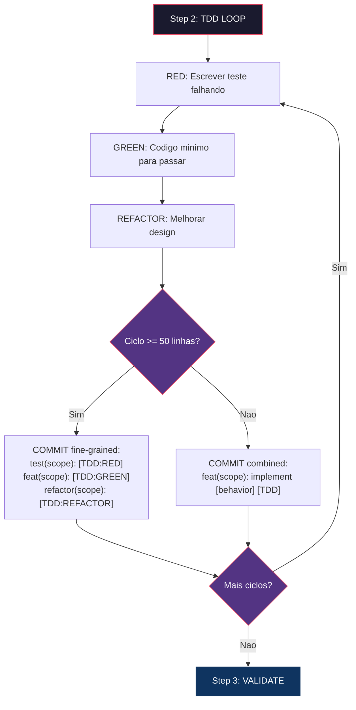
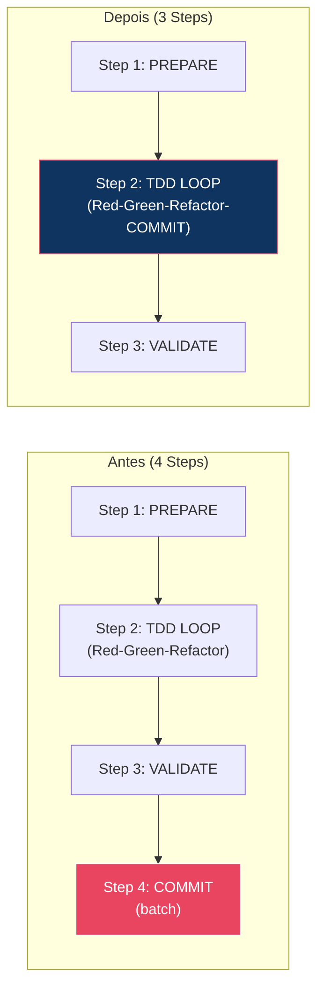

# Historia: Corrigir Commit Ordering no x-dev-implement

**ID:** story-0014-0005
**Chave Jira:** --
**Status:** Concluída

## 1. Dependencias

| Blocked By | Blocks |
| :--- | :--- |
| -- | story-0014-0006 |

## 2. Regras Transversais Aplicaveis

| ID | Titulo |
| :--- | :--- |
| RULE-005 | Commit Atomico por Ciclo TDD |
| RULE-006 | Backward Compatibility |

## 3. Descricao

Como **Tech Lead**, eu quero que o x-dev-implement estruture commits como parte integral de cada ciclo TDD (Red-Green-Refactor-COMMIT), e que exista uma tabela de decisao clara para formato de commit (combined vs fine-grained), para que commits atomicos acontecam durante cada ciclo TDD e nao em batch ao final.

### Contexto

No x-dev-implement/SKILL.md atual, Step 4 (Commit) vem depois de Step 2 (TDD Loop) e Step 3 (Validate). Esta ordenacao sequencial implica que commits acontecem apos TODOS os ciclos TDD estarem completos. Porem, as instrucoes de commit dizem "Make atomic commits per TDD cycle" -- significando que commits deveriam acontecer DURANTE Step 2, nao depois. Esta contradicao estrutural permite que desenvolvedores acumulem mudancas e facam commits em batch, violando o principio de atomicidade TDD.

Adicionalmente, x-dev-lifecycle/SKILL.md Phase 2 apresenta dois formatos de commit sem criterio claro para quando usar cada um:

1. Combined: `feat(scope): implement [behavior] [TDD]`
2. Fine-grained: `test(scope): [TDD:RED]` + `feat(scope): [TDD:GREEN]` + `refactor(scope): [TDD:REFACTOR]`

O item 25 do checklist do QA engineer ("Commits show test-first pattern") so e verificavel com commits fine-grained, tornando a opcao combined invisivel para auditoria.

### 3.1 Reestruturacao de Steps no x-dev-implement

O x-dev-implement/SKILL.md deve ser reestruturado de 4 steps para 3:

| Antes (4 Steps) | Depois (3 Steps) |
| :--- | :--- |
| Step 1: PREPARE + UNDERSTAND | Step 1: PREPARE + UNDERSTAND (inalterado) |
| Step 2: TDD LOOP (Red-Green-Refactor) | Step 2: TDD LOOP (Red-Green-Refactor-**COMMIT**) |
| Step 3: VALIDATE | Step 3: VALIDATE (validacao final) |
| Step 4: COMMIT (batch) | (removido -- absorvido pelo Step 2) |

O Step 4 atual deve ser movido para dentro do Step 2, como 4a fase de cada ciclo. O loop interno passa a ser:

1. **RED**: Escrever teste falhando
2. **GREEN**: Implementar codigo minimo para passar
3. **REFACTOR**: Melhorar design sem alterar comportamento
4. **COMMIT**: Commit atomico com sufixo TDD apropriado

### 3.2 Tabela de Decisao de Formato de Commit

Uma tabela de decisao deve ser adicionada ao x-dev-implement/SKILL.md e ao x-dev-lifecycle/SKILL.md:

| Cenario | Formato | Razao |
| :--- | :--- | :--- |
| Ciclo TDD simples (<50 linhas) | Combined `[TDD]` | Menor overhead |
| Ciclo TDD complexo (>50 linhas) | Fine-grained `[TDD:RED]`+`[TDD:GREEN]` | Verificavel no git log |
| Refactoring nao-trivial | Separado `[TDD:REFACTOR]` | Prova que nenhum comportamento foi adicionado |
| Execucao de epic com TDD gate | Fine-grained | Requerido para verificacao automatizada |

### 3.3 Criterios de Formato

O criterio de 50 linhas refere-se ao total de linhas alteradas (teste + producao) em um ciclo TDD completo. O formato fine-grained deve produzir commits na ordem: RED antes de GREEN para cada par, tornando o padrao test-first visivel no `git log --oneline`.

## 3.5 Entrega de Valor

- **Valor Principal:** Commits atomicos durante cada ciclo TDD, nao em batch ao final
- **Metrica de Sucesso:** Step count reduzido de 4 para 3; tabela de decisao de formato presente em ambos os skills
- **Impacto no Negocio:** Rastreabilidade de TDD no historico de commits, viabilizando verificacao automatizada pelo integrity gate

## 4. Definicoes de Qualidade Locais

### DoR Local

- [ ] x-dev-implement/SKILL.md lido e steps 1-4 compreendidos
- [ ] x-dev-lifecycle/SKILL.md Phase 2 lida e formatos de commit identificados
- [ ] QA engineer checklist item 25 compreendido
- [ ] RULE-005 (Commit Atomico por Ciclo TDD) revisada
- [ ] RULE-006 (Backward Compatibility) revisada

### DoD Local

- [ ] x-dev-implement/SKILL.md reestruturado de 4 steps para 3
- [ ] Step 4 (COMMIT) movido para dentro de Step 2 como 4a fase do ciclo TDD
- [ ] Fases do ciclo TDD documentadas como RED -> GREEN -> REFACTOR -> COMMIT
- [ ] Tabela de decisao de formato de commit adicionada ao x-dev-implement/SKILL.md
- [ ] Tabela de decisao de formato de commit adicionada ao x-dev-lifecycle/SKILL.md
- [ ] Criterio de 50 linhas documentado com definicao precisa
- [ ] Ordem fine-grained (RED antes de GREEN) explicitamente documentada
- [ ] Skills existentes continuam funcionais com stories pre-existentes (backward compatibility)

### Global DoD

- **Cobertura:** >= 95% Line, >= 90% Branch
- **Regressao:** Skills existentes continuam funcionais
- **TDD Compliance:** Test-first pattern nos commits desta story
- **Backward Compatibility:** Stories existentes sem tabela de decisao devem ser trataveis

## 5. Contratos de Dados

**Estrutura do Step 2 (TDD LOOP) atualizado:**

| Campo | Tipo | Obrigatorio | Descricao |
| :--- | :--- | :--- | :--- |
| Step count | Integer | Sim | Reduzido de 4 para 3 |
| Cycle phases | Ordered list | Sim | RED -> GREEN -> REFACTOR -> COMMIT |
| Commit format table | Markdown table | Sim | Criterios de decisao para combined vs fine-grained |
| Line threshold | Integer | Sim | 50 linhas (total alteradas no ciclo) |

**Tabela de Decisao (formato):**

| Campo | Tipo | Obrigatorio | Descricao |
| :--- | :--- | :--- | :--- |
| Cenario | String | Sim | Descricao do cenario de uso |
| Formato | Enum | Sim | Combined [TDD] ou Fine-grained [TDD:RED]+[TDD:GREEN]+[TDD:REFACTOR] |
| Razao | String | Sim | Justificativa para a escolha do formato |

## 6. Diagramas

### 6.1 Ciclo TDD com COMMIT integrado (Depois)



### 6.2 Comparacao Antes vs Depois



## 7. Criterios de Aceite (Gherkin)

```gherkin
@GK-1
Cenario: x-dev-implement possui exatamente 3 steps
  DADO que o x-dev-implement/SKILL.md foi reestruturado
  QUANDO o conteudo do SKILL.md e analisado
  ENTAO devem existir exatamente 3 steps numerados
  E Step 1 e "PREPARE + UNDERSTAND"
  E Step 2 e "TDD LOOP"
  E Step 3 e "VALIDATE"
  E nao deve existir Step 4

@GK-2
Cenario: Step 2 do TDD LOOP inclui COMMIT como 4a fase
  DADO que o Step 2 (TDD LOOP) do x-dev-implement/SKILL.md esta documentado
  QUANDO as fases do ciclo sao listadas
  ENTAO as fases sao RED, GREEN, REFACTOR, COMMIT nesta ordem
  E a fase COMMIT e parte integral do loop, nao um step separado

@GK-3
Cenario: Tabela de decisao de formato de commit presente no x-dev-implement
  DADO que o x-dev-implement/SKILL.md foi atualizado
  QUANDO a secao de commit format e analisada
  ENTAO deve existir uma tabela com pelo menos 4 cenarios
  E o cenario "Ciclo TDD simples (<50 linhas)" indica formato Combined [TDD]
  E o cenario "Ciclo TDD complexo (>50 linhas)" indica formato Fine-grained
  E o cenario "Execucao de epic com TDD gate" indica formato Fine-grained

@GK-4
Cenario: Tabela de decisao de formato de commit presente no x-dev-lifecycle
  DADO que o x-dev-lifecycle/SKILL.md foi atualizado
  QUANDO a secao Phase 2 e analisada
  ENTAO deve existir a mesma tabela de decisao de formato de commit
  E os criterios sao identicos aos do x-dev-implement

@GK-5
Cenario: Formato fine-grained exige RED antes de GREEN no git log
  DADO que o formato fine-grained e usado em um ciclo TDD
  QUANDO os commits sao analisados no git log
  ENTAO o commit [TDD:RED] deve preceder o commit [TDD:GREEN] para cada par
  E o commit [TDD:REFACTOR] deve vir apos [TDD:GREEN] quando presente

@GK-6
Cenario: Skills continuam funcionais com stories pre-existentes
  DADO que existem stories criadas antes desta mudanca (sem tabela de decisao)
  QUANDO o x-dev-implement e invocado para implementar uma story pre-existente
  ENTAO o skill deve funcionar sem erro
  E o formato combined [TDD] deve ser usado como default quando nenhum criterio explicito existe
```

### 7.1 Scenario Ordering (TPP)

> TPP: degenerate (step count exato) -> constant (COMMIT como 4a fase) -> constant+ (tabela de decisao no implement) -> scalar (tabela de decisao no lifecycle) -> conditions (RED antes de GREEN) -> edge cases (backward compatibility com stories pre-existentes).

### 7.2 Mandatory Scenario Categories

- [x] Degenerate cases (exatamente 3 steps, sem Step 4)
- [x] Happy path (COMMIT como fase do ciclo, tabela de decisao presente)
- [x] Error paths (formato fine-grained com ordem incorreta)
- [x] Boundary values (backward compatibility com stories pre-existentes)

## 8. Sub-tarefas

- [x] [TDD] AT-1 (@GK-1): Escrever teste que valida x-dev-implement tem exatamente 3 steps (RED)
- [x] [TDD] AT-1 (@GK-1): Reestruturar x-dev-implement/SKILL.md de 4 para 3 steps (GREEN)
- [x] [TDD] AT-2 (@GK-2): Escrever teste que valida COMMIT como 4a fase do ciclo no Step 2 (RED)
- [x] [TDD] AT-2 (@GK-2): Mover instrucoes de commit do Step 4 para dentro do Step 2 (GREEN)
- [x] [TDD] AT-2 (@GK-2): Refatorar documentacao do Step 2 para clareza (REFACTOR)
- [x] [TDD] AT-3 (@GK-3): Escrever teste que valida presenca da tabela de decisao no x-dev-implement (RED)
- [x] [TDD] AT-3 (@GK-3): Adicionar tabela de decisao de formato de commit ao x-dev-implement/SKILL.md (GREEN)
- [x] [TDD] AT-4 (@GK-4): Escrever teste que valida presenca da tabela de decisao no x-dev-lifecycle (RED)
- [x] [TDD] AT-4 (@GK-4): Adicionar tabela de decisao de formato de commit ao x-dev-lifecycle/SKILL.md Phase 2 (GREEN)
- [x] [TDD] AT-5 (@GK-5): Escrever teste que valida ordem RED antes de GREEN no formato fine-grained (RED)
- [x] [TDD] AT-5 (@GK-5): Documentar regra de ordenacao fine-grained em ambos os skills (GREEN)
- [x] [TDD] AT-6 (@GK-6): Escrever teste que valida backward compatibility com stories sem tabela de decisao (RED)
- [x] [TDD] AT-6 (@GK-6): Garantir default para formato combined [TDD] quando criterio nao e explicito (GREEN)
- [x] [TDD] AT-6 (@GK-6): Refatorar instrucoes de backward compatibility para clareza (REFACTOR)
