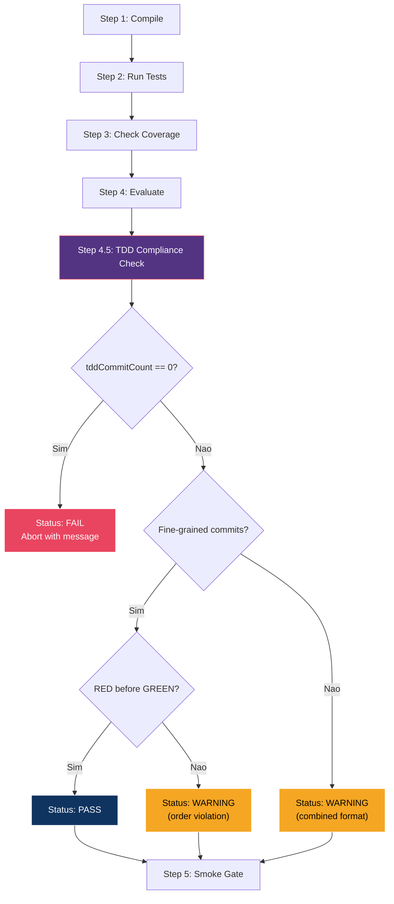
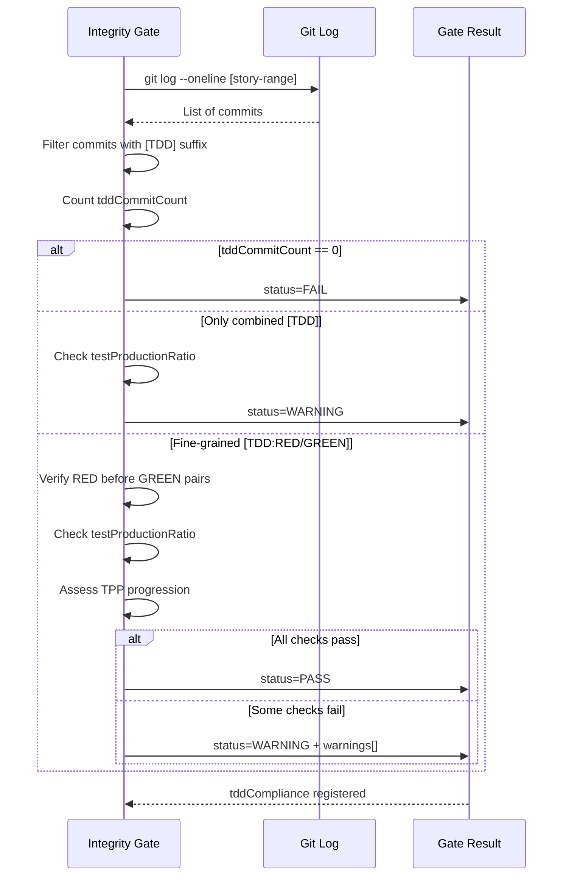

# Historia: Adicionar TDD Compliance ao Integrity Gate do Epic

**ID:** story-0014-0006
**Chave Jira:** --
**Status:** Pendente

## 1. Dependencias

| Blocked By | Blocks |
| :--- | :--- |
| story-0014-0002, story-0014-0004, story-0014-0005 | story-0014-0007 |

## 2. Regras Transversais Aplicaveis

| ID | Titulo |
| :--- | :--- |
| RULE-002 | TDD Sem Escape Hatch |
| RULE-005 | Commit Atomico por Ciclo TDD |
| RULE-007 | Verificacao em Multiplos Niveis |

## 3. Descricao

Como **QA Engineer**, eu quero que o integrity gate do x-dev-epic-implement verifique TDD compliance nos commits de cada story completada, para que desvios do padrao test-first sejam detectados automaticamente durante a execucao de epicos, antes de atingirem o review final.

### Contexto

O integrity gate em x-dev-epic-implement/SKILL.md executa apos cada fase e verifica: compile, tests pass, coverage thresholds, smoke tests. Porem, nao verifica TDD compliance: nao valida se commits seguem padrao test-first, se sufixos TDD estao presentes, ou se a progressao TPP e visivel no historico de commits. Um desenvolvedor pode escrever todo o codigo primeiro e depois todos os testes, passar o gate, e prosseguir -- violando regras TDD.

RULE-007 (Verificacao em Multiplos Niveis) define que TDD compliance deve ser verificada em 3 niveis: (1) Phase 0 do lifecycle (abort se test plan ausente), (2) Integrity gate do epic (warning de TDD compliance), (3) Tech Lead review (NO-GO se itens TDD falham). Esta story implementa o nivel 2.

### 3.1 TDD Compliance Check (Step 4.5)

Um novo passo deve ser adicionado ao Integrity Gate, entre Step 4 (Evaluate) e Step 5 (Smoke Gate):

**Step 4.5: TDD Compliance Check**

Para cada story completada, analisar o git log:

1. **Suffix Verification:** Verificar >= 1 commit com sufixo `[TDD]`, `[TDD:RED]`, ou `[TDD:GREEN]`
2. **Order Verification:** Se commits fine-grained existem, verificar que `[TDD:RED]` precede `[TDD:GREEN]` para cada par
3. **Test-Production Ratio:** Contar commits que alteram arquivos de teste vs arquivos de producao
4. **TPP Progression:** Verificar se primeiros commits de teste (UT) sao mais simples que posteriores (heuristica baseada em linhas de teste)

### 3.2 Resultado do TDD Compliance Check

O resultado deve seguir a estrutura:

```json
{
  "tddCompliance": {
    "status": "PASS | WARNING | FAIL",
    "tddCommitCount": 5,
    "totalCommits": 12,
    "redBeforeGreen": true,
    "testProductionRatio": 0.58,
    "warnings": [
      "No [TDD:RED] commits found -- using combined [TDD] format",
      "Test-production ratio below 0.4 threshold"
    ]
  }
}
```

### 3.3 Severidade e Comportamento

TDD compliance e **WARNING**, nao blocking **FAIL**. Justificativa:

- Commits combined `[TDD]` tornam verificacao automatizada imperfeita (RED e GREEN no mesmo commit)
- A verificacao heuristica de TPP pode gerar falsos positivos
- O nivel 3 (Tech Lead review) faz a avaliacao definitiva

Porem, se `tddCommitCount == 0` (nenhum commit com sufixo TDD), o status deve ser **FAIL** com mensagem: "No TDD commits found. Verify that commits follow the format defined in x-dev-implement Step 2."

### 3.4 Integracao com Gate Result Registration

O Gate Result Registration existente deve ser estendido para incluir `tddCompliance`:

| Campo Existente | Descricao |
| :--- | :--- |
| compile | Resultado de compilacao |
| tests | Resultado dos testes |
| coverage | Metricas de cobertura |
| smoke | Resultado dos smoke tests |
| **tddCompliance** | **NOVO: Resultado do TDD compliance check** |

## 3.5 Entrega de Valor

- **Valor Principal:** Verificacao automatizada de padrao test-first nos commits durante execucao de epicos
- **Metrica de Sucesso:** Integrity gate detecta ausencia de commits TDD e emite WARNING/FAIL
- **Impacto no Negocio:** Reducao de desvios TDD que so seriam descobertos no review final (nivel 3)

## 4. Definicoes de Qualidade Locais

### DoR Local

- [ ] story-0014-0002 (Remover Fallback G1-G7) concluida
- [ ] story-0014-0004 (Reestruturar Sub-tarefas TDD-Cycle) concluida
- [ ] story-0014-0005 (Corrigir Commit Ordering) concluida
- [ ] x-dev-epic-implement/SKILL.md lido e Integrity Gate compreendido (Steps 1-5)
- [ ] Formatos de commit TDD compreendidos (combined [TDD] e fine-grained [TDD:RED/GREEN/REFACTOR])
- [ ] RULE-007 (Verificacao em Multiplos Niveis) revisada

### DoD Local

- [ ] Step 4.5 (TDD Compliance Check) adicionado ao Integrity Gate do x-dev-epic-implement/SKILL.md
- [ ] Check realiza 4 verificacoes: suffix, order, ratio, TPP progression
- [ ] Resultado segue estrutura JSON documentada (status, tddCommitCount, totalCommits, warnings)
- [ ] Status FAIL quando tddCommitCount == 0
- [ ] Status WARNING quando commits existem mas verificacao parcial (combined format)
- [ ] Status PASS quando fine-grained commits com RED antes de GREEN
- [ ] tddCompliance adicionado ao Gate Result Registration
- [ ] Posicionamento correto: entre Step 4 (Evaluate) e Step 5 (Smoke Gate)

### Global DoD

- **Cobertura:** >= 95% Line, >= 90% Branch
- **Regressao:** Integrity gate existente continua funcional para steps 1-4 e 5
- **TDD Compliance:** Test-first pattern nos commits desta story
- **Verificacao Multi-Nivel:** Step 4.5 implementa nivel 2 de RULE-007

## 5. Contratos de Dados

**TDD Compliance Result:**

| Campo | Tipo | Obrigatorio | Descricao |
| :--- | :--- | :--- | :--- |
| tddCompliance.status | Enum(PASS, WARNING, FAIL) | Sim | Status geral do TDD compliance check |
| tddCompliance.tddCommitCount | Integer | Sim | Numero de commits com sufixo TDD ([TDD], [TDD:RED], [TDD:GREEN], [TDD:REFACTOR]) |
| tddCompliance.totalCommits | Integer | Sim | Total de commits na story |
| tddCompliance.redBeforeGreen | Boolean | Sim | Se commits fine-grained tem RED antes de GREEN (true se nao ha fine-grained) |
| tddCompliance.testProductionRatio | Float | Sim | Razao entre commits de teste e commits de producao (0.0 a 1.0) |
| tddCompliance.warnings | Array[String] | Sim | Lista de warnings de TDD compliance (vazia se PASS) |

**Gate Result Registration (estrutura estendida):**

| Campo | Tipo | Obrigatorio | Descricao |
| :--- | :--- | :--- | :--- |
| compile | Object | Sim | Resultado de compilacao (existente) |
| tests | Object | Sim | Resultado dos testes (existente) |
| coverage | Object | Sim | Metricas de cobertura (existente) |
| smoke | Object | Sim | Resultado dos smoke tests (existente) |
| tddCompliance | Object | Sim | NOVO: Resultado do TDD compliance check |

**Criterios de Status:**

| Condicao | Status | Mensagem |
| :--- | :--- | :--- |
| tddCommitCount == 0 | FAIL | "No TDD commits found. Verify commit format." |
| Apenas commits combined [TDD] | WARNING | "No [TDD:RED] commits found -- using combined [TDD] format" |
| Fine-grained com GREEN antes de RED | WARNING | "Commit order violation: [TDD:GREEN] before [TDD:RED]" |
| testProductionRatio < 0.4 | WARNING | "Test-production ratio below 0.4 threshold" |
| Fine-grained com RED antes de GREEN e ratio >= 0.4 | PASS | -- |

## 6. Diagramas

### 6.1 Integrity Gate com Step 4.5



### 6.2 Analise de Git Log para TDD Compliance



## 7. Criterios de Aceite (Gherkin)

```gherkin
@GK-1
Cenario: Integrity gate com zero commits TDD retorna FAIL
  DADO que uma story foi completada com 8 commits
  E nenhum commit possui sufixo [TDD], [TDD:RED] ou [TDD:GREEN]
  QUANDO o Step 4.5 (TDD Compliance Check) e executado
  ENTAO o status deve ser FAIL
  E a mensagem deve conter "No TDD commits found"
  E tddCommitCount deve ser 0

@GK-2
Cenario: Integrity gate com commits combined [TDD] retorna WARNING
  DADO que uma story foi completada com 10 commits
  E 4 commits possuem sufixo [TDD] (formato combined)
  E nenhum commit possui sufixo [TDD:RED] ou [TDD:GREEN]
  QUANDO o Step 4.5 (TDD Compliance Check) e executado
  ENTAO o status deve ser WARNING
  E tddCommitCount deve ser 4
  E warnings deve conter "No [TDD:RED] commits found -- using combined [TDD] format"

@GK-3
Cenario: Integrity gate com commits fine-grained na ordem correta retorna PASS
  DADO que uma story foi completada com 12 commits
  E existem pares de commits [TDD:RED] seguidos de [TDD:GREEN]
  E o testProductionRatio e >= 0.4
  QUANDO o Step 4.5 (TDD Compliance Check) e executado
  ENTAO o status deve ser PASS
  E redBeforeGreen deve ser true
  E warnings deve ser uma lista vazia

@GK-4
Cenario: Integrity gate detecta GREEN antes de RED como WARNING
  DADO que uma story foi completada com commits fine-grained
  E um commit [TDD:GREEN] precede seu correspondente [TDD:RED] no git log
  QUANDO o Step 4.5 (TDD Compliance Check) e executado
  ENTAO o status deve ser WARNING
  E warnings deve conter "Commit order violation: [TDD:GREEN] before [TDD:RED]"
  E redBeforeGreen deve ser false

@GK-5
Cenario: Integrity gate detecta testProductionRatio baixo como WARNING
  DADO que uma story foi completada com 15 commits
  E apenas 2 commits alteram arquivos de teste
  E 13 commits alteram arquivos de producao
  QUANDO o Step 4.5 (TDD Compliance Check) e executado
  ENTAO testProductionRatio deve ser menor que 0.4
  E warnings deve conter "Test-production ratio below 0.4 threshold"

@GK-6
Cenario: Step 4.5 posicionado entre Step 4 e Step 5 no Integrity Gate
  DADO que o x-dev-epic-implement/SKILL.md foi atualizado
  QUANDO a secao Integrity Gate e analisada
  ENTAO Step 4.5 deve estar documentado entre Step 4 (Evaluate) e Step 5 (Smoke Gate)
  E o titulo deve ser "TDD Compliance Check"

@GK-7
Cenario: tddCompliance registrado no Gate Result Registration
  DADO que o Step 4.5 completou a analise de TDD compliance
  QUANDO o Gate Result Registration e atualizado
  ENTAO o campo tddCompliance deve existir no resultado
  E deve conter status, tddCommitCount, totalCommits, redBeforeGreen, testProductionRatio e warnings
```

### 7.1 Scenario Ordering (TPP)

> TPP: degenerate (zero commits TDD -> FAIL) -> constant (combined [TDD] -> WARNING) -> constant+ (fine-grained na ordem correta -> PASS) -> conditions (GREEN antes de RED -> WARNING, ratio baixo -> WARNING) -> composite (posicionamento no gate, registro no result).

### 7.2 Mandatory Scenario Categories

- [x] Degenerate cases (zero commits TDD retorna FAIL)
- [x] Happy path (fine-grained commits na ordem correta retorna PASS)
- [x] Error paths (GREEN antes de RED, ratio baixo)
- [x] Boundary values (posicionamento do step, registro no Gate Result)

## 8. Sub-tarefas

- [ ] [TDD] AT-1 (@GK-1): Escrever teste que valida FAIL quando nenhum commit TDD existe (RED)
- [ ] [TDD] AT-1 (@GK-1): Implementar deteccao de sufixo TDD no git log (GREEN)
- [ ] [TDD] AT-2 (@GK-2): Escrever teste que valida WARNING para commits combined [TDD] (RED)
- [ ] [TDD] AT-2 (@GK-2): Implementar diferenciacao entre combined e fine-grained (GREEN)
- [ ] [TDD] AT-2 (@GK-2): Refatorar logica de classificacao de commits (REFACTOR)
- [ ] [TDD] AT-3 (@GK-3): Escrever teste que valida PASS para fine-grained com RED antes de GREEN (RED)
- [ ] [TDD] AT-3 (@GK-3): Implementar verificacao de ordem RED/GREEN nos pares (GREEN)
- [ ] [TDD] AT-4 (@GK-4): Escrever teste que valida WARNING quando GREEN precede RED (RED)
- [ ] [TDD] AT-4 (@GK-4): Implementar deteccao de order violation (GREEN)
- [ ] [TDD] AT-5 (@GK-5): Escrever teste que valida WARNING para testProductionRatio < 0.4 (RED)
- [ ] [TDD] AT-5 (@GK-5): Implementar calculo de testProductionRatio (GREEN)
- [ ] [TDD] AT-5 (@GK-5): Refatorar calculo de metricas em funcao dedicada (REFACTOR)
- [ ] [TDD] AT-6 (@GK-6): Escrever teste que valida posicionamento do Step 4.5 no Integrity Gate (RED)
- [ ] [TDD] AT-6 (@GK-6): Adicionar Step 4.5 ao x-dev-epic-implement/SKILL.md entre Steps 4 e 5 (GREEN)
- [ ] [TDD] AT-7 (@GK-7): Escrever teste que valida tddCompliance no Gate Result Registration (RED)
- [ ] [TDD] AT-7 (@GK-7): Estender Gate Result Registration com campo tddCompliance (GREEN)
- [ ] [TDD] AT-7 (@GK-7): Refatorar estrutura do Gate Result para consistencia (REFACTOR)
