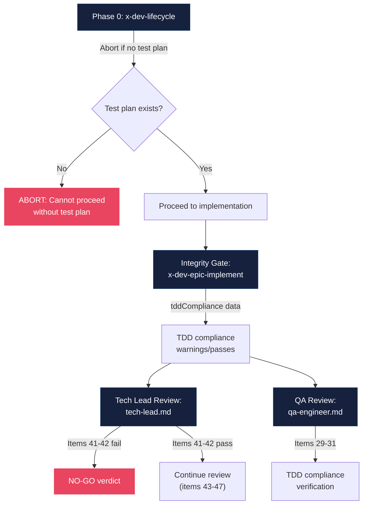
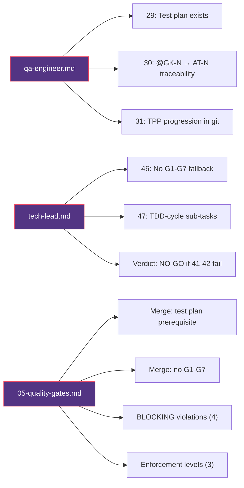

# Historia: Expandir Checklists QA/Tech Lead e Fortalecer Quality Gates

**ID:** story-0014-0007

## 1. Dependencias

| Blocked By | Blocks |
| :--- | :--- |
| story-0014-0006 | story-0014-0008 |

## 2. Regras Transversais Aplicaveis

| ID | Titulo |
| :--- | :--- |
| RULE-002 | TDD Sem Escape Hatch |
| RULE-003 | Rastreabilidade Bidirecional @GK-N ↔ AT-N |
| RULE-007 | Verificacao em Multiplos Niveis |

## 3. Descricao

Como **Tech Lead**, eu quero que os checklists de review do QA Engineer e do Tech Lead sejam expandidos com itens de verificacao TDD, e que os quality gates em `05-quality-gates.md` usem linguagem prescritiva com violacoes BLOCKING, para que a verificacao de TDD compliance seja sistematica e inescapavel em todos os niveis de review.

### Contexto

A verificacao de TDD compliance atualmente opera em tres niveis (RULE-007), mas dois deles possuem lacunas:

1. **qa-engineer.md** (itens 25-28 para TDD Compliance): Verifica presenca de testes e cobertura, mas nao valida existencia de test plan pre-implementacao, rastreabilidade bidirecional @GK-N ↔ AT-N, nem progressao TPP no historico de commits. Com a introducao de @GK-N IDs (story-0014-0003) e TDD compliance no integrity gate (story-0014-0006), o checklist QA precisa de itens que consumam esses dados.

2. **tech-lead.md** (itens 41-45 para TDD Process): Verifica padrao test-first e refactoring, mas nao detecta uso de fallback G1-G7 (removido em story-0014-0002) nem valida que sub-tarefas refletem ciclos TDD (story-0014-0004). O veredito de NO-GO nao esta explicitamente vinculado aos itens TDD mandatorios.

3. **05-quality-gates.md**: A secao TDD Compliance usa linguagem descritiva ("Double-Loop TDD", "Transformation Priority Premise") em vez de linguagem prescritiva com violacoes BLOCKING. O Merge Checklist nao inclui verificacao de test plan nem ausencia de fallback G1-G7.

### 3.1 Alteracoes em qa-engineer.md

Adicionar tres itens apos o item 28 na secao TDD Compliance:

- **Item 29:** "Test plan exists and was generated before implementation"
- **Item 30:** "All @GK-N scenarios have corresponding AT-N entries (bidirectional traceability)"
- **Item 31:** "Git history shows TPP progression (degenerate case commits appear before complex case commits)"

Os itens devem referenciar dados automatizados do `tddCompliance` quando disponiveis (produzido pelo integrity gate em story-0014-0006), mas tambem devem ser verificaveis manualmente quando a informacao automatizada nao estiver presente.

### 3.2 Alteracoes em tech-lead.md

Adicionar dois itens apos o item 45 na secao TDD Process:

- **Item 46:** "No G1-G7 fallback mode used (test plan was present for all implementation)"
- **Item 47:** "Story sub-tasks reflect TDD cycles, not waterfall phases"

Atualizar a regra de veredito para explicitar: "NO-GO if items 41-42 fail (TDD process is mandatory)". Os itens 41-42 devem ser identificados como bloqueadores absolutos, enquanto os demais itens TDD sao MEDIUM-severity.

### 3.3 Alteracoes em 05-quality-gates.md

Duas mudancas distintas:

1. **Merge Checklist** — adicionar dois novos itens:
   - `- [ ] Test plan was generated before implementation (mandatory prerequisite)`
   - `- [ ] No G1-G7 fallback used`

2. **Secao TDD Compliance** — reescrever com linguagem prescritiva:
   ```
   ## TDD Compliance (Non-Negotiable)
   BLOCKING violations:
   - Implementation without test plan (no G1-G7 fallback allowed)
   - Test-after pattern (production code committed before corresponding test)
   - Missing acceptance tests for Gherkin scenarios
   - Refactoring commits that add new behavior

   Enforced at three levels:
   1. x-dev-lifecycle Phase 0: Aborts if no test plan exists
   2. Integrity Gate: Reports TDD compliance warnings
   3. Tech Lead Review: NO-GO if TDD process items fail
   ```

## 3.5 Entrega de Valor

- **Valor Principal:** Checklists de review com itens TDD expandidos e quality gates com linguagem prescritiva e violacoes BLOCKING
- **Metrica de Sucesso:** QA checklist com 31 itens (3 novos), Tech Lead checklist com 47 itens (2 novos), quality gates com 4 BLOCKING violations e 3 niveis de enforcement
- **Impacto no Negocio:** Verificacao de TDD compliance em todos os niveis de review, eliminando possibilidade de aprovar PRs que contornem o processo TDD mandatorio

## 4. Definicoes de Qualidade Locais

### DoR Local

- [ ] Checklist atual do QA Engineer (itens 25-28) revisado e compreendido
- [ ] Checklist atual do Tech Lead (itens 41-45) revisado e compreendido
- [ ] Secao TDD Compliance atual em `05-quality-gates.md` revisada
- [ ] Merge Checklist atual em `05-quality-gates.md` revisado
- [ ] Story-0014-0006 (TDD Compliance no Integrity Gate) concluida — dados `tddCompliance` disponiveis
- [ ] Formato de @GK-N IDs (story-0014-0003) e sub-tarefas [TDD] (story-0014-0004) compreendidos

### DoD Local

- [ ] `qa-engineer.md` com itens 29, 30 e 31 adicionados na secao TDD Compliance
- [ ] Item 29 referencia dados automatizados de `tddCompliance` quando disponiveis
- [ ] Item 30 valida rastreabilidade bidirecional @GK-N ↔ AT-N
- [ ] Item 31 verifica progressao TPP no historico de commits
- [ ] `tech-lead.md` com itens 46 e 47 adicionados na secao TDD Process
- [ ] Veredito de `tech-lead.md` atualizado: "NO-GO if items 41-42 fail"
- [ ] `05-quality-gates.md` Merge Checklist com 2 novos itens (test plan + no G1-G7)
- [ ] `05-quality-gates.md` secao TDD Compliance reescrita com BLOCKING violations
- [ ] Secao TDD Compliance lista os 3 niveis de enforcement (RULE-007)
- [ ] Todos os novos itens sao verificaveis (manual ou automatizado)

### Global DoD

- **Cobertura:** >= 95% Line, >= 90% Branch
- **Testes Automatizados:** Testes validando presenca dos novos itens nos artefatos gerados e consistencia entre checklists
- **TDD Compliance:** Commits test-first, refactoring explicito
- **Backward Compatibility:** Checklists existentes (itens 1-28 QA, 1-45 Tech Lead) inalterados; novos itens sao aditivos
- **Double-Loop TDD:** Acceptance tests derivados dos cenarios Gherkin (outer loop), unit tests guiados por TPP (inner loop)
- **Rastreabilidade:** Todo @GK-N mapeia para >= 1 AT-N, todo AT-N referencia um @GK-N valido

## 5. Contratos de Dados

**qa-engineer.md (novos itens):**

| Campo | Tipo | Obrigatorio | Descricao |
| :--- | :--- | :--- | :--- |
| Item 29 | Checklist item | Sim | Verifica existencia de test plan pre-implementacao |
| Item 30 | Checklist item | Sim | Valida rastreabilidade bidirecional @GK-N ↔ AT-N |
| Item 31 | Checklist item | Sim | Verifica progressao TPP no git history |

**tech-lead.md (novos itens):**

| Campo | Tipo | Obrigatorio | Descricao |
| :--- | :--- | :--- | :--- |
| Item 46 | Checklist item | Sim | Verifica ausencia de fallback G1-G7 |
| Item 47 | Checklist item | Sim | Valida sub-tarefas no formato TDD-cycle |
| Verdict update | Rule text | Sim | NO-GO explicito se itens 41-42 falham |

**05-quality-gates.md (alteracoes):**

| Campo | Tipo | Obrigatorio | Descricao |
| :--- | :--- | :--- | :--- |
| Merge Checklist item (test plan) | Checklist item | Sim | Test plan como prerequisito mandatorio |
| Merge Checklist item (no G1-G7) | Checklist item | Sim | Ausencia de fallback G1-G7 |
| TDD Compliance section | Markdown section | Sim | Reescrita com BLOCKING violations e 3 niveis de enforcement |

## 6. Diagramas

### 6.1 Tres Niveis de Verificacao TDD (RULE-007)



### 6.2 Mapeamento de Itens por Artefato



## 7. Criterios de Aceite (Gherkin)

```gherkin
@GK-1
Cenario: QA checklist sem novos itens gera artefato com apenas 28 itens TDD
  DADO que o qa-engineer.md atual contem itens 25 a 28 na secao TDD Compliance
  QUANDO nenhuma alteracao e aplicada
  ENTAO a secao TDD Compliance contem exatamente 4 itens (25-28)
  E nao existe item 29, 30 ou 31

@GK-2
Cenario: QA checklist com novos itens contem verificacao de test plan
  DADO que o qa-engineer.md foi atualizado com os novos itens
  QUANDO a secao TDD Compliance e inspecionada
  ENTAO o item 29 deve conter "Test plan exists and was generated before implementation"
  E o item deve referenciar dados automatizados de tddCompliance quando disponiveis

@GK-3
Cenario: QA checklist com novos itens contem verificacao de rastreabilidade bidirecional
  DADO que o qa-engineer.md foi atualizado com os novos itens
  QUANDO a secao TDD Compliance e inspecionada
  ENTAO o item 30 deve conter "All @GK-N scenarios have corresponding AT-N entries"
  E deve mencionar "bidirectional traceability"

@GK-4
Cenario: QA checklist com novos itens contem verificacao de progressao TPP
  DADO que o qa-engineer.md foi atualizado com os novos itens
  QUANDO a secao TDD Compliance e inspecionada
  ENTAO o item 31 deve conter "Git history shows TPP progression"
  E deve mencionar "degenerate case commits appear before complex case commits"

@GK-5
Cenario: Tech Lead checklist com novos itens contem verificacao de ausencia de fallback G1-G7
  DADO que o tech-lead.md foi atualizado com os novos itens
  QUANDO a secao TDD Process e inspecionada
  ENTAO o item 46 deve conter "No G1-G7 fallback mode used"
  E deve mencionar que test plan estava presente para toda implementacao

@GK-6
Cenario: Tech Lead checklist com novos itens contem verificacao de sub-tarefas TDD-cycle
  DADO que o tech-lead.md foi atualizado com os novos itens
  QUANDO a secao TDD Process e inspecionada
  ENTAO o item 47 deve conter "Story sub-tasks reflect TDD cycles"
  E deve mencionar "not waterfall phases"

@GK-7
Cenario: Tech Lead veredito atualizado para NO-GO explicito em itens TDD mandatorios
  DADO que o tech-lead.md foi atualizado com a regra de veredito
  QUANDO a secao de veredito e inspecionada
  ENTAO deve conter "NO-GO if items 41-42 fail"
  E deve indicar que TDD process e mandatorio

@GK-8
Cenario: Quality gates Merge Checklist contem item de test plan como prerequisito
  DADO que o 05-quality-gates.md foi atualizado
  QUANDO a secao Merge Checklist e inspecionada
  ENTAO deve conter "Test plan was generated before implementation (mandatory prerequisite)"
  E deve conter "No G1-G7 fallback used"

@GK-9
Cenario: Quality gates TDD Compliance reescrita com BLOCKING violations
  DADO que o 05-quality-gates.md foi atualizado
  QUANDO a secao TDD Compliance e inspecionada
  ENTAO o titulo deve ser "TDD Compliance (Non-Negotiable)"
  E deve listar 4 BLOCKING violations
  E deve incluir "Implementation without test plan" como primeira violacao
  E deve incluir "Test-after pattern" como segunda violacao

@GK-10
Cenario: Quality gates TDD Compliance lista tres niveis de enforcement
  DADO que o 05-quality-gates.md foi atualizado
  QUANDO a secao TDD Compliance e inspecionada
  ENTAO deve listar "x-dev-lifecycle Phase 0" como nivel 1
  E deve listar "Integrity Gate" como nivel 2
  E deve listar "Tech Lead Review" como nivel 3
  E cada nivel deve descrever a acao tomada em caso de violacao

@GK-11
Cenario: Itens existentes nos checklists permanecem inalterados apos atualizacao
  DADO que o qa-engineer.md e tech-lead.md foram atualizados
  QUANDO os itens anteriores (25-28 QA, 41-45 Tech Lead) sao inspecionados
  ENTAO todos os itens originais devem estar presentes e inalterados
  E a numeracao original deve ser preservada
  E novos itens devem ser adicionados apos os existentes
```

### 7.1 Scenario Ordering (TPP)

> TPP: degenerate (estado atual sem alteracoes, @GK-1) -> constant (um item QA, @GK-2) -> constant+ (itens QA adicionais, @GK-3/@GK-4) -> scalar (itens Tech Lead, @GK-5/@GK-6) -> conditions (veredito NO-GO, @GK-7) -> composite (Merge Checklist, @GK-8; TDD Compliance rewrite, @GK-9/@GK-10) -> edge case (backward compat, @GK-11).

### 7.2 Mandatory Scenario Categories

- [x] Degenerate cases (estado atual sem novos itens, @GK-1)
- [x] Happy path (novos itens QA e Tech Lead, @GK-2 a @GK-6)
- [x] Error paths (veredito NO-GO para violacoes TDD, @GK-7)
- [x] Boundary values (BLOCKING violations e enforcement levels, @GK-9/@GK-10)
- [x] Edge cases (backward compatibility de itens existentes, @GK-11)

## 8. Sub-tarefas

- [ ] [TDD] AT-1 (@GK-1): Escrever acceptance test validando que qa-engineer.md atual contem exatamente itens 25-28 na secao TDD Compliance (RED)
- [ ] [TDD] AT-2 (@GK-2): Escrever acceptance test validando presenca do item 29 com texto de test plan (RED)
- [ ] [TDD] UT-1: Implementar item 29 no qa-engineer.md (GREEN)
- [ ] [TDD] AT-3 (@GK-3): Escrever acceptance test validando presenca do item 30 com rastreabilidade @GK-N ↔ AT-N (RED)
- [ ] [TDD] UT-2: Implementar item 30 no qa-engineer.md (GREEN)
- [ ] [TDD] AT-4 (@GK-4): Escrever acceptance test validando presenca do item 31 com progressao TPP (RED)
- [ ] [TDD] UT-3: Implementar item 31 no qa-engineer.md (GREEN)
- [ ] [TDD] Refactor: Revisar consistencia de linguagem entre itens 29-31 e itens 25-28
- [ ] [TDD] AT-5 (@GK-5): Escrever acceptance test validando presenca do item 46 com ausencia de G1-G7 (RED)
- [ ] [TDD] UT-4: Implementar item 46 no tech-lead.md (GREEN)
- [ ] [TDD] AT-6 (@GK-6): Escrever acceptance test validando presenca do item 47 com sub-tarefas TDD-cycle (RED)
- [ ] [TDD] UT-5: Implementar item 47 no tech-lead.md (GREEN)
- [ ] [TDD] AT-7 (@GK-7): Escrever acceptance test validando veredito NO-GO para itens 41-42 (RED)
- [ ] [TDD] UT-6: Atualizar regra de veredito no tech-lead.md (GREEN)
- [ ] [TDD] Refactor: Revisar consistencia entre itens 46-47 e itens 41-45
- [ ] [TDD] AT-8 (@GK-8): Escrever acceptance test validando novos itens no Merge Checklist (RED)
- [ ] [TDD] UT-7: Adicionar 2 itens ao Merge Checklist em 05-quality-gates.md (GREEN)
- [ ] [TDD] AT-9 (@GK-9): Escrever acceptance test validando reescrita da secao TDD Compliance com BLOCKING violations (RED)
- [ ] [TDD] AT-10 (@GK-10): Escrever acceptance test validando 3 niveis de enforcement na secao TDD Compliance (RED)
- [ ] [TDD] UT-8: Reescrever secao TDD Compliance em 05-quality-gates.md com linguagem prescritiva (GREEN)
- [ ] [TDD] Refactor: Consolidar linguagem entre quality gates, QA checklist e Tech Lead checklist
- [ ] [TDD] AT-11 (@GK-11): Escrever acceptance test de backward compatibility confirmando itens originais inalterados (RED)
- [ ] [TDD] UT-9: Validar que nenhum item existente foi modificado ou removido (GREEN)
