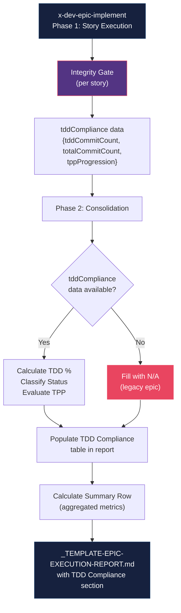
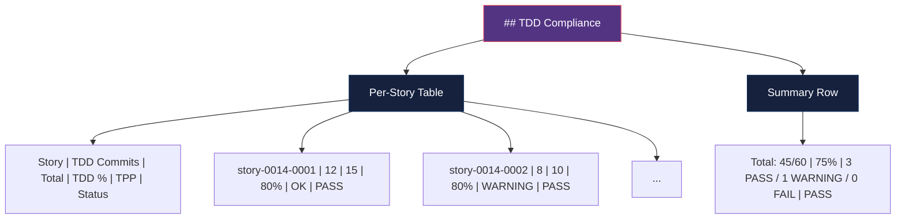

# Historia: Adicionar TDD Metrics ao Epic Execution Report

**ID:** story-0014-0008

## 1. Dependencias

| Blocked By | Blocks |
| :--- | :--- |
| story-0014-0006 | -- |

## 2. Regras Transversais Aplicaveis

| ID | Titulo |
| :--- | :--- |
| RULE-005 | Commit Atomico por Ciclo TDD |
| RULE-007 | Verificacao em Multiplos Niveis |

## 3. Descricao

Como **Tech Lead**, eu quero que o Epic Execution Report inclua uma secao de TDD Compliance com metricas por story e agregadas, para que eu tenha visibilidade quantitativa do nivel de aderencia ao TDD durante a execucao de um epico completo.

### Contexto

O template existente `_TEMPLATE-EPIC-EXECUTION-REPORT.md` rastreia: stories completadas/falhadas/bloqueadas, timeline de fases, coverage delta, commits e SHAs, unresolved issues e link do PR. Porem, nao possui metricas especificas de TDD. Com a introducao do TDD compliance check no integrity gate (story-0014-0006), os dados de compliance por story ja sao coletados durante a execucao do epico. Esses dados precisam fluir para o relatorio de execucao, fornecendo uma visao consolidada de TDD compliance.

A ausencia de metricas TDD no relatorio significa que um epico pode ser concluido com alta cobertura de codigo (>= 95% line) mas com padrao test-after predominante, sem que isso fique visivel no relatorio final. O objetivo e tornar o TDD compliance tao visivel quanto o coverage delta.

### 3.1 Alteracoes em _TEMPLATE-EPIC-EXECUTION-REPORT.md

Adicionar nova secao `## TDD Compliance` apos a secao `## Coverage Delta` existente. A secao contem:

1. **Tabela por story** com colunas:
   - Story: ID da story (e.g., story-0014-0001)
   - TDD Commits: contagem de commits com sufixo `[TDD]` ou que seguem padrao test-first
   - Total Commits: total de commits para a story
   - TDD %: `tddCommitCount / totalCommits * 100`, arredondado para inteiro
   - TPP Progression: OK (commits seguem ordem degenerate -> complex), WARNING (ordem parcial), N/A (nao aplicavel)
   - Status: PASS (TDD % >= 80%), WARNING (TDD % >= 50% e < 80%), FAIL (TDD % < 50%)

2. **Linha de resumo** com metricas agregadas:
   - Total TDD Commits / Total Commits
   - TDD % agregado
   - Contagem de stories PASS / WARNING / FAIL
   - Status geral do epico (PASS se todas stories PASS ou WARNING, FAIL se qualquer story FAIL)

### 3.2 Alteracoes em x-dev-epic-implement/SKILL.md

Na Phase 2 (Consolidation), quando o execution report e gerado:

1. Coletar dados de `tddCompliance` do integrity gate para cada story executada
2. Calcular metricas derivadas (TDD %, TPP Progression, Status)
3. Preencher a tabela TDD Compliance no template
4. Calcular e preencher a linha de resumo com metricas agregadas
5. Se nao houver dados de integrity gate (epico legado), preencher com N/A e nota explicativa

### 3.3 Thresholds de Status

| TDD % | Status | Acao |
| :--- | :--- | :--- |
| >= 80% | PASS | Nenhuma acao necessaria |
| >= 50% e < 80% | WARNING | Review recomendado para identificar gaps |
| < 50% | FAIL | Investigacao obrigatoria; indica padrao test-after predominante |

## 3.5 Entrega de Valor

- **Valor Principal:** Visibilidade quantitativa de TDD compliance no relatorio de execucao de epicos, tornando aderencia ao TDD mensuravel e rastreavel
- **Metrica de Sucesso:** Execution report com secao TDD Compliance preenchida automaticamente a partir de dados do integrity gate, com metricas por story e agregadas
- **Impacto no Negocio:** Tech Leads podem identificar tendencias de TDD compliance ao longo de multiplos epicos e tomar acoes corretivas antes que o padrao test-after se torne prevalente

## 4. Definicoes de Qualidade Locais

### DoR Local

- [ ] Template `_TEMPLATE-EPIC-EXECUTION-REPORT.md` existente revisado e compreendido
- [ ] Skill `x-dev-epic-implement/SKILL.md` revisado, especialmente Phase 2 (Consolidation)
- [ ] Story-0014-0006 (TDD Compliance no Integrity Gate) concluida — dados `tddCompliance` disponiveis
- [ ] Formato de dados `tddCompliance` do integrity gate documentado (campos, tipos, valores)
- [ ] Secao `## Coverage Delta` do template identificada como ponto de insercao

### DoD Local

- [ ] Template `_TEMPLATE-EPIC-EXECUTION-REPORT.md` com secao `## TDD Compliance` adicionada apos `## Coverage Delta`
- [ ] Tabela por story com 6 colunas (Story, TDD Commits, Total Commits, TDD %, TPP Progression, Status)
- [ ] Linha de resumo com metricas agregadas (totais, TDD % global, contagens por status, status geral)
- [ ] `x-dev-epic-implement/SKILL.md` Phase 2 atualizada para popular secao TDD Compliance
- [ ] Logica de calculo de TDD % implementada (tddCommitCount / totalCommits * 100)
- [ ] Logica de classificacao de Status implementada (PASS >= 80%, WARNING >= 50%, FAIL < 50%)
- [ ] Logica de TPP Progression implementada (OK, WARNING, N/A)
- [ ] Fallback para epicos legados sem dados de integrity gate (preenchimento com N/A)
- [ ] Secoes existentes do template inalteradas

### Global DoD

- **Cobertura:** >= 95% Line, >= 90% Branch
- **Testes Automatizados:** Testes validando geracao da secao TDD Compliance com dados reais e com fallback N/A
- **TDD Compliance:** Commits test-first, refactoring explicito
- **Backward Compatibility:** Templates de execution report existentes sem secao TDD Compliance continuam validos (RULE-005)
- **Double-Loop TDD:** Acceptance tests derivados dos cenarios Gherkin (outer loop), unit tests guiados por TPP (inner loop)
- **Rastreabilidade:** Todo @GK-N mapeia para >= 1 AT-N, todo AT-N referencia um @GK-N valido

## 5. Contratos de Dados

**TDD Compliance section (template):**

| Campo | Tipo | Obrigatorio | Descricao |
| :--- | :--- | :--- | :--- |
| Story | String | Sim | ID da story (e.g., story-0014-0001) |
| TDD Commits | Integer | Sim | Contagem de commits com padrao test-first ou sufixo [TDD] |
| Total Commits | Integer | Sim | Total de commits para a story |
| TDD % | Percentage | Sim | tddCommitCount / totalCommits * 100, arredondado para inteiro |
| TPP Progression | Enum (OK, WARNING, N/A) | Sim | Avaliacao da ordem de commits por complexidade |
| Status | Enum (PASS, WARNING, FAIL) | Sim | Classificacao baseada em TDD % thresholds |

**Summary row (template):**

| Campo | Tipo | Obrigatorio | Descricao |
| :--- | :--- | :--- | :--- |
| Total TDD Commits | Integer | Sim | Soma de TDD Commits de todas as stories |
| Total Commits | Integer | Sim | Soma de Total Commits de todas as stories |
| Aggregate TDD % | Percentage | Sim | totalTddCommits / totalCommits * 100 |
| Stories PASS | Integer | Sim | Contagem de stories com Status PASS |
| Stories WARNING | Integer | Sim | Contagem de stories com Status WARNING |
| Stories FAIL | Integer | Sim | Contagem de stories com Status FAIL |
| Epic Status | Enum (PASS, FAIL) | Sim | PASS se zero stories FAIL, FAIL caso contrario |

**x-dev-epic-implement Phase 2 (input):**

| Campo | Tipo | Obrigatorio | Descricao |
| :--- | :--- | :--- | :--- |
| tddCompliance | Object | Nao | Dados do integrity gate (pode ser ausente em epicos legados) |
| tddCompliance.tddCommitCount | Integer | Sim* | Commits test-first (*quando tddCompliance presente) |
| tddCompliance.totalCommitCount | Integer | Sim* | Total de commits (*quando tddCompliance presente) |
| tddCompliance.tppProgression | String | Sim* | OK, WARNING ou N/A (*quando tddCompliance presente) |

## 6. Diagramas

### 6.1 Fluxo de Dados: Integrity Gate -> Execution Report



### 6.2 Estrutura da Secao TDD Compliance no Report



## 7. Criterios de Aceite (Gherkin)

```gherkin
@GK-1
Cenario: Execution report sem secao TDD Compliance quando template nao atualizado
  DADO que o template _TEMPLATE-EPIC-EXECUTION-REPORT.md nao contem secao TDD Compliance
  QUANDO o execution report e gerado para um epico
  ENTAO o report nao contem secao "## TDD Compliance"
  E todas as secoes existentes permanecem inalteradas

@GK-2
Cenario: Execution report com secao TDD Compliance para epico com uma story
  DADO que o template atualizado contem secao TDD Compliance
  E o integrity gate reportou tddCommitCount=10, totalCommitCount=12, tppProgression="OK" para story-0014-0001
  QUANDO o execution report e gerado
  ENTAO a secao TDD Compliance contem uma linha para story-0014-0001
  E TDD Commits e 10
  E Total Commits e 12
  E TDD % e 83%
  E TPP Progression e OK
  E Status e PASS

@GK-3
Cenario: Execution report com secao TDD Compliance para epico com multiplas stories
  DADO que o template atualizado contem secao TDD Compliance
  E o integrity gate reportou dados para 3 stories com TDD % de 90%, 60% e 40%
  QUANDO o execution report e gerado
  ENTAO a tabela contem 3 linhas de stories
  E os Status sao PASS, WARNING e FAIL respectivamente
  E a linha de resumo contem totais agregados
  E o Epic Status e FAIL (porque existe ao menos uma story com Status FAIL)

@GK-4
Cenario: Execution report com fallback N/A para epico legado sem dados de integrity gate
  DADO que o template atualizado contem secao TDD Compliance
  E o integrity gate NAO reportou dados de tddCompliance para nenhuma story
  QUANDO o execution report e gerado
  ENTAO a secao TDD Compliance contem linhas com todos os campos preenchidos como N/A
  E a linha de resumo indica "N/A — no TDD compliance data available"

@GK-5
Cenario: Calculo de TDD % com arredondamento correto
  DADO que uma story tem tddCommitCount=7 e totalCommitCount=9
  QUANDO o TDD % e calculado
  ENTAO o resultado e 78% (arredondado para inteiro: 7/9*100 = 77.78 -> 78)

@GK-6
Cenario: Classificacao de Status nos limites dos thresholds
  DADO que tres stories possuem TDD % de 80%, 50% e 49%
  QUANDO o Status e classificado para cada story
  ENTAO a story com 80% recebe Status PASS (limite inferior de PASS)
  E a story com 50% recebe Status WARNING (limite inferior de WARNING)
  E a story com 49% recebe Status FAIL (abaixo do limite de WARNING)

@GK-7
Cenario: Epic Status geral e PASS quando todas stories sao PASS ou WARNING
  DADO que 3 stories possuem Status PASS e 2 stories possuem Status WARNING
  QUANDO o Epic Status e calculado
  ENTAO o Epic Status e PASS
  E a contagem mostra 3 PASS / 2 WARNING / 0 FAIL

@GK-8
Cenario: TPP Progression avaliada como WARNING quando ordem parcial
  DADO que uma story tem commits em ordem degenerate -> complex -> degenerate -> complex
  QUANDO a TPP Progression e avaliada
  ENTAO o resultado e WARNING (ordem parcial, nao estritamente crescente)

@GK-9
Cenario: Secao TDD Compliance posicionada apos Coverage Delta no template
  DADO que o template _TEMPLATE-EPIC-EXECUTION-REPORT.md foi atualizado
  QUANDO a ordem das secoes e inspecionada
  ENTAO a secao "## TDD Compliance" aparece imediatamente apos "## Coverage Delta"
  E antes de qualquer secao subsequente existente

@GK-10
Cenario: x-dev-epic-implement Phase 2 popula secao TDD Compliance a partir de integrity gate
  DADO que o skill x-dev-epic-implement/SKILL.md foi atualizado
  QUANDO a Phase 2 (Consolidation) e inspecionada
  ENTAO deve conter instrucao para coletar dados tddCompliance do integrity gate
  E deve conter instrucao para calcular TDD % agregado
  E deve conter instrucao para preencher tabela e linha de resumo
```

### 7.1 Scenario Ordering (TPP)

> TPP: degenerate (report sem secao TDD, @GK-1) -> constant (uma story, @GK-2) -> constant+ (multiplas stories, @GK-3) -> nil (fallback N/A, @GK-4) -> scalar (calculo TDD %, @GK-5) -> conditions (thresholds de status, @GK-6; Epic Status, @GK-7; TPP WARNING, @GK-8) -> structural (posicionamento no template, @GK-9) -> composite (integracao Phase 2, @GK-10).

### 7.2 Mandatory Scenario Categories

- [x] Degenerate cases (report sem secao TDD Compliance, @GK-1; fallback N/A, @GK-4)
- [x] Happy path (uma story, @GK-2; multiplas stories, @GK-3)
- [x] Error paths (story FAIL com TDD % < 50%, @GK-3; Epic Status FAIL, @GK-3)
- [x] Boundary values (thresholds 80%/50%/49%, @GK-6; arredondamento, @GK-5)
- [x] Edge cases (TPP WARNING com ordem parcial, @GK-8; posicionamento no template, @GK-9)

## 8. Sub-tarefas

- [ ] [TDD] AT-1 (@GK-1): Escrever acceptance test validando que report sem template atualizado nao contem secao TDD Compliance (RED)
- [ ] [TDD] UT-1: Escrever unit test para parser que detecta ausencia de secao TDD Compliance no template (RED)
- [ ] [TDD] UT-1: Implementar deteccao de secao TDD Compliance no template (GREEN)
- [ ] [TDD] AT-2 (@GK-2): Escrever acceptance test validando geracao de secao TDD Compliance com uma story (RED)
- [ ] [TDD] UT-2: Escrever unit test para calculo de TDD % (tddCommitCount / totalCommits * 100) (RED)
- [ ] [TDD] UT-2: Implementar funcao de calculo de TDD % com arredondamento (GREEN)
- [ ] [TDD] AT-5 (@GK-5): Escrever acceptance test validando arredondamento de TDD % (RED)
- [ ] [TDD] UT-3: Escrever unit test para classificacao de Status (PASS/WARNING/FAIL por threshold) (RED)
- [ ] [TDD] UT-3: Implementar funcao de classificacao de Status (GREEN)
- [ ] [TDD] AT-6 (@GK-6): Escrever acceptance test validando thresholds nos limites (80%, 50%, 49%) (RED)
- [ ] [TDD] Refactor: Extrair logica de calculo e classificacao para modulo compartilhado
- [ ] [TDD] AT-3 (@GK-3): Escrever acceptance test validando geracao com multiplas stories e metricas agregadas (RED)
- [ ] [TDD] UT-4: Escrever unit test para calculo de linha de resumo (totais agregados, Epic Status) (RED)
- [ ] [TDD] UT-4: Implementar funcao de geracao de linha de resumo (GREEN)
- [ ] [TDD] AT-7 (@GK-7): Escrever acceptance test validando Epic Status PASS quando zero FAIL (RED)
- [ ] [TDD] UT-5: Implementar logica de Epic Status (PASS se zero FAIL, FAIL caso contrario) (GREEN)
- [ ] [TDD] AT-4 (@GK-4): Escrever acceptance test validando fallback N/A para epicos legados (RED)
- [ ] [TDD] UT-6: Implementar fallback N/A quando dados tddCompliance ausentes (GREEN)
- [ ] [TDD] AT-8 (@GK-8): Escrever acceptance test validando TPP Progression WARNING para ordem parcial (RED)
- [ ] [TDD] UT-7: Implementar avaliacao de TPP Progression (OK, WARNING, N/A) (GREEN)
- [ ] [TDD] Refactor: Consolidar formatacao de tabela e linha de resumo
- [ ] [TDD] AT-9 (@GK-9): Escrever acceptance test validando posicionamento da secao apos Coverage Delta (RED)
- [ ] [TDD] UT-8: Adicionar secao TDD Compliance ao template _TEMPLATE-EPIC-EXECUTION-REPORT.md (GREEN)
- [ ] [TDD] AT-10 (@GK-10): Escrever acceptance test validando que x-dev-epic-implement Phase 2 popula secao TDD Compliance (RED)
- [ ] [TDD] UT-9: Atualizar x-dev-epic-implement/SKILL.md Phase 2 com instrucoes de populacao (GREEN)
- [ ] [TDD] Refactor: Revisar consistencia de linguagem entre template e skill
