# Historia: Criacao da Estrutura de Pacotes Hexagonal (Scaffolding)

**ID:** story-0015-0002
**Chave Jira:** —
**Status:** Pendente

## 1. Dependencias

| Blocked By | Blocks |
| :--- | :--- |
| story-0015-0001 | story-0015-0003 |

## 2. Regras Transversais Aplicaveis

| ID | Titulo |
| :--- | :--- |
| RULE-001 | Dependency Rule Estrita |
| RULE-008 | Migracao Incremental sem Big Bang |

## 3. Descricao

Como **Arquiteto de Software**, eu quero criar a estrutura completa de diretorios hexagonais com arquivos `package-info.java` documentados, para que as historias subsequentes tenham ancoras claras de destino para a migracao de classes e os desenvolvedores compreendam a responsabilidade de cada camada.

### Contexto

A estrutura de pacotes TO-BE precisa existir fisicamente antes que qualquer classe seja movida. Esta historia cria o scaffolding vazio que serve como destino para todas as migracoes. Cada pacote recebe um `package-info.java` com Javadoc explicando responsabilidades e restricoes da camada.

### 3.1 Estrutura de Diretorios TO-BE

```
java/src/main/java/dev/iadev/
├── domain/
│   ├── model/                    # Entidades e Value Objects imutaveis
│   ├── port/
│   │   ├── input/                # Input Ports (Use Case interfaces)
│   │   └── output/               # Output Ports (interfaces para infraestrutura)
│   └── service/                  # Implementacoes dos Use Cases
├── application/
│   ├── assembler/                # Assemblers de geracao (23 assemblers)
│   ├── dag/                      # Resolucao de dependencias entre componentes
│   └── factory/                  # Criacao de contexto de geracao
└── infrastructure/
    ├── adapter/
    │   ├── input/
    │   │   └── cli/              # Picocli commands
    │   └── output/
    │       ├── template/         # PebbleTemplateRenderer
    │       ├── filesystem/       # FileSystemWriterAdapter
    │       ├── config/           # YamlStackProfileRepository
    │       ├── checkpoint/       # FileCheckpointStore
    │       └── progress/         # ConsoleProgressReporter
    └── config/                   # Composition root (ApplicationFactory)
```

### 3.2 Conteudo dos package-info.java

Cada `package-info.java` deve conter:
- Javadoc descrevendo a responsabilidade da camada
- Restricoes de dependencia (o que pode e nao pode importar)
- Referencia a RULE correspondente do epico

### 3.3 Preservacao da Estrutura Existente

Os pacotes atuais (`cli/`, `config/`, `model/`, `domain/`, `assembler/`, `template/`, `checkpoint/`, `progress/`, `exception/`, `util/`) devem ser mantidos intactos. A nova estrutura e criada em paralelo — nenhuma classe e movida nesta historia.

## 3.5 Entrega de Valor

- **Valor Principal:** Estrutura de pacotes pronta para receber migracao, documentada com `package-info.java`
- **Metrica de Sucesso:** 16 diretorios criados com `package-info.java`, build continua passando
- **Impacto no Negocio:** Elimina ambiguidade sobre onde cada classe deve residir, reduzindo decisoes ad-hoc durante migracao — desbloqueia story-0015-0003

## 4. Definicoes de Qualidade Locais

### DoR Local

- [ ] story-0015-0001 concluida (ArchUnit configurado)
- [ ] Estrutura TO-BE revisada e aprovada

### DoD Local

- [ ] 16 diretorios hexagonais criados
- [ ] `package-info.java` com Javadoc em cada diretorio
- [ ] Estrutura existente 100% preservada
- [ ] `mvn verify` passa (incluindo 1961 testes existentes)
- [ ] Test plan gerado via `/x-test-plan` antes do inicio da implementacao
- [ ] Todo @GK-N da secao 7 mapeado para >= 1 AT-N na secao 8
- [ ] Cenarios Gherkin ordenados por TPP (degenerate -> happy -> error -> boundary -> edge)
- [ ] Todo AT-N com status GREEN antes de marcar DoD como concluido
- [ ] Commits seguem padrao test-first (teste precede ou acompanha implementacao no git log)

### Global DoD

- **Cobertura:** >= 95% Line, >= 90% Branch
- **Testes Automatizados:** Testes de existencia de pacotes
- **TDD Compliance:** Commits test-first, refactoring explicito
- **Backward Compatibility:** Todos os 1961 testes existentes continuam passando
- **Double-Loop TDD:** Acceptance tests derivados dos cenarios Gherkin (outer loop), unit tests guiados por TPP (inner loop)
- **Rastreabilidade:** Todo @GK-N mapeia para >= 1 AT-N, todo AT-N referencia um @GK-N valido

## 5. Contratos de Dados

| Campo | Tipo | Obrigatorio | Descricao |
| :--- | :--- | :--- | :--- |
| `domain/model/package-info.java` | Java source | Sim | Javadoc: "Entidades e Value Objects imutaveis. Zero dependencias externas." |
| `domain/port/input/package-info.java` | Java source | Sim | Javadoc: "Input Ports — interfaces de Use Case expostas ao mundo externo." |
| `domain/port/output/package-info.java` | Java source | Sim | Javadoc: "Output Ports — interfaces para recursos de infraestrutura." |
| `domain/service/package-info.java` | Java source | Sim | Javadoc: "Domain Services — implementacoes de Use Cases que orquestram ports." |
| `application/assembler/package-info.java` | Java source | Sim | Javadoc: "Assemblers de geracao — orquestradores de output ports." |
| `application/dag/package-info.java` | Java source | Sim | Javadoc: "Resolucao de dependencias e grafo de componentes." |
| `application/factory/package-info.java` | Java source | Sim | Javadoc: "Fabricas de contexto de geracao." |
| `infrastructure/adapter/input/cli/package-info.java` | Java source | Sim | Javadoc: "Driving Adapter — comandos Picocli." |
| `infrastructure/adapter/output/*/package-info.java` | Java source | Sim | Javadoc especifico por adapter (template, filesystem, config, checkpoint, progress) |
| `infrastructure/config/package-info.java` | Java source | Sim | Javadoc: "Composition Root — wiring manual de dependencias." |

## 6. Diagramas

### 6.1 Estrutura de Pacotes Hexagonal

```mermaid
graph TD
    subgraph Domain ["domain/ (Hexagono Central)"]
        DM["model/"]
        DPI["port/input/"]
        DPO["port/output/"]
        DS["service/"]
    end

    subgraph Application ["application/"]
        AA["assembler/"]
        AD["dag/"]
        AF["factory/"]
    end

    subgraph Infrastructure ["infrastructure/"]
        IAC["adapter/input/cli/"]
        IOT["adapter/output/template/"]
        IOF["adapter/output/filesystem/"]
        IOC["adapter/output/config/"]
        IOCK["adapter/output/checkpoint/"]
        IOP["adapter/output/progress/"]
        IC["config/ (Composition Root)"]
    end

    DS --> DPI
    DS --> DPO
    AA --> DPO
    IAC --> DPI
    IOT --> DPO
    IOF --> DPO
    IOC --> DPO
    IOCK --> DPO
    IOP --> DPO

    classDef domain fill:#1a1a2e,stroke:#e94560,color:#fff
    classDef app fill:#16213e,stroke:#0f3460,color:#fff
    classDef infra fill:#533483,stroke:#e94560,color:#fff

    class DM,DPI,DPO,DS domain
    class AA,AD,AF app
    class IAC,IOT,IOF,IOC,IOCK,IOP,IC infra
```



## 7. Criterios de Aceite (Gherkin)

```gherkin
@GK-1
Cenario: Projeto sem estrutura hexagonal (estado degenerado)
  DADO que apenas os pacotes originais existem (cli, config, model, etc.)
  QUANDO o desenvolvedor verifica a estrutura de diretorios
  ENTAO nao existem pacotes domain/port/, application/, ou infrastructure/

@GK-2
Cenario: Scaffolding completo criado com sucesso (happy path)
  DADO que story-0015-0001 esta concluida
  QUANDO os 16 diretorios hexagonais sao criados com package-info.java
  ENTAO cada diretorio contem exatamente um arquivo package-info.java
  E cada package-info.java possui Javadoc descrevendo responsabilidade e restricoes
  E o build "mvn compile" completa com sucesso

@GK-3
Cenario: Scaffolding nao altera pacotes existentes (error prevention)
  DADO que os pacotes originais contem 194+ classes Java
  QUANDO o scaffolding hexagonal e criado
  ENTAO nenhum arquivo existente e modificado, movido ou deletado
  E o comando "mvn verify" executa todos os 1961 testes com sucesso

@GK-4
Cenario: Todos os package-info.java seguem convencao de documentacao (boundary)
  DADO que os 16 diretorios hexagonais foram criados
  QUANDO cada package-info.java e inspecionado
  ENTAO todos contem: descricao de responsabilidade, restricoes de dependencia, e referencia a RULE
  E nenhum package-info.java esta vazio ou contem apenas a declaracao de pacote

@GK-5
Cenario: Estrutura de subdiretorios de output adapters esta completa (edge case)
  DADO que o scaffolding hexagonal foi criado
  QUANDO o diretorio infrastructure/adapter/output/ e inspecionado
  ENTAO existem exatamente 5 subdiretorios: template, filesystem, config, checkpoint, progress
  E cada subdirectorio contem seu respectivo package-info.java
```

## 8. Sub-tarefas

### Ciclos TDD

> Sub-tarefas TDD serao populadas apos geracao do test plan via `/x-test-plan`.
> Cada AT-N e UT-N do test plan gerara entradas [TDD] com ciclos RED/GREEN/REFACTOR.

### Tarefas nao-TDD

- [ ] [Doc] Criar package-info.java com Javadoc para cada diretorio
- [ ] [Arch] Validar que a estrutura TO-BE corresponde ao diagrama aprovado

### Avaliacao de Risco

- **Risco de Regressao:** Baixo — apenas cria diretorios e arquivos package-info.java
- **Estrategia de Rollback:** Deletar os novos diretorios criados
- **Acoplamento Critico:** Nenhum — nenhum codigo de producao e modificado

### Migration Checklist

- [ ] Pacotes legados mantidos como facade: N/A (nenhum codigo movido)
- [ ] Zero imports proibidos apos migracao parcial: N/A
- [ ] Build passa com `mvn verify`
- [ ] Golden file tests passam
- [ ] Coverage thresholds mantidos
