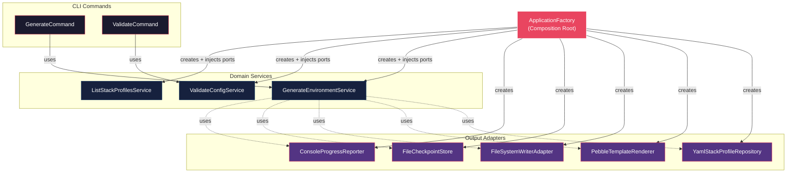

# Historia: Composition Root — ApplicationFactory

**ID:** story-0015-0014
**Chave Jira:** —
**Status:** Pendente

## 1. Dependencias

| Blocked By | Blocks |
| :--- | :--- |
| story-0015-0007, story-0015-0008, story-0015-0009, story-0015-0010, story-0015-0011, story-0015-0012, story-0015-0013 | story-0015-0015 |

## 2. Regras Transversais Aplicaveis

| ID | Titulo |
| :--- | :--- |
| RULE-001 | Dependency Rule Estrita |
| RULE-002 | Ports como Contratos |
| RULE-003 | Use Cases como Ponto de Entrada |
| RULE-005 | Composition Root Unico |
| RULE-007 | Paridade Funcional Total |
| RULE-008 | Migracao Incremental sem Big Bang |

## 3. Descricao

Como **Arquiteto de Software**, eu quero criar `ApplicationFactory.java` como unico ponto de wiring manual que instancia todos os adapters concretos, injeta nos services, e expoe as instancias de Input Ports para os comandos CLI, para que o grafo de dependencias do sistema seja explicito, rastreavel, e nao dependa de nenhum framework de injecao de dependencia.

### Contexto

Com todos os adapters (stories 0007-0012) e assemblers (story 0013) migrados, e necessario um unico ponto de montagem que:
1. Instancia cada Output Adapter concreto
2. Injeta os adapters nos Domain Services
3. Injeta os Domain Services (como Input Ports) nos comandos CLI
4. Expoe o grafo montado para o ponto de entrada Picocli

### 3.1 ApplicationFactory

```java
package dev.iadev.infrastructure.config;

import dev.iadev.domain.port.input.*;
import dev.iadev.domain.port.output.*;
import dev.iadev.domain.service.*;
import dev.iadev.infrastructure.adapter.input.cli.*;
import dev.iadev.infrastructure.adapter.output.checkpoint.*;
import dev.iadev.infrastructure.adapter.output.config.*;
import dev.iadev.infrastructure.adapter.output.filesystem.*;
import dev.iadev.infrastructure.adapter.output.progress.*;
import dev.iadev.infrastructure.adapter.output.template.*;

public class ApplicationFactory {

    // Output Adapters
    private final StackProfileRepository profileRepository;
    private final TemplateRenderer templateRenderer;
    private final FileSystemWriter fileSystemWriter;
    private final CheckpointStore checkpointStore;
    private final ProgressReporter progressReporter;

    // Domain Services (exposed as Input Ports)
    private final GenerateEnvironmentUseCase generateUseCase;
    private final ValidateConfigUseCase validateUseCase;
    private final ListStackProfilesUseCase listProfilesUseCase;

    public ApplicationFactory() {
        // 1. Create Output Adapters
        this.profileRepository = new YamlStackProfileRepository();
        this.templateRenderer = new PebbleTemplateRenderer();
        this.fileSystemWriter = new FileSystemWriterAdapter();
        this.checkpointStore = new FileCheckpointStore(defaultCheckpointDir());
        this.progressReporter = new ConsoleProgressReporter();

        // 2. Create Domain Services (injecting Output Ports)
        this.generateUseCase = new GenerateEnvironmentService(
            profileRepository, templateRenderer, fileSystemWriter,
            checkpointStore, progressReporter
        );
        this.validateUseCase = new ValidateConfigService(profileRepository);
        this.listProfilesUseCase = new ListStackProfilesService(profileRepository);
    }

    // Getters for Input Ports (used by CLI commands)
    public GenerateEnvironmentUseCase generateUseCase() { return generateUseCase; }
    public ValidateConfigUseCase validateUseCase() { return validateUseCase; }
    public ListStackProfilesUseCase listProfilesUseCase() { return listProfilesUseCase; }
}
```

### 3.2 Integracao com Picocli

O `main()` do aplicativo deve usar `ApplicationFactory` para montar o grafo e passar os use cases para o CommandLine do Picocli via `IFactory` customizado.

### 3.3 Eliminacao de Instanciacoes Dispersas

Nenhum adapter concreto pode ser instanciado fora de `ApplicationFactory`. Todas as `new YamlStackProfileRepository()`, `new PebbleTemplateRenderer()`, etc. devem existir exclusivamente nesta classe.

### 3.4 Ativacao da Regra ArchUnit

Ativar a regra `compositionRootShouldBeUnique()` em `HexagonalArchitectureTest`.

## 3.5 Entrega de Valor

- **Valor Principal:** Ponto unico de wiring que torna explicitas todas as dependencias do sistema, facilitando troubleshooting e configuracao
- **Metrica de Sucesso:** ApplicationFactory criado como unico ponto de instanciacao de adapters, grafo de dependencias visivel em um unico arquivo
- **Impacto no Negocio:** Torna o sistema configuravel (trocar adapter = mudar uma linha no factory), testavel (injetar mocks no factory para testes de integracao), e rastreavel (todas as dependencias visiveis em um lugar) — desbloqueia story-0015-0015

## 4. Definicoes de Qualidade Locais

### DoR Local

- [ ] Stories 0007-0013 concluidas (todos os adapters e assemblers migrados)
- [ ] Todas as interfaces de ports e services implementadas

### DoD Local

- [ ] ApplicationFactory.java criado em infrastructure/config/
- [ ] Unico ponto de instanciacao de adapters concretos
- [ ] Integrado com Picocli main()
- [ ] Regra ArchUnit compositionRootShouldBeUnique ativa e passando
- [ ] Zero instanciacoes de adapters fora de ApplicationFactory
- [ ] `mvn verify` passa com todos os testes
- [ ] Test plan gerado via `/x-test-plan` antes do inicio da implementacao
- [ ] Todo @GK-N da secao 7 mapeado para >= 1 AT-N na secao 8
- [ ] Cenarios Gherkin ordenados por TPP (degenerate -> happy -> error -> boundary -> edge)
- [ ] Todo AT-N com status GREEN antes de marcar DoD como concluido
- [ ] Commits seguem padrao test-first (teste precede ou acompanha implementacao no git log)

### Global DoD

- **Cobertura:** >= 95% Line, >= 90% Branch
- **Testes Automatizados:** Integration test do factory + ArchUnit
- **TDD Compliance:** Commits test-first, refactoring explicito
- **Backward Compatibility:** Todos os 1961 testes existentes continuam passando
- **Double-Loop TDD:** Acceptance tests derivados dos cenarios Gherkin (outer loop), unit tests guiados por TPP (inner loop)
- **Rastreabilidade:** Todo @GK-N mapeia para >= 1 AT-N, todo AT-N referencia um @GK-N valido

## 5. Contratos de Dados

| Campo | Tipo | Obrigatorio | Descricao |
| :--- | :--- | :--- | :--- |
| `ApplicationFactory` | Class | Sim | Composition Root — unico ponto de wiring |
| `generateUseCase()` | `GenerateEnvironmentUseCase` | Sim | Getter para Input Port de geracao |
| `validateUseCase()` | `ValidateConfigUseCase` | Sim | Getter para Input Port de validacao |
| `listProfilesUseCase()` | `ListStackProfilesUseCase` | Sim | Getter para Input Port de listagem |

## 6. Diagramas

### 6.1 Grafo de Dependencias Montado pelo ApplicationFactory



## 7. Criterios de Aceite (Gherkin)

```gherkin
@GK-1
Cenario: ApplicationFactory sem adapters disponiveis (estado degenerado)
  DADO que uma dependencia de adapter falha na instanciacao (ex: diretorio de checkpoint inacessivel)
  QUANDO ApplicationFactory() e construido
  ENTAO uma excecao descritiva e lancada indicando qual adapter falhou
  E a mensagem contem o adapter e a causa raiz

@GK-2
Cenario: ApplicationFactory monta grafo completo (happy path)
  DADO que todos os adapters e services estao disponiveis
  QUANDO ApplicationFactory() e construido
  ENTAO generateUseCase() retorna instancia valida de GenerateEnvironmentUseCase
  E validateUseCase() retorna instancia valida de ValidateConfigUseCase
  E listProfilesUseCase() retorna instancia valida de ListStackProfilesUseCase

@GK-3
Cenario: Instanciacao de adapter fora do ApplicationFactory (error path — ArchUnit)
  DADO que uma classe em application/ instancia new PebbleTemplateRenderer()
  QUANDO a regra ArchUnit compositionRootShouldBeUnique executa
  ENTAO o teste falha indicando que adapters so podem ser instanciados no Composition Root

@GK-4
Cenario: Integracao com Picocli main() funcional (boundary)
  DADO que ApplicationFactory esta integrado com o main() do aplicativo
  QUANDO o usuario executa "ia-dev-env generate -c config.yaml"
  ENTAO o comando e processado pelo GenerateCommand
  E GenerateCommand invoca generateUseCase via Input Port
  E o fluxo completo executa sem erros

@GK-5
Cenario: Geracao completa end-to-end via ApplicationFactory (edge case)
  DADO que ApplicationFactory monta o grafo completo
  E um perfil "java-spring" valido esta disponivel
  QUANDO GenerateCommand executa geracao completa
  ENTAO todos os artefatos sao gerados corretamente
  E golden file parity tests passam
  E o output e identico ao gerado pela arquitetura AS-IS
```

## 8. Sub-tarefas

### Ciclos TDD

> Sub-tarefas TDD serao populadas apos geracao do test plan via `/x-test-plan`.

### Tarefas nao-TDD

- [ ] [Doc] Documentar grafo de dependencias do ApplicationFactory
- [ ] [Arch] Ativar regra ArchUnit compositionRootShouldBeUnique
- [ ] [Arch] Integrar com Picocli IFactory para constructor injection

### Avaliacao de Risco

- **Risco de Regressao:** Alto — o ApplicationFactory conecta TODOS os componentes. Qualquer erro de wiring causa falha completa
- **Estrategia de Rollback:** `git revert`; wiring anterior (direto nos commands) continua funcionando
- **Acoplamento Critico:** Depende de TODAS as 7 stories anteriores (0007-0013); Picocli IFactory pattern; ordem de instanciacao dos adapters

### ArchUnit Snippet (Referencia)

```java
@ArchTest
static final ArchRule compositionRootShouldBeUnique =
    noClasses().that().resideOutsideOfPackage("..infrastructure.config..")
        .should().dependOnClassesThat()
        .resideInAPackage("..infrastructure.adapter.output..")
        .because("Apenas o Composition Root (ApplicationFactory) pode instanciar adapters concretos (RULE-005)");
```

### Migration Checklist

- [ ] Pacotes legados mantidos como facade: N/A — ApplicationFactory e novo
- [ ] Zero imports proibidos apos migracao parcial
- [ ] Build passa com `mvn verify`
- [ ] Golden file tests passam
- [ ] Coverage thresholds mantidos
