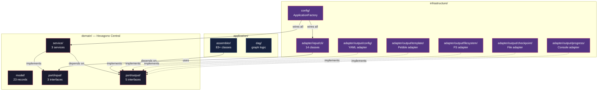

# Historia: Ativacao Completa das Regras ArchUnit e Limpeza Final

**ID:** story-0015-0015
**Chave Jira:** —
**Status:** Pendente

## 1. Dependencias

| Blocked By | Blocks |
| :--- | :--- |
| story-0015-0014 | — |

## 2. Regras Transversais Aplicaveis

| ID | Titulo |
| :--- | :--- |
| RULE-001 | Dependency Rule Estrita |
| RULE-002 | Ports como Contratos |
| RULE-003 | Use Cases como Ponto de Entrada |
| RULE-004 | Records Imutaveis no Dominio |
| RULE-005 | Composition Root Unico |
| RULE-006 | ArchUnit como Guardiao |
| RULE-007 | Paridade Funcional Total |
| RULE-008 | Migracao Incremental sem Big Bang |
| RULE-009 | Cobertura de Testes Mantida |
| RULE-010 | Preservacao de Contratos de Template |

## 3. Descricao

Como **Arquiteto de Software**, eu quero ativar todas as regras ArchUnit, remover pacotes legados, e executar validacao final completa, para que a migracao hexagonal esteja 100% concluida, documentada, e protegida automaticamente contra regressoes de fronteira.

### Contexto

Esta e a historia final do epico. Todas as 14 historias anteriores migraram classes para a nova estrutura hexagonal. Agora e necessario:
1. Ativar TODAS as regras ArchUnit (remover todos os `@Disabled`)
2. Remover pacotes legados que nao contem mais classes ativas
3. Executar validacao final completa (todos os testes, golden files, coverage)
4. Atualizar documentacao de arquitetura
5. Gerar ADR documentando a decisao de migracao

### 3.1 Ativacao de Regras ArchUnit

Remover `@Disabled` de TODAS as 7 regras em `HexagonalArchitectureTest`:
- `domainShouldNotDependOnInfrastructure` — RULE-001
- `domainShouldNotDependOnApplication` — RULE-001
- `domainModelShouldNotHaveFrameworkAnnotations` — RULE-004
- `outputPortsShouldBeInterfaces` — RULE-002
- `inputPortsShouldBeInterfaces` — RULE-003
- `cliShouldOnlyAccessInputPorts` — RULE-003
- `compositionRootShouldBeUnique` — RULE-005

### 3.2 Remocao de Pacotes Legados

Remover os pacotes originais SOMENTE se nao contem mais classes ativas:
- `cli/` → migrado para `infrastructure/adapter/input/cli/`
- `config/` → migrado para `infrastructure/adapter/output/config/`
- `model/` → migrado para `domain/model/`
- `assembler/` → migrado para `application/assembler/`
- `template/` → migrado para `infrastructure/adapter/output/template/`
- `checkpoint/` → migrado para `infrastructure/adapter/output/checkpoint/`
- `progress/` → migrado para `infrastructure/adapter/output/progress/`

Pacotes que podem permanecer (se ainda contem logica ativa):
- `domain/` (agora contem model/, port/, service/)
- `exception/` (pode permanecer ou ser redistribuido)
- `util/` (funcoes restantes nao migradas para adapters)

### 3.3 Validacao Final Completa

Executar em sequencia:
1. `mvn clean verify` — todos os testes + JaCoCo
2. Golden file parity tests — todos os 8 perfis
3. ArchUnit tests — todas as 7 regras ativas
4. Line Coverage >= 95%, Branch Coverage >= 90%

### 3.4 Atualizacao de Documentacao

- Atualizar `docs/architecture/service-architecture.md` com a nova estrutura hexagonal
- Gerar ADR-XXX: "Migracao para Arquitetura Hexagonal" em `docs/architecture/adr/`
- Atualizar CHANGELOG.md

### 3.5 Comparacao AS-IS vs TO-BE

Gerar relatorio comparativo final:
- Numero de violacoes AS-IS (baseline do story-0015-0001) vs TO-BE (zero)
- Estrutura de pacotes antes e depois
- Metricas de acoplamento antes e depois

## 3.5 Entrega de Valor

- **Valor Principal:** Arquitetura hexagonal validada automaticamente em cada build, com zero codigo legado residual
- **Metrica de Sucesso:** 7 regras ArchUnit ativas sem violacoes, zero pacotes legados, cobertura mantida, golden files passando
- **Impacto no Negocio:** A ferramenta que gera arquitetura hexagonal para projetos terceiros agora segue o mesmo padrao internamente — eliminando a inconsistencia que motivou este epico e servindo como referencia de implementacao

## 4. Definicoes de Qualidade Locais

### DoR Local

- [ ] story-0015-0014 concluida (ApplicationFactory wiring completo)
- [ ] Todos os 1961 testes passando com a nova estrutura

### DoD Local

- [ ] Todas as 7 regras ArchUnit ativas (zero @Disabled)
- [ ] Zero violacoes ArchUnit detectadas
- [ ] Pacotes legados removidos (cli/, config/, model/ originais, assembler/, template/, checkpoint/, progress/)
- [ ] `docs/architecture/service-architecture.md` atualizado
- [ ] ADR de migracao hexagonal gerado
- [ ] CHANGELOG.md atualizado
- [ ] Relatorio comparativo AS-IS vs TO-BE gerado
- [ ] `mvn verify` passa com todos os testes
- [ ] Line Coverage >= 95%, Branch Coverage >= 90%
- [ ] Golden file parity tests passam para todos os 8 perfis
- [ ] Test plan gerado via `/x-test-plan` antes do inicio da implementacao
- [ ] Todo @GK-N da secao 7 mapeado para >= 1 AT-N na secao 8
- [ ] Cenarios Gherkin ordenados por TPP (degenerate -> happy -> error -> boundary -> edge)
- [ ] Todo AT-N com status GREEN antes de marcar DoD como concluido
- [ ] Commits seguem padrao test-first (teste precede ou acompanha implementacao no git log)

### Global DoD

- **Cobertura:** >= 95% Line, >= 90% Branch
- **Testes Automatizados:** ArchUnit completo + golden files + unit/integration
- **TDD Compliance:** Commits test-first, refactoring explicito
- **Backward Compatibility:** Todos os 1961 testes existentes continuam passando
- **Double-Loop TDD:** Acceptance tests derivados dos cenarios Gherkin (outer loop), unit tests guiados por TPP (inner loop)
- **Rastreabilidade:** Todo @GK-N mapeia para >= 1 AT-N, todo AT-N referencia um @GK-N valido

## 5. Contratos de Dados

| Campo | Tipo | Obrigatorio | Descricao |
| :--- | :--- | :--- | :--- |
| `HexagonalArchitectureTest` | Test class | Sim | 7 regras ArchUnit todas ativas |
| `service-architecture.md` | Markdown | Sim | Documento atualizado com estrutura hexagonal |
| `ADR-XXX.md` | Markdown | Sim | ADR: Migracao para Arquitetura Hexagonal |
| `CHANGELOG.md` | Markdown | Sim | Entrada para EPIC-0015 com todas as mudancas |

## 6. Diagramas

### 6.1 Estrutura Final Hexagonal



## 7. Criterios de Aceite (Gherkin)

```gherkin
@GK-1
Cenario: Regras ArchUnit com @Disabled residual (estado degenerado)
  DADO que HexagonalArchitectureTest contem regras com @Disabled
  QUANDO o desenvolvedor inspeciona a classe de teste
  ENTAO nenhuma regra esta marcada com @Disabled
  E todas as 7 regras sao executadas ativamente

@GK-2
Cenario: Todas as 7 regras ArchUnit passam sem violacoes (happy path)
  DADO que todos os pacotes legados foram removidos
  E toda a base de codigo segue a estrutura hexagonal TO-BE
  QUANDO "mvn verify" e executado
  ENTAO todas as 7 regras ArchUnit passam
  E zero violacoes de fronteira sao detectadas
  E todos os 1961 testes passam

@GK-3
Cenario: Pacote legado com classes residuais detectado (error path)
  DADO que o pacote model/ original ainda contem uma classe nao migrada
  QUANDO a limpeza e executada
  ENTAO a classe residual e identificada
  E a remocao do pacote e bloqueada ate que a classe seja migrada ou removida

@GK-4
Cenario: Golden file parity como gate final de migracao (boundary)
  DADO que toda a migracao hexagonal esta concluida
  QUANDO os golden file tests executam para os 8 perfis (go-gin, java-quarkus, java-spring, kotlin-ktor, python-click-cli, python-fastapi, rust-axum, typescript-nestjs)
  ENTAO todos os arquivos gerados sao byte-a-byte identicos aos golden files
  E o total de violacoes e zero (comparado com baseline AS-IS que tinha N violacoes)

@GK-5
Cenario: Cobertura de testes mantida apos limpeza (edge case)
  DADO que pacotes legados foram removidos
  E novos testes de ArchUnit foram adicionados
  QUANDO JaCoCo calcula cobertura final
  ENTAO Line Coverage >= 95%
  E Branch Coverage >= 90%
  E nenhuma classe de producao ficou sem cobertura apos a reorganizacao

@GK-6
Cenario: Documentacao atualizada com estrutura TO-BE (happy path - docs)
  DADO que a migracao hexagonal esta concluida
  QUANDO service-architecture.md e inspecionado
  ENTAO o documento reflete a estrutura hexagonal com domain/, application/, infrastructure/
  E um ADR documenta a decisao de migracao com rationale, alternativas consideradas, e consequencias
  E CHANGELOG.md contem entrada para EPIC-0015
```

## 8. Sub-tarefas

### Ciclos TDD

> Sub-tarefas TDD serao populadas apos geracao do test plan via `/x-test-plan`.

### Tarefas nao-TDD

- [ ] [Doc] Atualizar docs/architecture/service-architecture.md
- [ ] [Doc] Gerar ADR: Migracao para Arquitetura Hexagonal
- [ ] [Doc] Atualizar CHANGELOG.md
- [ ] [Doc] Gerar relatorio comparativo AS-IS vs TO-BE
- [ ] [Arch] Remover @Disabled de todas as regras ArchUnit
- [ ] [Arch] Identificar e remover pacotes legados vazios
- [ ] [Arch] Validacao final: mvn verify + golden files + coverage

### Avaliacao de Risco

- **Risco de Regressao:** Medio — remocao de pacotes legados pode afetar imports residuais nao detectados. ArchUnit ativo e o guardiao
- **Estrategia de Rollback:** `git revert`; pacotes legados podem ser restaurados
- **Acoplamento Critico:**
  - Imports residuais para pacotes legados que serao removidos
  - Testes que referenciam pacotes antigos
  - Configuracoes que apontam para classes nos pacotes legados

### Migration Checklist

- [ ] Pacotes legados mantidos como facade: Nao — TODOS removidos (limpeza final)
- [ ] Zero imports proibidos — validado por ArchUnit completo
- [ ] Build passa com `mvn verify`
- [ ] Golden file tests passam para todos os 8 perfis
- [ ] Coverage thresholds mantidos (Line >= 95%, Branch >= 90%)
- [ ] Documentacao atualizada (service-architecture.md, ADR, CHANGELOG)
