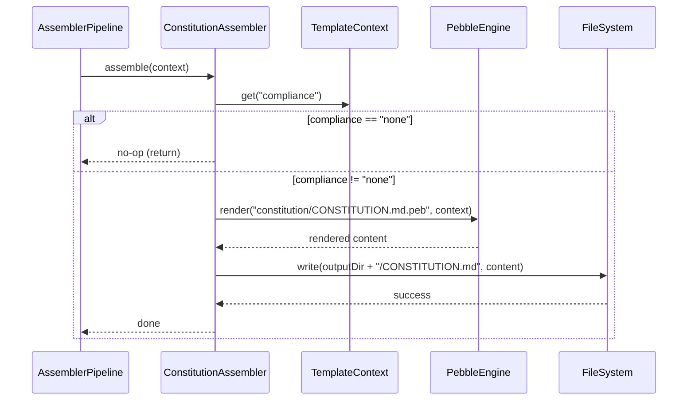

# Historia: ConstitutionAssembler e template CONSTITUTION.md

**ID:** story-0016-0002
**Chave Jira:** —

## 1. Dependencias

| Blocked By | Blocks |
| :--- | :--- |
| story-0016-0001 | story-0016-0003, story-0016-0010 |

## 2. Regras Transversais Aplicaveis

| ID | Titulo |
| :--- | :--- |
| RULE-001 | Golden file obrigatorio |
| RULE-006 | Assemblers como primeira classe |
| RULE-008 | Cobertura minima JaCoCo |
| RULE-010 | Constitution concreta |

## 3. Descricao

Como **arquiteto de plataforma**, eu quero que o CLI gere um artefato `CONSTITUTION.md` na raiz do projeto quando `compliance` estiver ativo, para que projetos com requisitos regulatorios tenham invariants de seguranca, mapeamentos CWE e architecture boundaries documentados desde o dia zero.

### Contexto

O `CONSTITUTION.md` e um novo artefato de governance gerado pelo ia-dev-environment. Diferentemente de documentacao generica, uma Constitution contem regras executaveis: invariants que podem ser verificados por ferramentas (ArchUnit, linters), mapeamentos CWE com exemplos de codigo correto/incorreto, e boundaries arquiteturais especificos. O assembler deve ser registrado como cidadao de primeira classe no `AssemblerPipeline`, ativado condicionalmente quando `compliance != "none"`.

### 3.1 Template Pebble CONSTITUTION.md

Criar template em `src/main/resources/templates/constitution/CONSTITUTION.md.peb` com as secoes obrigatorias:
- `## Invariants` — regras que nunca podem ser violadas, com IDs (RULE-SEC-NNN, RULE-ARCH-NNN)
- `## Security Constraints` — tabela de mapeamentos CWE (CWE ID, Descricao, Proibido, Correto)
- `## Architecture Boundaries` — o que cada camada pode e nao pode importar
- `## Naming Conventions` — padroes do projeto
- `## Compliance Requirements` — requisitos especificos mapeados para componentes

O template deve usar variaveis Pebble para preencher conteudo condicionalmente com base no valor de `compliance` (ex: `pci-dss` preenche secoes PCI-especificas).

### 3.2 ConstitutionAssembler

Nova classe `ConstitutionAssembler` implementando a interface de assembler existente. Responsabilidades:
- Verificar se `compliance != "none"` no context
- Renderizar template CONSTITUTION.md via Pebble engine
- Escrever output na raiz do diretorio de saida
- Registrar-se no `AssemblerPipeline` como primeiro assembler a executar (constitution define constraints para outros assemblers)

### 3.3 Ativacao condicional

O ConstitutionAssembler DEVE ser no-op silencioso quando `compliance == "none"`. Nao deve gerar arquivo, nao deve logar warning, nao deve afetar o pipeline. Quando `compliance == "pci-dss"`, gera o arquivo com conteudo especifico para PCI-DSS.

## 3.5 Entrega de Valor

- **Valor Principal:** Projetos com compliance ativo recebem CONSTITUTION.md com invariants e CWE mappings executaveis desde a primeira geracao
- **Metrica de Sucesso:** Template renderizado corretamente com todas as 5 secoes obrigatorias; golden file gerado e validado
- **Impacto no Negocio:** Base para o profile fintech-pci (story-0016-0010) e verificacao de naming conventions no drift check

## 4. Definicoes de Qualidade Locais

### DoR Local

- [ ] story-0016-0001 concluida (campo compliance disponivel no context)
- [ ] Interface de assembler existente documentada e compreendida
- [ ] AssemblerPipeline.java lido e ponto de registro identificado

### DoD Local

- [ ] ConstitutionAssembler registrado no AssemblerPipeline
- [ ] Template CONSTITUTION.md.peb renderiza as 5 secoes obrigatorias
- [ ] Arquivo gerado na raiz do output quando compliance != "none"
- [ ] Nenhum arquivo gerado quando compliance == "none"
- [ ] Golden file criado para o cenario pci-dss
- [ ] Conteudo gerado contem exemplos concretos de codigo (nao ornamental)
- [ ] Test plan gerado via `/x-test-plan` antes do inicio da implementacao
- [ ] Todo @GK-N da secao 7 mapeado para >= 1 AT-N na secao 8
- [ ] Cenarios Gherkin ordenados por TPP (degenerate -> happy -> error -> boundary)
- [ ] Todo AT-N com status GREEN antes de marcar DoD como concluido
- [ ] Commits seguem padrao test-first (teste precede ou acompanha implementacao no git log)

### Global DoD

- **Cobertura:** >= 95% Line, >= 90% Branch
- **Testes Automatizados:** Unit tests para assembler, integration tests para template rendering
- **TDD Compliance:** Commits test-first, refactoring explicito
- **Backward Compatibility:** Profiles sem compliance nao geram CONSTITUTION.md
- **Double-Loop TDD:** Acceptance tests derivados dos cenarios Gherkin (outer loop), unit tests guiados por TPP (inner loop)
- **Rastreabilidade:** Todo @GK-N mapeia para >= 1 AT-N, todo AT-N referencia um @GK-N valido

## 5. Contratos de Dados

**ConstitutionAssembler (input)**

| Campo | Tipo | Obrigatorio | Descricao |
| :--- | :--- | :--- | :--- |
| `compliance` | String | M | Valor de compliance do context ("none" ou "pci-dss") |
| `language` | String | M | Linguagem do projeto (ex: "java 21") |
| `framework` | String | M | Framework do projeto (ex: "spring-boot 3.2") |
| `architecture` | String | M | Estilo arquitetural (ex: "hexagonal") |

**CONSTITUTION.md (output sections)**

| Secao | Obrigatorio | Descricao |
| :--- | :--- | :--- |
| `## Invariants` | M | Regras RULE-SEC-NNN e RULE-ARCH-NNN com descricao e enforcement |
| `## Security Constraints` | M | Tabela CWE ID / Descricao / Proibido / Correto |
| `## Architecture Boundaries` | M | Tabela camada / pode importar / nao pode importar |
| `## Naming Conventions` | M | Padroes de nomes do projeto |
| `## Compliance Requirements` | M | Requisitos especificos mapeados para componentes |

## 6. Diagramas

### 6.1 Fluxo de geracao de CONSTITUTION.md

## 7. Criterios de Aceite (Gherkin)

@GK-1
Cenario: Config com compliance none nao gera CONSTITUTION.md
  DADO um TemplateContext com compliance = "none"
  QUANDO o ConstitutionAssembler.assemble() e executado
  ENTAO nenhum arquivo CONSTITUTION.md e criado no diretorio de saida
  E nenhum log de warning e emitido

@GK-2
Cenario: Config com compliance pci-dss gera CONSTITUTION.md completo
  DADO um TemplateContext com compliance = "pci-dss", language = "java 21", framework = "spring-boot 3.2"
  QUANDO o ConstitutionAssembler.assemble() e executado
  ENTAO o arquivo CONSTITUTION.md e criado na raiz do diretorio de saida
  E o arquivo contem secao "## Invariants" com pelo menos 2 regras RULE-SEC-NNN
  E o arquivo contem secao "## Security Constraints" com tabela CWE
  E o arquivo contem secao "## Architecture Boundaries"
  E o arquivo contem secao "## Naming Conventions"
  E o arquivo contem secao "## Compliance Requirements"

@GK-3
Cenario: Secao Security Constraints contem exemplos concretos de codigo
  DADO um TemplateContext com compliance = "pci-dss"
  QUANDO o CONSTITUTION.md e gerado
  ENTAO a secao "## Security Constraints" contem coluna "Proibido" com exemplo de codigo Java
  E a secao contem coluna "Correto" com exemplo de codigo Java usando PreparedStatement ou equivalente
  E pelo menos CWE-89 (SQL Injection) e CWE-312 (Cleartext Storage) estao mapeados

@GK-4
Cenario: ConstitutionAssembler esta registrado no AssemblerPipeline
  DADO o AssemblerPipeline configurado com todos os assemblers
  QUANDO a lista de assemblers registrados e inspecionada
  ENTAO ConstitutionAssembler esta presente na lista
  E executa antes dos demais assemblers de conteudo

@GK-5
Cenario: Golden file de CONSTITUTION.md corresponde ao output gerado
  DADO o golden file de CONSTITUTION.md para compliance pci-dss
  QUANDO o ConstitutionAssembler gera o arquivo com o mesmo context
  ENTAO o output corresponde byte-a-byte ao golden file

## 8. Sub-tarefas

### Ciclos TDD

> Sub-tarefas TDD serao populadas apos geracao do test plan via `/x-test-plan`.
> Cada AT-N e UT-N do test plan gerara entradas [TDD] com ciclos RED/GREEN/REFACTOR.

### Tarefas nao-TDD

- [ ] [Doc] Documentar template CONSTITUTION.md.peb e variaveis Pebble disponiveis
- [ ] [Doc] Adicionar ConstitutionAssembler ao README do pipeline de assemblers
