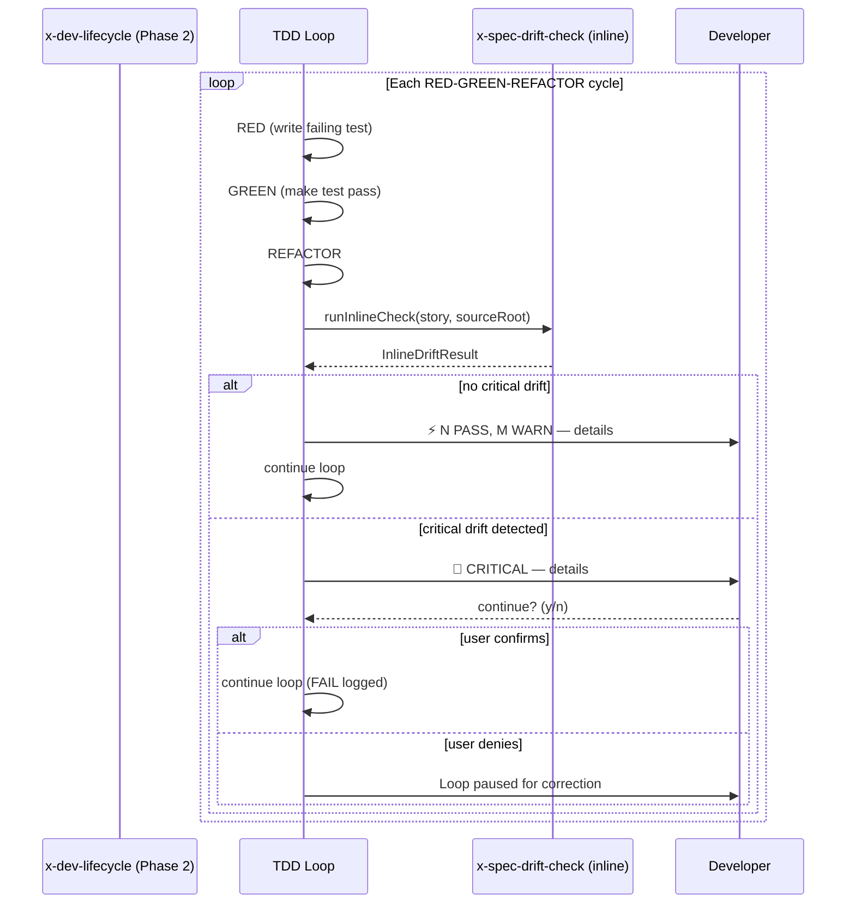

# Historia: Modo inline do x-spec-drift-check no x-dev-lifecycle

**ID:** story-0016-0005
**Chave Jira:** —

## 1. Dependencias

| Blocked By | Blocks |
| :--- | :--- |
| story-0016-0004 | story-0016-0013 |

## 2. Regras Transversais Aplicaveis

| ID | Titulo |
| :--- | :--- |
| RULE-004 | Estrutura padrao de skills |
| RULE-009 | Outputs acionaveis |
| RULE-008 | Cobertura minima JaCoCo |

## 3. Descricao

Como **desenvolvedor usando x-dev-lifecycle**, eu quero que divergencias spec-codigo sejam detectadas automaticamente durante o ciclo TDD, para que eu corrija drifts no mesmo ciclo em vez de descobri-los apos o PR.

### Contexto

O x-dev-lifecycle possui fases de implementacao TDD (fase 2). Apos cada ciclo RED-GREEN-REFACTOR, o modo inline do x-spec-drift-check deve executar verificacoes rapidas e emitir WARNINGs sem bloquear o loop TDD. Apenas FAILs criticos (campo obrigatorio ausente, endpoint declarado nao implementado) devem interromper com pedido de confirmacao.

### 3.1 Integracao na fase 2 do x-dev-lifecycle

Apos cada ciclo RED-GREEN-REFACTOR na fase 2:
1. Executar verificacoes de data contract (campos M) e endpoints
2. Emitir WARNINGs inline no output do agente
3. NAO executar verificacoes de Gherkin coverage (reservado para modo standalone)
4. NAO executar verificacoes de CONSTITUTION.md (reservado para modo standalone)

### 3.2 Comportamento non-blocking

- WARNINGs sao exibidos mas o TDD loop continua
- FAILs criticos pausam o loop e pedem confirmacao: `"Critical drift detected: [detail]. Continue? (y/n)"`
- Se o usuario confirma, o loop continua com o FAIL registrado
- Se o usuario nega, o loop para para correcao

### 3.3 Output inline

Output compacto (nao o relatorio completo do standalone):
```
⚡ Drift Check (inline): 2 PASS, 1 WARN — PaymentRequestDTO.processingTime type mismatch (Long vs Integer)
```

Para FAIL critico:
```
🚨 Drift Check (inline): CRITICAL — PaymentRequest.amount (BigDecimal, M) NOT FOUND in PaymentRequestDTO
   Continue TDD loop despite critical drift? (y/n)
```

## 3.5 Entrega de Valor

- **Valor Principal:** Drift e detectado automaticamente durante TDD, corrigido no mesmo ciclo em vez de apos o PR
- **Metrica de Sucesso:** Zero FAILs criticos chegam ao PR quando inline mode esta ativo
- **Impacto no Negocio:** Reduz ciclo de feedback de dias (review) para minutos (inline check); base para scope assessment (story-0016-0013)

## 4. Definicoes de Qualidade Locais

### DoR Local

- [ ] story-0016-0004 concluida (skill standalone funcional)
- [ ] Estrutura de fases do x-dev-lifecycle documentada (pontos de extensao na fase 2)
- [ ] Mecanismo de confirmacao interativa no agente identificado

### DoD Local

- [ ] Verificacoes inline executam apos cada ciclo RED-GREEN-REFACTOR
- [ ] WARNINGs exibidos sem bloquear o TDD loop
- [ ] FAILs criticos pausam com pedido de confirmacao
- [ ] Verificacoes de Gherkin e CONSTITUTION NAO executam em modo inline
- [ ] Output compacto (1 linha para WARN, 2 linhas para FAIL)
- [ ] Test plan gerado via `/x-test-plan` antes do inicio da implementacao
- [ ] Todo @GK-N da secao 7 mapeado para >= 1 AT-N na secao 8
- [ ] Cenarios Gherkin ordenados por TPP (degenerate -> happy -> error -> boundary)
- [ ] Todo AT-N com status GREEN antes de marcar DoD como concluido
- [ ] Commits seguem padrao test-first (teste precede ou acompanha implementacao no git log)

### Global DoD

- **Cobertura:** >= 95% Line, >= 90% Branch
- **Testes Automatizados:** Unit tests para logica inline, integration test com x-dev-lifecycle simulado
- **TDD Compliance:** Commits test-first, refactoring explicito
- **Backward Compatibility:** x-dev-lifecycle sem drift check continua funcionando (feature opt-in)
- **Double-Loop TDD:** Acceptance tests derivados dos cenarios Gherkin (outer loop), unit tests guiados por TPP (inner loop)
- **Rastreabilidade:** Todo @GK-N mapeia para >= 1 AT-N, todo AT-N referencia um @GK-N valido

## 5. Contratos de Dados

**InlineDriftCheckConfig**

| Campo | Tipo | Obrigatorio | Descricao |
| :--- | :--- | :--- | :--- |
| `enabled` | boolean | M | Se drift check inline esta ativo (default: true quando story tem data contract) |
| `blockOnCritical` | boolean | M | Se FAILs criticos devem pausar o loop (default: true) |

**InlineDriftResult**

| Campo | Tipo | Obrigatorio | Descricao |
| :--- | :--- | :--- | :--- |
| `passCount` | int | M | Total de verificacoes PASS |
| `warnCount` | int | M | Total de WARNINGs |
| `failCount` | int | M | Total de FAILs criticos |
| `summary` | String | M | Mensagem compacta de 1 linha |
| `criticalDetails` | List&lt;String&gt; | N | Detalhes dos FAILs criticos (vazio se nenhum) |

## 6. Diagramas

### 6.1 Fluxo inline no TDD loop



## 7. Criterios de Aceite (Gherkin)

@GK-1
Cenario: Story sem data contract nao executa drift check inline
  DADO uma story sem secao de data contract
  QUANDO o TDD loop da fase 2 completa um ciclo
  ENTAO nenhuma verificacao de drift inline e executada
  E o loop continua normalmente

@GK-2
Cenario: Drift check inline com todos os campos presentes mostra PASS compacto
  DADO uma story com 2 campos M implementados corretamente no codigo
  QUANDO o TDD loop completa um ciclo RED-GREEN-REFACTOR
  ENTAO a mensagem exibida e "⚡ Drift Check (inline): 2 PASS, 0 WARN"
  E o TDD loop continua sem interrupcao

@GK-3
Cenario: WARN inline nao bloqueia o TDD loop
  DADO uma story com campo O `processingTime: Long` declarado
  E o codigo possui `processingTime` com tipo `Integer` (type mismatch)
  QUANDO o drift check inline executa
  ENTAO a mensagem contem "1 WARN — processingTime type mismatch (Long vs Integer)"
  E o TDD loop continua sem interrupcao

@GK-4
Cenario: FAIL critico inline pausa o TDD loop para confirmacao
  DADO uma story com campo M `amount: BigDecimal` declarado
  E o codigo NAO possui o campo `amount`
  QUANDO o drift check inline executa
  ENTAO a mensagem contem "CRITICAL — amount (BigDecimal, M) NOT FOUND"
  E o agente exibe "Continue TDD loop despite critical drift? (y/n)"

@GK-5
Cenario: Modo inline NAO verifica Gherkin coverage nem CONSTITUTION
  DADO uma story com 4 scenarios @GK-1..@GK-4 e um CONSTITUTION.md no projeto
  QUANDO o drift check inline executa
  ENTAO o report NAO contem secao "Gherkin Coverage"
  E o report NAO contem secao "Constitution Compliance"

## 8. Sub-tarefas

### Ciclos TDD

> Sub-tarefas TDD serao populadas apos geracao do test plan via `/x-test-plan`.
> Cada AT-N e UT-N do test plan gerara entradas [TDD] com ciclos RED/GREEN/REFACTOR.

### Tarefas nao-TDD

- [ ] [Doc] Documentar modo inline no SKILL.md do x-spec-drift-check
- [ ] [Doc] Adicionar secao sobre inline drift check no README do x-dev-lifecycle
