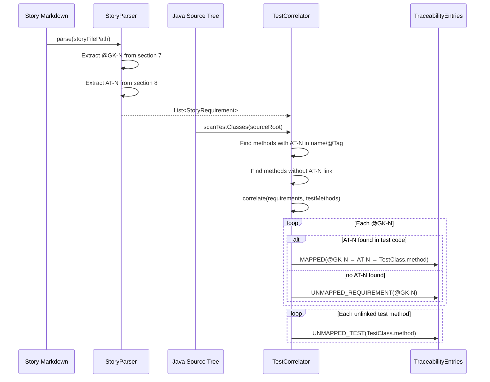

# Historia: Parser de stories e correlacionador de testes

**ID:** story-0016-0008
**Chave Jira:** —

## 1. Dependencias

| Blocked By | Blocks |
| :--- | :--- |
| -- | story-0016-0009 |

## 2. Regras Transversais Aplicaveis

| ID | Titulo |
| :--- | :--- |
| RULE-009 | Outputs acionaveis |
| RULE-008 | Cobertura minima JaCoCo |

## 3. Descricao

Como **auditor PCI-DSS**, eu quero que o sistema correlacione automaticamente cada requisito (scenario Gherkin) da story com a classe e metodo de teste correspondente, para que eu possa verificar rastreabilidade bidirecional sem inspecao manual.

### Contexto

A rastreabilidade bidirecional requisito-teste e mandatoria no PCI-DSS v4.0 Requirement 6.3. Esta story implementa dois componentes fundamentais: (1) um parser que extrai IDs de scenarios (@GK-N / AT-N) de story markdowns, e (2) um correlacionador que encontra os metodos de teste correspondentes no codigo-fonte. A story-0016-0009 utiliza estes componentes para gerar o relatorio final.

### 3.1 Story Parser

O parser deve extrair de um arquivo story markdown:
- IDs de scenarios Gherkin: @GK-1, @GK-2, etc.
- Titulos dos scenarios
- IDs de acceptance tests referenciados: AT-1, AT-2, etc. (da secao 8)
- Mapeamento @GK-N → AT-N (quando declarado nos sub-tasks)

### 3.2 Test Correlator

O correlacionador deve buscar no codigo-fonte Java:
- Classes de teste que referenciam AT-N (via nome do metodo, @DisplayName, ou comentario)
- Convenção de naming: `shouldXxx` metodos em classes `*AcceptanceTest`, `*IntegrationTest`
- Anotações @Tag("AT-N") ou padrão no nome do metodo: `at1_scenarioTitle()`
- Metodos sem vinculo de story (nao referenciam nenhum AT-N)

### 3.3 Output do correlacionador

Para cada @GK-N da story, o correlacionador produz:
- `MAPPED`: @GK-N → AT-N → TestClass.methodName
- `UNMAPPED_REQUIREMENT`: @GK-N sem AT correspondente no codigo
- `UNMAPPED_TEST`: metodo de teste sem @GK-N/AT-N vinculado

## 3.5 Entrega de Valor

- **Valor Principal:** Habilita rastreabilidade bidirecional requisito-teste, essencial para auditorias PCI-DSS v4.0 Requirement 6.3
- **Metrica de Sucesso:** Parser extrai 100% dos @GK-N de stories; correlacionador identifica metodos de teste com >= 95% de acuracia
- **Impacto no Negocio:** Desbloqueia story-0016-0009 (gerador de matriz de rastreabilidade); fundamento para compliance PCI-DSS

## 4. Definicoes de Qualidade Locais

### DoR Local

- [ ] Formato de story markdown (secoes 7 e 8) documentado
- [ ] Padroes de naming de testes Java identificados (metodos, anotacoes)
- [ ] Exemplos de stories e testes correspondentes preparados para testes

### DoD Local

- [ ] Parser extrai @GK-N e AT-N de story markdown corretamente
- [ ] Correlacionador encontra metodos de teste por naming convention
- [ ] Correlacionador encontra metodos de teste por @Tag annotation
- [ ] Requisitos sem teste sao classificados como UNMAPPED_REQUIREMENT
- [ ] Testes sem requisito sao classificados como UNMAPPED_TEST
- [ ] Test plan gerado via `/x-test-plan` antes do inicio da implementacao
- [ ] Todo @GK-N da secao 7 mapeado para >= 1 AT-N na secao 8
- [ ] Cenarios Gherkin ordenados por TPP (degenerate -> happy -> error -> boundary)
- [ ] Todo AT-N com status GREEN antes de marcar DoD como concluido
- [ ] Commits seguem padrao test-first (teste precede ou acompanha implementacao no git log)

### Global DoD

- **Cobertura:** >= 95% Line, >= 90% Branch
- **Testes Automatizados:** Unit tests para parser e correlacionador com fixtures
- **TDD Compliance:** Commits test-first, refactoring explicito
- **Backward Compatibility:** Nenhuma funcionalidade existente alterada
- **Double-Loop TDD:** Acceptance tests derivados dos cenarios Gherkin (outer loop), unit tests guiados por TPP (inner loop)
- **Rastreabilidade:** Todo @GK-N mapeia para >= 1 AT-N, todo AT-N referencia um @GK-N valido

## 5. Contratos de Dados

**StoryRequirement (output do parser)**

| Campo | Tipo | Obrigatorio | Descricao |
| :--- | :--- | :--- | :--- |
| `gherkinId` | String | M | ID do scenario (@GK-N) |
| `title` | String | M | Titulo do scenario Gherkin |
| `acceptanceTestId` | String | N | AT-N vinculado (null se nao declarado) |

**TestMethod (output do correlacionador)**

| Campo | Tipo | Obrigatorio | Descricao |
| :--- | :--- | :--- | :--- |
| `className` | String | M | Nome da classe de teste |
| `methodName` | String | M | Nome do metodo de teste |
| `linkedAtId` | String | N | AT-N referenciado (null se nao vinculado) |
| `tags` | List&lt;String&gt; | M | Anotacoes @Tag encontradas |

**TraceabilityEntry**

| Campo | Tipo | Obrigatorio | Descricao |
| :--- | :--- | :--- | :--- |
| `gherkinId` | String | M | @GK-N |
| `acceptanceTestId` | String | N | AT-N |
| `testClassName` | String | N | Classe de teste (null se UNMAPPED) |
| `testMethodName` | String | N | Metodo de teste (null se UNMAPPED) |
| `status` | enum(MAPPED, UNMAPPED_REQUIREMENT, UNMAPPED_TEST) | M | Status da correlacao |

## 6. Diagramas

### 6.1 Fluxo de parsing e correlacao

## 7. Criterios de Aceite (Gherkin)

@GK-1
Cenario: Story sem secao Gherkin retorna lista vazia de requisitos
  DADO uma story markdown sem secao 7 (Criterios de Aceite)
  QUANDO o StoryParser faz parsing do arquivo
  ENTAO a lista de StoryRequirement esta vazia
  E nenhum erro e lancado

@GK-2
Cenario: Parser extrai @GK-N e titulos corretamente
  DADO uma story com 4 scenarios: @GK-1 "pagamento aprovado", @GK-2 "pagamento negado", @GK-3 "timeout", @GK-4 "duplicado"
  QUANDO o StoryParser faz parsing
  ENTAO 4 StoryRequirement sao retornados
  E o primeiro tem gherkinId = "@GK-1" e title = "pagamento aprovado"
  E o quarto tem gherkinId = "@GK-4" e title = "duplicado"

@GK-3
Cenario: Correlacionador encontra teste por naming convention
  DADO o metodo `at1_pagamentoAprovadoRetorna200()` em `PaymentAcceptanceTest`
  E o StoryRequirement @GK-1 com AT-1
  QUANDO o TestCorrelator executa correlacao
  ENTAO @GK-1 e classificado como MAPPED
  E testClassName = "PaymentAcceptanceTest"
  E testMethodName = "at1_pagamentoAprovadoRetorna200"

@GK-4
Cenario: Requisito sem teste correspondente e UNMAPPED_REQUIREMENT
  DADO @GK-3 "timeout do autorizador" com AT-3
  E nenhum metodo de teste referencia AT-3
  QUANDO o TestCorrelator executa correlacao
  ENTAO @GK-3 e classificado como UNMAPPED_REQUIREMENT

@GK-5
Cenario: Teste sem vinculo de story e UNMAPPED_TEST
  DADO o metodo `shouldHandleNullAmount()` em `PaymentControllerTest`
  E nenhum @GK-N ou AT-N referencia esse metodo
  QUANDO o TestCorrelator executa correlacao
  ENTAO um UNMAPPED_TEST e reportado para "PaymentControllerTest.shouldHandleNullAmount"

@GK-6
Cenario: Correlacionador encontra teste por anotacao @Tag
  DADO o metodo `testApprovedPayment()` com `@Tag("AT-1")` em `PaymentAcceptanceTest`
  E o StoryRequirement @GK-1 com AT-1
  QUANDO o TestCorrelator executa correlacao
  ENTAO @GK-1 e classificado como MAPPED via @Tag

## 8. Sub-tarefas

### Ciclos TDD

> Sub-tarefas TDD serao populadas apos geracao do test plan via `/x-test-plan`.
> Cada AT-N e UT-N do test plan gerara entradas [TDD] com ciclos RED/GREEN/REFACTOR.

### Tarefas nao-TDD

- [ ] [Doc] Documentar convencoes de naming de testes suportadas pelo correlacionador
- [ ] [Doc] Documentar formato de output do parser
