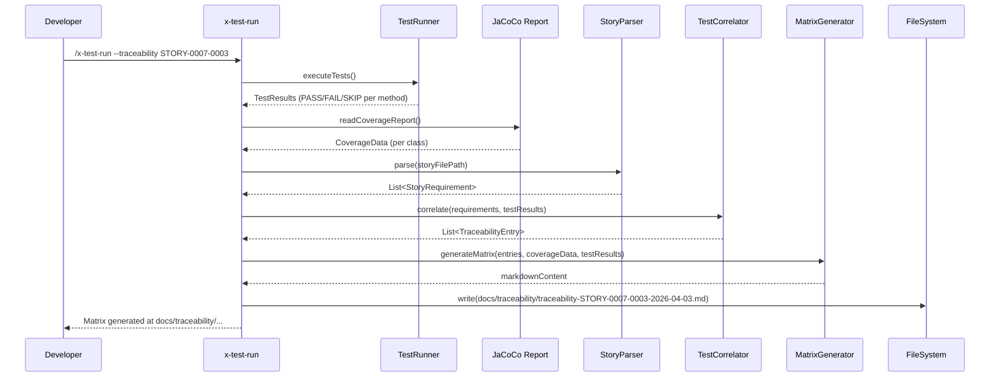

# Historia: Gerador de matriz de rastreabilidade no x-test-run

**ID:** story-0016-0009
**Chave Jira:** —

## 1. Dependencias

| Blocked By | Blocks |
| :--- | :--- |
| story-0016-0008 | -- |

## 2. Regras Transversais Aplicaveis

| ID | Titulo |
| :--- | :--- |
| RULE-009 | Outputs acionaveis |
| RULE-007 | Compliance no frontmatter |
| RULE-008 | Cobertura minima JaCoCo |

## 3. Descricao

Como **auditor PCI-DSS**, eu quero gerar uma matriz de rastreabilidade bidirecional em formato Markdown que correlacione requisitos, testes e resultados de execucao, para que eu tenha evidencia documentada de cobertura de requisitos para auditorias.

### Contexto

O x-test-run ja executa testes e reporta cobertura. Esta story adiciona o flag `--traceability` que, apos execucao dos testes, gera um arquivo Markdown com a matriz de rastreabilidade. A matriz correlaciona cada @GK-N da story com o teste que o cobre, o status de execucao (PASS/FAIL/SKIP), e a cobertura de linha do codigo exercitado.

### 3.1 Flag --traceability

Novo flag no x-test-run: `/x-test-run --traceability [STORY-ID|EPIC-ID]`
- `STORY-ID`: gera matriz para uma story individual
- `EPIC-ID`: gera matriz consolidada para todas as stories do epic
- Output: `docs/traceability/traceability-{ID}-{YYYY-MM-DD}.md`

### 3.2 Estrutura da matriz

```markdown
# Traceability Matrix — STORY-XXXX-YYYY
Generated: YYYY-MM-DD | Build: <commit-hash>

## Requirement → Test → Execution

| Req ID | Scenario | Test Class | Method | Status | Line Cov |
|--------|----------|------------|--------|--------|----------|
| AT-1 | scenario title | TestClass | method | ✅ PASS | 94% |

## Unmapped Requirements
- AT-N: description — reason

## Unmapped Tests
- TestClass.method → not linked to any story scenario

## Coverage Summary
- Stories covered: N/M
- Scenarios covered: N/M (X%)
- Scenarios PASS: N | SKIP: N | FAIL: N
```

### 3.3 Consolidacao por epic

Para EPIC-ID, a matriz consolida todas as stories do epic:
- Uma secao por story
- Summary global no final com totais agregados
- Percentual de cobertura do epic inteiro

### 3.4 Integracao com resultados de teste

A skill deve:
1. Executar os testes via mecanismo existente do x-test-run
2. Capturar resultados de execucao (PASS/FAIL/SKIP) por metodo
3. Capturar cobertura por classe via JaCoCo report
4. Correlacionar com TraceabilityEntries (story-0016-0008)

## 3.5 Entrega de Valor

- **Valor Principal:** Equipes de auditoria obtem evidencia automatica de cobertura de requisitos por testes executados
- **Metrica de Sucesso:** Matriz gerada contem 100% dos scenarios da story; status de execucao reflete resultado real dos testes
- **Impacto no Negocio:** Reduz esforco manual de auditoria PCI-DSS v4.0 Req 6.3; evidencia rastreavel e reprodutivel a cada build

## 4. Definicoes de Qualidade Locais

### DoR Local

- [ ] story-0016-0008 concluida (parser e correlacionador funcionais)
- [ ] Formato de output JaCoCo (XML/CSV) documentado
- [ ] Formato do report de execucao de testes mapeado

### DoD Local

- [ ] Flag --traceability aceita STORY-ID e EPIC-ID
- [ ] Matriz Markdown gerada em docs/traceability/
- [ ] Cada @GK-N da story aparece na matriz com status de execucao real
- [ ] Unmapped Requirements e Unmapped Tests listados
- [ ] Coverage Summary com contagens precisas
- [ ] Consolidacao por epic funcional
- [ ] Test plan gerado via `/x-test-plan` antes do inicio da implementacao
- [ ] Todo @GK-N da secao 7 mapeado para >= 1 AT-N na secao 8
- [ ] Cenarios Gherkin ordenados por TPP (degenerate -> happy -> error -> boundary)
- [ ] Todo AT-N com status GREEN antes de marcar DoD como concluido
- [ ] Commits seguem padrao test-first (teste precede ou acompanha implementacao no git log)

### Global DoD

- **Cobertura:** >= 95% Line, >= 90% Branch
- **Testes Automatizados:** Unit tests para geracao de matriz, integration test com testes reais
- **TDD Compliance:** Commits test-first, refactoring explicito
- **Backward Compatibility:** x-test-run sem flag continua funcionando normalmente
- **Double-Loop TDD:** Acceptance tests derivados dos cenarios Gherkin (outer loop), unit tests guiados por TPP (inner loop)
- **Rastreabilidade:** Todo @GK-N mapeia para >= 1 AT-N, todo AT-N referencia um @GK-N valido

## 5. Contratos de Dados

**TraceabilityReport**

| Campo | Tipo | Obrigatorio | Descricao |
| :--- | :--- | :--- | :--- |
| `targetId` | String | M | STORY-ID ou EPIC-ID |
| `generatedAt` | LocalDate | M | Data de geracao |
| `buildHash` | String | M | Commit hash do build |
| `entries` | List&lt;TraceabilityRow&gt; | M | Linhas da matriz |
| `unmappedRequirements` | List&lt;String&gt; | M | ATs sem teste |
| `unmappedTests` | List&lt;String&gt; | M | Testes sem AT |
| `summary` | CoverageSummary | M | Resumo de cobertura |

**TraceabilityRow**

| Campo | Tipo | Obrigatorio | Descricao |
| :--- | :--- | :--- | :--- |
| `reqId` | String | M | AT-N |
| `scenarioTitle` | String | M | Titulo do scenario Gherkin |
| `testClassName` | String | N | Classe de teste (null se unmapped) |
| `testMethodName` | String | N | Metodo de teste (null se unmapped) |
| `executionStatus` | enum(PASS, FAIL, SKIP, UNMAPPED) | M | Resultado da execucao |
| `lineCoverage` | Integer | N | Cobertura de linha em % (null se UNMAPPED/SKIP) |

**CoverageSummary**

| Campo | Tipo | Obrigatorio | Descricao |
| :--- | :--- | :--- | :--- |
| `storiesCovered` | String | M | "N/M" stories com pelo menos 1 AT mapeado |
| `scenariosCovered` | String | M | "N/M (X%)" scenarios com teste |
| `passCount` | int | M | Total PASS |
| `skipCount` | int | M | Total SKIP |
| `failCount` | int | M | Total FAIL |

## 6. Diagramas

### 6.1 Fluxo de geracao da matriz de rastreabilidade



## 7. Criterios de Aceite (Gherkin)

@GK-1
Cenario: Story sem scenarios nao gera matriz
  DADO uma story sem secao 7 (Criterios de Aceite)
  QUANDO `/x-test-run --traceability STORY-TEST-001` e executado
  ENTAO a mensagem indica "No scenarios found in STORY-TEST-001 — skipping traceability"
  E nenhum arquivo e gerado

@GK-2
Cenario: Matriz gerada para story com 4 scenarios mapeados
  DADO a story STORY-0007-0003 com 4 scenarios AT-1..AT-4
  E testes correspondentes existem em PaymentAcceptanceTest
  E todos os testes passam
  QUANDO `/x-test-run --traceability STORY-0007-0003` e executado
  ENTAO o arquivo docs/traceability/traceability-STORY-0007-0003-2026-04-03.md e criado
  E contem 4 linhas na tabela de rastreabilidade
  E todas com status PASS
  E cada linha referencia a classe e metodo de teste correto

@GK-3
Cenario: Scenario sem teste e listado como Unmapped Requirement
  DADO AT-3 na story mas nenhum metodo de teste referencia AT-3
  QUANDO a matriz e gerada
  ENTAO AT-3 aparece na secao "Unmapped Requirements"

@GK-4
Cenario: Teste sem story vinculada e listado como Unmapped Test
  DADO o metodo `shouldHandleNullAmount()` sem tag AT-N
  QUANDO a matriz e gerada para STORY-0007-0003
  ENTAO "PaymentControllerTest.shouldHandleNullAmount" aparece em "Unmapped Tests"

@GK-5
Cenario: Consolidacao por epic agrega todas as stories
  DADO EPIC-0007 com 3 stories (4 ATs cada = 12 total)
  E testes para 10 dos 12 ATs
  QUANDO `/x-test-run --traceability EPIC-0007` e executado
  ENTAO a matriz consolida todas as 12 linhas
  E o summary indica "Scenarios covered: 10/12 (83%)"

@GK-6
Cenario: Teste com status SKIP aparece na matriz com motivo
  DADO AT-3 vinculado a metodo com @Disabled("pending implementation")
  QUANDO a matriz e gerada
  ENTAO a linha de AT-3 mostra status "⚠️ SKIP"
  E a secao Unmapped Requirements lista "AT-3: Test exists but @Disabled"

## 8. Sub-tarefas

### Ciclos TDD

> Sub-tarefas TDD serao populadas apos geracao do test plan via `/x-test-plan`.
> Cada AT-N e UT-N do test plan gerara entradas [TDD] com ciclos RED/GREEN/REFACTOR.

### Tarefas nao-TDD

- [ ] [Doc] Documentar flag --traceability no help do x-test-run
- [ ] [Doc] Documentar formato do arquivo de rastreabilidade gerado
