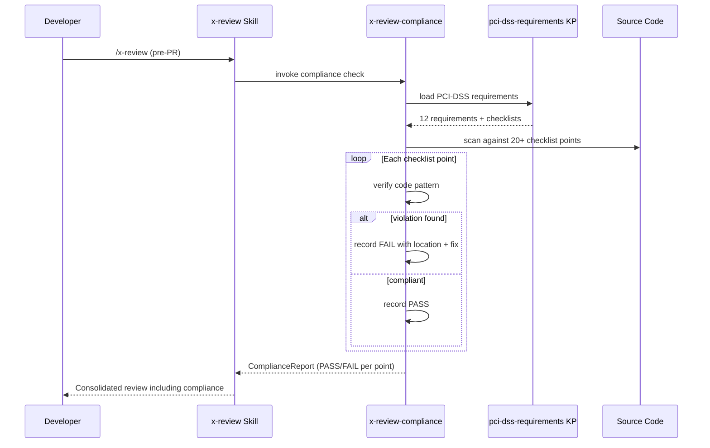

# Historia: Skill x-review-compliance e regras PCI

**ID:** story-0016-0012
**Chave Jira:** —

## 1. Dependencias

| Blocked By | Blocks |
| :--- | :--- |
| story-0016-0010 | story-0016-0015 |

## 2. Regras Transversais Aplicaveis

| ID | Titulo |
| :--- | :--- |
| RULE-004 | Estrutura padrao de skills |
| RULE-007 | Compliance no frontmatter |
| RULE-001 | Golden file obrigatorio |
| RULE-009 | Outputs acionaveis |

## 3. Descricao

Como **security engineer**, eu quero que code reviews automaticos incluam um checklist PCI-DSS de 20+ pontos e que regras de seguranca PCI-especificas estejam ativas, para que violacoes de compliance sejam detectadas durante o review e nao em auditorias.

### Contexto

Esta story cria dois artefatos: (1) a skill `x-review-compliance` com checklist PCI-DSS para code review, e (2) a rule `security-pci.md` com proibicoes explicitas. Ambos sao templates Pebble gerados pelo profile java-spring-fintech-pci.

### 3.1 Skill x-review-compliance

Template em `src/main/resources/skills-templates/x-review-compliance/SKILL.md.peb`:
- Frontmatter: name, description, version, user-invocable: true
- Checklist de 20+ pontos PCI-DSS para code review
- Categorias: Data Protection, Cryptography, Authentication, Access Control, Logging, Transmission Security
- Cada ponto com: descricao, o que verificar no codigo, exemplo de violacao

### 3.2 Rule security-pci.md

Template em `src/main/resources/rules-templates/security-pci.md.peb`:
- Proibicoes explicitas para codigo Java em contexto PCI:
  - `toString()` em objetos que contenham dados de cartao
  - Serializacao de objetos de dominio financeiro para logs
  - Armazenamento de PAN em campos sem criptografia
  - Uso de `Math.random()` para gerar tokens
  - Log de CVV, data de expiracao, ou numero completo do cartao
- Cada proibicao com: regra, motivo, exemplo proibido, alternativa correta

### 3.3 Checklist minimo obrigatorio

O checklist deve conter verificacoes para:
1. PAN nunca em logs, traces ou mensagens de erro
2. Criptografia em repouso para dados de cartao (AES-256+)
3. TLS 1.2+ para transmissao de dados de cartao
4. Autenticacao multifator para acesso a dados de cartao
5. Controle de acesso baseado em role para endpoints sensiveis
6. Audit logging para toda operacao com dados de cartao
7. Mascaramento de PAN em outputs (****1234)
8. Chaves de criptografia de variavel de ambiente ou KMS
9. Nenhum dado de cartao em query strings ou URLs
10. Session tokens com expiracao configurada
(minimo 20 pontos no total)

## 3.5 Entrega de Valor

- **Valor Principal:** Code reviews automaticos verificam conformidade PCI-DSS com checklist de 20+ pontos, reduzindo risco regulatorio
- **Metrica de Sucesso:** Checklist com >= 20 pontos PCI-DSS; regra security-pci.md com >= 5 proibicoes explicitas com exemplos
- **Impacto no Negocio:** Violacoes PCI-DSS detectadas durante development (custo baixo) em vez de durante auditoria (custo altissimo)

## 4. Definicoes de Qualidade Locais

### DoR Local

- [ ] story-0016-0010 concluida (profile base funcional)
- [ ] Knowledge pack PCI-DSS (story-0016-0011) revisado para consistencia de referencias
- [ ] Estrutura de skills templates e rules templates documentada

### DoD Local

- [ ] Template x-review-compliance/SKILL.md.peb criado com frontmatter correto
- [ ] Checklist com >= 20 pontos PCI-DSS categorizado
- [ ] Template security-pci.md.peb criado com proibicoes explicitas
- [ ] Cada proibicao tem exemplo proibido e alternativa correta
- [ ] Golden files criados para ambos artefatos
- [ ] Profile fintech-pci gera ambos artefatos corretamente
- [ ] Test plan gerado via `/x-test-plan` antes do inicio da implementacao
- [ ] Todo @GK-N da secao 7 mapeado para >= 1 AT-N na secao 8
- [ ] Cenarios Gherkin ordenados por TPP (degenerate -> happy -> error -> boundary)
- [ ] Todo AT-N com status GREEN antes de marcar DoD como concluido
- [ ] Commits seguem padrao test-first (teste precede ou acompanha implementacao no git log)

### Global DoD

- **Cobertura:** >= 95% Line, >= 90% Branch
- **Testes Automatizados:** Integration tests para rendering; content validation para checklist
- **TDD Compliance:** Commits test-first, refactoring explicito
- **Backward Compatibility:** Nenhuma skill ou rule existente alterada
- **Double-Loop TDD:** Acceptance tests derivados dos cenarios Gherkin (outer loop), unit tests guiados por TPP (inner loop)
- **Rastreabilidade:** Todo @GK-N mapeia para >= 1 AT-N, todo AT-N referencia um @GK-N valido

## 5. Contratos de Dados

**x-review-compliance SKILL.md (output)**

| Campo | Tipo | Obrigatorio | Descricao |
| :--- | :--- | :--- | :--- |
| `name` | String | M | "x-review-compliance" |
| `user-invocable` | boolean | M | true |
| `checklist_items` | List (>= 20) | M | Pontos de verificacao PCI-DSS |
| `checklist_item.category` | String | M | Categoria (Data Protection, Cryptography, etc.) |
| `checklist_item.description` | String | M | O que verificar |
| `checklist_item.violation_example` | String | M | Exemplo de violacao |

**security-pci.md (output)**

| Campo | Tipo | Obrigatorio | Descricao |
| :--- | :--- | :--- | :--- |
| `prohibitions` | List (>= 5) | M | Proibicoes explicitas |
| `prohibition.rule` | String | M | Descricao da proibicao |
| `prohibition.reason` | String | M | Motivo (referencia PCI-DSS) |
| `prohibition.forbidden_code` | String | M | Exemplo de codigo proibido |
| `prohibition.correct_code` | String | M | Alternativa correta |

## 6. Diagramas

### 6.1 Fluxo de review com x-review-compliance

## 7. Criterios de Aceite (Gherkin)

@GK-1
Cenario: Skill x-review-compliance renderizada sem variaveis residuais
  DADO o template x-review-compliance/SKILL.md.peb
  QUANDO renderizado com context do profile java-spring-fintech-pci
  ENTAO o output NAO contem variaveis Pebble residuais
  E o frontmatter contem user-invocable: true

@GK-2
Cenario: Checklist contem 20+ pontos PCI-DSS
  DADO a skill x-review-compliance renderizada
  QUANDO o conteudo e analisado
  ENTAO contem pelo menos 20 items de checklist
  E cada item esta categorizado (Data Protection, Cryptography, etc.)

@GK-3
Cenario: Checklist cobre pontos PCI criticos
  DADO a skill x-review-compliance renderizada
  QUANDO o checklist e inspecionado
  ENTAO contem verificacao para: PAN em logs
  E contem verificacao para: criptografia em repouso
  E contem verificacao para: autenticacao em acesso a dados de cartao
  E contem verificacao para: seguranca de transmissao (TLS)
  E contem verificacao para: controle de acesso

@GK-4
Cenario: Rule security-pci.md contem proibicoes com exemplos
  DADO a rule security-pci.md renderizada
  QUANDO o conteudo e analisado
  ENTAO contem proibicao sobre toString() em objetos com dados de cartao
  E cada proibicao tem exemplo de codigo proibido e alternativa correta

@GK-5
Cenario: Profile java-spring SEM fintech-pci nao gera artefatos PCI
  DADO o profile java-spring (sem fintech-pci)
  QUANDO `ia-dev-env generate --stack java-spring` e executado
  ENTAO x-review-compliance NAO esta presente no output
  E security-pci.md NAO esta presente no output

## 8. Sub-tarefas

### Ciclos TDD

> Sub-tarefas TDD serao populadas apos geracao do test plan via `/x-test-plan`.
> Cada AT-N e UT-N do test plan gerara entradas [TDD] com ciclos RED/GREEN/REFACTOR.

### Tarefas nao-TDD

- [ ] [Doc] Documentar checklist PCI-DSS e categorias
- [ ] [Doc] Documentar regra security-pci.md e proibicoes
