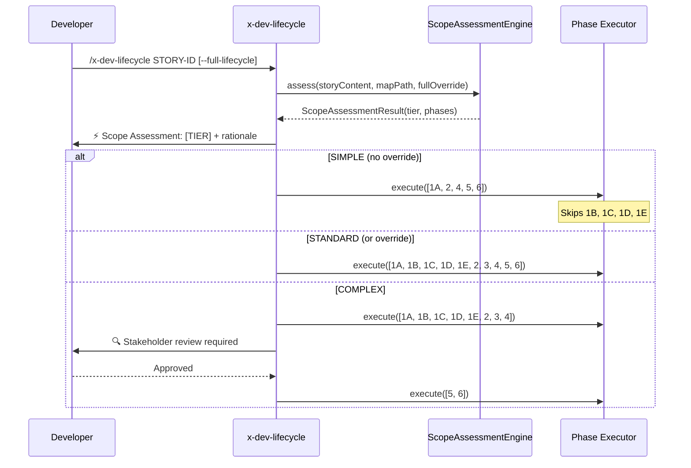

# Historia: Integracao do Scope Assessment no x-dev-lifecycle

**ID:** story-0016-0014
**Chave Jira:** —

## 1. Dependencias

| Blocked By | Blocks |
| :--- | :--- |
| story-0016-0013 | -- |

## 2. Regras Transversais Aplicaveis

| ID | Titulo |
| :--- | :--- |
| RULE-004 | Estrutura padrao de skills |
| RULE-009 | Outputs acionaveis |
| RULE-008 | Cobertura minima JaCoCo |

## 3. Descricao

Como **desenvolvedor**, eu quero que o x-dev-lifecycle adapte automaticamente suas fases com base na classificacao do Scope Assessment, para que eu nao execute fases desnecessarias em stories simples e tenha rigor adicional em stories complexas.

### Contexto

O x-dev-lifecycle possui fases 1A-1E (planning), 2 (TDD), 3 (review), 4 (docs), 5 (PR), 6 (verification). O Scope Assessment (story-0016-0013) classifica stories em SIMPLE/STANDARD/COMPLEX. Esta story integra a classificacao na execucao do lifecycle.

### 3.1 Comportamento por tier

**SIMPLE** (pula fases 1B-1E):
- Executa: 1A (Prepare) → 2 (TDD) → 4 (Docs) → 5 (PR) → 6 (Verify)
- Pula: 1B (Architecture Plan), 1C (Test Plan extended), 1D (Review Plan), 1E (Implementation Map)
- Economia estimada: ~15-20 minutos

**STANDARD** (todas as fases):
- Executa: 1A → 1B → 1C → 1D → 1E → 2 → 3 → 4 → 5 → 6
- Sem alteracao no fluxo atual

**COMPLEX** (fases extras):
- Executa: todas as fases STANDARD + stakeholder review apos fase 4
- Stakeholder review: agente pausa e aguarda confirmacao do desenvolvedor antes de criar o PR
- Mensagem: "Scope COMPLEX — stakeholder review required. Review the implementation and confirm to proceed with PR creation."

### 3.2 Flag --full-lifecycle

Novo flag booleano que forca execucao completa independente da classificacao:
- `--full-lifecycle`: todas as fases executam (equivale a STANDARD)
- Mensagem quando ativo: "Scope override: running full lifecycle as requested"

### 3.3 Exibicao do assessment

No inicio do lifecycle, antes de qualquer fase, exibir:
```
⚡ Scope Assessment: [TIER]
→ [Fases que serao executadas]
→ Rationale: [justificativa]
→ [Override instruction se SIMPLE]
```

### 3.4 Integracao com x-dev-implement

A skill x-dev-implement tambem deve respeitar o Scope Assessment:
- SIMPLE: pula architecture plan detalhado, usa plan simplificado
- COMPLEX: inclui fase de compliance check (se compliance ativo)

## 3.5 Entrega de Valor

- **Valor Principal:** Desenvolvedores experimentam lifecycle adaptativo que otimiza tempo para stories triviais e adiciona rigor para stories complexas
- **Metrica de Sucesso:** Stories SIMPLE completam lifecycle em <= 50% do tempo de STANDARD; zero stories COMPLEX sem stakeholder review
- **Impacto no Negocio:** Produtividade do time aumenta em stories simples; risco reduzido em stories complexas/compliance

## 4. Definicoes de Qualidade Locais

### DoR Local

- [ ] story-0016-0013 concluida (motor de classificacao funcional)
- [ ] Fases do x-dev-lifecycle e x-dev-implement documentadas
- [ ] Pontos de extensao para skip/add phases identificados

### DoD Local

- [ ] Scope Assessment executa no inicio do x-dev-lifecycle
- [ ] SIMPLE: fases 1B-1E puladas
- [ ] STANDARD: todas as fases executam
- [ ] COMPLEX: stakeholder review adicionado apos fase 4
- [ ] --full-lifecycle forca execucao completa
- [ ] Assessment exibido com rationale antes da primeira fase
- [ ] x-dev-implement respeita classificacao
- [ ] Test plan gerado via `/x-test-plan` antes do inicio da implementacao
- [ ] Todo @GK-N da secao 7 mapeado para >= 1 AT-N na secao 8
- [ ] Cenarios Gherkin ordenados por TPP (degenerate -> happy -> error -> boundary)
- [ ] Todo AT-N com status GREEN antes de marcar DoD como concluido
- [ ] Commits seguem padrao test-first (teste precede ou acompanha implementacao no git log)

### Global DoD

- **Cobertura:** >= 95% Line, >= 90% Branch
- **Testes Automatizados:** Integration tests para cada tier + override flag
- **TDD Compliance:** Commits test-first, refactoring explicito
- **Backward Compatibility:** x-dev-lifecycle sem assessment continua funcionando (default STANDARD)
- **Double-Loop TDD:** Acceptance tests derivados dos cenarios Gherkin (outer loop), unit tests guiados por TPP (inner loop)
- **Rastreabilidade:** Todo @GK-N mapeia para >= 1 AT-N, todo AT-N referencia um @GK-N valido

## 5. Contratos de Dados

**x-dev-lifecycle (flag adicional)**

| Campo | Tipo | Obrigatorio | Descricao |
| :--- | :--- | :--- | :--- |
| `--full-lifecycle` | boolean | N (default: false) | Forca execucao completa independente do tier |

**LifecyclePhaseConfig**

| Campo | Tipo | Obrigatorio | Descricao |
| :--- | :--- | :--- | :--- |
| `activePhases` | List&lt;String&gt; | M | Fases a executar (ex: ["1A", "2", "4", "5", "6"] para SIMPLE) |
| `skippedPhases` | List&lt;String&gt; | M | Fases puladas (ex: ["1B", "1C", "1D", "1E"] para SIMPLE) |
| `additionalPhases` | List&lt;String&gt; | M | Fases extras (ex: ["stakeholder-review"] para COMPLEX) |
| `tier` | String | M | SIMPLE, STANDARD ou COMPLEX |
| `overrideActive` | boolean | M | true se --full-lifecycle foi usado |

## 6. Diagramas

### 6.1 Fluxo do lifecycle com Scope Assessment



## 7. Criterios de Aceite (Gherkin)

@GK-1
Cenario: Story sem assessment engine disponivel executa lifecycle completo
  DADO o ScopeAssessmentEngine nao esta configurado
  QUANDO x-dev-lifecycle e invocado para uma story
  ENTAO todas as fases executam (comportamento default STANDARD)
  E nenhum erro e exibido

@GK-2
Cenario: Story SIMPLE pula fases de parallel planning
  DADO uma story classificada como SIMPLE pelo ScopeAssessmentEngine
  QUANDO x-dev-lifecycle e invocado sem --full-lifecycle
  ENTAO as fases 1B, 1C, 1D, 1E sao puladas
  E as fases 1A, 2, 4, 5, 6 sao executadas
  E o agente exibe a justificativa da classificacao

@GK-3
Cenario: --full-lifecycle forca execucao completa
  DADO uma story classificada como SIMPLE
  QUANDO x-dev-lifecycle e invocado com --full-lifecycle
  ENTAO todas as fases sao executadas (1A ate 6)
  E o agente exibe "Scope override: running full lifecycle as requested"

@GK-4
Cenario: Story COMPLEX adiciona stakeholder review
  DADO uma story classificada como COMPLEX (compliance: pci-dss)
  QUANDO x-dev-lifecycle e executado
  ENTAO todas as fases 1A-4 executam normalmente
  E apos fase 4, o agente pausa com "stakeholder review required"
  E aguarda confirmacao antes de executar fases 5-6

@GK-5
Cenario: Assessment exibido no inicio do lifecycle
  DADO uma story qualquer
  QUANDO x-dev-lifecycle inicia
  ENTAO a primeira saida e o Scope Assessment com tier e rationale
  E somente entao as fases comecam a executar

## 8. Sub-tarefas

### Ciclos TDD

> Sub-tarefas TDD serao populadas apos geracao do test plan via `/x-test-plan`.
> Cada AT-N e UT-N do test plan gerara entradas [TDD] com ciclos RED/GREEN/REFACTOR.

### Tarefas nao-TDD

- [ ] [Doc] Documentar flag --full-lifecycle no help do x-dev-lifecycle
- [ ] [Doc] Documentar comportamento por tier (SIMPLE/STANDARD/COMPLEX)
