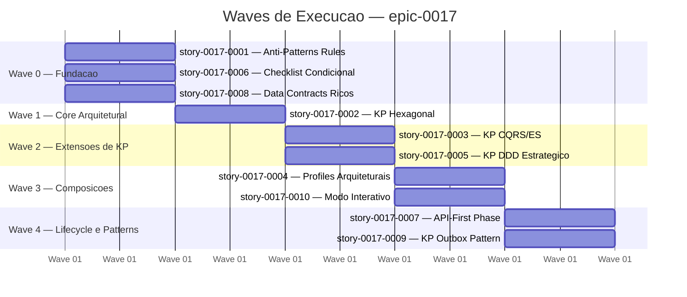
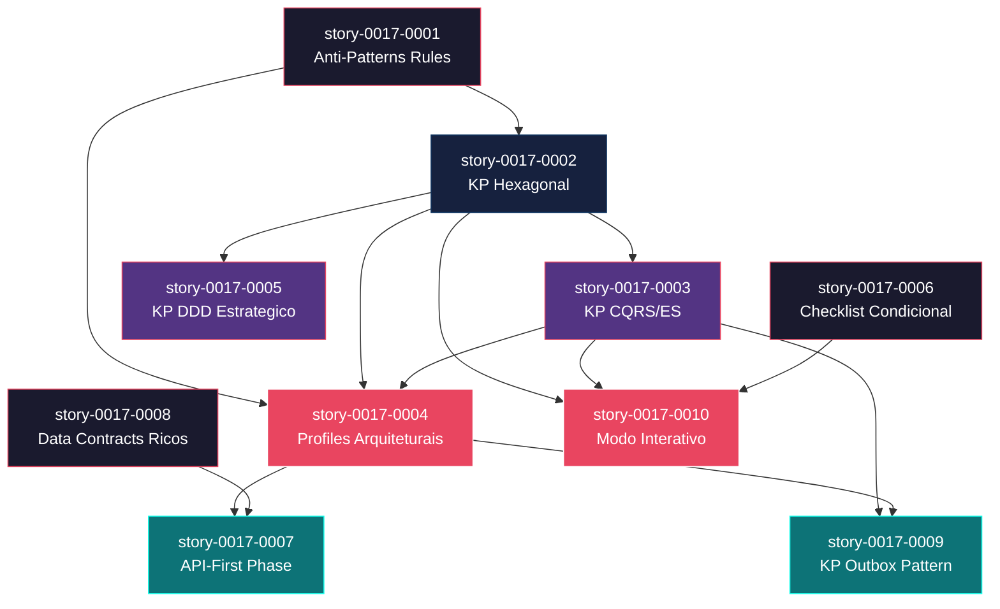

# Mapa de Implementacao — epic-0017 (Architectural Improvements — Segunda Dimensao de Configuracao Arquitetural)

**Autor:** Claude Code
**Data:** 2026-04-03
**Gerado a partir das dependencias BlockedBy/Blocks de cada historia do epic-0017.**

---

## 1. Dependency Matrix

| ID | Titulo | Chave Jira | Blocked By | Blocks | Wave | Test Plan Status |
| :--- | :--- | :--- | :--- | :--- | :--- | :--- |
| story-0017-0001 | Anti-Patterns Rules por Language/Framework | — | -- | story-0017-0002, story-0017-0004 | 0 | Pending |
| story-0017-0002 | KP Hexagonal Architecture com Codigo de Referencia | — | story-0017-0001 | story-0017-0003, story-0017-0004, story-0017-0005, story-0017-0010 | 1 | Pending |
| story-0017-0003 | KP CQRS + Event Sourcing | — | story-0017-0002 | story-0017-0004, story-0017-0009, story-0017-0010 | 2 | Pending |
| story-0017-0004 | Profiles Arquiteturais Dedicados | — | story-0017-0001, story-0017-0002, story-0017-0003 | story-0017-0007, story-0017-0009 | 3 | Pending |
| story-0017-0005 | KP DDD Estrategico (Context Map + Bounded Context) | — | story-0017-0002 | -- | 2 | Pending |
| story-0017-0006 | Checklist Condicional no /x-review-pr | — | -- | story-0017-0010 | 0 | Pending |
| story-0017-0007 | API-First Phase no /x-dev-lifecycle | — | story-0017-0004, story-0017-0008 | -- | 4 | Pending |
| story-0017-0008 | Data Contracts Ricos nas Stories Geradas | — | -- | story-0017-0007 | 0 | Pending |
| story-0017-0009 | KP patterns-outbox (Transactional Outbox Pattern) | — | story-0017-0003, story-0017-0004 | -- | 4 | Pending |
| story-0017-0010 | Modo Interativo com Selecao de Estilo Arquitetural | — | story-0017-0002, story-0017-0003, story-0017-0006 | -- | 3 | Pending |

> **Nota:** story-0017-0008 (Data Contracts Ricos) nao tem dependencias declaradas mas e prerequisito funcional de story-0017-0007 (API-First) pois a Phase 0.5 consome os data contracts ricos das stories para gerar os contratos OpenAPI/AsyncAPI. Esta dependencia esta declarada em story-0017-0007 (Blocked By: story-0017-0008).

---

## 2. Wave Diagram



---

## 3. Fases de Implementacao

> As historias sao agrupadas em fases (waves). Dentro de cada fase, as historias podem ser implementadas **em paralelo**. Uma fase so pode iniciar quando todas as dependencias das fases anteriores estiverem concluidas.

```
+================================================================================+
|          FASE 0 — Fundacao Anti-Alucinacao (paralelo)                          |
|                                                                                |
|  +--------------------+  +--------------------+  +--------------------+        |
|  | story-0017-0001    |  | story-0017-0006    |  | story-0017-0008    |        |
|  | Anti-Patterns      |  | Checklist Cond.    |  | Data Contracts     |        |
|  +--------+-----------+  +--------+-----------+  +--------+-----------+        |
+===========|=======================|=======================|====================+
            |                       |                       |
            v                       |                       |
+================================================================================+
|          FASE 1 — Core Arquitetural                                            |
|                                                                                |
|  +-------------------------------+                                             |
|  | story-0017-0002               |                                             |
|  | KP Hexagonal + ArchUnit       |                                             |
|  +---------------+---------------+                                             |
+==================|=============================================================+
                   |
          +--------+--------+
          |                 |
          v                 v
+================================================================================+
|          FASE 2 — Extensoes de Knowledge Packs (paralelo)                      |
|                                                                                |
|  +--------------------+  +--------------------+                                |
|  | story-0017-0003    |  | story-0017-0005    |                                |
|  | KP CQRS/ES         |  | KP DDD Estrategico |                                |
|  +--------+-----------+  +--------------------+                                |
+===========|================================================================+===+
            |                                        |
            v                                        |
+================================================================================+
|          FASE 3 — Composicoes (paralelo)                                       |
|                                                                                |
|  +--------------------+  +--------------------+                                |
|  | story-0017-0004    |  | story-0017-0010    |                                |
|  | Profiles Arquitet. |  | Modo Interativo    |                                |
|  +--------+-----------+  +--------------------+                                |
+===========|================================================================+===+
            |
            v
+================================================================================+
|          FASE 4 — Lifecycle e Patterns Avancados (paralelo)                    |
|                                                                                |
|  +--------------------+  +--------------------+                                |
|  | story-0017-0007    |  | story-0017-0009    |                                |
|  | API-First Phase    |  | KP Outbox Pattern  |                                |
|  +--------------------+  +--------------------+                                |
+================================================================================+
```

---

## 4. Caminho Critico

> O caminho critico (a sequencia mais longa de dependencias) determina o tempo minimo de implementacao do projeto.

```
story-0017-0001 ──→ story-0017-0002 ──→ story-0017-0003 ──→ story-0017-0004 ──→ story-0017-0007
    Wave 0              Wave 1              Wave 2              Wave 3          ┐
                                                                                ├──→ Wave 4
story-0017-0001 ──→ story-0017-0002 ──→ story-0017-0003 ──→ story-0017-0004 ──→ story-0017-0009
    Wave 0              Wave 1              Wave 2              Wave 3              Wave 4
```

**5 fases no caminho critico, 5 historias na cadeia mais longa.**

O caminho critico atravessa toda a cadeia de conhecimento arquitetural: anti-patterns (fundacao de exemplos negativos) → mecanismo de `architecture.style` (hexagonal como ponto de entrada) → extensao CQRS/ES → composicao em profiles → consumo no lifecycle ou em patterns avancados. Qualquer atraso em story-0017-0002 (KP Hexagonal) propaga diretamente para 7 das 10 historias do epico.

---

## 5. Grafo de Dependencias (Mermaid)



---

## 6. Resumo por Fase

| Fase | Historias | Camada | Paralelismo | Pre-requisito |
| :--- | :--- | :--- | :--- | :--- |
| 0 | story-0017-0001, story-0017-0006, story-0017-0008 | Fundacao (Layer 0) | 3 paralelas | -- |
| 1 | story-0017-0002 | Core (Layer 1) | 1 | Fase 0 concluida |
| 2 | story-0017-0003, story-0017-0005 | Extensoes (Layer 2) | 2 paralelas | Fase 1 concluida |
| 3 | story-0017-0004, story-0017-0010 | Composicoes (Layer 3) | 2 paralelas | Fase 2 concluida |
| 4 | story-0017-0007, story-0017-0009 | Lifecycle/Patterns (Layer 2+) | 2 paralelas | Fase 3 concluida |

**Total: 10 historias em 5 fases.**

> **Nota:** story-0017-0005 (KP DDD) e story-0017-0010 (Modo Interativo) sao folhas que nao bloqueiam nenhuma outra historia. Podem absorver atrasos sem impacto no caminho critico.

---

## 7. Detalhamento por Fase

### Fase 0 — Fundacao Anti-Alucinacao

| Story | Escopo Principal | Artefatos Chave |
| :--- | :--- | :--- |
| story-0017-0001 | Templates de anti-patterns por language/framework | `07-anti-patterns.md` template Pebble, `RulesAssembler` condicional, golden files para 10 profiles |
| story-0017-0006 | Secoes condicionais no checklist de review | `x-review-pr/SKILL.md` template com logica Pebble, secoes L/M/N, scoring percentual |
| story-0017-0008 | Templates de data contracts ricos nas stories | `x-story-create/SKILL.md` template atualizado, tabelas Request/Response/ErrorCodes/EventSchema |

**Entregas da Fase 0:**

- Template Pebble `07-anti-patterns.md` com blocos condicionais por language/framework
- `RulesAssembler.java` atualizado com geracao condicional do rule 07
- Template `x-review-pr/SKILL.md` com secoes L (event-driven), M (PCI-DSS), N (LGPD) via Pebble ``
- Campo `compliance` adicionado ao modelo de dados e schema de validacao
- Template `x-story-create/SKILL.md` com novo formato de data contracts (Tipo/Validacoes/Exemplo/ErrorCodes)
- Golden files atualizados para todos os profiles existentes

---

### Fase 1 — Core Arquitetural

| Story | Escopo Principal | Artefatos Chave |
| :--- | :--- | :--- |
| story-0017-0002 | Mecanismo architecture.style + KP hexagonal + ArchUnit | `ArchitectureConfig.java`, `KnowledgePackAssembler` condicional, `architecture-hexagonal/KNOWLEDGE.md`, `HexagonalArchitectureTest.java` template, ArchUnit dependency no pom.xml |

**Entregas da Fase 1:**

- Campo `architecture.style` (enum) adicionado ao modelo de dados `ArchitectureConfig.java`
- Campo `architecture.validateWithArchUnit` (boolean) e `architecture.basePackage` (string)
- `KnowledgePackAssembler` gera `architecture-hexagonal/KNOWLEDGE.md` condicionalmente
- KP com 4 secoes: estrutura de pacotes, regras de dependencia, exemplos port/adapter, suite ArchUnit
- `TestAssembler` gera `HexagonalArchitectureTest.java` com 3+ ArchTest rules
- `pom.xml` template inclui `archunit-junit5` quando `validateWithArchUnit: true`
- Validacao: `validate` command rejeita `validateWithArchUnit: true` sem `basePackage`

---

### Fase 2 — Extensoes de Knowledge Packs

| Story | Escopo Principal | Artefatos Chave |
| :--- | :--- | :--- |
| story-0017-0003 | KP CQRS/ES com aggregate, event store, projections | `architecture-cqrs/KNOWLEDGE.md` (7 secoes), EventStoreDB no `docker-compose.yml`, StatefulSet K8s |
| story-0017-0005 | KP DDD estrategico com context map e ACL | `ddd-strategic/KNOWLEDGE.md` (4 secoes), skill `/x-ddd-context-map` condicional, enum value `ddd` |

**Entregas da Fase 2:**

- KP `architecture-cqrs` com 7 secoes: separacao de modelos, command bus, event store, aggregate ES, projections, snapshot policy, dead letter handling
- EventStoreDB adicionado ao template `docker-compose.yml` quando `style: cqrs`
- StatefulSet do EventStoreDB no template Kubernetes quando `orchestrator: kubernetes`
- Campo `eventStore` (enum) e `snapshotPolicy.eventsPerSnapshot` (int) no modelo
- KP `ddd-strategic` com 4 secoes: bounded context, context map + integration patterns, ACL template Java, skill `/x-ddd-context-map`
- Enum value `ddd` adicionado a `architecture.style`
- Campo `ddd.enabled` (boolean) no modelo de dados

---

### Fase 3 — Composicoes

| Story | Escopo Principal | Artefatos Chave |
| :--- | :--- | :--- |
| story-0017-0004 | 3 novos profiles bundled | `java-spring-hexagonal.yaml`, `java-spring-cqrs-es.yaml`, `java-spring-event-driven.yaml`, golden files, `ProfileRegistry` atualizado |
| story-0017-0010 | Wizard interativo com architecture.style e compliance | `InteractiveConfigBuilder` com 3 novos steps, mapeamento para `ArchitectureConfig` |

**Entregas da Fase 3:**

- 3 novos profiles registrados no `ProfileRegistry`:
  - `java-spring-hexagonal`: KP hexagonal + ArchUnit + anti-patterns hexagonal
  - `java-spring-cqrs-es`: KP CQRS + EventStoreDB + Kafka + anti-patterns CQRS
  - `java-spring-event-driven`: KP outbox + Kafka + Schema Registry + Outbox migration
- Campos `eventStore`, `schemaRegistry`, `outboxPattern`, `deadLetterStrategy` no modelo
- Golden files completos para os 3 novos profiles
- `ia-dev-env generate --stack <profile>` funcional para cada novo profile
- `InteractiveConfigBuilder` com perguntas de `architectureStyle` (java/kotlin only), `validateWithArchUnit` (hexagonal/clean only), `compliance` (multi-select)
- Mapeamento correto das respostas para `ArchitectureConfig`

---

### Fase 4 — Lifecycle e Patterns Avancados

| Story | Escopo Principal | Artefatos Chave |
| :--- | :--- | :--- |
| story-0017-0007 | Phase 0.5 API-first no lifecycle | `x-dev-lifecycle/SKILL.md` com Phase 0.5, template OpenAPI/AsyncAPI, skill `/x-contract-lint` |
| story-0017-0009 | KP outbox pattern com polling publisher e CDC | `patterns-outbox/KNOWLEDGE.md` (5 secoes), schema SQL `outbox_events`, CDC Debezium config |

**Entregas da Fase 4:**

- Template `x-dev-lifecycle/SKILL.md` com Phase 0.5 condicional (ativada por interfaces REST/gRPC/event)
- Template de contrato OpenAPI 3.1 gerado a partir dos data contracts da story
- Template de contrato AsyncAPI 2.6 para stories event-driven
- Mecanismo de pausa com mensagem "CONTRACT PENDING APPROVAL"
- Skill `/x-contract-lint` gerada condicionalmente
- KP `patterns-outbox` com 5 secoes: problema, solucao transactional outbox, polling publisher, CDC Debezium, anti-patterns
- Schema SQL da tabela `outbox_events` com indice parcial
- Referencia no agent `architect` para o KP outbox

---

## 8. Observacoes Estrategicas

### Gargalo Principal

**story-0017-0002 (KP Hexagonal Architecture)** e o gargalo critico do epico. Bloqueia diretamente **4 historias** (story-0017-0003, story-0017-0004, story-0017-0005, story-0017-0010) e indiretamente **7 das 10 historias**. O mecanismo de `architecture.style` condicional que ela introduz e o ponto de extensao que todas as stories subsequentes reutilizam.

**Recomendacao:** Investir design extra nesta historia — especificamente na extensibilidade do `KnowledgePackAssembler` para aceitar novos estilos sem modificacao do assembler base (Open/Closed Principle). Uma implementacao rigida aqui forcara refactoring em cascata nas historias de CQRS, DDD, e profiles.

### Historias Folha (sem dependentes)

- **story-0017-0005** (KP DDD Estrategico) — Wave 2, nao bloqueia ninguem. Pode ser adiada sem impacto no caminho critico. Boa candidata para stream paralelo ou desenvolvedor focado em DDD.
- **story-0017-0007** (API-First Phase) — Wave 4, folha terminal. Entrega valor alto mas nao desbloqueia nada.
- **story-0017-0009** (KP Outbox Pattern) — Wave 4, folha terminal. Mesma observacao.
- **story-0017-0010** (Modo Interativo) — Wave 3, folha. Menor complexidade tecnica, boa para onboarding.

### Otimizacao de Tempo

**Paralelismo maximo na Wave 0**: 3 historias independentes podem iniciar simultaneamente. Com 3 desenvolvedores, a Fase 0 completa em tempo de 1 historia.

**Alocacao ideal:**
- **Dev 1 (senior):** Caminho critico completo — story-0017-0001 → 0002 → 0003 → 0004 → 0007
- **Dev 2:** story-0017-0008 (Wave 0) → story-0017-0005 (Wave 2) → story-0017-0009 (Wave 4)
- **Dev 3:** story-0017-0006 (Wave 0) → story-0017-0010 (Wave 3)

Com esta alocacao, o epico completa em ~5 ciclos sequenciais (1 por wave do caminho critico), com paralelismo absorvendo as historias laterais.

### Dependencias Cruzadas

**Ponto de convergencia em story-0017-0004 (Profiles Arquiteturais):** Esta historia depende de 3 stories de waves diferentes (story-0017-0001 da Wave 0, story-0017-0002 da Wave 1, story-0017-0003 da Wave 2). E o ponto onde anti-patterns, KP hexagonal e KP CQRS se unem para compor os profiles. Atrasos em qualquer uma das 3 propagam para esta story.

**Ponto de convergencia em story-0017-0010 (Modo Interativo):** Depende de 3 stories de waves diferentes (story-0017-0002 Wave 1, story-0017-0003 Wave 2, story-0017-0006 Wave 0). Menos critico pois e uma folha, mas representa o ponto onde todas as opcoes do wizard precisam estar definidas.

**Ponto de convergencia em story-0017-0007 (API-First):** Depende de story-0017-0004 (Wave 3) e story-0017-0008 (Wave 0). A longa distancia entre Wave 0 e Wave 3 significa que story-0017-0008 estara pronta muito antes de story-0017-0004, deixando margem para ajustes no formato de data contracts antes do consumo pela Phase 0.5.

### Marco de Validacao Arquitetural

**story-0017-0002 (KP Hexagonal)** e o marco de validacao arquitetural. Apos sua conclusao, valida-se:

1. **Mecanismo de extensibilidade:** O `KnowledgePackAssembler` aceita novos estilos arquiteturais via condicional no config — padrao que story-0017-0003 (CQRS) e story-0017-0005 (DDD) reutilizam
2. **Pipeline de geracao condicional:** O fluxo config → assembler → template Pebble → golden file funciona end-to-end para um estilo nao-padrao
3. **Integracao ArchUnit:** O mecanismo de adicionar dependencias e testes arquiteturais ao pom.xml gerado funciona sem quebrar profiles existentes
4. **Validacao de schema:** O `validate` command aceita os novos campos sem regressao nos campos existentes

Se story-0017-0002 falhar na validacao de qualquer destes pontos, corrigir antes de expandir para CQRS/DDD/profiles.

---

## Execution Order

1. **Wave 0** (paralelo): story-0017-0001 (Anti-Patterns), story-0017-0006 (Checklist Condicional), story-0017-0008 (Data Contracts Ricos)
2. **Wave 1** (apos Wave 0): story-0017-0002 (KP Hexagonal + ArchUnit)
3. **Wave 2** (apos Wave 1, paralelo): story-0017-0003 (KP CQRS/ES), story-0017-0005 (KP DDD Estrategico)
4. **Wave 3** (apos Wave 2, paralelo): story-0017-0004 (Profiles Arquiteturais), story-0017-0010 (Modo Interativo)
5. **Wave 4** (apos Wave 3, paralelo): story-0017-0007 (API-First Phase), story-0017-0009 (KP Outbox Pattern)
