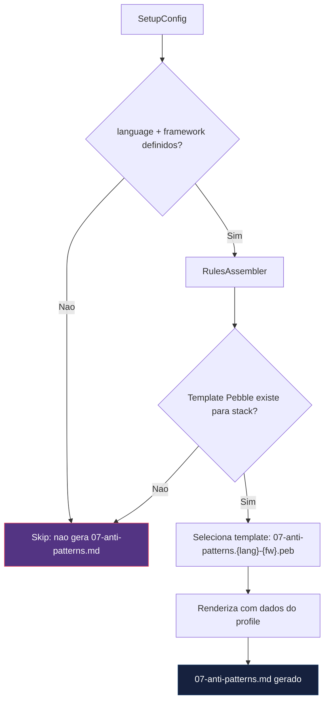
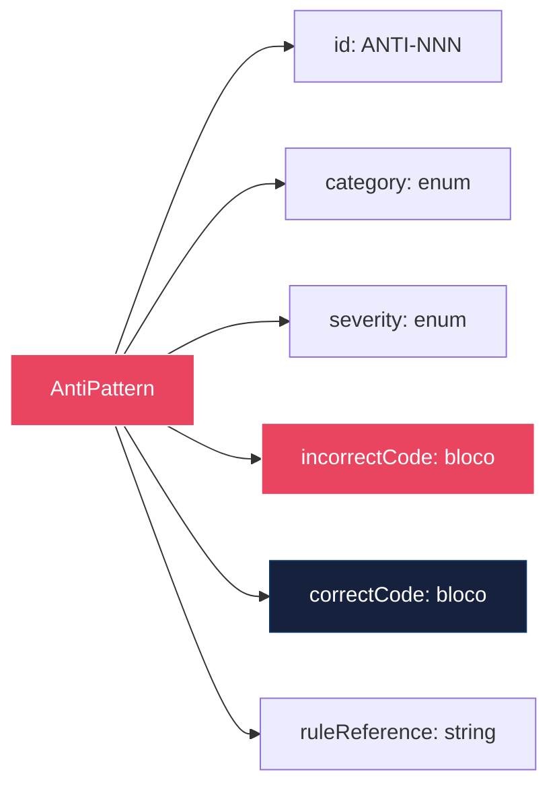

# Historia: Anti-Patterns Rules por Language/Framework

**ID:** story-0017-0001
**Chave Jira:** —

## 1. Dependencias

| Blocked By | Blocks |
| :--- | :--- |
| -- | story-0017-0002, story-0017-0004 |

## 2. Regras Transversais Aplicaveis

| ID | Titulo |
| :--- | :--- |
| RULE-002 | Anti-patterns com codigo errado/certo |
| RULE-006 | Anti-patterns condicionais por language/framework |

## 3. Descricao

Como **Desenvolvedor assistido por IA**, eu quero receber exemplos explicitos de anti-patterns por language/framework nos rules gerados, para que o agente tenha referencia concreta de codigo incorreto vs correto, reduzindo alucinacoes.

### Contexto

O gerador atual produz 6 arquivos de rules (01 a 06) sem exemplos de codigo incorreto. Descricoes puramente textuais de padroes sao insuficientes para guiar sintese de codigo por LLMs — o agente precisa de exemplos negativos explicitos para evitar gerar codigo que viola padroes do projeto.

Esta story adiciona `07-anti-patterns.md` como rule condicional por `language` + `framework`. O arquivo e gerado via template Pebble com blocos condicionais que selecionam os anti-patterns aplicaveis ao stack do profile.

### 3.1 Anti-Patterns por Stack

**java-spring (10 anti-patterns):**
1. God Service (classe de servico com multiplas responsabilidades)
2. Controller chamando Repository diretamente (bypass da camada de aplicacao)
3. `@Transactional` em metodo privado (proxy nao intercepta)
4. `Optional.get()` sem `isPresent()` (NoSuchElementException em runtime)
5. Retornar `List<Entity>` sem DTO e sem paginacao (exposicao de modelo interno + OOM)
6. `catch(Exception e)` com swallowing silencioso (perda de rastreabilidade)
7. Field injection com `@Autowired` (acoplamento oculto, impossivel testar)
8. `@Scheduled` com logica de negocio inline (violacao SRP)
9. Entity JPA com logica de negocio (dominio acoplado a framework)
10. `Thread.sleep()` em testes (sincronizacao fragil)

**java-quarkus (10 + 3 adicionais):**
- Herda os 10 de java-spring adaptados para Quarkus
- `static @Inject` (CDI nao injeta em campos estaticos)
- Blocking I/O em event loop Vert.x (bloqueia thread reativa)
- `@Transactional` com escopo errado em contexto reativo

**go-gin (4 anti-patterns):**
- Goroutine leak (goroutine sem cancelamento via context)
- Panic em handler HTTP (crash do servidor)
- `sync.Mutex` em struct exportado sem documentacao (race condition oculta)
- SQL injection via concatenacao de string

**python-fastapi (3 anti-patterns):**
- Endpoint sincrono bloqueando event loop asyncio
- Pydantic model sem validacao (campos `Any`)
- Dependency injection circular

**Demais profiles:** ao menos 5 anti-patterns cada, cobrindo categorias SERVICE_LAYER, PERSISTENCE, ERROR_HANDLING, SECURITY e TESTING.

### 3.2 Estrutura do Template

Cada anti-pattern no template segue a estrutura:

```
### ANTI-NNN: [Nome] (SEVERITY)
**Categoria:** [CATEGORY]
**Rule violada:** [referencia ao rule file]

**Codigo incorreto:**
```language
// Comentario explicando POR QUE e errado
[bloco de codigo incorreto]
```

**Codigo correto:**
```language
// Comentario explicando a correcao
[bloco de codigo correto]
```
```

### 3.3 Condicionalidade por Stack

O `RulesAssembler` deve:
1. Ler `language` e `framework` da configuracao do profile
2. Selecionar o template Pebble correspondente (e.g., `07-anti-patterns.java-spring.peb`)
3. Gerar `07-anti-patterns.md` apenas quando a combinacao language+framework possui template definido
4. Nao gerar o arquivo quando nao ha template para o stack (fail silencioso, nao erro)

## 3.5 Entrega de Valor

- **Valor Principal:** Reducao de alucinacoes de codigo incorreto pelo agente atraves de exemplos negativos explicitos por stack
- **Metrica de Sucesso:** Zero anti-patterns de uma linguagem vazando para output de outra linguagem; 10+ anti-patterns para java-spring
- **Impacto no Negocio:** Agentes geram codigo que nao viola padroes do projeto, reduzindo ciclos de review e retrabalho

## 4. Definicoes de Qualidade Locais

### DoR Local

- [ ] `RulesAssembler.java` existente identificado e analisado
- [ ] Template Pebble base definido para `07-anti-patterns.md`
- [ ] Golden files alvo listados para todos os 10 profiles (8 existentes + futuros)
- [ ] Lista completa de anti-patterns por stack revisada e aprovada
- [ ] Categorias de anti-pattern (enum) definidas: SERVICE_LAYER, PERSISTENCE, TRANSACTION, ERROR_HANDLING, SECURITY, TESTING, CONCURRENCY

### DoD Local

- [ ] `RulesAssembler` gera `07-anti-patterns.md` condicionalmente por language+framework
- [ ] Template Pebble para java-spring contem 10+ anti-patterns com codigo errado e correto
- [ ] Template Pebble para java-quarkus contem anti-patterns Quarkus-especificos adicionais
- [ ] Template Pebble para go-gin contem 4+ anti-patterns Go-especificos
- [ ] Template Pebble para python-fastapi contem 3+ anti-patterns Python-especificos
- [ ] Golden file parity tests passam para todos os profiles
- [ ] Codigo Java nos exemplos de anti-pattern e compilavel (validado por testes)
- [ ] Zero anti-patterns de uma linguagem presentes no output de outra linguagem
- [ ] Test plan gerado via `/x-test-plan` antes do inicio da implementacao
- [ ] Todo @GK-N da secao 7 mapeado para >= 1 AT-N na secao 8
- [ ] Cenarios Gherkin ordenados por TPP (degenerate -> happy -> error -> boundary)
- [ ] Todo AT-N com status GREEN antes de marcar DoD como concluido
- [ ] Commits seguem padrao test-first (teste precede ou acompanha implementacao no git log)

### Global DoD

- **Cobertura:** >= 95% Line, >= 90% Branch
- **Testes Automatizados:** Unit + Integration + Golden file parity
- **TDD Compliance:** Commits test-first, refactoring explicito
- **Backward Compatibility:** Zero regressao em profiles existentes
- **Double-Loop TDD:** Acceptance tests derivados dos cenarios Gherkin (outer loop), unit tests guiados por TPP (inner loop)
- **Rastreabilidade:** Todo @GK-N mapeia para >= 1 AT-N, todo AT-N referencia um @GK-N valido

## 5. Contratos de Dados

| Campo | Tipo | Obrigatorio | Descricao |
| :--- | :--- | :--- | :--- |
| `language` | `String` | Sim | Linguagem do profile (java, go, python, kotlin, rust, typescript) |
| `framework` | `String` | Sim | Framework do profile (spring-boot, quarkus, gin, fastapi, ktor, axum, nestjs) |
| `antiPatterns` | `List<AntiPattern>` | Sim | Lista de anti-patterns gerados para o stack |
| `antiPatterns[].id` | `String` | Sim | Identificador unico (ANTI-001, ANTI-002, ...) |
| `antiPatterns[].category` | `enum(SERVICE_LAYER, PERSISTENCE, TRANSACTION, ERROR_HANDLING, SECURITY, TESTING, CONCURRENCY)` | Sim | Categoria do anti-pattern |
| `antiPatterns[].severity` | `enum(CRITICAL, HIGH, MEDIUM)` | Sim | Severidade do anti-pattern |
| `antiPatterns[].incorrectCode` | `String` | Sim | Bloco de codigo incorreto com comentarios explicando o problema |
| `antiPatterns[].correctCode` | `String` | Sim | Bloco de codigo correto equivalente com comentarios |
| `antiPatterns[].ruleReference` | `String` | Sim | Referencia ao rule file violado (e.g., `03-coding-standards.md#solid`) |

## 6. Diagramas

### 6.1 Fluxo de Geracao de Anti-Patterns



### 6.2 Estrutura de Anti-Pattern no Template



## 7. Criterios de Aceite (Gherkin)

```gherkin
@GK-1
Cenario: Config sem language definido nao gera anti-patterns
  DADO que o arquivo de configuracao do profile nao possui campo "language"
  QUANDO o RulesAssembler e executado
  ENTAO o arquivo 07-anti-patterns.md NAO deve ser gerado
  E nenhum erro deve ser lancado

@GK-2
Cenario: Profile java-spring gera anti-patterns com 10+ entradas
  DADO que o profile possui language "java" e framework "spring-boot"
  QUANDO o RulesAssembler gera os rules
  ENTAO o arquivo 07-anti-patterns.md deve ser gerado
  E deve conter ao menos 10 anti-patterns
  E cada anti-pattern deve ter bloco de codigo incorreto
  E cada anti-pattern deve ter bloco de codigo correto
  E cada anti-pattern deve ter referencia a rule violada

@GK-3
Cenario: Profile go-gin gera anti-patterns Go-especificos
  DADO que o profile possui language "go" e framework "gin"
  QUANDO o RulesAssembler gera os rules
  ENTAO o arquivo 07-anti-patterns.md deve ser gerado
  E deve conter ao menos 4 anti-patterns
  E deve conter anti-pattern sobre goroutine leak
  E deve conter anti-pattern sobre panic em handler HTTP

@GK-4
Cenario: Template de anti-pattern sem bloco de codigo incorreto causa erro
  DADO que um template Pebble de anti-pattern possui entrada sem bloco de codigo incorreto
  QUANDO o RulesAssembler tenta renderizar o template
  ENTAO deve lancar InvalidTemplateException
  E a mensagem de erro deve identificar o anti-pattern sem codigo incorreto

@GK-5
Cenario: Profile go-gin nao contem anti-patterns Java
  DADO que o profile possui language "go" e framework "gin"
  QUANDO o RulesAssembler gera os rules
  ENTAO o arquivo 07-anti-patterns.md NAO deve conter "@Transactional"
  E NAO deve conter "@Autowired"
  E NAO deve conter "Spring"
  E NAO deve conter "JPA"

@GK-6
Cenario: Profile java-quarkus contem anti-patterns Quarkus-especificos
  DADO que o profile possui language "java" e framework "quarkus"
  QUANDO o RulesAssembler gera os rules
  ENTAO o arquivo 07-anti-patterns.md deve conter anti-pattern sobre "static @Inject"
  E deve conter anti-pattern sobre blocking I/O em event loop
  E deve conter anti-pattern sobre @Transactional em contexto reativo
```

### 7.1 Scenario Ordering (TPP)

> TPP: degenerate (config sem language, @GK-1) -> happy path (java-spring com 10+ anti-patterns, @GK-2; go-gin com anti-patterns Go, @GK-3) -> error (template invalido, @GK-4) -> boundary (isolamento go-gin sem Java, @GK-5; quarkus-especificos, @GK-6).

### 7.2 Mandatory Scenario Categories

- [x] Degenerate cases (config sem language nao gera anti-patterns, @GK-1)
- [x] Happy path (java-spring com 10+ entradas, @GK-2; go-gin com anti-patterns Go, @GK-3)
- [x] Error paths (template sem codigo incorreto causa InvalidTemplateException, @GK-4)
- [x] Boundary values (isolamento cross-language, @GK-5; quarkus-especificos, @GK-6)

## 8. Sub-tarefas

### Ciclos TDD

> Sub-tarefas TDD serao populadas apos geracao do test plan via `/x-test-plan`.
> Cada AT-N e UT-N do test plan gerara entradas [TDD] com ciclos RED/GREEN/REFACTOR.

### Tarefas nao-TDD

- [ ] [Doc] Documentar lista completa de anti-patterns por stack no README do diretorio de templates
- [ ] [Doc] Atualizar CHANGELOG.md com entrada na secao `Added` para 07-anti-patterns.md condicional
- [ ] [Doc] Documentar processo de adicao de novos anti-patterns para stacks futuros
