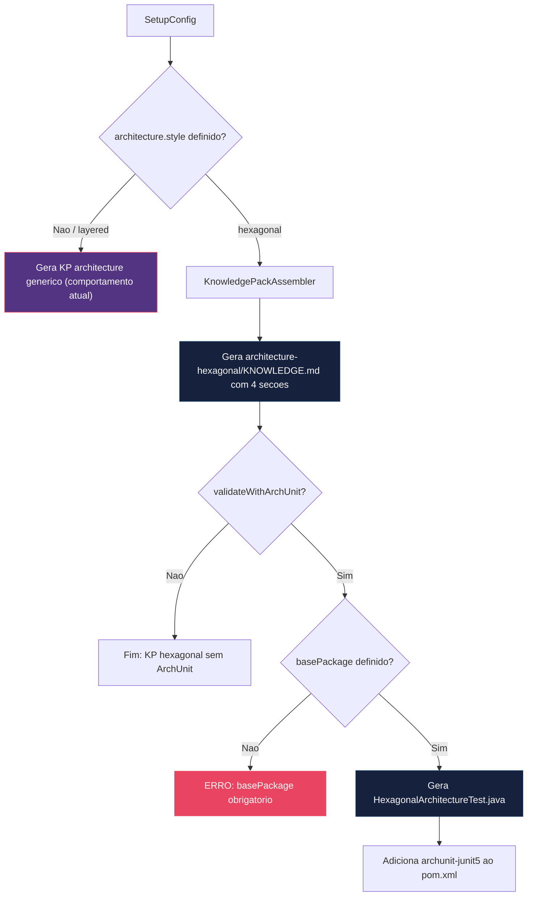
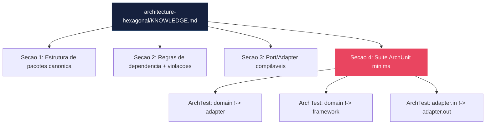

# Historia: KP Hexagonal Architecture com Codigo de Referencia

**ID:** story-0017-0002
**Chave Jira:** —

## 1. Dependencias

| Blocked By | Blocks |
| :--- | :--- |
| story-0017-0001 | story-0017-0003, story-0017-0004, story-0017-0005, story-0017-0010 |

## 2. Regras Transversais Aplicaveis

| ID | Titulo |
| :--- | :--- |
| RULE-001 | Codigo de referencia compilavel em KPs |
| RULE-003 | Layer-templates por estilo arquitetural |
| RULE-004 | ArchUnit para hexagonal/DDD |
| RULE-007 | KPs referenciados em agents gerados |

## 3. Descricao

Como **Desenvolvedor assistido por IA**, eu quero receber knowledge pack especializado de arquitetura hexagonal com codigo de referencia e validacao ArchUnit, para que o agente gere codigo com boundaries arquiteturais corretas e violacoes sejam detectadas automaticamente em CI.

### Contexto

O knowledge pack `architecture` atual e generico — descreve principios de camadas e dependencias, mas nao fornece codigo compilavel de referencia nem validacao automatizada de boundaries. Quando o agente precisa gerar codigo hexagonal, ele infere a estrutura de pacotes e as regras de dependencia a partir de descricoes textuais, resultando em violacoes frequentes como imports de Spring/JPA no domain layer.

Esta story cria o knowledge pack `architecture-hexagonal` com 4 secoes especializadas e introduz o campo `architecture.style` como enum de primeira classe na configuracao do gerador.

### 3.1 Secoes do Knowledge Pack

**Secao 1 — Estrutura de pacotes canonica:**
Diagrama ASCII com a arvore de pacotes completa para hexagonal (domain/model, domain/port/inbound, domain/port/outbound, application/usecase, adapter/inbound/rest, adapter/outbound/persistence, config).

**Secao 2 — Regras de dependencia com exemplos de violacao:**
Tabela de regras (domain nao importa adapter, application nao importa adapter, adapter.inbound nao importa adapter.outbound) com bloco de codigo mostrando o import proibido e o erro esperado.

**Secao 3 — Exemplos de Port/Adapter compilaveis:**
Port interface no domain, Adapter implementation no adapter layer, UseCase no application layer. Codigo Java compilavel que demonstra o padrao correto.

**Secao 4 — Suite ArchUnit minima:**
Classe `HexagonalArchitectureTest.java` com 3+ regras ArchUnit que validam as boundaries em CI: (1) domain nao depende de adapter, (2) domain nao depende de framework, (3) adapter.inbound nao depende de adapter.outbound.

### 3.2 Campo architecture.style

Novo campo enum na configuracao do profile:

- `hexagonal` — gera KP hexagonal + ArchUnit (se habilitado)
- `layered` — comportamento atual (default)
- `cqrs` — gera KP CQRS/ES (story-0017-0003)
- `event-driven` — gera KP event-driven (futuro)
- `clean` — gera KP clean architecture (futuro)

O campo `architecture.validateWithArchUnit` (boolean, default false) controla a geracao de `HexagonalArchitectureTest.java`. O campo `architecture.basePackage` (string) e obrigatorio quando `style != layered`.

### 3.3 Integracao com Agents

O KP `architecture-hexagonal` deve ser referenciado nos agents `architect` e `tech-lead` gerados (RULE-007), para que o agente tenha acesso ao contexto de boundaries durante review e planejamento.

## 3.5 Entrega de Valor

- **Valor Principal:** Agente gera codigo com boundaries arquiteturais corretas, eliminando violacoes de dependencia cross-layer
- **Metrica de Sucesso:** Zero imports de Spring/JPA no domain layer em codigo gerado com style hexagonal; 3+ ArchTest rules geradas
- **Impacto no Negocio:** Projetos gerados mantem integridade arquitetural desde o primeiro commit, eliminando refactoring tardio

## 4. Definicoes de Qualidade Locais

### DoR Local

- [ ] KP `architecture` atual analisado para identificar lacunas de especificidade hexagonal
- [ ] Campo `architecture.style` definido como enum com valores validos
- [ ] Classe `HexagonalArchitectureTest.java` de referencia com 3+ ArchTest rules definida
- [ ] Golden files alvo identificados para profiles que usarao style hexagonal
- [ ] Dependencia `archunit-junit5` identificada com versao especifica para pom.xml

### DoD Local

- [ ] KP `architecture-hexagonal/KNOWLEDGE.md` gerado com 4 secoes completas
- [ ] Codigo de referencia (Port, Adapter, UseCase) compilavel no estilo Java
- [ ] `HexagonalArchitectureTest.java` gerado quando `validateWithArchUnit: true` com 3+ ArchTest rules
- [ ] pom.xml gerado inclui dependencia `archunit-junit5` quando `validateWithArchUnit: true`
- [ ] Campo `architecture.style` aceito pela validacao de config com valores: hexagonal, layered, cqrs, event-driven, clean
- [ ] Config com `validateWithArchUnit: true` sem `basePackage` retorna erro de validacao claro
- [ ] Agents `architect` e `tech-lead` gerados referenciam KP hexagonal quando style = hexagonal
- [ ] Golden file parity tests passam para todos os profiles afetados
- [ ] Test plan gerado via `/x-test-plan` antes do inicio da implementacao
- [ ] Todo @GK-N da secao 7 mapeado para >= 1 AT-N na secao 8
- [ ] Cenarios Gherkin ordenados por TPP (degenerate -> happy -> error -> boundary)
- [ ] Todo AT-N com status GREEN antes de marcar DoD como concluido
- [ ] Commits seguem padrao test-first (teste precede ou acompanha implementacao no git log)

### Global DoD

- **Cobertura:** >= 95% Line, >= 90% Branch
- **Testes Automatizados:** Unit + Integration + Golden file parity
- **TDD Compliance:** Commits test-first, refactoring explicito
- **Backward Compatibility:** Zero regressao em profiles existentes
- **Double-Loop TDD:** Acceptance tests derivados dos cenarios Gherkin (outer loop), unit tests guiados por TPP (inner loop)
- **Rastreabilidade:** Todo @GK-N mapeia para >= 1 AT-N, todo AT-N referencia um @GK-N valido

## 5. Contratos de Dados

| Campo | Tipo | Obrigatorio | Descricao |
| :--- | :--- | :--- | :--- |
| `architecture.style` | `enum(hexagonal, layered, cqrs, event-driven, clean)` | Nao | Estilo arquitetural do profile. Default: `layered` |
| `architecture.validateWithArchUnit` | `boolean` | Nao | Gera `HexagonalArchitectureTest.java` com suite ArchUnit. Default: `false` |
| `architecture.basePackage` | `String` | Sim se style != layered | Package base Java/Kotlin valido (e.g., `com.example.myapp`) |

## 6. Diagramas

### 6.1 Fluxo de Geracao do KP Hexagonal



### 6.2 Estrutura do KP architecture-hexagonal



## 7. Criterios de Aceite (Gherkin)

```gherkin
@GK-1
Cenario: Config sem architecture.style declarado nao gera KP hexagonal
  DADO que o arquivo de configuracao do profile nao possui campo "architecture.style"
  QUANDO o KnowledgePackAssembler e executado
  ENTAO o KP architecture-hexagonal NAO deve ser gerado
  E o KP architecture generico deve ser gerado normalmente

@GK-2
Cenario: Config style hexagonal gera KP com 4 secoes
  DADO que o profile possui architecture.style "hexagonal"
  E possui architecture.basePackage "com.example.myapp"
  QUANDO o KnowledgePackAssembler gera os knowledge packs
  ENTAO o arquivo architecture-hexagonal/KNOWLEDGE.md deve ser gerado
  E deve conter secao "Estrutura de pacotes canonica"
  E deve conter secao "Regras de dependencia"
  E deve conter secao "Exemplos de Port/Adapter"
  E deve conter secao "Suite ArchUnit"

@GK-3
Cenario: Config hexagonal com validateWithArchUnit gera teste ArchUnit
  DADO que o profile possui architecture.style "hexagonal"
  E possui architecture.validateWithArchUnit true
  E possui architecture.basePackage "com.example.myapp"
  QUANDO o gerador e executado
  ENTAO o arquivo HexagonalArchitectureTest.java deve ser gerado
  E deve conter ao menos 3 regras ArchTest
  E deve conter regra que domain nao depende de adapter
  E deve conter regra que domain nao depende de framework

@GK-4
Cenario: Config validateWithArchUnit true sem basePackage retorna erro
  DADO que o profile possui architecture.style "hexagonal"
  E possui architecture.validateWithArchUnit true
  E NAO possui architecture.basePackage
  QUANDO a validacao de configuracao e executada
  ENTAO deve retornar erro de validacao
  E a mensagem deve indicar que basePackage e obrigatorio quando validateWithArchUnit e true

@GK-5
Cenario: pom.xml gerado contem dependencia archunit-junit5
  DADO que o profile possui architecture.style "hexagonal"
  E possui architecture.validateWithArchUnit true
  E possui architecture.basePackage "com.example.myapp"
  QUANDO o gerador gera o pom.xml
  ENTAO o pom.xml deve conter dependencia "com.tngtech.archunit:archunit-junit5"
  E o scope deve ser "test"

@GK-6
Cenario: Config style layered gera KP generico e nao hexagonal
  DADO que o profile possui architecture.style "layered"
  QUANDO o KnowledgePackAssembler gera os knowledge packs
  ENTAO o KP architecture generico deve ser gerado
  E o KP architecture-hexagonal NAO deve ser gerado
  E nenhum arquivo HexagonalArchitectureTest.java deve ser gerado
```

### 7.1 Scenario Ordering (TPP)

> TPP: degenerate (sem style declarado, @GK-1) -> happy path (hexagonal com 4 secoes, @GK-2; hexagonal com ArchUnit, @GK-3) -> error (validateWithArchUnit sem basePackage, @GK-4) -> boundary (pom.xml com dependencia, @GK-5; layered nao gera hexagonal, @GK-6).

### 7.2 Mandatory Scenario Categories

- [x] Degenerate cases (config sem architecture.style nao gera KP hexagonal, @GK-1)
- [x] Happy path (hexagonal com 4 secoes, @GK-2; hexagonal com ArchUnit, @GK-3)
- [x] Error paths (validateWithArchUnit sem basePackage, @GK-4)
- [x] Boundary values (pom.xml com archunit-junit5, @GK-5; layered vs hexagonal, @GK-6)

## 8. Sub-tarefas

### Ciclos TDD

> Sub-tarefas TDD serao populadas apos geracao do test plan via `/x-test-plan`.
> Cada AT-N e UT-N do test plan gerara entradas [TDD] com ciclos RED/GREEN/REFACTOR.

### Tarefas nao-TDD

- [ ] [Doc] Documentar campo `architecture.style` e valores validos no README de configuracao
- [ ] [Doc] Atualizar CHANGELOG.md com entrada na secao `Added` para KP architecture-hexagonal
- [ ] [Doc] Documentar processo de extensao para novos estilos arquiteturais (event-driven, clean)
