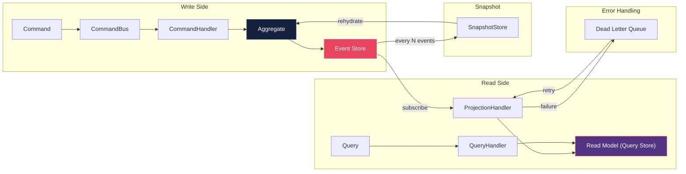
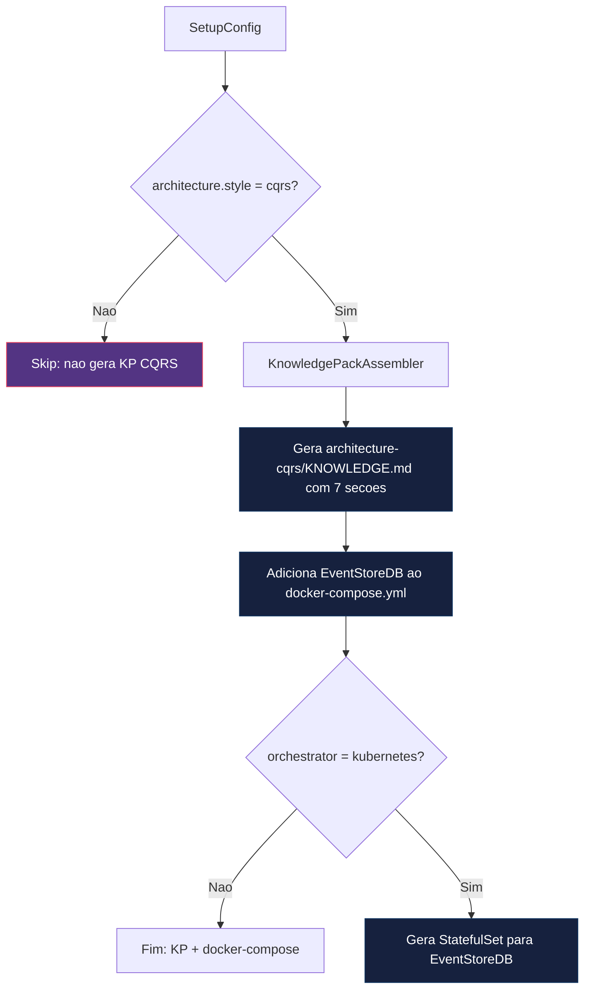

# Historia: KP CQRS + Event Sourcing

**ID:** story-0017-0003
**Chave Jira:** —

## 1. Dependencias

| Blocked By | Blocks |
| :--- | :--- |
| story-0017-0002 | story-0017-0004, story-0017-0009, story-0017-0010 |

## 2. Regras Transversais Aplicaveis

| ID | Titulo |
| :--- | :--- |
| RULE-001 | Codigo de referencia compilavel em KPs |
| RULE-009 | Infraestrutura de event store para CQRS/ES |

## 3. Descricao

Como **Desenvolvedor assistido por IA**, eu quero receber knowledge pack especializado de CQRS/Event Sourcing com aggregate patterns, event store e projections, para que o agente implemente CQRS com separacao real de write/read models, event sourcing e projecoes, nao apenas separacao de classes.

### Contexto

CQRS/Event Sourcing e o padrao de maior complexidade geracional para LLMs. Sem exemplos concretos e compilaveis, o agente tende a gerar uma "pseudo-CQRS" onde Command e Query sao apenas classes separadas sem as semanticas corretas de event sourcing — agregados sem replay de eventos, projections sem rebuild, snapshots inexistentes, e dead letter nao tratado.

O KP deve conter 7 secoes especializadas que cobrem o ciclo completo de CQRS/ES, com codigo Java compilavel de referencia em cada secao. Reutiliza o mecanismo `architecture.style` introduzido por story-0017-0002, adicionando o valor `cqrs` ao enum.

### 3.1 Secoes do Knowledge Pack

**Secao 1 — Separacao de Modelos com Mermaid:**
Diagrama Mermaid mostrando write model (Command -> Aggregate -> Event Store) e read model (Event -> Projection -> Query Store) como fluxos independentes com eventual consistency.

**Secao 2 — Command Bus:**
Interface `CommandBus`, implementacao com despacho para `CommandHandler`, padrao de routing por tipo de comando. Codigo Java compilavel.

**Secao 3 — Event Store interface:**
Port interface `EventStore` no domain com operacoes: `append(aggregateId, events, expectedVersion)`, `load(aggregateId)`, `loadFromVersion(aggregateId, version)`. Adapter para EventStoreDB.

**Secao 4 — Aggregate com Event Sourcing:**
Classe abstrata `EventSourcedAggregate` com: `apply(event)`, `rehydrate(events)`, `uncommittedEvents()`, versioning otimista. Exemplo concreto compilavel (e.g., `OrderAggregate`).

**Secao 5 — Projections e rebuild:**
Interface `Projection`, `ProjectionHandler` que escuta eventos e atualiza read model. Mecanismo de rebuild completo a partir do event store.

**Secao 6 — Snapshot Policy:**
Interface `SnapshotStore`, logica de snapshot a cada N eventos (configuravel via `architecture.snapshotPolicy.eventsPerSnapshot`, default 100). Restauracao de aggregate a partir de snapshot + eventos subsequentes.

**Secao 7 — Dead Letter e Error Handling:**
Estrategia para eventos que falham ao ser processados por projections. Dead letter queue, retry policy, alertas. Padrao de idempotencia para reprocessamento.

### 3.2 Infraestrutura EventStoreDB

Quando `architecture.style: cqrs`, o gerador deve adicionar ao `docker-compose.yml` o servico EventStoreDB com:
- Imagem oficial `eventstore/eventstore`
- Portas 2113 (HTTP) e 1113 (TCP)
- Volume persistente para dados
- Health check configurado
- Variavel de ambiente para modo inseguro em dev (`EVENTSTORE_INSECURE=true`)

O campo `eventStore` (enum: `eventstoredb`, `axon`, `custom`) permite selecionar o tipo de event store. Default: `eventstoredb`.

### 3.3 Kubernetes StatefulSet

Quando `architecture.style: cqrs` e `orchestrator: kubernetes`, o gerador deve produzir um `StatefulSet` para EventStoreDB (ao inves de Deployment), garantindo identidade de pod estavel e armazenamento persistente.

## 3.5 Entrega de Valor

- **Valor Principal:** Agente implementa CQRS/ES com separacao correta de write/read models, eliminando implementacao superficial
- **Metrica de Sucesso:** KP contem as 7 secoes especificadas; docker-compose inclui EventStoreDB; Aggregate com @EventHandler compilavel
- **Impacto no Negocio:** Projetos CQRS gerados seguem o padrao completo desde o inicio, evitando migracao custosa posterior

## 4. Definicoes de Qualidade Locais

### DoR Local

- [ ] Story-0017-0002 concluida (mecanismo `architecture.style` disponivel)
- [ ] Documentacao oficial do EventStoreDB revisada para configuracao Docker e Kubernetes
- [ ] Padrao de Aggregate com Event Sourcing definido e revisado (classe abstrata + exemplo concreto)
- [ ] Secoes 1-7 do KP definidas com escopo claro e exemplos de referencia identificados
- [ ] Golden files alvo identificados para profile com style cqrs

### DoD Local

- [ ] KP `architecture-cqrs/KNOWLEDGE.md` gerado com 7 secoes completas
- [ ] Codigo Java de referencia em cada secao e compilavel
- [ ] `docker-compose.yml` gerado contem servico EventStoreDB quando style = cqrs
- [ ] `StatefulSet` gerado para EventStoreDB quando style = cqrs + orchestrator = kubernetes
- [ ] Campo `architecture.snapshotPolicy.eventsPerSnapshot` aceito com default 100
- [ ] Campo `eventStore` aceito com valores: eventstoredb, axon, custom
- [ ] Agents `architect` e `tech-lead` referenciam KP cqrs quando style = cqrs
- [ ] Golden file parity tests passam para profiles com style cqrs
- [ ] Test plan gerado via `/x-test-plan` antes do inicio da implementacao
- [ ] Todo @GK-N da secao 7 mapeado para >= 1 AT-N na secao 8
- [ ] Cenarios Gherkin ordenados por TPP (degenerate -> happy -> error -> boundary)
- [ ] Todo AT-N com status GREEN antes de marcar DoD como concluido
- [ ] Commits seguem padrao test-first (teste precede ou acompanha implementacao no git log)

### Global DoD

- **Cobertura:** >= 95% Line, >= 90% Branch
- **Testes Automatizados:** Unit + Integration + Golden file parity
- **TDD Compliance:** Commits test-first, refactoring explicito
- **Backward Compatibility:** Zero regressao em profiles existentes
- **Double-Loop TDD:** Acceptance tests derivados dos cenarios Gherkin (outer loop), unit tests guiados por TPP (inner loop)
- **Rastreabilidade:** Todo @GK-N mapeia para >= 1 AT-N, todo AT-N referencia um @GK-N valido

## 5. Contratos de Dados

| Campo | Tipo | Obrigatorio | Descricao |
| :--- | :--- | :--- | :--- |
| `architecture.style` | `enum(hexagonal, layered, cqrs, event-driven, clean)` | Sim (valor: `cqrs`) | Estilo arquitetural CQRS para ativar geracao do KP |
| `architecture.snapshotPolicy.eventsPerSnapshot` | `integer` | Nao | Numero de eventos antes de criar snapshot. Default: `100` |
| `eventStore` | `enum(eventstoredb, axon, custom)` | Nao | Tipo de event store utilizado. Default: `eventstoredb` |

## 6. Diagramas

### 6.1 Fluxo CQRS/ES com Write e Read Models



### 6.2 Fluxo de Geracao do KP CQRS



## 7. Criterios de Aceite (Gherkin)

```gherkin
@GK-1
Cenario: Config sem architecture.style nao gera KP CQRS
  DADO que o arquivo de configuracao do profile nao possui campo "architecture.style"
  QUANDO o KnowledgePackAssembler e executado
  ENTAO o KP architecture-cqrs NAO deve ser gerado
  E o docker-compose.yml NAO deve conter servico eventstore

@GK-2
Cenario: Config style cqrs gera KP com 7 secoes
  DADO que o profile possui architecture.style "cqrs"
  E possui language "java"
  QUANDO o KnowledgePackAssembler gera os knowledge packs
  ENTAO o arquivo architecture-cqrs/KNOWLEDGE.md deve ser gerado
  E deve conter secao "Separacao de Modelos"
  E deve conter secao "Command Bus"
  E deve conter secao "Event Store"
  E deve conter secao "Aggregate com Event Sourcing"
  E deve conter secao "Projections e rebuild"
  E deve conter secao "Snapshot Policy"
  E deve conter secao "Dead Letter e Error Handling"

@GK-3
Cenario: Config style cqrs gera docker-compose com EventStoreDB
  DADO que o profile possui architecture.style "cqrs"
  E possui eventStore "eventstoredb"
  QUANDO o gerador gera o docker-compose.yml
  ENTAO o docker-compose.yml deve conter servico "eventstore"
  E o servico deve usar imagem "eventstore/eventstore"
  E o servico deve expor porta 2113
  E o servico deve ter health check configurado

@GK-4
Cenario: KP gerado sem secao Event Store causa falha de validacao
  DADO que o template Pebble do KP CQRS foi modificado para omitir a secao "Event Store"
  QUANDO a validacao de integridade do KP e executada
  ENTAO deve reportar violacao da RULE-001
  E a mensagem deve indicar que a secao "Event Store" e obrigatoria para style cqrs

@GK-5
Cenario: Config style cqrs com orchestrator kubernetes gera StatefulSet
  DADO que o profile possui architecture.style "cqrs"
  E possui orchestrator "kubernetes"
  QUANDO o gerador gera os manifests Kubernetes
  ENTAO deve gerar um StatefulSet para EventStoreDB
  E o StatefulSet deve ter volumeClaimTemplate para armazenamento persistente
  E NAO deve gerar um Deployment para EventStoreDB
```

### 7.1 Scenario Ordering (TPP)

> TPP: degenerate (sem style declarado, @GK-1) -> happy path (cqrs com 7 secoes, @GK-2; docker-compose com EventStoreDB, @GK-3) -> error (KP sem secao obrigatoria, @GK-4) -> boundary (kubernetes com StatefulSet, @GK-5).

### 7.2 Mandatory Scenario Categories

- [x] Degenerate cases (config sem architecture.style nao gera KP CQRS, @GK-1)
- [x] Happy path (cqrs com 7 secoes, @GK-2; docker-compose com EventStoreDB, @GK-3)
- [x] Error paths (KP sem secao Event Store viola RULE-001, @GK-4)
- [x] Boundary values (kubernetes gera StatefulSet ao inves de Deployment, @GK-5)

## 8. Sub-tarefas

### Ciclos TDD

> Sub-tarefas TDD serao populadas apos geracao do test plan via `/x-test-plan`.
> Cada AT-N e UT-N do test plan gerara entradas [TDD] com ciclos RED/GREEN/REFACTOR.

### Tarefas nao-TDD

- [ ] [Doc] Documentar as 7 secoes do KP CQRS/ES no README de knowledge packs
- [ ] [Doc] Atualizar CHANGELOG.md com entrada na secao `Added` para KP architecture-cqrs e integracao EventStoreDB
- [ ] [Doc] Documentar campos `eventStore` e `snapshotPolicy.eventsPerSnapshot` no README de configuracao
