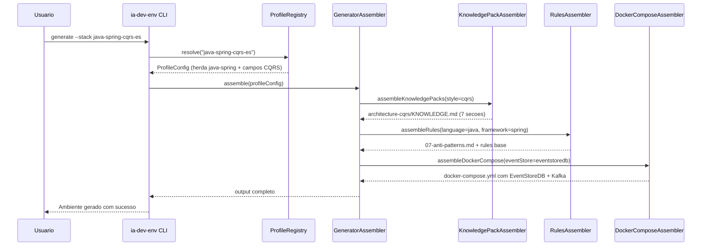
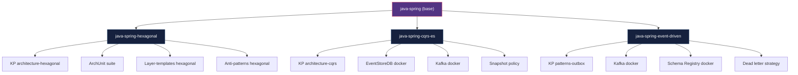

# Historia: Profiles Arquiteturais Dedicados

**ID:** story-0017-0004
**Chave Jira:** —

## 1. Dependencias

| Blocked By | Blocks |
| :--- | :--- |
| story-0017-0001, story-0017-0002, story-0017-0003 | story-0017-0007, story-0017-0009 |

## 2. Regras Transversais Aplicaveis

| ID | Titulo |
| :--- | :--- |
| RULE-003 | Layer-templates por estilo arquitetural |
| RULE-004 | ArchUnit para hexagonal/DDD |
| RULE-006 | Anti-patterns condicionais por language/framework |
| RULE-007 | KPs referenciados em agents gerados |
| RULE-009 | Infraestrutura de event store para CQRS/ES |

## 3. Descricao

Como **Engenheiro de software**, eu quero selecionar entre profiles arquiteturais dedicados (java-spring-hexagonal, java-spring-cqrs-es, java-spring-event-driven) ao gerar um ambiente, para que receba um ambiente completo com knowledge packs, rules, templates e validacoes especificos para o estilo escolhido.

### Contexto

Os 10 profiles atuais definem a dimensao tecnologica (language + framework + database). Esta story adiciona 3 profiles que definem uma segunda dimensao: a dimensao arquitetural sobre java-spring. Cada profile arquitetural herda a base java-spring e adiciona artefatos especializados para o estilo escolhido.

Profile `java-spring-hexagonal` gera KP hexagonal, anti-patterns hexagonal, ArchUnit e layer-templates hexagonal. Profile `java-spring-cqrs-es` gera KP CQRS, EventStoreDB e Kafka. Profile `java-spring-event-driven` gera KP outbox, Kafka e Schema Registry.

Novos campos de configuracao: `eventStore` (enum), `schemaRegistry` (enum), `architecture.snapshotPolicy.eventsPerSnapshot` (integer), `architecture.outboxPattern` (boolean), `architecture.deadLetterStrategy` (enum).

### 3.1 Profile java-spring-hexagonal

Herda toda a configuracao de java-spring base e adiciona:
- Knowledge pack `architecture-hexagonal` (secoes de boundary, dependency rules, layer-templates)
- Knowledge pack de anti-patterns hexagonais (imports cross-layer, domain com anotacoes JPA)
- Suite ArchUnit com 3+ regras de boundary (domain nao importa adapter, adapter.inbound nao importa adapter.outbound)
- Layer-templates hexagonal com estrutura de pacotes canonica

### 3.2 Profile java-spring-cqrs-es

Herda toda a configuracao de java-spring base e adiciona:
- Knowledge pack `architecture-cqrs` com 7 secoes (Command Bus, Event Store, Aggregate, Projections, Snapshot, Dead Letter)
- EventStoreDB no docker-compose.yml com health check
- Kafka no docker-compose.yml para projections e event streaming
- Campos: `eventStore`, `architecture.snapshotPolicy.eventsPerSnapshot`

### 3.3 Profile java-spring-event-driven

Herda toda a configuracao de java-spring base e adiciona:
- Knowledge pack `patterns-outbox` com Transactional Outbox Pattern
- Kafka no docker-compose.yml
- Schema Registry (Confluent, Apicurio ou Glue) no docker-compose.yml
- Campos: `schemaRegistry`, `architecture.outboxPattern`, `architecture.deadLetterStrategy`

### 3.4 Registro de Profiles

Os 3 novos profiles devem ser registrados no `ProfileRegistry` com:
- Nome canonico (java-spring-hexagonal, java-spring-cqrs-es, java-spring-event-driven)
- Heranca da base java-spring (language, framework, build tool)
- Campos especificos de cada profile com defaults
- Arquivo de configuracao YAML template em `resources/config-templates/`

## 3.5 Entrega de Valor

- **Valor Principal:** Usuarios selecionam estilo arquitetural no gerador, recebendo ambiente completo e validado para cada estilo
- **Metrica de Sucesso:** 3 profiles novos adicionados ao ProfileRegistry; parity tests passam; `ia-dev-env generate --stack <profile>` executa sem erro
- **Impacto no Negocio:** Equipes recebem ambiente pronto para uso com estilo arquitetural escolhido, sem configuracao manual

## 4. Definicoes de Qualidade Locais

### DoR Local

- [ ] Story-0017-0001 concluida (anti-patterns condicionais por stack disponivel)
- [ ] Story-0017-0002 concluida (KP hexagonal e campo `architecture.style` disponiveis)
- [ ] Story-0017-0003 concluida (KP CQRS/ES e infraestrutura EventStoreDB disponiveis)
- [ ] `ProfileRegistry` existente identificado e analisado
- [ ] Configuracao YAML template base de java-spring revisada como ponto de heranca
- [ ] Golden files alvo identificados para os 3 novos profiles

### DoD Local

- [ ] 3 profiles registrados no `ProfileRegistry` (java-spring-hexagonal, java-spring-cqrs-es, java-spring-event-driven)
- [ ] Cada profile herda configuracao java-spring base corretamente
- [ ] Profile java-spring-hexagonal gera ArchUnit + KP hexagonal + anti-patterns hexagonais
- [ ] Profile java-spring-cqrs-es gera EventStoreDB + KP CQRS + Kafka no docker-compose
- [ ] Profile java-spring-event-driven gera KP outbox + Kafka + Schema Registry
- [ ] Campos `eventStore`, `schemaRegistry`, `outboxPattern`, `deadLetterStrategy`, `snapshotPolicy.eventsPerSnapshot` aceitos com validacao
- [ ] Profiles existentes (java-spring base) nao sao afetados (zero regressao)
- [ ] `ia-dev-env generate --stack java-spring-hexagonal` executa sem erro
- [ ] Golden file parity tests passam para os 3 novos profiles
- [ ] Test plan gerado via `/x-test-plan` antes do inicio da implementacao
- [ ] Todo @GK-N da secao 7 mapeado para >= 1 AT-N na secao 8
- [ ] Cenarios Gherkin ordenados por TPP (degenerate -> happy -> error -> boundary)
- [ ] Todo AT-N com status GREEN antes de marcar DoD como concluido
- [ ] Commits seguem padrao test-first (teste precede ou acompanha implementacao no git log)

### Global DoD

- **Cobertura:** >= 95% Line, >= 90% Branch
- **Testes Automatizados:** Unit + Integration + Golden file parity
- **TDD Compliance:** Commits test-first, refactoring explicito
- **Backward Compatibility:** Zero regressao em profiles existentes
- **Double-Loop TDD:** Acceptance tests derivados dos cenarios Gherkin (outer loop), unit tests guiados por TPP (inner loop)
- **Rastreabilidade:** Todo @GK-N mapeia para >= 1 AT-N, todo AT-N referencia um @GK-N valido

## 5. Contratos de Dados

| Campo | Tipo | Obrigatorio | Descricao |
| :--- | :--- | :--- | :--- |
| `name` | `String` | Sim | Nome do profile (java-spring-hexagonal, java-spring-cqrs-es, java-spring-event-driven) |
| `architecture.style` | `enum(hexagonal, layered, cqrs, event-driven, clean)` | Sim | Estilo arquitetural do profile |
| `eventStore` | `enum(eventstoredb, axon, custom)` | Nao | Tipo de event store. Aplicavel a java-spring-cqrs-es |
| `schemaRegistry` | `enum(confluent, apicurio, glue)` | Nao | Schema registry utilizado. Aplicavel a java-spring-event-driven |
| `architecture.outboxPattern` | `boolean` | Nao | Ativa outbox pattern. Default: `false` |
| `architecture.deadLetterStrategy` | `enum(kafka-dlq, sqs-dlq, database)` | Nao | Estrategia de dead letter queue |
| `architecture.snapshotPolicy.eventsPerSnapshot` | `integer` | Nao | Numero de eventos antes de criar snapshot. Default: `100` |

## 6. Diagramas

### 6.1 Fluxo de Selecao e Geracao de Profile Arquitetural



### 6.2 Heranca de Profiles Arquiteturais



## 7. Criterios de Aceite (Gherkin)

```gherkin
@GK-1
Cenario: Profile inexistente retorna erro com lista de profiles validos
  DADO que o usuario executa "ia-dev-env generate --stack java-spring-microkernel"
  E o profile "java-spring-microkernel" nao existe no ProfileRegistry
  QUANDO o ProfileRegistry tenta resolver o nome do profile
  ENTAO deve retornar erro com mensagem "Profile 'java-spring-microkernel' not found"
  E a mensagem deve listar todos os profiles validos disponiveis

@GK-2
Cenario: Profile java-spring-hexagonal gera ArchUnit e KP hexagonal e anti-patterns
  DADO que o profile "java-spring-hexagonal" esta registrado no ProfileRegistry
  E possui architecture.style "hexagonal"
  QUANDO o GeneratorAssembler gera o ambiente completo
  ENTAO o KP architecture-hexagonal/KNOWLEDGE.md deve ser gerado
  E a suite ArchUnit deve conter ao menos 3 regras de boundary
  E o arquivo 07-anti-patterns.md deve conter anti-patterns hexagonais
  E os agents architect e tech-lead devem referenciar o KP hexagonal

@GK-3
Cenario: Profile java-spring-cqrs-es gera EventStoreDB e KP CQRS e Kafka
  DADO que o profile "java-spring-cqrs-es" esta registrado no ProfileRegistry
  E possui architecture.style "cqrs"
  E possui eventStore "eventstoredb"
  QUANDO o GeneratorAssembler gera o ambiente completo
  ENTAO o KP architecture-cqrs/KNOWLEDGE.md deve ser gerado com 7 secoes
  E o docker-compose.yml deve conter servico "eventstore" com imagem "eventstore/eventstore"
  E o docker-compose.yml deve conter servico "kafka"
  E o campo snapshotPolicy.eventsPerSnapshot deve ter default 100

@GK-4
Cenario: Profile java-spring-event-driven gera KP outbox e Kafka e Schema Registry
  DADO que o profile "java-spring-event-driven" esta registrado no ProfileRegistry
  E possui architecture.style "event-driven"
  E possui schemaRegistry "confluent"
  QUANDO o GeneratorAssembler gera o ambiente completo
  ENTAO o KP patterns-outbox deve ser gerado
  E o docker-compose.yml deve conter servico "kafka"
  E o docker-compose.yml deve conter servico "schema-registry" com imagem Confluent
  E o campo architecture.outboxPattern deve ter default false

@GK-5
Cenario: Comando validate rejeita campo eventStore com valor invalido
  DADO que o arquivo de configuracao possui eventStore "mongodb"
  E "mongodb" nao e um valor valido do enum (eventstoredb, axon, custom)
  QUANDO o comando "ia-dev-env validate" e executado
  ENTAO deve retornar erro de validacao
  E a mensagem deve indicar que "mongodb" nao e um valor valido para eventStore
  E deve listar os valores aceitos: eventstoredb, axon, custom

@GK-6
Cenario: Profiles existentes java-spring base nao sao afetados
  DADO que o profile "java-spring" base ja existe com golden files conhecidos
  E os 3 novos profiles arquiteturais foram registrados no ProfileRegistry
  QUANDO o GeneratorAssembler gera o ambiente para profile "java-spring" base
  ENTAO o output deve ser byte-for-byte identico aos golden files existentes
  E nenhum artefato de profile arquitetural deve estar presente no output
  E nenhum campo novo (eventStore, schemaRegistry, outboxPattern) deve aparecer na configuracao
```

### 7.1 Scenario Ordering (TPP)

> TPP: degenerate (profile inexistente com lista valida, @GK-1) -> happy path (hexagonal com ArchUnit, @GK-2; cqrs-es com EventStoreDB, @GK-3; event-driven com outbox, @GK-4) -> error (eventStore com valor invalido, @GK-5) -> boundary (zero regressao em profiles existentes, @GK-6).

### 7.2 Mandatory Scenario Categories

- [x] Degenerate cases (profile inexistente retorna erro com lista valida, @GK-1)
- [x] Happy path (hexagonal com ArchUnit e KP, @GK-2; cqrs-es com EventStoreDB e Kafka, @GK-3; event-driven com outbox e Schema Registry, @GK-4)
- [x] Error paths (eventStore com valor invalido rejeitado por validate, @GK-5)
- [x] Boundary values (zero regressao em profiles existentes, @GK-6)

## 8. Sub-tarefas

### Ciclos TDD

> Sub-tarefas TDD serao populadas apos geracao do test plan via `/x-test-plan`.
> Cada AT-N e UT-N do test plan gerara entradas [TDD] com ciclos RED/GREEN/REFACTOR.

### Tarefas nao-TDD

- [ ] [Doc] Documentar os 3 novos profiles arquiteturais no README de profiles
- [ ] [Doc] Atualizar CHANGELOG.md com entrada na secao `Added` para profiles java-spring-hexagonal, java-spring-cqrs-es e java-spring-event-driven
- [ ] [Doc] Documentar campos novos (eventStore, schemaRegistry, outboxPattern, deadLetterStrategy, snapshotPolicy) no README de configuracao
