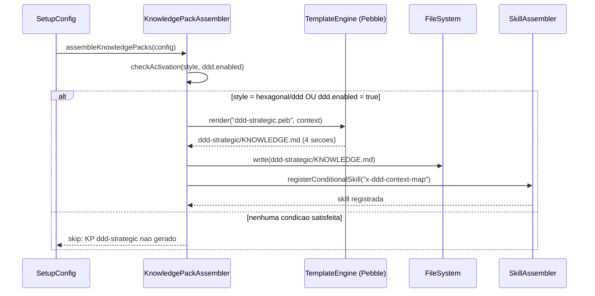
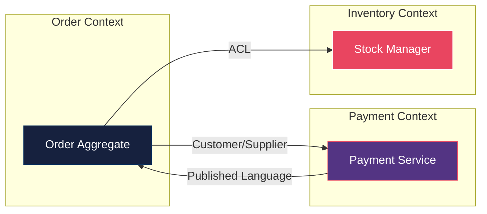

# Historia: KP DDD Estrategico (Context Map + Bounded Context)

**ID:** story-0017-0005
**Chave Jira:** —

## 1. Dependencias

| Blocked By | Blocks |
| :--- | :--- |
| story-0017-0002 | -- |

## 2. Regras Transversais Aplicaveis

| ID | Titulo |
| :--- | :--- |
| RULE-001 | Codigo de referencia compilavel em KPs |
| RULE-003 | Layer-templates por estilo arquitetural |

## 3. Descricao

Como **Arquiteto de software assistido por IA**, eu quero receber knowledge pack de DDD estrategico com context map, bounded context canvas e ACL patterns, para que o agente identifique bounded contexts, classifique integration patterns e gere ACLs onde necessario.

### Contexto

O knowledge pack `architecture-hexagonal` introduzido por story-0017-0002 foca na dimensao tatica (camadas, dependency rules, ports/adapters). Falta a dimensao estrategica: como identificar bounded contexts, como classificar relacoes entre eles e como proteger boundaries com Anti-Corruption Layers.

O KP `ddd-strategic` e gerado condicionalmente quando `architecture.style` e `hexagonal` ou `ddd`, ou quando `ddd.enabled: true` na configuracao. Contem 4 secoes especializadas com codigo Java compilavel de referencia.

### 3.1 Secoes do Knowledge Pack

**Secao 1 — Bounded Context: Definicao e Identificacao:**
Criterios para identificar bounded contexts: linguagem ubiqua distinta, modelo de dados proprio, ciclo de vida independente. Heuristicas para decomposicao: pivot events, autonomia de deploy, ownership de time.

**Secao 2 — Context Map com Integration Patterns:**
Tabela de integration patterns com descricao, quando usar e exemplo de codigo:
- Shared Kernel (codigo compartilhado entre contexts)
- Customer/Supplier (upstream fornece, downstream consome)
- Conformist (downstream aceita modelo do upstream sem traducao)
- Anti-Corruption Layer (traducao explicita entre modelos)
- Open Host Service (API publica estavel para multiplos consumers)
- Published Language (schema compartilhado como contrato)

**Secao 3 — Template ACL com Codigo Compilavel:**
Interface `AntiCorruptionLayer<ExternalModel, DomainModel>` com metodo `translate(ExternalModel): DomainModel`. Implementacao concreta de exemplo (e.g., `PaymentGatewayACL`) com testes. Padrao de integracao com ports hexagonais.

**Secao 4 — Skill /x-ddd-context-map Condicional:**
Skill condicional que auto-descobre bounded contexts a partir da estrutura de pacotes e gera diagrama Mermaid com context map. Ativado apenas quando KP ddd-strategic esta presente. O diagrama mostra contexts como subgraphs e relationships como arestas rotuladas com o integration pattern.

### 3.2 Ativacao Condicional

O KP `ddd-strategic` e gerado quando pelo menos uma das condicoes e verdadeira:
1. `architecture.style` e `hexagonal` ou `ddd`
2. `ddd.enabled` e `true`

Quando nenhuma condicao e satisfeita, o KP nao deve ser gerado e a skill `/x-ddd-context-map` nao deve aparecer no menu de skills.

## 3.5 Entrega de Valor

- **Valor Principal:** Agente identifica e respeita bounded contexts, gerando ACLs onde necessario para protecao de dominio
- **Metrica de Sucesso:** KP contem 4 secoes com codigo compilavel para ACL; skill x-ddd-context-map gera Mermaid valido
- **Impacto no Negocio:** Integracoes entre servicos respeitam boundaries, reduzindo acoplamento e risco de quebra em cascata

## 4. Definicoes de Qualidade Locais

### DoR Local

- [ ] Story-0017-0002 concluida (campo `architecture.style` e KP hexagonal disponiveis)
- [ ] Integration patterns DDD documentados e revisados (6 patterns com criterios de uso)
- [ ] Interface `AntiCorruptionLayer` definida com assinatura e exemplo concreto
- [ ] Criterios de ativacao condicional (style hexagonal/ddd ou ddd.enabled) especificados
- [ ] Golden files alvo identificados para profiles com style hexagonal/ddd

### DoD Local

- [ ] KP `ddd-strategic/KNOWLEDGE.md` gerado com 4 secoes completas
- [ ] Secao 1 contem criterios de identificacao de bounded context e heuristicas
- [ ] Secao 2 contem tabela de 6 integration patterns com codigo de exemplo
- [ ] Secao 3 contem interface ACL com implementacao concreta compilavel
- [ ] Secao 4 contem skill `/x-ddd-context-map` com geracao de diagrama Mermaid
- [ ] KP gerado quando `architecture.style: hexagonal` ou `architecture.style: ddd` ou `ddd.enabled: true`
- [ ] KP NAO gerado quando nenhuma condicao de ativacao e satisfeita
- [ ] Golden file parity tests passam para profiles com style hexagonal/ddd
- [ ] Test plan gerado via `/x-test-plan` antes do inicio da implementacao
- [ ] Todo @GK-N da secao 7 mapeado para >= 1 AT-N na secao 8
- [ ] Cenarios Gherkin ordenados por TPP (degenerate -> happy -> error -> boundary)
- [ ] Todo AT-N com status GREEN antes de marcar DoD como concluido
- [ ] Commits seguem padrao test-first (teste precede ou acompanha implementacao no git log)

### Global DoD

- **Cobertura:** >= 95% Line, >= 90% Branch
- **Testes Automatizados:** Unit + Integration + Golden file parity
- **TDD Compliance:** Commits test-first, refactoring explicito
- **Backward Compatibility:** Zero regressao em profiles existentes
- **Double-Loop TDD:** Acceptance tests derivados dos cenarios Gherkin (outer loop), unit tests guiados por TPP (inner loop)
- **Rastreabilidade:** Todo @GK-N mapeia para >= 1 AT-N, todo AT-N referencia um @GK-N valido

## 5. Contratos de Dados

| Campo | Tipo | Obrigatorio | Descricao |
| :--- | :--- | :--- | :--- |
| `architecture.style` | `enum(hexagonal, layered, cqrs, event-driven, clean, ddd)` | Nao | Valores que ativam KP: `hexagonal`, `ddd` |
| `ddd.enabled` | `boolean` | Nao | Ativa KP DDD estrategico explicitamente. Default: `false` |

## 6. Diagramas

### 6.1 Fluxo de Geracao do KP DDD Estrategico



### 6.2 Context Map de Exemplo (Gerado pela Skill)



## 7. Criterios de Aceite (Gherkin)

```gherkin
@GK-1
Cenario: Config sem ddd.enabled e sem style hexagonal/ddd nao gera KP ddd-strategic
  DADO que o arquivo de configuracao nao possui campo "ddd.enabled"
  E o campo "architecture.style" possui valor "layered"
  QUANDO o KnowledgePackAssembler e executado
  ENTAO o KP ddd-strategic NAO deve ser gerado
  E a skill x-ddd-context-map NAO deve aparecer no menu de skills

@GK-2
Cenario: Config ddd.enabled true gera ddd-strategic com 4 secoes
  DADO que o arquivo de configuracao possui ddd.enabled "true"
  E o campo "architecture.style" possui valor "layered"
  QUANDO o KnowledgePackAssembler gera os knowledge packs
  ENTAO o arquivo ddd-strategic/KNOWLEDGE.md deve ser gerado
  E deve conter secao "Bounded Context: Definicao e Identificacao"
  E deve conter secao "Context Map com Integration Patterns"
  E deve conter secao "Template ACL com Codigo Compilavel"
  E deve conter secao "Skill /x-ddd-context-map"

@GK-3
Cenario: Config architecture.style hexagonal gera KP ddd-strategic por ativacao implicita
  DADO que o arquivo de configuracao possui architecture.style "hexagonal"
  E NAO possui campo "ddd.enabled"
  QUANDO o KnowledgePackAssembler gera os knowledge packs
  ENTAO o arquivo ddd-strategic/KNOWLEDGE.md deve ser gerado com 4 secoes
  E a skill x-ddd-context-map deve estar registrada no menu de skills
  E a secao "Template ACL" deve conter interface AntiCorruptionLayer compilavel

@GK-4
Cenario: KP sem secao ACL Template falha validacao por violacao RULE-001
  DADO que o template Pebble do KP ddd-strategic foi modificado para omitir a secao "Template ACL"
  QUANDO a validacao de integridade do KP e executada
  ENTAO deve reportar violacao da RULE-001
  E a mensagem deve indicar que a secao "Template ACL com Codigo Compilavel" e obrigatoria

@GK-5
Cenario: Novo enum value ddd aceito em architecture.style sem regressao
  DADO que o campo architecture.style agora aceita o valor "ddd" alem dos existentes
  E existem profiles configurados com valores anteriores (hexagonal, layered, cqrs, event-driven, clean)
  QUANDO o comando "ia-dev-env validate" e executado para cada profile existente
  ENTAO todos os profiles devem passar validacao sem erro
  E nenhum golden file existente deve ser alterado
```

### 7.1 Scenario Ordering (TPP)

> TPP: degenerate (sem ddd.enabled e sem style hexagonal/ddd, @GK-1) -> happy path (ddd.enabled true com 4 secoes, @GK-2; style hexagonal ativacao implicita, @GK-3) -> error (KP sem secao ACL viola RULE-001, @GK-4) -> boundary (novo enum value ddd sem regressao, @GK-5).

### 7.2 Mandatory Scenario Categories

- [x] Degenerate cases (config sem ativacao nao gera KP ddd-strategic, @GK-1)
- [x] Happy path (ddd.enabled true gera 4 secoes, @GK-2; style hexagonal ativacao implicita, @GK-3)
- [x] Error paths (KP sem secao ACL Template viola RULE-001, @GK-4)
- [x] Boundary values (novo enum value ddd aceito sem regressao em valores existentes, @GK-5)

## 8. Sub-tarefas

### Ciclos TDD

> Sub-tarefas TDD serao populadas apos geracao do test plan via `/x-test-plan`.
> Cada AT-N e UT-N do test plan gerara entradas [TDD] com ciclos RED/GREEN/REFACTOR.

### Tarefas nao-TDD

- [ ] [Doc] Documentar as 4 secoes do KP DDD estrategico no README de knowledge packs
- [ ] [Doc] Atualizar CHANGELOG.md com entrada na secao `Added` para KP ddd-strategic e skill x-ddd-context-map
- [ ] [Doc] Documentar campo `ddd.enabled` e condicoes de ativacao no README de configuracao
