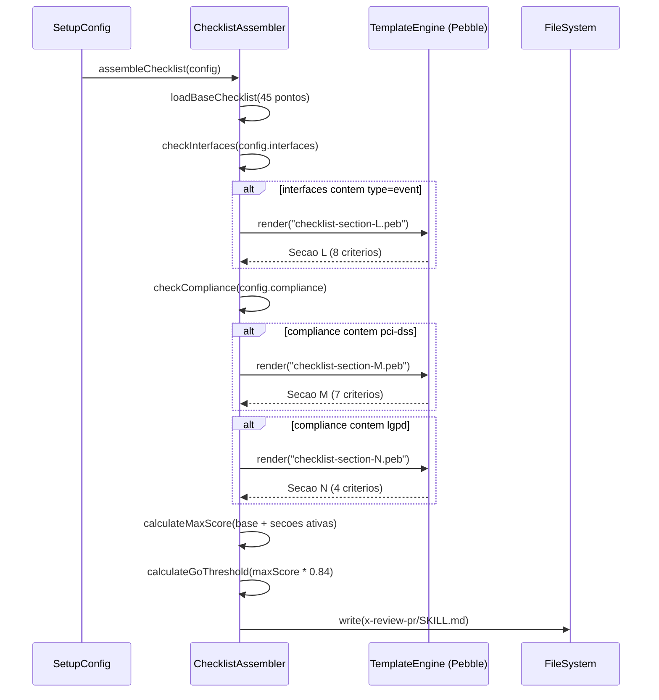
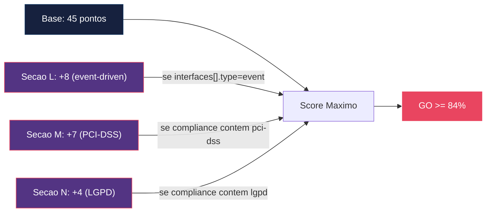

# Historia: Checklist Condicional no /x-review-pr

**ID:** story-0017-0006
**Chave Jira:** —

## 1. Dependencias

| Blocked By | Blocks |
| :--- | :--- |
| -- | story-0017-0010 |

## 2. Regras Transversais Aplicaveis

| ID | Titulo |
| :--- | :--- |
| RULE-008 | Checklist condicional por flags de config |

## 3. Descricao

Como **Tech Lead**, eu quero ter checklist de review com secoes condicionais ativadas por tipo de projeto (event-driven, PCI-DSS, LGPD), para que reviews cubram criterios especificos sem gerar falsos positivos para projetos que nao precisam deles.

### Contexto

O checklist de 45 pontos do `/x-review-pr` e estatico — todos os projetos recebem os mesmos criterios independente do tipo de projeto. Isso causa dois problemas: (1) projetos event-driven nao sao avaliados em criterios especificos como idempotencia, ordering e dead letter, e (2) projetos regulados (PCI-DSS, LGPD) nao tem criterios de compliance no review, confiando em processos manuais.

Esta story adiciona 3 secoes condicionais ao checklist gerado:

- **Secao L — Event-Driven Review (8 criterios):** ativada quando `interfaces` contem pelo menos um item com `type: event`
- **Secao M — PCI-DSS (7 criterios):** ativada quando `compliance` contem `pci-dss`
- **Secao N — LGPD (4 criterios):** ativada quando `compliance` contem `lgpd`

O score GO e recalculado como percentual >= 84% do maximo possivel (soma dos pontos de todas as secoes ativas).

### 3.1 Secao L — Event-Driven Review (8 criterios)

Ativada por: `interfaces[].type = event`

1. Idempotencia de consumers (deduplicacao por event ID)
2. Ordering garantido dentro de partition key
3. Dead letter strategy configurada e testada
4. Schema evolution com backward compatibility
5. Retry policy com exponential backoff
6. Consumer group isolation (nao compartilhar group entre servicos)
7. Transactional outbox quando aplicavel
8. Observabilidade de lag e throughput por consumer

### 3.2 Secao M — PCI-DSS (7 criterios)

Ativada por: `compliance` contendo `pci-dss`

1. Dados de cartao nunca logados (PAN, CVV, expiry)
2. Criptografia em transito (TLS 1.2+) e em repouso (AES-256)
3. Tokenizacao para armazenamento de PAN
4. Audit trail para acesso a dados sensiveis
5. Segregacao de ambientes (dev/staging/prod)
6. Rotacao de chaves e credenciais documentada
7. Testes de penetracao referenciados em pipeline

### 3.3 Secao N — LGPD (4 criterios)

Ativada por: `compliance` contendo `lgpd`

1. Consentimento rastreavel por operacao de tratamento
2. Endpoint de exclusao de dados pessoais implementado (direito ao esquecimento)
3. Log de operacoes de tratamento com base legal registrada
4. Anonimizacao/pseudonimizacao aplicada onde dados pessoais nao sao estritamente necessarios

### 3.4 Calculo de Score GO

O score GO deixa de ser um valor fixo e passa a ser percentual:

- Score maximo = soma dos pontos de todas as secoes ativas (base 45 + secoes condicionais)
- Threshold GO = >= 84% do score maximo
- Exemplo: projeto com base (45) + secao L (8) + secao M (7) = 60 pontos maximo. GO = >= 51 pontos (84% de 60)

### 3.5 Novo Campo: compliance

O campo `compliance` e uma lista de enums que ativa secoes condicionais. Valores aceitos: `pci-dss`, `lgpd`, `sox`, `hipaa`. Valores nao reconhecidos devem causar erro de validacao.

## 3.5 Entrega de Valor

- **Valor Principal:** Reviews de codigo cobrem requisitos regulatorios e event-driven, reduzindo risco de nao-conformidade em producao
- **Metrica de Sucesso:** Projeto sem compliance gera checklist identico ao atual (45 pontos); projeto com pci-dss adiciona secao M (7 criterios)
- **Impacto no Negocio:** Equipes em setores regulados detectam violacoes de compliance antes do merge, evitando remediacoes custosas pos-deploy

## 4. Definicoes de Qualidade Locais

### DoR Local

- [ ] Checklist atual de 45 pontos do `/x-review-pr` identificado e analisado
- [ ] Criterios das secoes L, M e N definidos e revisados com especialistas
- [ ] Campo `compliance` definido com enum values e regras de validacao
- [ ] Formula de calculo de score GO (>= 84% do maximo) aprovada
- [ ] Golden files alvo identificados para configs com e sem compliance

### DoD Local

- [ ] Secao L (Event-Driven, 8 criterios) gerada quando `interfaces[].type = event`
- [ ] Secao M (PCI-DSS, 7 criterios) gerada quando `compliance` contem `pci-dss`
- [ ] Secao N (LGPD, 4 criterios) gerada quando `compliance` contem `lgpd`
- [ ] Score GO recalculado como >= 84% do score maximo possivel
- [ ] Campo `compliance` aceita lista de enums: pci-dss, lgpd, sox, hipaa
- [ ] Valor invalido no campo `compliance` causa erro de validacao
- [ ] Projeto sem compliance e sem interfaces event gera checklist identico ao atual (45 pontos)
- [ ] Golden file parity tests passam para configs com e sem compliance
- [ ] Test plan gerado via `/x-test-plan` antes do inicio da implementacao
- [ ] Todo @GK-N da secao 7 mapeado para >= 1 AT-N na secao 8
- [ ] Cenarios Gherkin ordenados por TPP (degenerate -> happy -> error -> boundary)
- [ ] Todo AT-N com status GREEN antes de marcar DoD como concluido
- [ ] Commits seguem padrao test-first (teste precede ou acompanha implementacao no git log)

### Global DoD

- **Cobertura:** >= 95% Line, >= 90% Branch
- **Testes Automatizados:** Unit + Integration + Golden file parity
- **TDD Compliance:** Commits test-first, refactoring explicito
- **Backward Compatibility:** Zero regressao em profiles existentes
- **Double-Loop TDD:** Acceptance tests derivados dos cenarios Gherkin (outer loop), unit tests guiados por TPP (inner loop)
- **Rastreabilidade:** Todo @GK-N mapeia para >= 1 AT-N, todo AT-N referencia um @GK-N valido

## 5. Contratos de Dados

| Campo | Tipo | Obrigatorio | Descricao |
| :--- | :--- | :--- | :--- |
| `compliance` | `List<enum(pci-dss, lgpd, sox, hipaa)>` | Nao | Requisitos de compliance que ativam secoes condicionais no checklist |
| `interfaces[].type` | `enum(rest, event, grpc, websocket)` | Nao | Tipo de interface. Valor `event` ativa secao L |
| `interfaces[].broker` | `String` | Nao | Broker de mensageria (kafka, rabbitmq, etc.) |
| `reviewChecklistMaxScore` | `integer` | Calculado | Score maximo possivel com secoes ativas. Base: 45 + secoes condicionais |
| `reviewGoThreshold` | `String` | Calculado | ">= 84% do total de pontos" |

## 6. Diagramas

### 6.1 Fluxo de Montagem do Checklist Condicional



### 6.2 Composicao do Score por Cenario



## 7. Criterios de Aceite (Gherkin)

```gherkin
@GK-1
Cenario: Config sem compliance e sem interfaces event gera checklist de 45 pontos identico ao atual
  DADO que o arquivo de configuracao nao possui campo "compliance"
  E nenhuma interface possui type "event"
  QUANDO o ChecklistAssembler gera o checklist do x-review-pr
  ENTAO o checklist deve conter exatamente 45 pontos
  E NAO deve conter secao L (Event-Driven Review)
  E NAO deve conter secao M (PCI-DSS)
  E NAO deve conter secao N (LGPD)
  E o score GO deve ser >= 38 pontos (84% de 45)

@GK-2
Cenario: Config com compliance pci-dss gera secao M com 7 criterios
  DADO que o arquivo de configuracao possui compliance ["pci-dss"]
  E nenhuma interface possui type "event"
  QUANDO o ChecklistAssembler gera o checklist do x-review-pr
  ENTAO o checklist deve conter secao M (PCI-DSS) com 7 criterios
  E deve conter criterio sobre "dados de cartao nunca logados"
  E deve conter criterio sobre "criptografia em transito e em repouso"
  E o score maximo deve ser 52 pontos (45 base + 7 PCI-DSS)
  E o score GO deve ser >= 44 pontos (84% de 52)

@GK-3
Cenario: Config com interfaces type event gera secao L com 8 criterios
  DADO que o arquivo de configuracao possui interfaces com type "event" e broker "kafka"
  E nao possui campo "compliance"
  QUANDO o ChecklistAssembler gera o checklist do x-review-pr
  ENTAO o checklist deve conter secao L (Event-Driven Review) com 8 criterios
  E deve conter criterio sobre "idempotencia de consumers"
  E deve conter criterio sobre "dead letter strategy"
  E o score maximo deve ser 53 pontos (45 base + 8 event-driven)
  E o score GO deve ser >= 45 pontos (84% de 53)

@GK-4
Cenario: Config com compliance pci-dss e interfaces type event gera ambas secoes L e M
  DADO que o arquivo de configuracao possui compliance ["pci-dss"]
  E possui interfaces com type "event" e broker "kafka"
  QUANDO o ChecklistAssembler gera o checklist do x-review-pr
  ENTAO o checklist deve conter secao L (Event-Driven Review) com 8 criterios
  E o checklist deve conter secao M (PCI-DSS) com 7 criterios
  E o score maximo deve ser 60 pontos (45 base + 8 event-driven + 7 PCI-DSS)
  E o score GO deve ser >= 51 pontos (84% de 60)

@GK-5
Cenario: Config com compliance contendo valor invalido retorna erro de validacao
  DADO que o arquivo de configuracao possui compliance ["gdpr"]
  E "gdpr" nao e um valor valido do enum (pci-dss, lgpd, sox, hipaa)
  QUANDO o comando "ia-dev-env validate" e executado
  ENTAO deve retornar erro de validacao
  E a mensagem deve indicar que "gdpr" nao e um valor valido para compliance
  E deve listar os valores aceitos: pci-dss, lgpd, sox, hipaa

@GK-6
Cenario: Score GO recalculado como percentual quando secoes condicionais ativas
  DADO que o arquivo de configuracao possui compliance ["pci-dss", "lgpd"]
  E possui interfaces com type "event"
  QUANDO o ChecklistAssembler calcula o score GO
  ENTAO o score maximo deve ser 64 pontos (45 base + 8 event-driven + 7 PCI-DSS + 4 LGPD)
  E o threshold GO deve ser >= 54 pontos (84% de 64)
  E o threshold deve ser arredondado para cima (ceil)
```

### 7.1 Scenario Ordering (TPP)

> TPP: degenerate (sem compliance e sem event gera checklist identico, @GK-1) -> happy path (pci-dss gera secao M, @GK-2; interfaces event gera secao L, @GK-3; ambas secoes simultaneamente, @GK-4) -> error (compliance com valor invalido, @GK-5) -> boundary (score GO recalculado com todas secoes ativas, @GK-6).

### 7.2 Mandatory Scenario Categories

- [x] Degenerate cases (sem compliance e sem event gera checklist identico ao atual, @GK-1)
- [x] Happy path (pci-dss gera secao M, @GK-2; interfaces event gera secao L, @GK-3; ambas secoes, @GK-4)
- [x] Error paths (compliance com valor invalido "gdpr" retorna erro, @GK-5)
- [x] Boundary values (score GO recalculado com percentual e arredondamento ceil, @GK-6)

## 8. Sub-tarefas

### Ciclos TDD

> Sub-tarefas TDD serao populadas apos geracao do test plan via `/x-test-plan`.
> Cada AT-N e UT-N do test plan gerara entradas [TDD] com ciclos RED/GREEN/REFACTOR.

### Tarefas nao-TDD

- [ ] [Doc] Documentar secoes condicionais L, M e N no README do skill x-review-pr
- [ ] [Doc] Atualizar CHANGELOG.md com entrada na secao `Added` para checklist condicional e campo compliance
- [ ] [Doc] Documentar campo `compliance` e formula de calculo de score GO no README de configuracao
