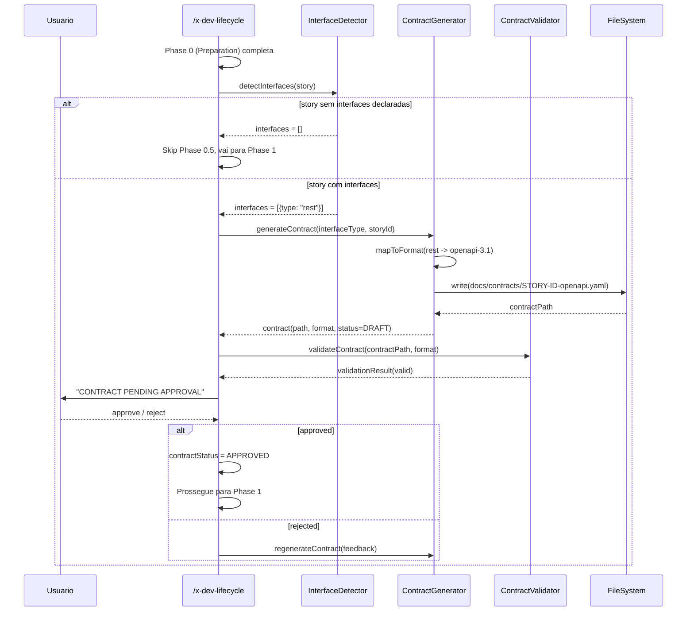
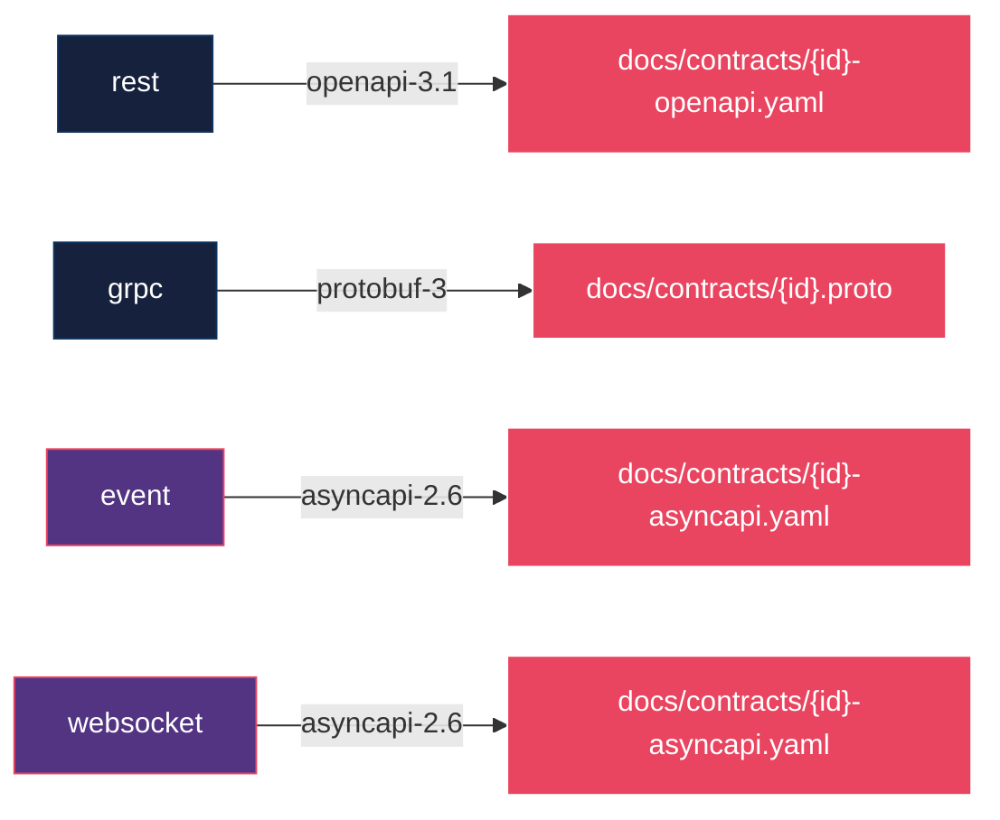

# Historia: API-First Phase no /x-dev-lifecycle

**ID:** story-0017-0007
**Chave Jira:** —

## 1. Dependencias

| Blocked By | Blocks |
| :--- | :--- |
| story-0017-0004, story-0017-0008 | -- |

## 2. Regras Transversais Aplicaveis

| ID | Titulo |
| :--- | :--- |
| RULE-005 | Geracao de contratos antes da implementacao |
| RULE-010 | Validacao de contratos API por tipo de interface |

## 3. Descricao

Como **Desenvolvedor assistido por IA**, eu quero ter uma fase de geracao de contrato formal (OpenAPI/AsyncAPI/Protobuf) antes da implementacao no lifecycle, para que contratos sejam revisaveis antes de qualquer codigo de implementacao ser gerado, eliminando divergencias.

### Contexto

O lifecycle atual vai de architecture plan direto para implementacao. Esta story adiciona Phase 0.5 condicional entre Phase 0 (Preparation) e Phase 1 (Architecture Planning). A fase e ativada quando a story declara interfaces REST, gRPC ou event.

A Phase 0.5 segue 4 steps sequenciais:

- **Step 0.5.1:** Identifica o tipo de interface declarado na story (`rest`, `grpc`, `event`, `websocket`)
- **Step 0.5.2:** Gera rascunho do contrato no formato apropriado (REST gera `openapi.yaml`, gRPC gera `.proto`, Event gera `asyncapi.yaml`)
- **Step 0.5.3:** Valida o contrato gerado contra as especificacoes do formato
- **Step 0.5.4:** Aguarda aprovacao explicita do usuario antes de prosseguir para Phase 1

### 3.1 Mapeamento de Interface para Formato de Contrato

| Tipo de Interface | Formato de Contrato | Caminho de Saida |
| :--- | :--- | :--- |
| `rest` | OpenAPI 3.1 | `docs/contracts/{story-id}-openapi.yaml` |
| `grpc` | Protobuf 3 | `docs/contracts/{story-id}.proto` |
| `event` | AsyncAPI 2.6 | `docs/contracts/{story-id}-asyncapi.yaml` |
| `websocket` | AsyncAPI 2.6 | `docs/contracts/{story-id}-asyncapi.yaml` |

### 3.2 Skill /x-contract-lint Condicional

Quando a configuracao do projeto declara interfaces, a skill `/x-contract-lint` e gerada condicionalmente. Esta skill valida contratos gerados contra as especificacoes do formato (OpenAPI 3.1, AsyncAPI 2.6, Protobuf 3) e reporta erros de validacao antes da aprovacao.

### 3.3 Fluxo de Aprovacao

O lifecycle pausa na Phase 0.5.4 com a mensagem `CONTRACT PENDING APPROVAL` e aguarda acao explicita do usuario:

- **Aprovacao:** Lifecycle prossegue para Phase 1 com `contractStatus = APPROVED`
- **Rejeicao:** Lifecycle retorna para Step 0.5.2 para regeneracao com `contractStatus = REJECTED`

## 3.5 Entrega de Valor

- **Valor Principal:** Contratos formais revisaveis antes da implementacao, eliminando divergencias entre spec e codigo
- **Metrica de Sucesso:** Phase 0.5 gera OpenAPI 3.1 valido para stories REST; lifecycle pausa aguardando aprovacao
- **Impacto no Negocio:** APIs produzidas sao consistentes com o planejamento, reduzindo retrabalho por divergencia de contrato

## 4. Definicoes de Qualidade Locais

### DoR Local

- [ ] Estrutura atual do `/x-dev-lifecycle` analisada (phases 0 a N identificadas)
- [ ] Formatos de contrato (OpenAPI 3.1, AsyncAPI 2.6, Protobuf 3) documentados e exemplificados
- [ ] Story-0017-0008 (Data Contracts Ricos) concluida ou em paralelo com contratos definidos
- [ ] Story-0017-0004 (dependencia) concluida
- [ ] Caminho de saida `docs/contracts/` definido e aprovado

### DoD Local

- [ ] Phase 0.5 inserida condicionalmente entre Phase 0 e Phase 1 no lifecycle
- [ ] Step 0.5.1 identifica corretamente tipo de interface (rest, grpc, event, websocket)
- [ ] Step 0.5.2 gera contrato no formato correto para cada tipo de interface
- [ ] Step 0.5.3 valida contrato contra especificacao do formato
- [ ] Step 0.5.4 emite mensagem `CONTRACT PENDING APPROVAL` e pausa o lifecycle
- [ ] Story sem interfaces declaradas pula Phase 0.5 completamente
- [ ] Skill `/x-contract-lint` gerada condicionalmente quando interfaces configuradas
- [ ] Golden file parity tests passam para stories com e sem interfaces
- [ ] Test plan gerado via `/x-test-plan` antes do inicio da implementacao
- [ ] Todo @GK-N da secao 7 mapeado para >= 1 AT-N na secao 8
- [ ] Cenarios Gherkin ordenados por TPP (degenerate -> happy -> error -> boundary)
- [ ] Todo AT-N com status GREEN antes de marcar DoD como concluido
- [ ] Commits seguem padrao test-first (teste precede ou acompanha implementacao no git log)

### Global DoD

- **Cobertura:** >= 95% Line, >= 90% Branch
- **Testes Automatizados:** Unit + Integration + Golden file parity
- **TDD Compliance:** Commits test-first, refactoring explicito
- **Backward Compatibility:** Zero regressao em profiles existentes
- **Double-Loop TDD:** Acceptance tests derivados dos cenarios Gherkin (outer loop), unit tests guiados por TPP (inner loop)
- **Rastreabilidade:** Todo @GK-N mapeia para >= 1 AT-N, todo AT-N referencia um @GK-N valido

## 5. Contratos de Dados

| Campo | Tipo | Obrigatorio | Descricao |
| :--- | :--- | :--- | :--- |
| `interfaces[].type` | `enum(rest, grpc, event, websocket)` | Sim | Tipo de interface declarada na story |
| `contractPath` | `String` | Gerado | Caminho do contrato gerado (docs/contracts/{story-id}-openapi.yaml) |
| `contractFormat` | `enum(openapi-3.1, asyncapi-2.6, protobuf-3)` | Gerado | Formato do contrato gerado |
| `contractStatus` | `enum(DRAFT, PENDING_APPROVAL, APPROVED, REJECTED)` | Gerado | Status do contrato no fluxo de aprovacao |

## 6. Diagramas

### 6.1 Fluxo da Phase 0.5 no Lifecycle



### 6.2 Mapeamento de Interface para Formato



## 7. Criterios de Aceite (Gherkin)

```gherkin
@GK-1
Cenario: Story sem interfaces declaradas pula Phase 0.5
  DADO que a story nao possui campo "interfaces" declarado
  QUANDO o /x-dev-lifecycle executa a sequencia de phases
  ENTAO a Phase 0.5 NAO deve ser executada
  E o lifecycle deve ir diretamente de Phase 0 (Preparation) para Phase 1 (Architecture Planning)
  E nenhum arquivo deve ser criado em docs/contracts/

@GK-2
Cenario: Story com interface REST ativa Phase 0.5 e gera contrato OpenAPI
  DADO que a story possui interfaces com type "rest"
  QUANDO o /x-dev-lifecycle executa a Phase 0.5
  ENTAO o Step 0.5.1 deve identificar o tipo de interface como "rest"
  E o Step 0.5.2 deve gerar o arquivo "docs/contracts/STORY-ID-openapi.yaml"
  E o contrato gerado deve estar no formato OpenAPI 3.1
  E o contractFormat deve ser "openapi-3.1"

@GK-3
Cenario: Story com interface event gera contrato AsyncAPI
  DADO que a story possui interfaces com type "event" e broker "kafka"
  QUANDO o /x-dev-lifecycle executa a Phase 0.5
  ENTAO o Step 0.5.2 deve gerar o arquivo "docs/contracts/STORY-ID-asyncapi.yaml"
  E o contrato gerado deve estar no formato AsyncAPI 2.6
  E o contractFormat deve ser "asyncapi-2.6"

@GK-4
Cenario: Phase 0.5 emite mensagem de aprovacao pendente e pausa lifecycle
  DADO que a story possui interfaces com type "rest"
  E o Step 0.5.2 gerou o contrato com sucesso
  E o Step 0.5.3 validou o contrato com sucesso
  QUANDO o Step 0.5.4 e executado
  ENTAO o lifecycle deve emitir a mensagem "CONTRACT PENDING APPROVAL"
  E o contractStatus deve ser "PENDING_APPROVAL"
  E o lifecycle deve pausar aguardando acao explicita do usuario

@GK-5
Cenario: Skill /x-contract-lint gerada condicionalmente quando interfaces configuradas
  DADO que a configuracao do projeto possui interfaces declaradas
  QUANDO o gerador processa a configuracao
  ENTAO a skill /x-contract-lint deve ser incluida no output gerado
  E a skill deve validar contratos contra a especificacao do formato configurado
  E a configuracao sem interfaces NAO deve gerar a skill /x-contract-lint
```

### 7.1 Scenario Ordering (TPP)

> TPP: degenerate (story sem interfaces pula Phase 0.5, @GK-1) -> happy path (interface REST gera OpenAPI, @GK-2; interface event gera AsyncAPI, @GK-3) -> error/pausa (lifecycle emite CONTRACT PENDING APPROVAL e pausa, @GK-4) -> boundary (skill /x-contract-lint gerada condicionalmente, @GK-5).

### 7.2 Mandatory Scenario Categories

- [x] Degenerate cases (story sem interfaces pula Phase 0.5, @GK-1)
- [x] Happy path (interface REST gera OpenAPI, @GK-2; interface event gera AsyncAPI, @GK-3)
- [x] Error paths (lifecycle pausa com CONTRACT PENDING APPROVAL, @GK-4)
- [x] Boundary values (skill /x-contract-lint condicional, @GK-5)

## 8. Sub-tarefas

### Ciclos TDD

> Sub-tarefas TDD serao populadas apos geracao do test plan via `/x-test-plan`.
> Cada AT-N e UT-N do test plan gerara entradas [TDD] com ciclos RED/GREEN/REFACTOR.

### Tarefas nao-TDD

- [ ] [Doc] Documentar Phase 0.5 (API-First) no README do skill x-dev-lifecycle
- [ ] [Doc] Atualizar CHANGELOG.md com entrada na secao `Added` para Phase 0.5 e skill /x-contract-lint
- [ ] [Doc] Documentar mapeamento de interface para formato de contrato (REST->OpenAPI, gRPC->Protobuf, Event->AsyncAPI)
